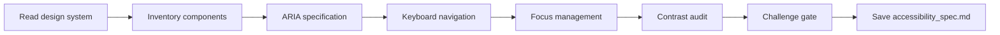

# Accessibility Spec

## Goal

Produce an actionable accessibility specification for every component in the design system: ARIA roles and attributes, keyboard navigation sequences, focus management rules, and contrast requirements. The output is implementation-ready for developers.

## Rules

- WCAG AA is the minimum — document where AAA is achievable
- Every interactive component must have keyboard navigation specified
- ARIA roles and attributes must be explicit, not implied
- Focus management must cover modals, drawers, dynamic content
- Contrast ratios must be verified against design tokens
- Requirements started from $ARGUMENTS
- **Standalone usage** — when invoked directly (not through an agent), present the deliverable and ask for user approval

### Scope Boundary

**Reference design tokens, do not redefine them.** When specifying contrast ratios, reference the token name from `design_system.md` (e.g., "color.primary on color.surface") rather than restating hex values. This ensures a single source of truth for visual tokens.

## Quick Start

```text
Generate accessibility specs from our design system
```

## Workflow



### Step 1: Inventory Interactive Components

**Do:**

1. Read the design system from $ARGUMENTS or referenced files
2. List every interactive component (buttons, inputs, modals, navigation, tabs, dropdowns, etc.)
3. Classify each component by interaction pattern (clickable, editable, navigable, expandable)

**Success criteria:** Complete inventory of interactive components with classification

### Step 2: ARIA & Keyboard Specification

**Do:**

4. Read the template from Resources. Follow its exact structure — same headings, same table columns, same formats. Do not add, remove, or rename sections.
5. For each component, specify:
   - **ARIA roles**: `role`, `aria-label`, `aria-describedby`, `aria-expanded`, `aria-live`, etc.
   - **Keyboard navigation**: which keys do what (Tab, Enter, Escape, Arrow keys, Space)
   - **Keyboard sequence**: the expected tab order and focus flow
6. Document compound widget patterns (combobox, menu, tabs, tree)

**Success criteria:** Every component has explicit ARIA roles and keyboard navigation

### Step 3: Focus Management & Contrast

**Do:**

7. Define focus management rules:
   - Focus trap for modals and drawers
   - Focus restoration on close
   - Focus movement for dynamic content (toasts, alerts, lazy-loaded items)
   - Skip links and landmark navigation
8. Verify contrast ratios against design tokens:
   - Text on background: minimum 4.5:1 (AA)
   - Large text: minimum 3:1 (AA)
   - UI components: minimum 3:1 (AA)
9. Document any exceptions or known limitations

**Success criteria:** Focus management rules defined, contrast ratios verified

### Step 4: Challenge Gate

**Do:**

10. Read the template from Resources
11. Verify every template section exists in the output with the exact same heading name and no section was added beyond what the template defines
12. Verify format requirements:
   - ARIA roles explicit per component
   - Contrast ratios reference design tokens (not raw hex values)

**Success criteria:** All template sections present and format requirements met. If any section is missing or any format is wrong, STOP — fix it. Do NOT proceed until structurally complete.

### Step 5: Save

**Do:**

13. Save as `aidd_docs/memory/internal/accessibility_spec.md`

**Success criteria:** File saved and accessible

## Resources

| Type     | Path                                              | Description              |
| -------- | ------------------------------------------------- | ------------------------ |
| Input    | `aidd_docs/memory/internal/design_system.md`       | Design system            |
| Input    | `aidd_docs/memory/internal/user_flows.md`          | User flows               |
| Template | `aidd_docs/templates/ux/accessibility_spec.md`     | Accessibility template   |
