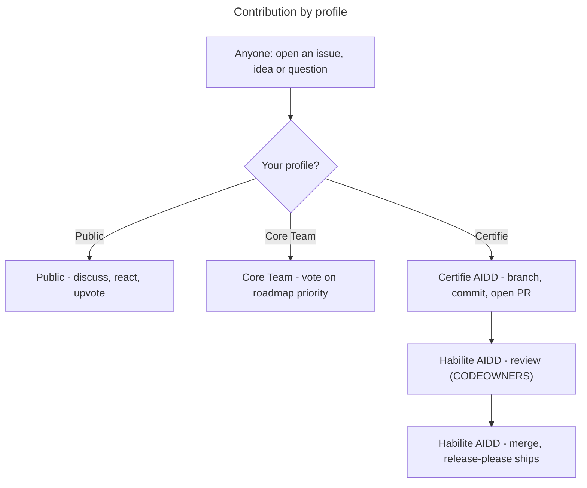

# Contributing to the AIDD Framework

The source of truth for AIDD skills, agents, rules, and templates. Authored in Claude Code syntax; at release time the CLI generates archives adapted to each supported tool.

> Wider AIDD community, roles, and the training programme live at [ai-driven-dev.fr](https://www.ai-driven-dev.fr/). This file covers contributing to **this repository**.

## Who does what (by profile)



**Only Certifié and Habilité contributors can open pull requests.** You become Certifié through [certification](https://www.ai-driven-dev.fr/); Habilité comes by promotion. Full role ladder, voting weights, and promotion rules: [`GOVERNANCE.md`](./GOVERNANCE.md#roles). The rest of this guide is the *how* for opening a PR.

## 1. Set up

Needs **Node 20+**, **pnpm**, **jq**, **python3**, and **pipx** (`gh` and the Claude/Codex CLI optional). Then:

```bash
make setup
```

- installs deps + git hooks
- registers this checkout as a local marketplace
- installs the plugins into Claude + Codex (`y/N` confirm, since it writes your global config; `YES=1` skips)

`make` lists every target; `make doctor` / `make check` verify the environment and run the pre-commit checks.

### Markdown links

Lefthook runs the Markdown link checker before every commit. `make setup` installs the hooks. If dependencies are already installed and you only need to wire up the hooks, run:

```bash
pnpm exec lefthook install --force
```

Run `node scripts/check-markdown-links.js` to scan the whole repository. For usage details, supported link forms, exclusions, and fix guidance, run `node scripts/check-markdown-links.js --help`.

### Test your changes locally

Exercise the skills you touched before opening a PR. Claude and Codex both serve a copied cache, not your checkout, so after editing, run:

```bash
make reload                        # all plugins; or PLUGIN="aidd-refine aidd-pm" for a subset
```

This:

- Reinstalls each plugin from the checkout, at its current version (no bump, nothing to revert).
- Installs Claude straight from the raw repo, since it is already native Claude format. Codex installs from a tree the `aidd` CLI builds, converting Claude syntax to Codex's (e.g. agents to TOML).
- Refreshes the cache in Claude and Codex. Codex agents are copied to `~/.codex/agents/`, since Codex cannot load plugin-bundled agents yet.
- Requires a session restart to load the change. For a Claude-only edit to an existing skill, `/reload-plugins` is enough.

## 2. Commit

Format: `<type>(<scope>): description`.

```bash
git commit -m "feat(aidd-dev): add for-sure skill"
```

Use one scope per commit; split cross-plugin changes into separate commits. Types, scopes, and rules live in [`aidd_docs/memory/vcs.md`](aidd_docs/memory/vcs.md#commit-convention), which mirrors `commitlint.config.cjs` (the source of truth). The commit **type** drives the release: see [`RELEASE.md`](./RELEASE.md) for what each type produces.

## 3. Open a pull request

- Branch off `next` and target `next` (the integration branch). Only `hotfix/*` branches off `main`, for urgent production fixes. The branch prefix alone decides the target: see the full prefix-label-target table in [`aidd_docs/memory/vcs.md`](aidd_docs/memory/vcs.md#types).
- **Fill the PR template** (applied automatically). Explain *what* changed and *how* you resolved it technically: that narrative is the point of the PR. CI already enforces the conventional title and pre-commit hooks, so don't repeat them in the description.
- **Label the PR** so reviewers and the [Roadmap board](https://github.com/orgs/ai-driven-dev/projects/8) can triage at a glance. The PR skill applies the label automatically, based on your branch kind. The label per kind is in the same [routing table](aidd_docs/memory/vcs.md#types); `security` is cross-cutting, so add it to any kind.
- The PR title follows the same conventional format, enforced by the **Commitlint** CI job. PRs are squash-merged using that title.
- A **Habilité** review gates every merge (see [`CODEOWNERS`](./.github/CODEOWNERS)). Certifié contributors cannot self-merge.
- Decision rules (lazy consensus, explicit consensus for cross-plugin/contract changes, the quality veto) live in [`GOVERNANCE.md`](./GOVERNANCE.md#code-decisions-merging).

## Releases

See [`RELEASE.md`](./RELEASE.md) for how releases flow: the `main`/`next` model, weekly cadence, hotfix process, and auto-merge. The release tooling lives in [`aidd_docs/memory/vcs.md`](aidd_docs/memory/vcs.md). What a release produces, for contributors:

- **7 independently-versioned packages**: the root `aidd-framework` plus the 6 plugins.
- On release, CI attaches the bundles:
  - `aidd-framework-marketplace-X.Y.Z.zip`: the Claude Code marketplace (`.claude-plugin/` + `plugins/`). Kept as the legacy alias of `aidd-framework-claude-marketplace-X.Y.Z.zip`.
  - `<plugin>-vX.Y.Z.zip`: one per released plugin.
  - `aidd-framework-<tool>-<mode>-X.Y.Z.zip`: **per-tool distributions**, built by `aidd-cli` (`framework build`) on the root release. That's 4 marketplace archives (claude/cursor/copilot/codex) plus 5 flat archives (the same 4 tools plus opencode, which is flat-only): 9 archives total. The `build-per-tool` matrix job in `.github/workflows/ci.yml` produces them, pinned to a specific `@ai-driven-dev/cli` version.

## Reporting issues

[Open an issue](https://github.com/ai-driven-dev/framework/issues/new/choose) (🐛 Bug or ✨ Feature). New issues are auto-added to the [AIDD Roadmap board](https://github.com/orgs/ai-driven-dev/projects/8). For **usage questions**, use [Discussions](https://github.com/ai-driven-dev/framework/discussions), not issues (see [`SUPPORT.md`](./.github/SUPPORT.md)).

## Reference

- **Build a plugin** - [`docs/CREATE_PLUGIN.md`](docs/CREATE_PLUGIN.md)
- **Architecture & terms** - [`docs/ARCHITECTURE.md`](docs/ARCHITECTURE.md), [`docs/GLOSSARY.md`](docs/GLOSSARY.md)
- **Patterns to follow**: a minimal plugin [`aidd-refine`](plugins/aidd-refine/), a router skill [`00-onboard`](plugins/aidd-context/skills/00-onboard/), agents [`aidd-dev/agents`](plugins/aidd-dev/agents/).
- **Syntax & per-tool builds**: source files use Claude Code syntax. At release time, `aidd-cli` generates an archive per supported tool, mapping each surface to that tool's equivalent. In frontmatter, `name`, `description`, and `argument-hint` are universal; other keys (`model`, `color`, `paths`, etc.) are tool-specific and ignored where unsupported.

---

■ [Back to framework](./README.md)
