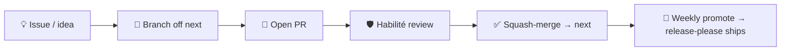

# Contributing to the AIDD Framework

Source of truth for AIDD skills, agents, rules, and templates — authored in Claude Code syntax; the CLI adapts an archive per tool at release. This file covers contributing to **this repository**; the wider community, roles, and training programme live at [ai-driven-dev.fr](https://www.ai-driven-dev.fr/).



## 👥 Who can contribute

Roles and their rights are defined in [`GOVERNANCE.md`](./GOVERNANCE.md#-roles). Where each starts:

| Role | Start here |
| --- | --- |
| 👤 **Public** | [Open an issue](https://github.com/ai-driven-dev/framework/issues) or [discussion](https://github.com/ai-driven-dev/framework/discussions) |
| 🗳️ **Core Team** | Vote on roadmap priority |
| 🌱 **Certifié** | Open a pull request → [Set up](#-1-set-up) |
| 🛡️ **Habilité** | Review and merge |

The rest of this guide is the *how* for those opening PRs.

## 🔧 1. Set up

Requires **Node 22.12+**, **pnpm**, **jq**, **python3**, and **pipx** (`gh` and the Claude/Codex CLI optional).

```bash
make setup   # deps + git hooks, registers a local marketplace, installs plugins into Claude + Codex
```

`make` lists every target; `make doctor` and `make check` verify the environment and run the pre-commit checks (including the Markdown link checker).

## ✏️ 2. Make your change

- **Test locally** — neither tool hot-reloads the checkout (both serve a cached copy). After editing, run `make reload` (or `PLUGIN="aidd-refine aidd-pm"` for a subset), then restart the session — `/reload-plugins` covers a Claude-only edit to an existing skill.
- **Commit** — `<type>(<scope>): description`, one scope per commit (split cross-plugin changes). The types, scopes, and rules live in [`aidd_docs/memory/vcs.md`](aidd_docs/memory/vcs.md#commit-convention) (mirrors `commitlint.config.cjs`); the **type** drives the release → [`RELEASE.md`](./RELEASE.md).

## 🔀 3. Open a pull request

- **Branch off `next`, target `next`** — only `hotfix/*` branches off `main` for urgent production fixes. The branch prefix alone decides the target → [routing table](aidd_docs/memory/vcs.md#types).
- **Fill the PR template** — explain *what* changed and *how* you solved it; skip re-asserting the conventional title and hooks (CI already enforces them).
- **Label** follows your branch kind (the PR skill applies it automatically); add `security` when relevant.
- **A Habilité review gates every merge** ([`CODEOWNERS`](./.github/CODEOWNERS)) — Certifié contributors cannot self-merge. PRs squash-merge on the conventional title. Decision rules → [`GOVERNANCE.md`](./GOVERNANCE.md#-code-decisions-merging).

## 🧩 Add a plugin

Adding a **skill / agent / rule / command / hook**? Generate it with `/aidd-context:03-context-generate`, then edit the owning plugin's `plugin.json` `skills[]`.

A **new plugin** (anatomy → [`ARCHITECTURE.md`](docs/ARCHITECTURE.md#-anatomy-of-a-plugin)):

1. **Scaffold** `plugins/aidd-<x>/` — `.claude-plugin/plugin.json` + `skills/<NN>-<name>/` (with `SKILL.md` + `actions/`).
2. **Register** — append to `.claude-plugin/marketplace.json` (`name`, `source`, `recommended: false`) **and** add the package to `release-please-config.json` + `.release-please-manifest.json`, or it never releases.
3. **Try it** — `/plugin marketplace add .` then `/plugin install aidd-<x>@aidd-framework`.

Guardrails: English prose, hyphens not em-dashes, no cross-plugin references, skill `name:` is the folder slug.

## 🚀 Releases

The `main`/`next` model, weekly cadence, and hotfix flow → [`RELEASE.md`](./RELEASE.md). A release ships **8 independently-versioned packages** (root `aidd-framework` + the 7 plugins; `aidd-ui` is alpha) plus per-tool archives; full breakdown → [`MAINTAINERS.md`](docs/MAINTAINERS.md#-releases).

## 🐛 Reporting issues

[Open an issue](https://github.com/ai-driven-dev/framework/issues/new/choose) (🐛 Bug or ✨ Feature) — auto-added to the [Roadmap board](https://github.com/orgs/ai-driven-dev/projects/8). For usage questions use [Discussions](https://github.com/ai-driven-dev/framework/discussions), not issues (see [`SUPPORT.md`](./.github/SUPPORT.md)).

## 📚 Reference

- **Architecture & terms** → [`docs/ARCHITECTURE.md`](docs/ARCHITECTURE.md) · [`docs/GLOSSARY.md`](docs/GLOSSARY.md)
- **Patterns to follow** → a minimal plugin [`aidd-refine`](plugins/aidd-refine/), a router skill [`00-onboard`](plugins/aidd-context/skills/00-onboard/), agents [`aidd-dev/agents`](plugins/aidd-dev/agents/)
- **Per-tool builds** → source files use Claude Code syntax; the `aidd-cli` maps each surface to its per-tool equivalent at release. `name` / `description` / `argument-hint` are universal; other frontmatter keys (`model`, `color`, `paths`, …) are tool-specific and ignored where unsupported.

---

■ [Back to framework](./README.md)
