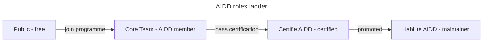

# Governance

How decisions get made in the AI-Driven Dev Framework. Four roles form a
**ladder** - each rung keeps every right of the rungs below and adds its own.

## Roles

| Tier | How you get there | Adds (on top of the rung below) | Team |
| ---- | ----------------- | ------------------------------- | ---- |
| **Public** | Free, any GitHub account | Open issues, comment, react / upvote ideas (signal only) | - |
| **Core Team** | Active [AIDD programme](https://www.ai-driven-dev.fr/) member (training, community, coaching) | A **counted roadmap vote** + voice on direction | [`core-team`](https://github.com/orgs/ai-driven-dev/teams/core-team) |
| **Certifié AIDD** | Pass the [AIDD certification](https://www.ai-driven-dev.fr/) | Open **pull requests** (framework + courses) | [`certified`](https://github.com/orgs/ai-driven-dev/teams/certified) |
| **Habilité AIDD** | Promoted by a majority of Habilité | **Approve & merge** PRs, **quality veto**, appoint/promote, guard the standard | [`habilitated`](https://github.com/orgs/ai-driven-dev/teams/habilitated) |

**Plugin owners** are Habilité scoped to one plugin (`aidd-context`, `aidd-dev`,
…): they merge and triage for that plugin only.

## Roadmap voting

- **Public** reacts (👍 / upvote). This is a **signal**, not a counted vote; it
  promotes an item to a formal vote.
- **Core Team, Certifié, Habilité** each cast **one equal vote**. The vote is a
  benefit of AIDD membership (the programme is a paid training / community /
  coaching offering) - that is what turns a signal into a counted vote.
- **Habilité** holds the tiebreak and a **quality veto** as the top rung.
- A poll runs **≥ 7 days**. Accepted items land on the
  [AIDD Roadmap board](https://github.com/orgs/ai-driven-dev/projects/8).

## Code decisions (merging)

Merge authority is **Habilité only**. Default is **lazy consensus**: a Habilité
may merge if no other Habilité objects within 72h, there is ≥1 Habilité approval,
and CI passes. Any Habilité can block with a `request-changes` review (the
**quality veto**) until resolved.

Cross-plugin changes, contract changes (skill frontmatter, `marketplace.json`),
or licensing/governance changes need **explicit consensus**: ≥2 Habilité approve,
none object.

## Promotion and inactivity

- **→ Certifié**: pass the AIDD certification → added to `certified`.
- **→ Habilité**: a Habilité nominates a Certifié with a track record of merged,
  standard-consistent work; a majority of Habilité approves → added to
  `habilitated` and `CODEOWNERS`.
- A Core Team / Habilité member inactive **6 months** may be moved to **emeritus**
  by a Habilité majority (keeps recognition, loses vote/merge until they return).

## Plugins, breaking changes, conflicts

- **New plugin**: lands via PR following [`docs/CREATE_PLUGIN.md`](docs/CREATE_PLUGIN.md)
  (description on every skill, registered in
  `marketplace.json` + `release-please-config.json`, a Habilité owner). Starts
  `experimental` → `release candidate` (one external success) → `stable` (Habilité
  review).
- **Deprecate/remove**: any Habilité, with a rationale + migration path; stays
  installable 90 days.
- **Breaking changes**: Conventional Commits `!` suffix; document the migration
  path. Prompt-only behaviour changes also count - flag in the PR and announce on
  Discord.
- **Conflict of interest**: a Habilité with a stake in a PR discloses it and is
  not the sole approver (a second Habilité approval becomes mandatory).

## Branch protection on `main` and `next`

`main` is production: no direct push, no force-push, no deletion; every change is
a PR with ≥1 Habilité (CODEOWNERS) approval, passing checks (`lefthook
(framework-local checks)`, `Commitlint`), and resolved threads. Machine-readable
form: [`.github/rulesets/main.json`](.github/rulesets/main.json) (enforced once
the repo is public / on a paid plan).

`next` is the integration branch: PRs with ≥1 review and passing checks, no
direct push or deletion. The release bot bypasses to push the automated
back-merge, and the `admin` team may merge without a second review. Machine-readable form:
[`.github/rulesets/next.json`](.github/rulesets/next.json). The release flow is in
[`RELEASE.md`](RELEASE.md).

## Code of Conduct & amendments

All interactions follow the [Code of Conduct](./CODE_OF_CONDUCT.md). Changes to
this document follow the explicit-consensus rule above.
