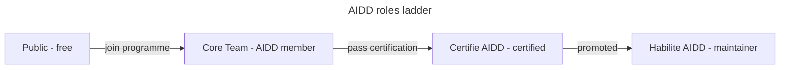

# Governance

How decisions get made in the AI-Driven Dev Framework. Four roles form a
**ladder**. Each rung keeps every right of the rungs below it, plus adds a
right of its own.

## Roles

| Tier | How you get there | Adds (on top of the rung below) | Team |
| ---- | ----------------- | ------------------------------- | ---- |
| **Public** | Free, any GitHub account | Open issues, comment, react / upvote ideas (signal only) | - |
| **Core Team** | Active [AIDD programme](https://www.ai-driven-dev.fr/) member (training, community, coaching) | A **counted roadmap vote** + voice on direction | [`core-team`](https://github.com/orgs/ai-driven-dev/teams/core-team) |
| **Certifié AIDD** | Pass the [AIDD certification](https://www.ai-driven-dev.fr/) | Open **pull requests** (framework + courses) | [`certified`](https://github.com/orgs/ai-driven-dev/teams/certified) |
| **Habilité AIDD** | Promoted by a majority of Habilité | **Approve & merge** PRs, **quality veto**, appoint/promote, guard the standard | [`habilitated`](https://github.com/orgs/ai-driven-dev/teams/habilitated) |

**Plugin owners** are Habilité members scoped to one plugin, such as
`aidd-context` or `aidd-dev`. They merge and triage only for that plugin.

## Roadmap voting

- **Public** reacts with a 👍 / upvote. This is a **signal**, not a counted
  vote. Enough signal promotes an item to a formal vote.
- **Core Team, Certifié, and Habilité** members each cast **one equal vote**.
  This vote is a benefit of AIDD membership, since the programme is a paid
  training / community / coaching offering. Membership is what turns a signal
  into a counted vote.
- **Habilité** holds the tiebreak vote and a **quality veto**, as the top rung.
- A poll runs for **≥ 7 days**. Accepted items land on the
  [AIDD Roadmap board](https://github.com/orgs/ai-driven-dev/projects/8).

## Code decisions (merging)

Only **Habilité** members can merge. The default path is **lazy consensus**:
a Habilité may merge once all three conditions hold:

- No other Habilité objects within 72 hours.
- At least one Habilité has approved.
- CI passes.

Any Habilité can block a merge with a `request-changes` review. This is the
**quality veto**, and it holds until resolved.

Cross-plugin changes, contract changes (skill frontmatter, `marketplace.json`),
and licensing or governance changes need **explicit consensus** instead: at
least 2 Habilité must approve, and none may object.

## Promotion and inactivity

- **→ Certifié**: pass the AIDD certification. You are then added to
  `certified`.
- **→ Habilité**: a Habilité nominates a Certifié with a track record of
  merged, standard-consistent work. A majority of Habilité must approve. The
  nominee is then added to `habilitated` and `CODEOWNERS`.
- A Core Team or Habilité member who is inactive for **6 months** may be moved
  to **emeritus** by a Habilité majority. This keeps their recognition but
  removes their vote and merge rights until they return.

## Plugins, breaking changes, conflicts

- **New plugin**: it lands via PR following [`docs/CREATE_PLUGIN.md`](docs/CREATE_PLUGIN.md).
  Every skill needs a description, the plugin must be registered in
  `marketplace.json` and `release-please-config.json`, and it needs a Habilité
  owner. It starts as `experimental`, moves to `release candidate` after one
  external success, then to `stable` after Habilité review.
- **Deprecate/remove**: any Habilité can do this, with a rationale and a
  migration path. The plugin stays installable for 90 days after deprecation.
- **Breaking changes**: mark them with the Conventional Commits `!` suffix and
  document the migration path. Prompt-only behaviour changes count as breaking
  too - flag them in the PR and announce on Discord.
- **Conflict of interest**: a Habilité with a stake in a PR must disclose it
  and cannot be the sole approver. A second Habilité approval becomes
  mandatory.

## Branch protection on `main` and `next`

`main` is the production branch: no direct push, no force-push, no deletion.
Every change goes through a PR with ≥1 Habilité (CODEOWNERS) approval, passing
checks (`lefthook (framework-local checks)`, `Commitlint`), and resolved
review threads. The machine-readable rules are in
[`.github/rulesets/main.json`](.github/rulesets/main.json), enforced once the
repo is public or on a paid plan.

`next` is the integration branch: PRs need ≥1 review and passing checks, with
no direct push or deletion. The release bot may bypass this to push its
automated back-merge, and the `admin` team may merge without a second review.
The machine-readable rules are in
[`.github/rulesets/next.json`](.github/rulesets/next.json). The release flow
is documented in [`RELEASE.md`](RELEASE.md).

## Code of Conduct & amendments

All interactions follow the [Code of Conduct](./CODE_OF_CONDUCT.md). Changes
to this document follow the explicit-consensus rule described above.
