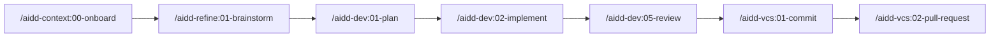

<div align="center">


# AI-Driven Dev Framework

### Skills, agents & rules that run the full SDLC inside Claude Code — under human supervision.

<p>
  <!--counts:start--><kbd>6 plugins</kbd> · <kbd>37 skills</kbd> · <kbd>3 agents</kbd><!--counts:end--> · <kbd>MIT</kbd>
</p>

<p>
  <a href="#-quick-start"><strong>Quick start →</strong></a> ·
  <a href="#-plugins"><strong>Plugins →</strong></a> ·
  <a href="recipes/"><strong>Recipes →</strong></a> ·
  <a href="https://discord.gg/ai-driven-dev"><strong>Discord 🇫🇷 →</strong></a>
</p>

[](LICENSE)
[](https://code.claude.com/docs/en/discover-plugins)
[](https://github.com/ai-driven-dev/framework/releases)
[](https://github.com/ai-driven-dev/framework/actions/workflows/ci.yml)
[](https://www.ai-driven-dev.fr/)

</div>

---

The **AIDD Framework** is a marketplace of **skills, agents, and rules** that make the AI-Driven Development flow concrete inside your AI coding assistant — the full SDLC (plan → implement → review → ship) under rigorous human supervision. It is the open toolset of the [AI-Driven Dev](https://www.ai-driven-dev.fr/) community, authored for **Claude Code**.

## 👋 Who we are

Built by the **[AI-Driven Dev](https://www.ai-driven-dev.fr/)** community, founded by **Alex Soyes**.

- 💬 **[Discord 🇫🇷](https://discord.gg/ai-driven-dev)** — live sessions every **Thursday**
- 🎓 **[Training & community](https://www.ai-driven-dev.fr/)** — the AIDD programme (training · coaching · community)
- ▶️ **[YouTube](https://www.youtube.com/@aidd_off)** · 💼 **[LinkedIn](https://www.linkedin.com/company/ai-driven-dev)** · 🌐 **[Website](https://www.ai-driven-dev.fr/)**
- 👤 Alex Soyes — [Blog](https://alexsoyes.com/) · [GitHub](https://github.com/alexsoyes) · [LinkedIn](https://www.linkedin.com/in/alexsoyes/) · [X](https://x.com/alexsoyes)

## 🧰 Supported tools

The marketplace is **Claude Code native**. Every [release](https://github.com/ai-driven-dev/framework/releases/latest) also attaches an archive adapted to each other tool — download the one for your assistant and install it.

| Tool | Support | Install |
| --- | --- | --- |
| **Claude Code** | ✅ **Recommended** · native | `/plugin marketplace add ai-driven-dev/framework` |
| **Cursor** | Supported | Download `…-cursor-flat-<version>.zip`, unzip into your project |
| **GitHub Copilot** | Supported | Download `…-copilot-marketplace-<version>.zip`, `aidd marketplace add` |
| **Codex** | Supported | Download `…-codex-marketplace-<version>.zip`, `aidd marketplace add` |
| **OpenCode** | Supported | Download `…-opencode-flat-<version>.zip`, unzip into your project |

> On a non-Claude tool, map each skill's model tier to your tool's nearest model — see the [LLM tier reference](docs/MARKETPLACE.md#llm-tier-reference).

## 🚀 Quick start

**1. Install** — register the marketplace and the plugins (Claude Code slash commands, not shell):

```text
/plugin marketplace add ai-driven-dev/framework
/plugin install aidd-context@aidd-framework
/plugin install aidd-refine@aidd-framework
/plugin install aidd-dev@aidd-framework
/plugin install aidd-vcs@aidd-framework
/plugin install aidd-pm@aidd-framework
/plugin install aidd-orchestrator@aidd-framework
```

**2. Onboard** — one command inspects your project and guides you:

```text
/aidd-context:00-onboard
```

**3. Run the flow** — take a feature from idea to shipped PR:



> Want the whole loop in a single command? `/aidd-dev:00-sdlc` runs plan → implement → review → ship.

## 🧩 Plugins

<table>
<tr>
<td width="33%" valign="top">

### 🧭 [aidd-context](plugins/aidd-context/README.md)

`12 skills` · stable

Project init, architecture, generation of Claude Code context artifacts (skills, agents, rules, commands, hooks), diagrams, learning, discovery.

</td>
<td width="33%" valign="top">

### ⚙️ [aidd-dev](plugins/aidd-dev/README.md)

`11 skills` · stable

SDLC loop: sdlc, plan, implement, assert, audit, review, test, refactor, debug, for-sure.

</td>
<td width="33%" valign="top">

### 🌿 [aidd-vcs](plugins/aidd-vcs/README.md)

`4 skills` · stable

Commits, pull / merge requests, release tags, issue creation.

</td>
</tr>
<tr>
<td width="33%" valign="top">

### 📋 [aidd-pm](plugins/aidd-pm/README.md)

`4 skills` · stable

Ticket info, user stories, PRD, spec drafting.

</td>
<td width="33%" valign="top">

### 🪞 [aidd-refine](plugins/aidd-refine/README.md)

`5 skills` · stable

Meta-cognition: brainstorm, challenge, condense, shadow-areas, fact-check.

</td>
<td width="33%" valign="top">

### 🎼 [aidd-orchestrator](plugins/aidd-orchestrator/README.md)

`1 skill` · stable (`async-dev`)

Label an issue, get a PR; re-label, get the review applied.

</td>
</tr>
</table>

## 📖 Recipes

Task-oriented how-to sheets — install an MCP server, optimise your tokens, and more.

➡️ **[Browse the recipes →](recipes/)**

## 🤝 Contributing

- 🐛 **Open an [issue](https://github.com/ai-driven-dev/framework/issues)** or share an idea in [Discussions](https://github.com/ai-driven-dev/framework/discussions).
- 💬 **Join the [Discord 🇫🇷](https://discord.gg/ai-driven-dev)** — live every **Thursday**.
- 📦 Building a plugin or a recipe? See [`CONTRIBUTING.md`](./CONTRIBUTING.md) and [`docs/CREATE_PLUGIN.md`](docs/CREATE_PLUGIN.md).

Roles, rights, and how decisions get made → [`GOVERNANCE.md`](./GOVERNANCE.md). By participating you agree to the [Code of Conduct](./CODE_OF_CONDUCT.md).

## 🔒 Trust & safety

Plugins can run commands, edit files, and call external services on your behalf. Before installing any plugin from any marketplace, including this one: read its `README` and `SKILL.md`, inspect its actions, and check the permissions in its hooks and MCP servers. Spot a vulnerability? Report it privately via [`SECURITY.md`](./SECURITY.md).

## 📚 Documentation

| Resource | Where |
| -------- | ----- |
| How it works (architecture) | [`docs/ARCHITECTURE.md`](docs/ARCHITECTURE.md) |
| Marketplace, scopes & versioning · LLM tiers | [`docs/MARKETPLACE.md`](docs/MARKETPLACE.md) |
| Skills catalog | [`docs/CATALOG.md`](docs/CATALOG.md) |
| Build your own plugin | [`docs/CREATE_PLUGIN.md`](docs/CREATE_PLUGIN.md) |
| Recipes | [`recipes/`](recipes/) |
| FAQ · Troubleshooting | [`docs/FAQ.md`](docs/FAQ.md) · [`docs/TROUBLESHOOTING.md`](docs/TROUBLESHOOTING.md) |
| Glossary | [`docs/GLOSSARY.md`](docs/GLOSSARY.md) |
| Contributing · Governance | [`CONTRIBUTING.md`](./CONTRIBUTING.md) · [`GOVERNANCE.md`](./GOVERNANCE.md) |
| Changelog · Roadmap | [`CHANGELOG.md`](./CHANGELOG.md) · [`ROADMAP.md`](./ROADMAP.md) |
| Security | [`SECURITY.md`](./SECURITY.md) |

---

<div align="center">

🇫🇷 🥖 🐓 · Made with care in France by the AIDD community · 🐓 🥖 🇫🇷

← [Back to the AIDD organisation](https://github.com/ai-driven-dev)

</div>
