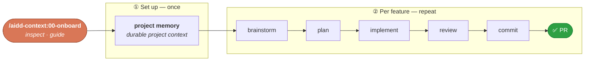

<p align="right">
  <a href="https://github.com/ai-driven-dev/framework/stargazers">
    <picture>
      <source media="(prefers-color-scheme: dark)" srcset="docs/assets/star-cta-dark.svg" />
      
    </picture>
  </a>
</p>

<div align="center">


# AI-Driven Dev Framework

### A French framework for AI-Driven Developers to ship high-quality code.

<p>
  <!--counts:start--><kbd>7 plugins</kbd> · <kbd>40 skills</kbd> · <kbd>2 agents</kbd><!--counts:end--> · <kbd>MIT</kbd>
</p>

[](LICENSE)
[](https://github.com/ai-driven-dev/framework/releases)
[](https://github.com/ai-driven-dev/framework/actions/workflows/ci.yml)
[](https://www.ai-driven-dev.fr/)

<p>🗺️ <a href="https://github.com/orgs/ai-driven-dev/projects/8"><b>Live roadmap</b></a></p>

</div>

---

A marketplace of **skills, agents, commands, rules, and recipes** that drive your SDLC — from idea to a tested, shipped PR — the agentic-engineering way.

## 🚀 Quick start

One command inspects your project and guides you. Set up **project memory** once, then run the **feature loop** as many times as you like.



```text
/aidd-context:00-onboard
```

> Prefer one command for the whole loop? `/aidd-dev:00-sdlc` runs plan → implement → review → ship.

## 📦 Install

**Prerequisites** — [Claude Code](https://claude.com/claude-code), and **Node** on your `PATH` (some plugins run small Node hooks automatically; see [Trust and safety](#-trust-and-safety)).

**Claude Code** (native) — register the marketplace and install the plugins (slash commands, not shell):

```text
/plugin marketplace add ai-driven-dev/framework
/plugin install aidd-context@aidd-framework
/plugin install aidd-refine@aidd-framework
/plugin install aidd-dev@aidd-framework
/plugin install aidd-vcs@aidd-framework
/plugin install aidd-pm@aidd-framework
/plugin install aidd-orchestrator@aidd-framework
```

Update anytime: `/plugin marketplace update aidd-framework`. Scopes and versioning → [`MARKETPLACE.md`](docs/MARKETPLACE.md).

### Other tools

Cursor, GitHub Copilot, Codex, and OpenCode install from a **flat** archive — no extra tooling:

1. Download `aidd-framework-<tool>-flat-<version>.zip` from the [latest release](https://github.com/ai-driven-dev/framework/releases/latest).
2. Unzip it into your project root — it materializes `.cursor/`, `.opencode/`, … ready to use.

> A CLI that registers AIDD as a native marketplace on these tools is on the way. Until then, use the flat archive above.

## 🧩 Plugins

Seven plugins covering the whole SDLC — **install all of them**; they work together. (`aidd-ui` is 🚧 **alpha**, off the curated path.)

<table>
<tr>
<td width="33%" valign="top">

### 🧭 [aidd-context](plugins/aidd-context/README.md)

`13 skills` · stable

Project init, memory bank, context-artifact generation, diagrams, learning, exploration.

</td>
<td width="33%" valign="top">

### ⚙️ [aidd-dev](plugins/aidd-dev/README.md)

`11 skills` · stable

SDLC loop: plan, implement, assert, audit, review, test, refactor, debug.

</td>
<td width="33%" valign="top">

### 🌿 [aidd-vcs](plugins/aidd-vcs/README.md)

`5 skills` · stable

Repo init, commits, pull / merge requests, release tags, issues.

</td>
</tr>
<tr>
<td width="33%" valign="top">

### 📋 [aidd-pm](plugins/aidd-pm/README.md)

`4 skills` · stable

Ticket info, user stories, PRD, spec drafting.

</td>
<td width="33%" valign="top">

### 🪞 [aidd-refine](plugins/aidd-refine/README.md)

`5 skills` · stable

Brainstorm, challenge, condense, shadow-areas, fact-check.

</td>
<td width="33%" valign="top">

### 🎼 [aidd-orchestrator](plugins/aidd-orchestrator/README.md)

`1 skill` · stable

Async dev: label an issue → get a PR.

</td>
</tr>
<tr>
<td width="33%" valign="top">

### 🎨 [aidd-ui](plugins/aidd-ui/README.md) 🚧

`1 skill` · **alpha**

UI / UX design — smoke-test only, not ready for use.

</td>
</tr>
</table>

Full catalog → [`CATALOG.md`](docs/CATALOG.md).

## 📖 Recipes · 📚 Docs

- **[Recipes](recipes/)** — task-oriented how-to sheets (e.g. [MCP installations](recipes/mcp-installation.md)).
- **Docs** — [`ARCHITECTURE`](docs/ARCHITECTURE.md) · [`MARKETPLACE`](docs/MARKETPLACE.md) · [`CATALOG`](docs/CATALOG.md) · [`CREATE_PLUGIN`](docs/CREATE_PLUGIN.md) · [`FAQ`](docs/FAQ.md) · [`TROUBLESHOOTING`](docs/TROUBLESHOOTING.md) · [`GLOSSARY`](docs/GLOSSARY.md).

## 🔒 Trust and safety

Plugins run commands, edit files, and call external services on your behalf — and some ship **hooks that run automatically** at session events ([full list](docs/ARCHITECTURE.md#bundled-hooks)); e.g. `aidd-context` refreshes the memory bank at session start via a Node script. Before installing any plugin, read its `README` and `SKILL.md`, and inspect its `hooks/` and `.mcp.json`. Spot a vulnerability? Report it privately via [`SECURITY.md`](./SECURITY.md).

## 🤝 Community & contributing

Free and open-source (MIT), built by the [AI-Driven Dev](https://www.ai-driven-dev.fr/) community. If it saves you time, [a ⭐](https://github.com/ai-driven-dev/framework/stargazers) helps others find it.

- **Idea or bug?** [Open an issue](https://github.com/ai-driven-dev/framework/issues) or [start a discussion](https://github.com/ai-driven-dev/framework/discussions).
- **Contribute code** → [`CONTRIBUTING.md`](CONTRIBUTING.md). PR rights are reserved for certified Core Team members ([`GOVERNANCE.md`](GOVERNANCE.md)).
- **Chat & roadmap** → [Discord](https://discord.gg/EWySJSpjWs) (decisions every Thursday) · [train your team](https://www.ai-driven-dev.fr/entreprise).

---

<div align="center">


Made with care in France 🇫🇷 by the AIDD community · ← [AIDD organisation](https://github.com/ai-driven-dev)

</div>
