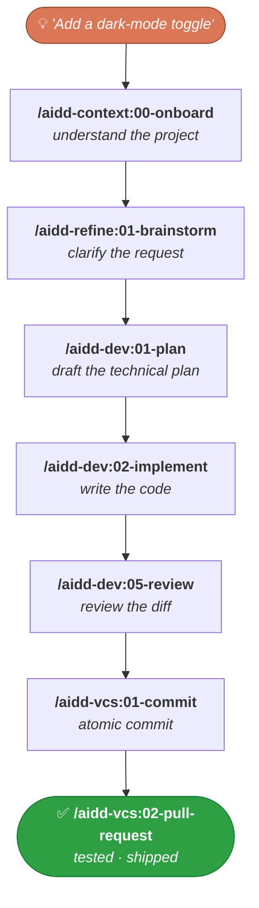

<p align="right">
  <a href="https://github.com/ai-driven-dev/framework/stargazers">
    <picture>
      <source media="(prefers-color-scheme: dark)" srcset="docs/assets/star-cta-dark.svg" />
      
    </picture>
  </a>
</p>

<div align="center">


# AI-Driven Dev Framework

### A French framework for AI-Driven Developers to ship high-quality code.

<p>
  <!--counts:start--><kbd>7 plugins</kbd> · <kbd>40 skills</kbd> · <kbd>2 agents</kbd><!--counts:end--> · <kbd>MIT</kbd>
</p>

[](LICENSE)
[](https://github.com/ai-driven-dev/framework/releases)
[](https://github.com/ai-driven-dev/framework/actions/workflows/ci.yml)
[](https://www.ai-driven-dev.fr/)

<p>🗺️ <a href="https://github.com/orgs/ai-driven-dev/projects/8"><b>Live roadmap</b></a> — what's shipping Now / Next / Later</p>

</div>

---

A marketplace of **skills, agents, commands, rules, prompts, templates, and recipes** that orchestrate your SDLC (Software Development Life Cycle) the agentic-engineering way — from idea to a tested, shipped PR.

## 📦 Install

Built for **Claude Code** (native). Other tools install from a per-release archive — see [another tool](#another-tool).

Register the marketplace, then install the plugins (these are slash commands, not shell):

```text
/plugin marketplace add ai-driven-dev/framework
/plugin install aidd-context@aidd-framework
/plugin install aidd-refine@aidd-framework
/plugin install aidd-dev@aidd-framework
/plugin install aidd-vcs@aidd-framework
/plugin install aidd-pm@aidd-framework
/plugin install aidd-orchestrator@aidd-framework
```

Update anytime with `/plugin marketplace update aidd-framework`. Scopes and versioning: [`MARKETPLACE.md`](docs/MARKETPLACE.md).

### Another tool

Every [release](https://github.com/ai-driven-dev/framework/releases/latest) attaches a per-tool archive in one of two formats:

- **Marketplace** — register once, install and update on demand: `aidd marketplace add aidd-framework ./<unzipped-dir>`, then install the same plugin names as Claude Code.
- **Flat** — unzip straight into your project root; it materializes `.cursor/`, `.opencode/`, … ready to use.

| Tool | Status | Format |
| --- | --- | --- |
| **Claude Code** | ✅ Native · **recommended** | native |
| **GitHub Copilot** | ✅ Supported | marketplace |
| **Codex** | ✅ Supported | marketplace |
| **Cursor** | ✅ Supported | flat |
| **OpenCode** | ✅ Supported | flat |
| **Gemini** | 🚧 In progress | — |
| **Mistral** | 🚧 In progress | — |

Grab `aidd-framework-<tool>-<format>-<version>.zip` from the [latest release](https://github.com/ai-driven-dev/framework/releases/latest). Private repo? `/plugin marketplace add` needs GitHub read access (`gh auth login` or a PAT).

## 🚀 Quick start

1. **Onboard** — one command inspects your project and guides you:
   ```text
   /aidd-context:00-onboard
   ```
2. **Run the flow** — take a feature from idea to a tested, shipped PR:



> Prefer one command for the whole loop? `/aidd-dev:00-sdlc` runs plan → implement → review → ship.

## 🧩 Plugins

Seven plugins covering the whole SDLC — **install all of them**; they're designed to work together. (`aidd-ui` is 🚧 **alpha — not ready for use**, off the curated install path.)

<table>
<tr>
<td width="33%" valign="top">

### 🧭 [aidd-context](plugins/aidd-context/README.md)

`13 skills` · stable

Project init, architecture, generation of Claude Code context artifacts (skills, agents, rules, commands, hooks), diagrams, learning, exploration.

</td>
<td width="33%" valign="top">

### ⚙️ [aidd-dev](plugins/aidd-dev/README.md)

`11 skills` · stable

SDLC loop: sdlc, plan, implement, assert, audit, review, test, refactor, debug, for-sure.

</td>
<td width="33%" valign="top">

### 🌿 [aidd-vcs](plugins/aidd-vcs/README.md)

`5 skills` · stable

Repo init, commits, pull / merge requests, release tags, issue creation.

</td>
</tr>
<tr>
<td width="33%" valign="top">

### 📋 [aidd-pm](plugins/aidd-pm/README.md)

`4 skills` · stable

Ticket info, user stories, PRD, spec drafting.

</td>
<td width="33%" valign="top">

### 🪞 [aidd-refine](plugins/aidd-refine/README.md)

`5 skills` · stable

Meta-cognition: brainstorm, challenge, condense, shadow-areas, fact-check.

</td>
<td width="33%" valign="top">

### 🎼 [aidd-orchestrator](plugins/aidd-orchestrator/README.md)

`1 skill` · stable (`async-dev`)

Label an issue, get a PR; re-label, get the review applied.

</td>
</tr>
<tr>
<td width="33%" valign="top">

### 🎨 [aidd-ui](plugins/aidd-ui/README.md) 🚧

`1 skill` · **alpha — not ready**

UI and UX: design, review, and improve frontend interfaces. ⚠️ Alpha (`0.1.0-alpha.0`), smoke-test only — do not rely on it yet.

</td>
</tr>
</table>

Full skills catalog: [`CATALOG.md`](docs/CATALOG.md).

## 📖 Recipes

Task-oriented how-to sheets. **[Browse all recipes →](recipes/)**

| Recipe | What you'll do |
| --- | --- |
| [MCP installations](recipes/mcp-installation.md) | Choose CLI vs MCP, and wire up the recommended servers (GitHub, Atlassian, Figma, Notion…) |

## 🧑‍💻 The AIDD community

Built by the [AI-Driven Dev](https://www.ai-driven-dev.fr/) community: 3 years of R&D, 500+ developers trained in English 🇬🇧 and French 🇫🇷, shipping production software with 100% AI-generated code.

- **[Join the Discord 🇫🇷](https://discord.gg/EWySJSpjWs)** — public [roadmap](./ROADMAP.md) decisions every Thursday morning.
- **Want to train your team?** [See the programme](https://www.ai-driven-dev.fr/entreprise).
- **AI is important to you?** [Join the ecosystem](https://www.ai-driven-dev.fr/ecosysteme).

## 🤝 Contributing

> ⭐ **Free & open-source (MIT), built by the AIDD community.** If AIDD saves you time, [**a star**](https://github.com/ai-driven-dev/framework/stargazers) genuinely helps the project grow and helps other developers find it.

Got an idea or hit a bug? **[Open an issue](https://github.com/ai-driven-dev/framework/issues)** or **[start a discussion](https://github.com/ai-driven-dev/framework/discussions)**. For everything else, **[join the Discord](https://discord.gg/EWySJSpjWs)**.

> **Note** — code (pull-request) rights on this repo are reserved for **certified Core Team members** ([`GOVERNANCE.md`](./GOVERNANCE.md)). Everyone else can open issues, join discussions, and shape the roadmap.

## 🔒 Trust and safety

Plugins can run commands, edit files, and call external services on your behalf. Before installing any plugin from any marketplace, including this one: read its `README` and `SKILL.md`, inspect its actions, and check the permissions in its hooks and MCP servers. Spot a vulnerability? Report it privately via [`SECURITY.md`](./SECURITY.md).

## 📚 Documentation

| Doc | What's inside |
| --- | --- |
| [`ARCHITECTURE.md`](docs/ARCHITECTURE.md) | How the framework is structured |
| [`MARKETPLACE.md`](docs/MARKETPLACE.md) | Marketplaces, install scopes, versioning, LLM tiers |
| [`CATALOG.md`](docs/CATALOG.md) | Full skills catalog |
| [`CREATE_PLUGIN.md`](docs/CREATE_PLUGIN.md) | Build your own plugin |
| [`FAQ.md`](docs/FAQ.md) | Frequently asked questions |
| [`TROUBLESHOOTING.md`](docs/TROUBLESHOOTING.md) | Install issues, load problems, limits |
| [`GLOSSARY.md`](docs/GLOSSARY.md) | Terms used across the framework |
| [`MAINTAINERS.md`](docs/MAINTAINERS.md) | Maintainer guide |

## 📈 Star History


---

<div align="center">

Made with care in France 🇫🇷 by the AIDD community

← [Back to the AIDD organisation](https://github.com/ai-driven-dev)

</div>
