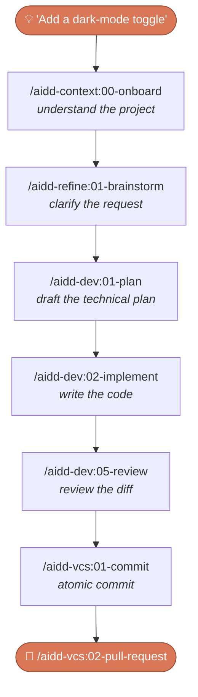

<div align="center">


# AI-Driven Dev Framework

### Skills, agents & rules that run the full SDLC inside your AI coding assistant — under human supervision.

<p>
  <!--counts:start--><kbd>6 plugins</kbd> · <kbd>38 skills</kbd> · <kbd>3 agents</kbd><!--counts:end--> · <kbd>MIT</kbd>
</p>

[](LICENSE)
[](https://code.claude.com/docs/en/discover-plugins)
[](https://github.com/ai-driven-dev/framework/releases)
[](https://github.com/ai-driven-dev/framework/actions/workflows/ci.yml)
[](https://www.ai-driven-dev.fr/)

</div>

---

The **AIDD Framework** is a marketplace of **skills, agents, and rules** that make the AI-Driven Development flow concrete inside your AI coding assistant — the full SDLC (plan → implement → review → ship) under rigorous human supervision. It is the open toolset of the [AI-Driven Dev](https://www.ai-driven-dev.fr/) community: authored for **Claude Code** and shipped for every major AI assistant.

## Community

Built and maintained by the **[AI-Driven Dev](https://www.ai-driven-dev.fr/)** community.

> ### → [Join the Discord 🇫🇷](https://discord.gg/ai-driven-dev)
> Live coding sessions every **Thursday**. Come build, ask, and share.

**[Discover the AIDD programme →](https://www.ai-driven-dev.fr/)** — training, coaching, and community.

[YouTube](https://www.youtube.com/@aidd_off) · [LinkedIn](https://www.linkedin.com/company/ai-driven-dev) · [Website](https://www.ai-driven-dev.fr/)

## Installation

There are two ways to install, depending on your tool:

- **Marketplace** *(recommended)* — register the marketplace once, then install and update plugins on demand. Native in Claude Code; for Copilot and Codex, download the `-marketplace-` release archive and register it with `aidd marketplace add`.
- **Flat** — unzip a `-flat-` release archive straight into your project (it materializes `.cursor/`, `.opencode/`, …). For tools without marketplace support.

**Claude Code** — register the marketplace and install the plugins (slash commands, not shell):

```text
/plugin marketplace add ai-driven-dev/framework
/plugin install aidd-context@aidd-framework
/plugin install aidd-refine@aidd-framework
/plugin install aidd-dev@aidd-framework
/plugin install aidd-vcs@aidd-framework
/plugin install aidd-pm@aidd-framework
/plugin install aidd-orchestrator@aidd-framework
```

**Other tools** — grab the archive for your assistant from the [latest release](https://github.com/ai-driven-dev/framework/releases/latest):

| Tool | Format | Install |
| --- | --- | --- |
| **Claude Code** | Marketplace *(native)* ✅ **recommended** | `/plugin marketplace add ai-driven-dev/framework` |
| **GitHub Copilot** | Marketplace archive | Download `…-copilot-marketplace-<version>.zip`, then `aidd marketplace add` |
| **Codex** | Marketplace archive | Download `…-codex-marketplace-<version>.zip`, then `aidd marketplace add` |
| **Cursor** | Flat archive | Download `…-cursor-flat-<version>.zip`, unzip into your project |
| **OpenCode** | Flat archive | Download `…-opencode-flat-<version>.zip`, unzip into your project |

> A flat variant is attached for every tool too — pick the format that fits your workflow. On a non-Claude tool, map each skill's model tier to your tool's nearest model ([LLM tier reference](docs/MARKETPLACE.md#llm-tier-reference)).

## Quick start

Once installed, let one command inspect your project and guide you:

```text
/aidd-context:00-onboard
```

Then run the flow — here's a feature going from idea to shipped PR:



> Prefer one command for the whole loop? `/aidd-dev:00-sdlc` runs plan → implement → review → ship.

## Plugins

<table>
<tr>
<td width="33%" valign="top">

### 🧭 [aidd-context](plugins/aidd-context/README.md)

`13 skills` · stable

Project init, architecture, generation of Claude Code context artifacts (skills, agents, rules, commands, hooks), diagrams, learning, discovery.

</td>
<td width="33%" valign="top">

### ⚙️ [aidd-dev](plugins/aidd-dev/README.md)

`11 skills` · stable

SDLC loop: sdlc, plan, implement, assert, audit, review, test, refactor, debug, for-sure.

</td>
<td width="33%" valign="top">

### 🌿 [aidd-vcs](plugins/aidd-vcs/README.md)

`4 skills` · stable

Commits, pull / merge requests, release tags, issue creation.

</td>
</tr>
<tr>
<td width="33%" valign="top">

### 📋 [aidd-pm](plugins/aidd-pm/README.md)

`4 skills` · stable

Ticket info, user stories, PRD, spec drafting.

</td>
<td width="33%" valign="top">

### 🪞 [aidd-refine](plugins/aidd-refine/README.md)

`5 skills` · stable

Meta-cognition: brainstorm, challenge, condense, shadow-areas, fact-check.

</td>
<td width="33%" valign="top">

### 🎼 [aidd-orchestrator](plugins/aidd-orchestrator/README.md)

`1 skill` · stable (`async-dev`)

Label an issue, get a PR; re-label, get the review applied.

</td>
</tr>
</table>

## Recipes

Task-oriented how-to sheets — install an MCP server, optimise your tokens, and more.

**[Browse the recipes →](recipes/)**

## Contributing

- Open an [issue](https://github.com/ai-driven-dev/framework/issues) or share an idea in [Discussions](https://github.com/ai-driven-dev/framework/discussions).
- Join the [Discord 🇫🇷](https://discord.gg/ai-driven-dev) — live every **Thursday**.
- Building a plugin or a recipe? See [`CONTRIBUTING.md`](./CONTRIBUTING.md) and [`docs/CREATE_PLUGIN.md`](docs/CREATE_PLUGIN.md).

## Trust & safety

Plugins can run commands, edit files, and call external services on your behalf. Before installing any plugin from any marketplace, including this one: read its `README` and `SKILL.md`, inspect its actions, and check the permissions in its hooks and MCP servers. Spot a vulnerability? Report it privately via [`SECURITY.md`](./SECURITY.md).

## Documentation

| Doc | What's inside |
| --- | --- |
| [`ARCHITECTURE.md`](docs/ARCHITECTURE.md) | How the framework is structured |
| [`MARKETPLACE.md`](docs/MARKETPLACE.md) | Marketplaces, install scopes, versioning, LLM tiers |
| [`CATALOG.md`](docs/CATALOG.md) | Full skills catalog |
| [`CREATE_PLUGIN.md`](docs/CREATE_PLUGIN.md) | Build your own plugin |
| [`FAQ.md`](docs/FAQ.md) | Frequently asked questions |
| [`TROUBLESHOOTING.md`](docs/TROUBLESHOOTING.md) | Install issues, load problems, limits |
| [`GLOSSARY.md`](docs/GLOSSARY.md) | Terms used across the framework |
| [`MAINTAINERS.md`](docs/MAINTAINERS.md) | Maintainer guide |

---

<div align="center">

Made with care in France 🇫🇷 by the AIDD community

← [Back to the AIDD organisation](https://github.com/ai-driven-dev)

</div>
