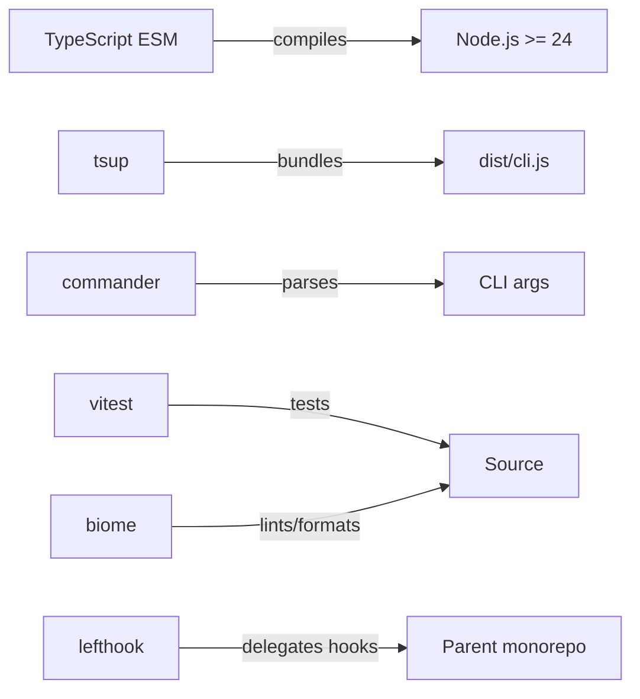
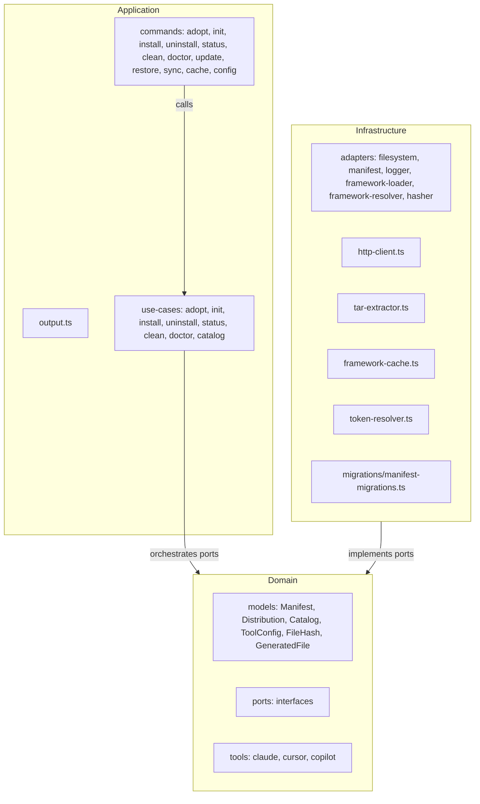

# Architecture

## Language/Framework



### Naming Conventions

| Scope | Convention | Example |
| --- | --- | --- |
| Files | kebab-case | `http-client.ts`, `file-hash.ts` |
| Functions | camelCase | `resolveToken()` |
| Types/Interfaces | PascalCase | `Manifest`, `ToolConfig` |
| Constants | UPPER_CASE | `DEFAULT_TIMEOUT` |

## Architecture Decisions

- 3-layer clean architecture: Domain → Application → Infrastructure (no separate Presentation layer)
- Commands live in `application/commands/`, output formatting in `application/output.ts`
- Max 2 runtime dependencies: `commander` and `@inquirer/prompts`; everything else uses Node.js built-ins (JSONC stripping is a local function in `file-system-adapter.ts`)
- `@inquirer/prompts` is reserved for interactive mode: without flags = guided interactive flow; with flags = non-interactive (CI-safe). Not yet used in v3.0.
- MD5 hashing via `node:crypto` for drift detection between installed files and framework version
- HTTP via `node:https` (no `fetch` wrapper libraries)
- Framework layout is hardcoded in `FrameworkLoaderAdapter` (`CONTENT_SECTIONS`, `TEMPLATE_REFS`, `CONFIG_REFS`). No `framework.json` file — `FrameworkDescriptor` is a code model built by the adapter, not parsed from a file.
- Manifest stored as JSON at `.aidd/manifest.json` — aggregate root tracking every installed file with its MD5 hash
- No settings file — project configuration is via CLI flags (`--repo`, `--verbose`) or env vars (`AIDD_REPO`, `AIDD_VERBOSE`)
- Domain layer has zero infrastructure imports (enforced in tests)
- Migration system in `infrastructure/migrations/` for manifest schema evolution

## Component Diagram



## Layer Responsibilities

- **Domain** — business models, value objects, port interfaces; zero infrastructure imports
- **Application** — use cases + commander commands + output formatting (`output.ts`)
- **Infrastructure** — port implementations using Node.js built-ins and allowed runtime deps

## Domain Ports

- `ManifestRepository` — read/write `.aidd/manifest.json`; `load()` returns `null` if not found; `delete()` removes file + `.aidd/` dir if empty
- `FileSystem` — read/write/delete/merge/hash files; `mergeJsonFile()` strips JSONC comments then deep-merges
- `FrameworkLoader` — build `FrameworkDescriptor` from hardcoded layout, read content directories
- `FrameworkResolver` — resolve framework from remote (GitHub Releases), local path, or tarball; `fetchLatestVersion()` fetches only the latest tag (no download) for update checks
- `Hasher` — compute MD5 hashes
- `Logger` — 3 methods: `debug()` (stderr, only in verbose), `info()` (stdout, always), `warn()` (stderr, always)

## ToolConfig Interface (domain/models/tool-config.ts)

`ToolConfig` is decomposed into handlers by functional subject. Each tool (`claude`, `cursor`, `copilot`) implements this interface in `domain/tools/`.

```ts
interface ToolConfig {
  readonly toolId: ToolId;
  readonly directory: string;
  readonly toolSuffix: string;
  rewriteContent(content: string, docsDir: string): string;
  agents(): SectionHandler;       // buildFilePath + convertFrontmatter
  commands(): CommandsHandler;    // buildFilePath + convertFrontmatter(fm, relativeFileName)
  rules(): RulesHandler;          // buildFilePath + convertFrontmatter
  skills(): SectionHandler;
  config(): ConfigHandler;        // outputPath + shouldMerge
  memoryBank(): MemoryBankHandler; // outputPath + rewriteContent
}
```

- `distribution.ts` dispatches via handlers — no more `if (section.name === X)` in tools
- `copilot.ts` named handlers (`agentsHandler`, `rulesHandler`...) reused in `rewriteContent` — no duplication of path mapping logic
- `frontmatter.ts` — `parseYamlLike` index-based (3 autonomous sub-functions), `serializeFrontmatter` emits JSON-array strings raw (no single-quote wrap)

## Services Communication

### Install Flow


## External Services

### GitHub Releases API

- Latest: `https://api.github.com/repos/<owner>/<repo>/releases/latest`
- By tag: `https://api.github.com/repos/<owner>/<repo>/releases/tags/<tag>` (used by `--release`)
- Auth: Bearer token from `--token` flag, `AIDD_TOKEN` env, or `gh auth token` (3s timeout fallback)
- Response: tarball URL downloaded via `node:https`, extracted with `node:child_process` (shells to system `tar`)
- Override: `--repo owner/repo` flag or `AIDD_REPO` env var for custom framework repository

## Token Resolution Priority

`--token` flag > `AIDD_TOKEN` env > `gh auth token` (3s timeout) > none

## Supported Tools

| Tool | Memory Bank | MCP Config | agents | commands | rules | skills |
| --- | --- | --- | --- | --- | --- | --- |
| `claude` | `CLAUDE.md` | `.mcp.json` | `.claude/agents/` | `.claude/commands/aidd/` | `.claude/rules/` (`.md`) | `.claude/skills/` |
| `cursor` | `AGENTS.md` | `.cursor/mcp.json` | `.cursor/agents/` | `.cursor/commands/{original-dir}/` | `.cursor/rules/` (`.mdc`) | `.cursor/skills/` |
| `copilot` | `.github/copilot-instructions.md` | — | `.github/agents/*.agent.md` | `.github/prompts/*.prompt.md` | `.github/instructions/*.instructions.md` | `.github/skills/*/SKILL.md` |

- `claude` — frontmatter scope: `paths:` list; include syntax: `@.claude/path`
- `claude` — frontmatter scope: `paths:` list; include syntax: `@.claude/path`
- `cursor` — frontmatter scope: `globs:` (JSON-array string) + `alwaysApply:`; rules use `.mdc` extension; commands preserve `argument-hint`
- `copilot` — frontmatter scope: `applyTo:`; file flattening applied to commands/rules; includes rewritten as markdown links; copilot-specific rules may use `applyTo` directly in source frontmatter

## Directory Structure

```plaintext
src/
├── cli.ts                          # Entry point (commander program)
├── application/
│   ├── commands/                   # adopt.ts, init.ts, install.ts, uninstall.ts, status.ts, clean.ts, doctor.ts, update.ts, restore.ts, sync.ts, cache.ts, config.ts
│   ├── output.ts                   # Output formatting (replaces presenter.ts)
│   └── use-cases/                  # adopt, init, install, uninstall, status, clean, doctor, catalog
│                                   # + gitignore, resolve-framework (shared)
├── domain/
│   ├── models/                     # Manifest, Distribution, Catalog, ToolConfig, FileHash, GeneratedFile,
│   │                               #   FrameworkDescriptor, Frontmatter
│   ├── ports/                      # ManifestRepository, FileSystem, FrameworkLoader,
│   │                               #   FrameworkResolver, Hasher, Logger
│   └── tools/                      # claude.ts, cursor.ts, copilot.ts
└── infrastructure/
    ├── adapters/                   # All port implementations
    ├── auth/                       # token-resolver.ts
    ├── cache/                      # framework-cache.ts
    ├── deps.ts                     # Dependency wiring
    ├── http/                       # http-client.ts
    ├── migrations/                 # manifest-migrations.ts
    └── tar/                        # tar-extractor.ts
```

## Known Design Behaviors

- `adopt` bootstraps a manifest for projects with pre-existing AIDD files installed manually. Auto-detects tools from disk signals (`.claude/` → claude, `.cursor/` → cursor, `.github/copilot-instructions.md` → copilot). Conflict handling: writes new files directly, backs up + overwrites existing with `--force`, or prompts keep/overwrite without `--force`. Orphan files (on disk but not in framework distribution) are warned but never deleted. Throws if manifest already exists ("use `aidd update`") or no tool dirs detected ("run `aidd init` instead").
- `init` guards against pre-existing AIDD signals (`.aidd/`, docsDir, `.claude/`, `.cursor/`, `.github/copilot-instructions.md`) — throws "AIDD files detected. Use `aidd adopt`" if any present and no manifest exists.
- `install` requires an existing manifest (created by `aidd init`). Aborts with "No AIDD installation found. Run `aidd init` first." if manifest is absent. No auto-init.
- `init --force` re-copies docs templates into the existing docs directory without a full clean+reinit. Skips files with identical content (hash check), warns and overwrites modified files. Does not touch tool distributions. Requires a prior `aidd init` (throws if no manifest).
- `init` on an already-initialized project (no `--force`) throws: "Use `aidd init --force` to re-copy docs, or `aidd clean --force` to reset completely."
- `clean` without `--force` is a **dry-run** (returns preview only, no files deleted).
- `doctor` checks structural integrity only: manifest absent/corrupted (throws), orphaned tool directories (warning). Exits 1 on any issue — by design for CI composability. Missing or modified files are drift, not structural problems — use `status` for that.
- `doctor` checks broken references: iterates manifest-tracked `.md`/`.mdc` files, extracts references from their content, and verifies each referenced file exists on disk. `@path` syntax is checked for all tracked files (project-root-relative). Markdown links `[text](path)` are also checked for all tracked files, resolved relative to the file's own directory (so `../../foo.md` resolves correctly for files in subdirectories). Directory-only paths (no extension, trailing `/`) are skipped. For `@path` extraction: fenced blocks with a non-markdown language specifier (e.g. ` ```text ```, ` ```ts ```) are stripped (documentation examples), but plain ` ``` ` and ` ```markdown ``` ` blocks are NOT stripped — Claude Code resolves `@` includes inside them. Inline code always stripped.
- `status` detects 3 drift types: `modified` (hash mismatch), `deleted` (missing from disk), `added` (on disk but not tracked). Files ending in `.backup` are excluded from the untracked-file scan (backup files created by `adopt`/`update`/`restore` must not show as drift). Also performs a best-effort version check via `FrameworkResolver.fetchLatestVersion()` — network failure is swallowed silently. Non-semver versions (e.g., `"local"`, `"test"`) are excluded from comparison. `compareSemver(a, b)` is exported from `status-use-case.ts` (3-part integer comparison, handles `v` prefix). Update info is shown **first** (before drift), per-section (docs → `aidd init --force`, tools → `aidd install --all`).
- `check-update.ts` (`application/check-update.ts`): `printUpdateBanner(resolver, manifestRepo, logger)` — shared best-effort update check used by all commands as a header (before the main action). Reads version from manifest (docs first, then any tool), compares with latest semver, prints context-aware guidance: `aidd init --force` for outdated docs, `aidd install --all` for outdated tools. Silent on null manifest, non-semver versions, or resolver errors.
- Multi-tool shared files (e.g. `.vscode/settings.json`): both `claude` and `copilot` merge into it. After each merge, `manifest.syncFileHashAcrossTools()` updates all tool entries tracking that path to the final disk hash — no false drift in `status`.
- Framework repo resolution: `--repo` flag > `AIDD_REPO` env > `manifest.repo` (persisted per project) > default `ai-driven-dev/aidd-framework`. Set once via `aidd init --repo` or `aidd config set repo`.
- Claude commands path: `.claude/commands/aidd/{phase}/` where phase is extracted from `01_onboard` → `01`, `04_code` → `04`, etc.
- `CATALOG.md` is generated (not installed): after every `init`, `install`, and `uninstall`, `writeCatalog()` writes `{docsDir}/CATALOG.md` with markdown tables linking to each installed file. The framework's own `CATALOG.md` is skipped during `init` docs installation. CATALOG is never tracked in the manifest (no drift). `clean --force` deletes it explicitly alongside the manifest-tracked docs files.
- `update` diffs the new framework distribution against the manifest (not disk): `added` = new file, `removed` = deleted file, `changed` = content differs (+ conflict if user also modified disk). `--dry-run` computes diff without writing. `--force` overwrites conflicts without prompting. Merged files (e.g., `.vscode/settings.json`) are always re-applied silently regardless of conflict status.
- `restore` detects `modified` (disk hash ≠ manifest hash) and `deleted` files. Uses pinned version from manifest; falls back to latest with warning if pinned version unavailable. `--tool` scopes to a single tool. Manifest is updated in one `addTool()` call after all restores complete (not per-file — avoids manifest corruption on multi-file restore). Without `--force`, prompts interactively via `Prompter.resolveConflict(path, reason)` where `reason` is `"deleted"` or `"modified"` — message differs accordingly. Aborts with exit 1 if non-TTY and `--force` is not set ("Restore requires --force in non-interactive mode").
- `sync` propagates local modifications from source tool to target tools via `reverseRewriteContent()` (tool-specific → canonical) then `rewriteContent()` (canonical → target). Files matched by `frameworkPath` field set on `GeneratedFile` during distribution generation. Excluded from sync: memory bank files, MCP configs, VS Code files, docs, `.aidd/`. Conflict = target file also modified; skip unless `--force`. Requires ≥ 2 installed tools.
- `cache list` shows semver-versioned cache entries at `.aidd/cache/` with path and size. `cache clear [version]` removes one specific version; `cache clear` or `cache clear --all` removes all cached versions. `--all` and a version argument are mutually exclusive (exit 1).
- `config list/get/set` — backed by manifest (no `settings.json`). Readable: `docsDir`, `repo`, `tools`. Writable: `docsDir` (checks if new dir exists on disk; warning + confirmation if not), `repo` (validated `owner/repo` format + confirmation). `tools` is read-only (use `install`/`uninstall`). Non-TTY without `--force` → exit 1. `init --repo` persists repo to manifest at creation time.
- `doctor --fix` resolves framework then runs `RestoreUseCase` with force for all installed tools to restore deleted/modified tracked files. Orphaned directories are NOT auto-fixable. Re-runs doctor after fix to report remaining issues.
- `reverseRewriteContent(content, docsDir): string` added to `ToolConfig` interface. Each tool implements it as the inverse of `rewriteContent`. Copilot's reverse handles `.github/agents/`, `.github/prompts/`, `.github/instructions/`, `.github/skills/` markdown link patterns.
- `GeneratedFile.frameworkPath?: string` — set during `generateDistribution()` to track which original framework file produced each generated file. Used by sync to match source↔target files across tools.
