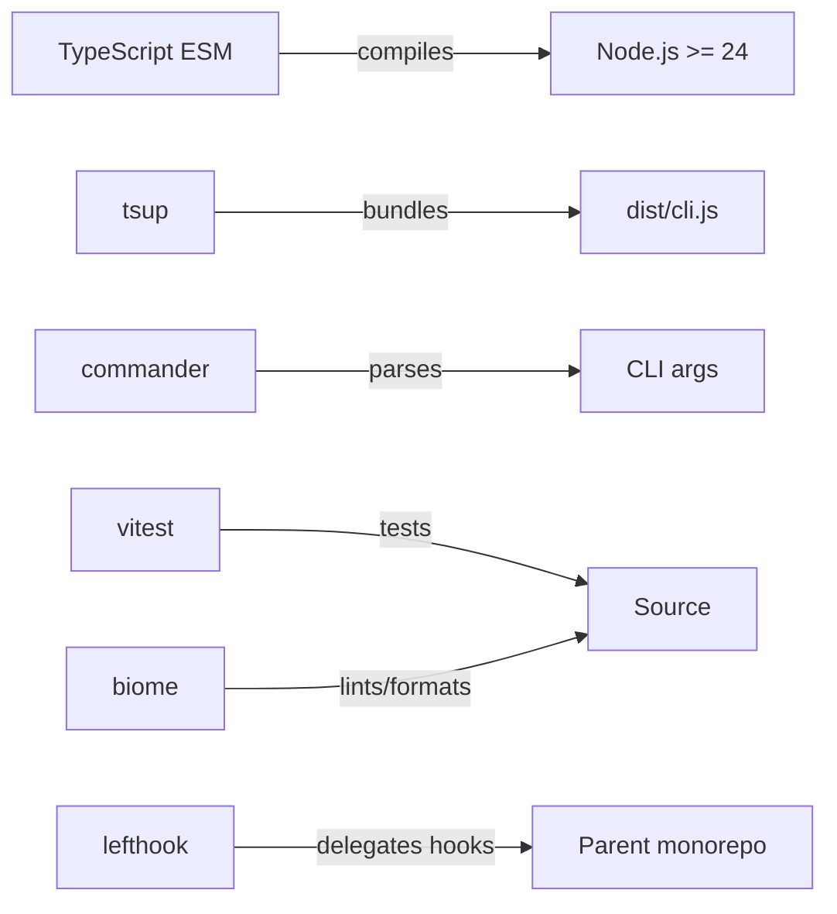
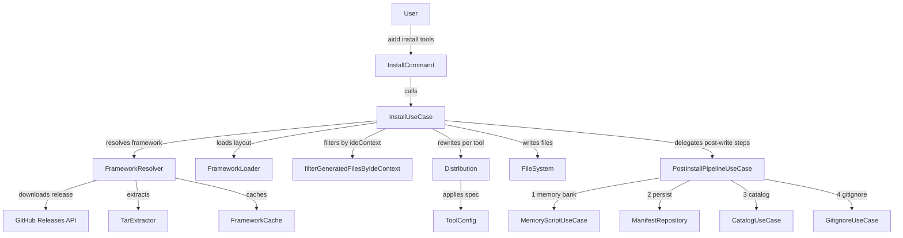

# Architecture

## Language/Framework

### Naming Conventions

| Scope | Convention | Example |
| --- | --- | --- |
| Files | kebab-case | `http-client.ts`, `file-hash.ts` |
| Functions | camelCase | `resolveToken()` |
| Types/Interfaces | PascalCase | `Manifest`, `ToolConfig` |
| Constants | UPPER_CASE | `DEFAULT_TIMEOUT` |

## Architecture

- 3-layer clean architecture: Domain → Application → Infrastructure
- Max 2 runtime dependencies: `commander`, `@inquirer/prompts`; everything else is Node.js built-ins
- `ToolConfig = AiToolConfig | IdeToolConfig` — discriminant union; AI tools in `domain/tools/ai/`, IDE tools in `domain/tools/ide/`. `isAiToolConfig()` is the runtime guard. See DEC-024.
- `ConfigRef.requiredIdeId?: IdeToolId` — a config ref is only distributed when the specified IDE is active in `ideContext`. `filterGeneratedFilesByIdeContext()` in `config-ref-filter.ts` is the pure filter. See DEC-026.
- `AiToolConfig.requiredIdeIds?: readonly IdeToolId[]` — tool-level IDE dependency; copilot declares `["vscode"]`. Used by `IdePatchUseCase` to find which AI tools need patching when an IDE is installed. See DEC-029.
- `IdePatchUseCase` in `shared/` — runs after `installAllTools` for any newly installed IDE tools; retroactively distributes IDE-conditional config files for already-installed AI tools. See DEC-030.
- Framework layout hardcoded in `FrameworkLoaderAdapter` — no `framework.json`. `copilot-settings.json` is a separate config ref from `settings.json` (DEC-027); vscode is pure `user-prime`, copilot settings are `framework-prime`.
- Uninstall of shared merge files: surgical key removal via `removeEntriesFromJson(content, null, keys)`; file deleted only when no owning tool remains. IDE tool files (user-prime) are never deleted on uninstall — guarded by `isAiToolConfig`. See DEC-028, DEC-031.
- Error handling: `ErrorHandler.handle(error)` in every command catch block. Typed exceptions in 3 layers (infra-internal only). See DEC-017, DEC-018.

## Services Communication

### Install Flow

## External Services

### GitHub Releases API

- Latest: `https://api.github.com/repos/<owner>/<repo>/releases/latest`
- By tag: `https://api.github.com/repos/<owner>/<repo>/releases/tags/<tag>` (used by `--release`)
- Auth: Bearer token resolved by `AuthReader`
- Response: tarball URL downloaded via `node:https`, extracted with `node:child_process` (system `tar`)

## Token Resolution Priority

`AIDD_TOKEN` env > project `.aidd/auth.json` > user `~/.config/aidd/auth.json` > `gh auth token` (only when `method: "gh"`) > none
