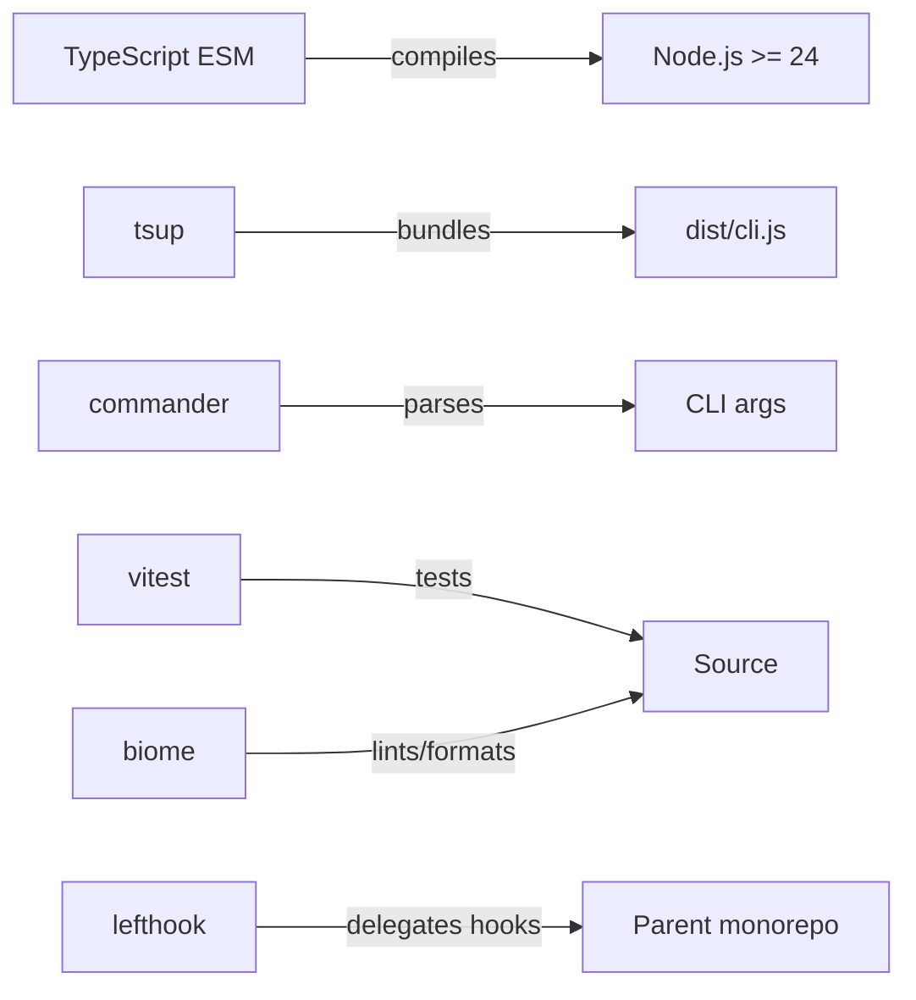
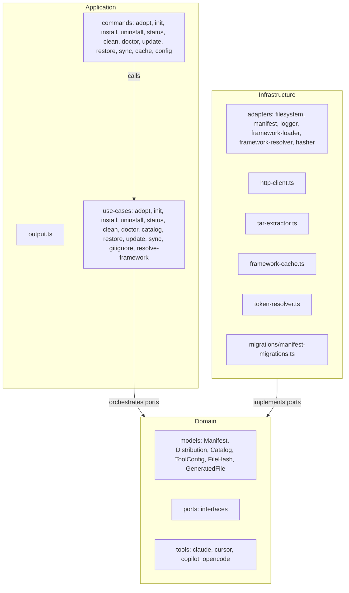

# Architecture

## Language/Framework



### Naming Conventions

| Scope | Convention | Example |
| --- | --- | --- |
| Files | kebab-case | `http-client.ts`, `file-hash.ts` |
| Functions | camelCase | `resolveToken()` |
| Types/Interfaces | PascalCase | `Manifest`, `ToolConfig` |
| Constants | UPPER_CASE | `DEFAULT_TIMEOUT` |

## Architecture Decisions

- 3-layer clean architecture: Domain → Application → Infrastructure (no separate Presentation layer)
- Commands live in `application/commands/`, output formatting in `application/output.ts`
- Max 2 runtime dependencies: `commander` and `@inquirer/prompts`; everything else uses Node.js built-ins (JSONC stripping is a local function in `file-system-adapter.ts`)
- `@inquirer/prompts` is reserved for interactive mode: without flags = guided interactive flow; with flags = non-interactive (CI-safe). Not yet used in v3.0.
- MD5 hashing via `node:crypto` for drift detection between installed files and framework version
- HTTP via `node:https` (no `fetch` wrapper libraries)
- Framework layout is hardcoded in `FrameworkLoaderAdapter` (`CONTENT_SECTIONS`, `TEMPLATE_REFS`, `CONFIG_REFS`). No `framework.json` file — `FrameworkDescriptor` is a code model built by the adapter, not parsed from a file.
- Manifest stored as JSON at `.aidd/manifest.json` — aggregate root tracking every installed file with its MD5 hash
- No settings file — project configuration is via CLI flags (`--repo`, `--verbose`) or env vars (`AIDD_REPO`, `AIDD_VERBOSE`)
- Domain layer has zero infrastructure imports (enforced in tests)
- Migration system in `infrastructure/migrations/` for manifest schema evolution

## Component Diagram



## Layer Responsibilities

- **Domain** — business models, value objects, port interfaces; zero infrastructure imports
- **Application** — use cases + commander commands + output formatting (`output.ts`)
- **Infrastructure** — port implementations using Node.js built-ins and allowed runtime deps

## Domain Ports

- `ManifestRepository` — read/write `.aidd/manifest.json`; `load()` returns `null` if not found; `delete()` removes file + `.aidd/` dir if empty
- `FileSystem` — read/write/delete/merge/hash files; `mergeJsonFile()` strips JSONC comments then deep-merges
- `FrameworkLoader` — build `FrameworkDescriptor` from hardcoded layout, read content directories
- `FrameworkResolver` — resolve framework from remote (GitHub Releases), local path, or tarball; `fetchLatestVersion()` fetches only the latest tag (no download) for update checks
- `Hasher` — compute MD5 hashes
- `Logger` — 3 methods: `debug()` (stderr, only in verbose), `info()` (stdout, always), `warn()` (stderr, always)

## ToolConfig Interface (domain/models/tool-config.ts)

`ToolConfig` is decomposed into handlers by functional subject. Each tool (`claude`, `cursor`, `copilot`) implements this interface in `domain/tools/`.

```ts
interface ToolConfig {
  readonly toolId: ToolId;
  readonly directory: string;
  readonly toolSuffix: string;
  rewriteContent(content: string, docsDir: string): string;
  agents(): SectionHandler;       // buildFilePath + convertFrontmatter
  commands(): CommandsHandler;    // buildFilePath + convertFrontmatter(fm, relativeFileName)
  rules(): RulesHandler;          // buildFilePath + convertFrontmatter
  skills(): SectionHandler;
  config(): ConfigHandler;        // outputPath + shouldMerge
  memoryBank(): MemoryBankHandler; // outputPath + rewriteContent
}
```

- `distribution.ts` dispatches via handlers — no more `if (section.name === X)` in tools
- `copilot.ts` named handlers (`agentsHandler`, `rulesHandler`...) reused in `rewriteContent` — no duplication of path mapping logic
- `frontmatter.ts` — `parseYamlLike` index-based (3 autonomous sub-functions), `serializeFrontmatter` emits JSON-array strings raw (no single-quote wrap)

## Services Communication

### Install Flow


## External Services

### GitHub Releases API

- Latest: `https://api.github.com/repos/<owner>/<repo>/releases/latest`
- By tag: `https://api.github.com/repos/<owner>/<repo>/releases/tags/<tag>` (used by `--release`)
- Auth: Bearer token from `--token` flag, `AIDD_TOKEN` env, or `gh auth token` (3s timeout fallback)
- Response: tarball URL downloaded via `node:https`, extracted with `node:child_process` (shells to system `tar`)
- Override: `--repo owner/repo` flag or `AIDD_REPO` env var for custom framework repository

## Token Resolution Priority

`--token` flag > `AIDD_TOKEN` env > `gh auth token` (3s timeout) > none

## Supported Tools

| Tool | Memory Bank | MCP Config | agents | commands | rules | skills |
| --- | --- | --- | --- | --- | --- | --- |
| `claude` | `CLAUDE.md` | `.mcp.json` | `.claude/agents/` | `.claude/commands/aidd/` | `.claude/rules/` (`.md`) | `.claude/skills/` |
| `cursor` | `AGENTS.md` | `.cursor/mcp.json` | `.cursor/agents/` | `.cursor/commands/{original-dir}/` | `.cursor/rules/` (`.mdc`) | `.cursor/skills/` |
| `copilot` | `.github/copilot-instructions.md` | — | `.github/agents/*.agent.md` | `.github/prompts/*.prompt.md` | `.github/instructions/*.instructions.md` | `.github/skills/*/SKILL.md` |
| `opencode` | `AGENTS.md` | `opencode.json` (merged, transforms `.mcp.json` to opencode format) | `.opencode/agents/` | `.opencode/commands/` | `.opencode/rules/` (`.opencode.md`) | `.opencode/skills/` |

- `claude` — frontmatter scope: `paths:` list; include syntax: `@.claude/path`
- `cursor` — frontmatter scope: `globs:` (JSON-array string) + `alwaysApply:`; rules use `.mdc` extension; commands preserve `argument-hint`
- `copilot` — frontmatter scope: `applyTo:`; file flattening applied to commands/rules; includes rewritten as markdown links; copilot-specific rules may use `applyTo` directly in source frontmatter
- `opencode` — frontmatter: description-only (no `name` field; filename used as name); suffix `.opencode.md`; MCP config transformed from standard `.mcp.json` to `{ mcp: { name: { type, command/url, enabled } } }` format; URL-based servers use `type: "remote"`

## Directory Structure

```plaintext
src/
├── cli.ts                          # Entry point (commander program)
├── application/
│   ├── commands/                   # adopt.ts, init.ts, install.ts, uninstall.ts, status.ts, clean.ts, doctor.ts, update.ts, restore.ts, sync.ts, cache.ts, config.ts
│   ├── output.ts                   # Output formatting (replaces presenter.ts)
│   └── use-cases/                  # adopt, init, install, uninstall, status, clean, doctor, catalog
│                                   # + gitignore, resolve-framework (shared)
├── domain/
│   ├── models/                     # Manifest, Distribution, Catalog, ToolConfig, FileHash, GeneratedFile,
│   │                               #   FrameworkDescriptor, Frontmatter
│   ├── ports/                      # ManifestRepository, FileSystem, FrameworkLoader,
│   │                               #   FrameworkResolver, Hasher, Logger
│   └── tools/                      # claude.ts, cursor.ts, copilot.ts, opencode.ts
└── infrastructure/
    ├── adapters/                   # All port implementations
    ├── auth/                       # token-resolver.ts
    ├── cache/                      # framework-cache.ts
    ├── deps.ts                     # Dependency wiring
    ├── http/                       # http-client.ts
    ├── migrations/                 # manifest-migrations.ts
    └── tar/                        # tar-extractor.ts
```

## Known Design Behaviors

- `adopt` bootstraps a manifest for projects with pre-existing AIDD files installed manually. Requires `--release <version>` OR `--framework <path>` (one mandatory). Downloads the framework, generates the per-tool distribution, and registers only disk files whose paths match the distribution. Files on disk not in the distribution are user files — untracked, never touched by any other command. No file writes — scan only. Throws if manifest already exists.
- `init` throws if any AIDD signals are detected on disk (`.aidd/`, docsDir, tool directories) and no manifest exists — use `aidd adopt` instead.
- `init --force` re-copies docs templates into the existing docs directory without a full reset. Does not touch tool distributions.
- `install` requires an existing manifest. Aborts if absent — no auto-init.
- `clean` without `--force` is a dry-run (preview only, no files deleted).
- `doctor` checks structural integrity only: manifest, orphaned tool directories, and broken `@path`/markdown link references in tracked files. Exits 1 on any issue. Missing or modified files are drift — use `status`.
- `status` detects 3 drift types: `modified` (hash mismatch), `deleted` (missing from disk), `added` (on disk but not tracked). Also performs a best-effort version check — network failure is silently ignored. `--tool` or `--docs` scopes output to one section.
- A version check banner is printed before every command — silent on network errors or missing manifest.
- Multi-tool shared files (e.g. `.vscode/settings.json`): merged by both `claude` and `copilot`. Manifest hash updated to final disk state after each merge — no false drift in `status`.
- Framework repo resolution: `--repo` flag > `AIDD_REPO` env > manifest-persisted value > default `ai-driven-dev/aidd-framework`.
- `CATALOG.md` is generated (not installed) after every `init`, `install`, and `uninstall`. Not manifest-tracked but reported as `deleted` by `status` if missing.
- `update` diffs the new framework distribution against the manifest: `added`, `removed`, `changed`. Conflicts (user-modified files) prompt unless `--force`. Merged files always re-applied. `--tool` or `--docs` scopes to one section.
- `restore` restores `modified` and `deleted` manifest-tracked files from the pinned version. Does not touch untracked files. Prompts without `--force`, requires `--force` in non-TTY.
- `sync` propagates modifications from a source tool to target tools. Content is round-tripped through canonical form. Excludes memory bank, MCP configs, VS Code files, docs, `.aidd/`. Conflicts skipped unless `--force`. Requires ≥ 2 installed tools.
- `cache list` shows cached framework versions. `cache clear [version]` removes one; `cache clear --all` removes all.
- `config` is manifest-backed. `docsDir` and `repo` are writable; `tools` is read-only.
