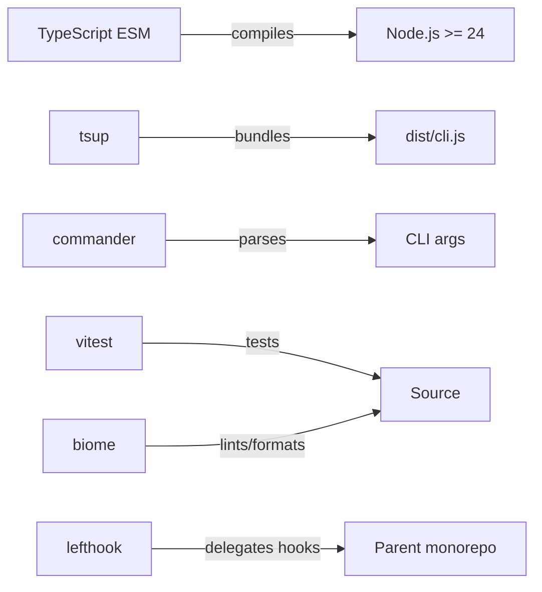
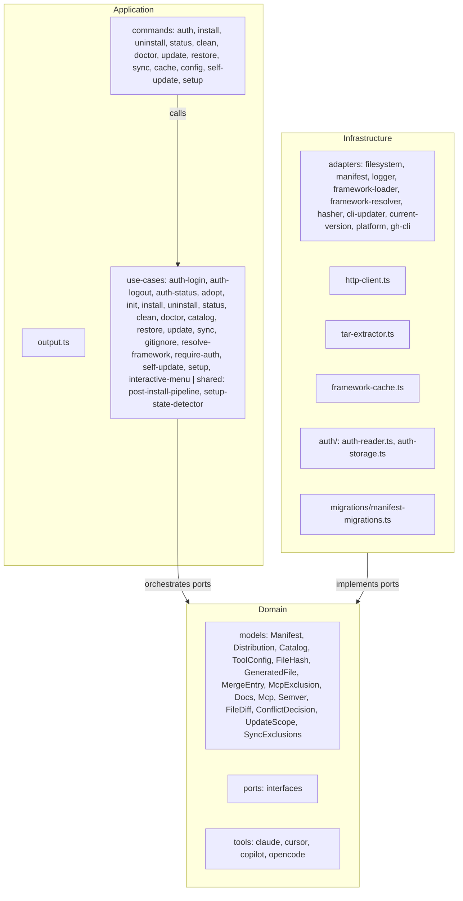
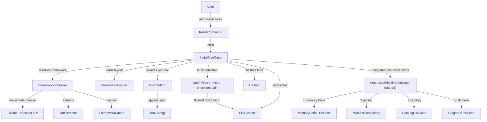

# Architecture

## Language/Framework



### Naming Conventions

| Scope | Convention | Example |
| --- | --- | --- |
| Files | kebab-case | `http-client.ts`, `file-hash.ts` |
| Functions | camelCase | `resolveToken()` |
| Types/Interfaces | PascalCase | `Manifest`, `ToolConfig` |
| Constants | UPPER_CASE | `DEFAULT_TIMEOUT` |

## Architecture Decisions

- 3-layer clean architecture: Domain → Application → Infrastructure (no separate Presentation layer)
- Commands live in `application/commands/`, output formatting in `application/output.ts`, error handling in `application/error-handler.ts`
- Error handling: `ErrorHandler` replaces `CLIOutput.exit()`. Commands instantiate `ErrorHandler` before try, use `errorHandler.handle(error)` in catch. Typed exceptions in 3 layers: domain, application, infrastructure (infra-internal only, adapters translate before crossing port). See DEC-017, DEC-018.
- Max 2 runtime dependencies: `commander` and `@inquirer/prompts`; everything else uses Node.js built-ins (JSONC stripping is a local function in `file-system-adapter.ts`)
- `@inquirer/prompts` is used for interactive mode. When `aidd` is run with no arguments in a TTY, `runMenuLoop()` in `cli.ts` launches `InteractiveMenuUseCase` in a fire-and-forget infinite loop. Each selected command is spawned as a child process via `child_process.spawn` with `stdio: "inherit"`; the menu reappears after it exits. Ctrl+C caught as `ExitPromptError` → `process.exit(0)`. See DEC-013, DEC-014.
- MD5 hashing via `node:crypto` for drift detection between installed files and framework version
- HTTP via `node:https` (no `fetch` wrapper libraries)
- Framework layout is hardcoded in `FrameworkLoaderAdapter` (`CONTENT_SECTIONS`, `TEMPLATE_REFS`, `CONFIG_REFS`). No `framework.json` file — `FrameworkDescriptor` is a code model built by the adapter, not parsed from a file.
- Manifest stored as JSON at `.aidd/manifest.json` — aggregate root tracking every installed file with its MD5 hash. Merge config files (`.mcp.json`, `.vscode/settings.json`) tracked separately in `mergeFiles` with per-entry hashes. Excluded MCP servers tracked per-tool in `excludedMcp`. See DEC-020, DEC-022.
- No settings file — project configuration is via CLI flags (`--repo`, `--verbose`) or env vars (`AIDD_REPO`, `AIDD_VERBOSE`)
- Domain layer has zero infrastructure imports (enforced in tests)
- Framework config files may contain JSONC (comments + trailing commas) — `extractMergeEntries` strips them before parsing. See DEC-021.

## Component Diagram



## Layer Responsibilities

- **Domain** — business models, value objects, port interfaces; zero infrastructure imports
- **Application** — use cases + commander commands + output formatting (`output.ts`)
- **Infrastructure** — port implementations using Node.js built-ins and allowed runtime deps

## Domain Ports

- `AuthTokenProvider` — `resolve(): Promise<string | null>`; implemented by `AuthReader`
- `ExternalTokenProvider` — `resolve(): string | null`; implemented by `GhCliAdapter` (calls `gh auth token` with 3s timeout)
- `ManifestRepository` — read/write `.aidd/manifest.json`; `load()` returns `null` if not found; `delete()` removes file + `.aidd/` dir if empty
- `FileSystem` — read/write/delete/merge/hash files; `mergeJsonFile(path, content, strategy)` strips JSONC comments then deep-merges; `"user-prime"` inverts merge direction (existing wins), `"framework-prime"` keeps source-wins behavior
- `FrameworkLoader` — build `FrameworkDescriptor` from hardcoded layout, read content directories
- `FrameworkResolver` — resolve framework from remote (GitHub Releases), local path, or tarball; `fetchLatestVersion()` fetches only the latest tag (no download) for update checks
- `Hasher` — compute MD5 hashes
- `Logger` — 3 methods: `debug()` (stderr, only in verbose), `info()` (stdout, always), `warn()` (stderr, always)
- `CliUpdater` — `fetchLatestRelease()`, `install()`; used by self-update command to check and apply CLI version
- `CurrentVersionProvider` — `get()` returns current CLI version string from package.json at runtime
- `Platform` — `current()` returns platform identifier; used for Windows-specific MCP config transformations

## ToolConfig Interface (domain/models/tool-config.ts)

`ToolConfig` is decomposed into handlers by functional subject. Each tool (`claude`, `cursor`, `copilot`) implements this interface in `domain/tools/`.

```ts
interface ToolConfig {
  readonly toolId: ToolId;
  readonly directory: string;
  readonly toolSuffix: string;
  rewriteContent(content: string, docsDir: string): string;
  agents(): SectionHandler;       // buildFilePath + convertFrontmatter
  commands(): CommandsHandler;    // buildFilePath + convertFrontmatter(fm, relativeFileName)
  rules(): RulesHandler;          // buildFilePath + convertFrontmatter
  skills(): SectionHandler;
  config(): ConfigHandler;        // outputPath + mergeStrategy + entrySection
  memoryBank(): MemoryBankHandler; // outputPath + rewriteContent
}
```

- `distribution.ts` dispatches via handlers — no more `if (section.name === X)` in tools
- `ConfigHandler.mergeStrategy(name)` returns `MergeStrategy` (`"none" | "framework-prime" | "user-prime"`) — encodes both whether to merge and who wins on conflict. MCP configs are user-prime; `.vscode/settings.json` is framework-prime. See DEC-016.
- `ConfigHandler.entrySection(name)` returns the JSON key containing trackable entries (`"mcpServers"`, `"servers"`, `"mcp"`) or `null` for top-level. See DEC-019.
- `copilot.ts` named handlers (`agentsHandler`, `rulesHandler`...) reused in `rewriteContent` — no duplication of path mapping logic
- `frontmatter.ts` — `parseYamlLike` index-based (3 autonomous sub-functions), `serializeFrontmatter` emits JSON-array strings raw (no single-quote wrap)

## Services Communication

### Install Flow



## External Services

### GitHub Releases API

- Latest: `https://api.github.com/repos/<owner>/<repo>/releases/latest`
- By tag: `https://api.github.com/repos/<owner>/<repo>/releases/tags/<tag>` (used by `--release`)
- Auth: Bearer token resolved by `AuthReader` (see Token Resolution Priority)
- Response: tarball URL downloaded via `node:https`, extracted with `node:child_process` (shells to system `tar`)
- Override: `--repo owner/repo` flag or `AIDD_REPO` env var for custom framework repository

## Token Resolution Priority

`AIDD_TOKEN` env > project `.aidd/auth.json` > user `~/.config/aidd/auth.json` > `gh auth token` (only when stored config uses `method: "gh"`) > none

Auth is stored by `aidd auth login`. Credentials written to JSON files with `600` permissions.
New ports: `AuthTokenProvider` (resolve chain), `ExternalTokenProvider` (CLI-based token, impl: `GhCliAdapter`).

## Supported Tools

| Tool | Memory Bank | MCP Config | agents | commands | rules | skills |
| --- | --- | --- | --- | --- | --- | --- |
| `claude` | `CLAUDE.md` | `.mcp.json` | `.claude/agents/` | `.claude/commands/aidd/` | `.claude/rules/` (`.md`) | `.claude/skills/` |
| `cursor` | `AGENTS.md` | `.cursor/mcp.json` | `.cursor/agents/` | `.cursor/commands/aidd/<phase>/` | `.cursor/rules/` (`.mdc`) | `.cursor/skills/` |
| `copilot` | `.github/copilot-instructions.md` | `.vscode/mcp.json` | `.github/agents/*.agent.md` | `.github/prompts/aidd_<phase>_<name>.prompt.md` | `.github/instructions/*.instructions.md` | `.github/skills/*/SKILL.md` |
| `opencode` | `AGENTS.md` | `opencode.json` (merged, transforms `.mcp.json` to opencode format) | `.opencode/agents/` | `.opencode/commands/aidd/<phase>/` | `.opencode/rules/` (`.opencode.md`) | `.opencode/skills/` |

- `claude` — frontmatter scope: `paths:` list; include syntax: `@.claude/path`; commands `name: aidd:<phase>:<name>`
- `cursor` — frontmatter scope: `globs:` (JSON-array string) + `alwaysApply:`; rules use `.mdc` extension; commands `name: aidd:<phase>:<name>`; call by filename
- `copilot` — frontmatter scope: `applyTo:`; file flattening applied to commands/rules; includes rewritten as markdown links; commands `name: aidd:<phase>:<name>`; no subfolder support
- `opencode` — commands `name: aidd:<phase>:<name>` + description; call by path (`aidd/<phase>/<name>`); rules description-only; suffix `.opencode.md`; MCP config transformed to `{ mcp: { name: { type, command/url, enabled } } }`; agents frontmatter always includes `mode: "subagent"` (required by OpenCode to register as subagent); sync reverse-convert strips `mode` (known trade-off: not recovered on round-trip)

## AIDD Signal Detection (init)

`aidd init` detects prior manual AIDD installs by scanning frontmatter `name: aidd:` in tool command directories. Generic tool directories (`.claude/`, `.cursor/`, `.opencode/`) are NOT signals — only AIDD-branded frontmatter is. See DEC-001.

## Directory Structure

```plaintext
src/
├── cli.ts                          # Entry point (commander program)
├── application/
│   ├── commands/                   # adopt.ts, init.ts, install.ts, uninstall.ts, status.ts, clean.ts, doctor.ts, update.ts, restore.ts, sync.ts, cache.ts, config.ts, self-update.ts
│   ├── output.ts                   # Output formatting (replaces presenter.ts)
│   └── use-cases/                  # adopt, init, install, uninstall, status, clean, doctor, catalog
│       │                           # + gitignore, resolve-framework, self-update, setup, memory-script
│       └── shared/                 # post-install-pipeline, setup-state-detector
├── domain/
│   ├── models/                     # Manifest, Distribution, Catalog, ToolConfig, FileHash, GeneratedFile,
│   │                               #   FrameworkDescriptor, Frontmatter, Docs, Mcp, Semver
│   ├── ports/                      # ManifestRepository, FileSystem, FrameworkLoader,
│   │                               #   FrameworkResolver, Hasher, Logger, CliUpdater, CurrentVersionProvider, Platform
│   └── tools/                      # claude.ts, cursor.ts, copilot.ts, opencode.ts
└── infrastructure/
    ├── adapters/                   # All port implementations
    ├── auth/                       # auth-reader.ts, auth-storage.ts
    ├── cache/                      # framework-cache.ts
    ├── deps.ts                     # Dependency wiring
    ├── http/                       # http-client.ts
    ├── migrations/                 # manifest-migrations.ts
    └── tar/                        # tar-extractor.ts
```

## Dependency Wiring

- `createDeps(projectRoot, options, output)` — async, full graph; memoized in `Map<string, Deps>` keyed by `projectRoot`; `preAction` hook always populates first; command actions reuse cached instance. See DEC-015.
- `createMenuDeps(projectRoot)` — synchronous, returns only `ManifestRepository` + `Prompter`; used in `cli.ts` before `program.parse()`

## Use Case Notes

- `ResolveFrameworkUseCase` handles framework resolution and conditional auth: for remote sources it delegates to `RequireAuthUseCase`; for local paths auth is never called. Exposes `isLocalSource` as a public static method for callers that need pre-classification.
- `RequireAuthUseCase` is the single source of auth validation logic. All commands and `SetupUseCase` delegate auth through this class — no duplicated auth checks.
- 13 commands total. `setup` is the interactive entry point for init/adopt/update flows; `init` and `adopt` are internal use cases only (no CLI commands). See DEC-009, DEC-010, DEC-011.
- `SetupStateDetector` (shared) consolidates setup state detection logic — determines which phase a project is in (`needs-init`, `needs-adopt`, `needs-install`, `needs-update`, `up-to-date`). Used by `SetupUseCase` to dispatch to the correct handler.
- `PostInstallPipelineUseCase` (shared) is the canonical post-write sequence: MemoryScriptUseCase → manifest.save() → CatalogUseCase → GitignoreUseCase. Every use-case that writes files to disk and updates the manifest must delegate to this pipeline. Exception: `InitUseCase` calls steps 2–4 directly (no tools installed at init time).

## Known Design Behaviors

- `setup` is the single onboarding entry point. It detects project state (needs-init, needs-adopt, needs-install, needs-update, up-to-date) and dispatches to the appropriate internal use-case. Requires an interactive TTY. See DEC-003, DEC-004.
- `adopt` (internal use-case only, no CLI command) bootstraps a manifest for projects with pre-existing AIDD files installed manually. Triggered by `aidd setup` which passes `--release`/`--path` from its own command-level options. Downloads the framework, generates the per-tool distribution, and registers only disk files whose paths match the distribution. Files on disk not in the distribution are user files — untracked, never touched by any other command. No file writes — scan only. Throws if manifest already exists.
- `init` (internal use-case only, no CLI command) throws if any AIDD signals are detected on disk (`.aidd/`, docsDir, tool directories) and no manifest exists.
- `init --force` re-copies docs templates into the existing docs directory without a full reset. Does not touch tool distributions.
- `install` requires an existing manifest. Aborts if absent — no auto-init. During install, any file that already exists on disk and is not tracked in the manifest is skipped with a warning — never overwritten. See DEC-007, DEC-008.
- `update` applies the same user-file protection for `added` diff entries: if a new framework file collides with a pre-existing untracked file, the write is skipped with a warning. See DEC-008.
- `clean` without `--force` is a dry-run (preview only, no files deleted).
- `doctor` checks structural integrity only: manifest, orphaned tool directories, and broken `@path`/markdown link references in tracked files. Missing auth is reported as `severity: "info"` (exit 0). Exits 1 on warning/error severity issues. Missing or modified files are drift — use `status`.
- `status` detects 3 drift types: `modified` (hash mismatch), `deleted` (missing from disk), `added` (on disk but not tracked). Also performs a best-effort version check — network failure is silently ignored. `--tool` or `--docs` scopes output to one section.
- A version check banner is printed before every command — silent on network errors or missing manifest.
- Multi-tool shared files (e.g. `.vscode/settings.json`): merged by both `claude` and `copilot`. Manifest hash updated to final disk state after each merge — no false drift in `status`.
- Framework repo resolution: `--repo` flag > `AIDD_REPO` env > manifest-persisted value > default `ai-driven-dev/aidd-framework`.
- `CATALOG.md` is generated (not installed) after every `init`, `install`, and `uninstall`. Not manifest-tracked but reported as `deleted` by `status` if missing.
- `update` diffs the new framework distribution against the manifest: `added`, `removed`, `changed`. Conflicts (user-modified files) prompt unless `--force`. Merged files always re-applied. `--tool` or `--docs` scopes to one section.
- `restore` restores `modified` and `deleted` manifest-tracked files from the pinned version. Does not touch untracked files. Prompts without `--force`, requires `--force` in non-TTY.
- `sync` propagates modifications from a source tool to target tools. Content is round-tripped through canonical form. Excludes memory bank, MCP configs, VS Code files, docs, `.aidd/`. Conflicts skipped unless `--force`. Requires ≥ 2 installed tools.
- `cache list` shows cached framework versions. `cache clear [version]` removes one; `cache clear --all` removes all.
- `config` is manifest-backed. `docsDir` and `repo` are writable; `tools` is read-only.
