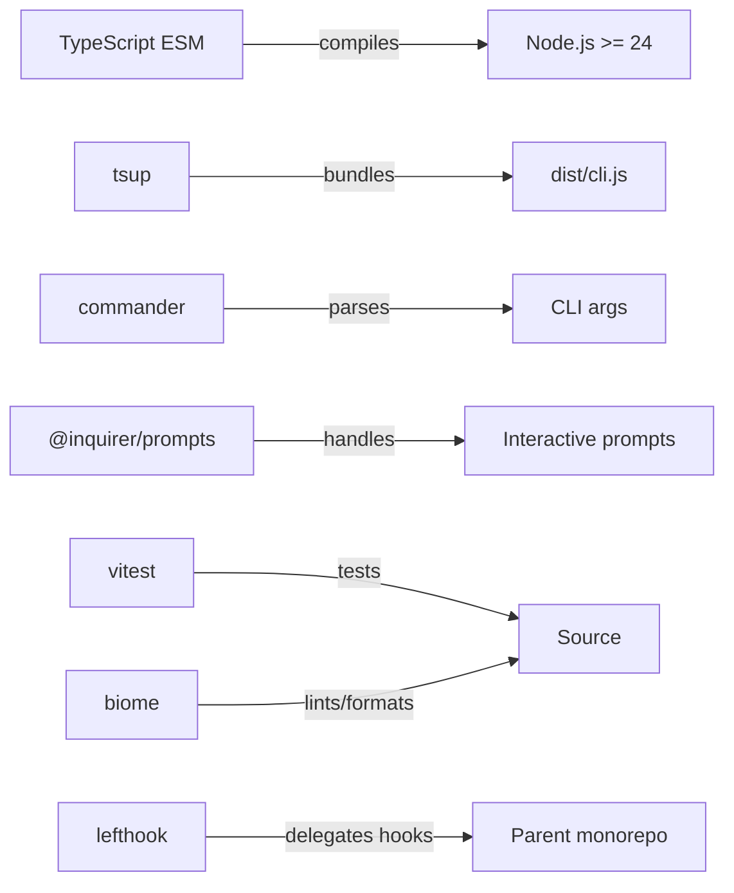
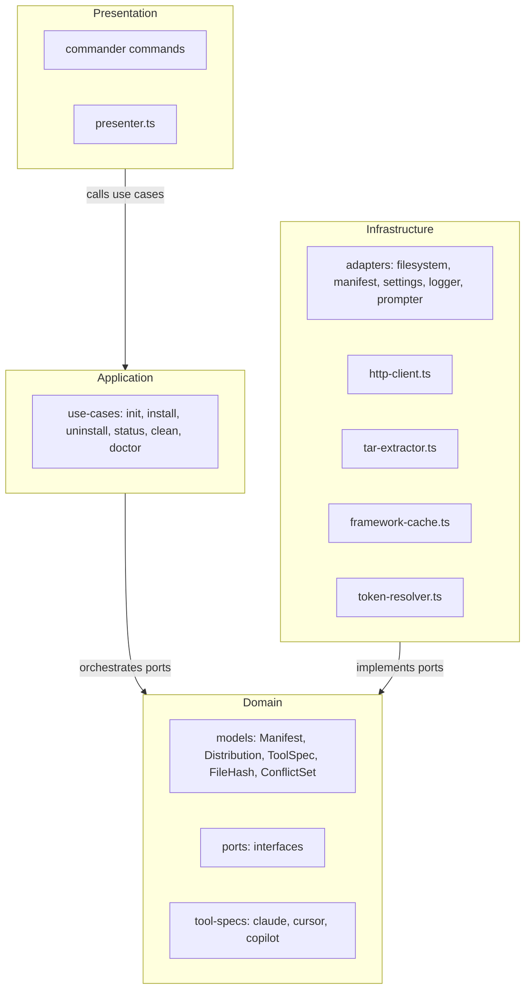
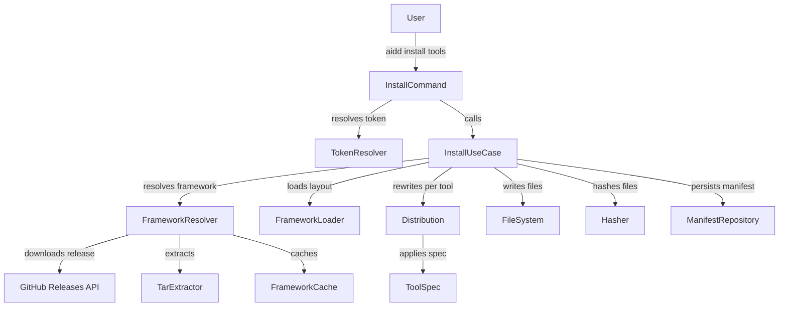

# Architecture

## Language/Framework



### Naming Conventions

| Scope | Convention | Example |
| --- | --- | --- |
| Files | kebab-case | `tool-spec.ts`, `http-client.ts` |
| Functions | camelCase | `resolveToken()` |
| Types/Interfaces | PascalCase | `Manifest`, `ToolSpec` |
| Constants | UPPER_CASE | `DEFAULT_TIMEOUT` |

## Architecture Decisions

- 4-layer clean architecture: Domain → Application → Infrastructure → Presentation
- Max 2 runtime dependencies: `commander` and `@inquirer/prompts`; everything else uses Node.js built-ins
- MD5 hashing via `node:crypto` for drift detection between installed files and framework version
- HTTP via `node:https` (no `fetch` wrapper libraries)
- `framework.json` is the canonical contract describing framework file layout (`FrameworkDescriptor`)
- Manifest stored as JSON at `.aidd/config.json` — aggregate root tracking every installed file with its MD5 hash
- Settings stored at `.aidd/settings.json` — user preferences with defaults
- Domain layer has zero infrastructure imports (enforced in CI and tests)

## Component Diagram



## Layer Responsibilities

- **Domain** — business models, value objects, port interfaces; zero infrastructure imports
- **Application** — use cases; orchestrates domain objects through port interfaces
- **Infrastructure** — port implementations using Node.js built-ins and the 2 allowed runtime deps
- **Presentation** — commander command registration, output formatting via `presenter.ts`

## Domain Ports

- `ManifestRepository` — read/write `.aidd/config.json`
- `SettingsRepository` — read `.aidd/settings.json` with defaults
- `FileSystem` — read/write/delete/merge files
- `FrameworkLoader` — parse `framework.json`, read content directories
- `FrameworkResolver` — resolve framework from remote (GitHub Releases), local path, or tarball
- `Hasher` — compute MD5 hashes
- `Prompter` — interactive prompts (or silent in CI via `SilentPrompterAdapter`)
- `Logger` — verbose output to `process.stderr`

## Services Communication

### Install Flow



## External Services

### GitHub Releases API

- URL: `https://api.github.com/repos/<owner>/<repo>/releases/latest`
- Auth: Bearer token from `--token` flag, `AIDD_TOKEN` env, or `gh auth token` (3s timeout fallback)
- Response: tarball URL downloaded via `node:https`, extracted with `node:child_process` (shells to system `tar`)
- Override: `AIDD_REPO` env var for custom framework repository

## Token Resolution Priority

`--token` flag > `AIDD_TOKEN` env > `gh auth token` (3s timeout) > none

## Supported Tools

| Tool | Memory Bank | MCP Config | agents | commands | rules | skills |
| --- | --- | --- | --- | --- | --- | --- |
| `claude` | `CLAUDE.md` | `.mcp.json` | `.claude/agents/` | `.claude/commands/` | `.claude/rules/` (`.md`) | `.claude/skills/` |
| `cursor` | `AGENTS.md` | `.cursor/mcp.json` | `.cursor/agents/` | `.cursor/commands/` | `.cursor/rules/` (`.mdc`) | `.cursor/skills/` |
| `copilot` | `.github/copilot-instructions.md` | — | `.github/agents/*.agent.md` | `.github/prompts/*.prompt.md` | `.github/instructions/*.instructions.md` | `.github/skills/*/SKILL.md` |

- `claude` — frontmatter scope: `paths:` list; include syntax: `@.claude/path`
- `cursor` — frontmatter scope: `globs:` + `alwaysApply:`; rules use `.mdc` extension
- `copilot` — frontmatter scope: `applyTo:`; file flattening applied to commands/rules; includes rewritten as markdown links

## Directory Structure

```plaintext
src/
├── cli.ts                          # Entry point (commander program)
├── index.ts                        # Library entry (empty export)
├── domain/
│   ├── models/                     # Manifest, Distribution, ToolSpec, FileHash, ConflictSet
│   ├── ports/                      # Port interfaces
│   └── tool-specs/                 # claude.ts, cursor.ts, copilot.ts
├── application/
│   └── use-cases/                  # init, install, uninstall, status, clean, doctor
├── infrastructure/
│   ├── http/                       # http-client.ts
│   ├── tar/                        # tar-extractor.ts
│   ├── cache/                      # framework-cache.ts
│   ├── auth/                       # token-resolver.ts
│   └── adapters/                   # All port implementations
└── presentation/
    ├── commands/                   # init.ts, install.ts, uninstall.ts, status.ts, clean.ts, doctor.ts
    └── presenter.ts                # Output formatting
```
