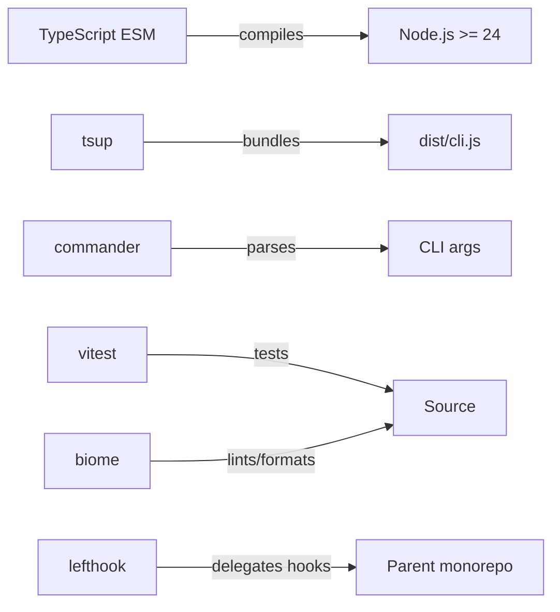
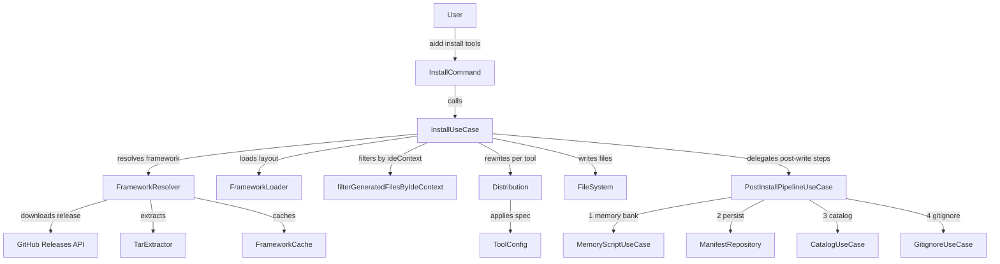

# Architecture

## Language/Framework

### Naming Conventions

| Scope | Convention | Example |
| --- | --- | --- |
| Files | kebab-case | `http-client.ts`, `file-hash.ts` |
| Functions | camelCase | `resolveToken()` |
| Types/Interfaces | PascalCase | `Manifest`, `ToolConfig` |
| Constants | UPPER_CASE | `DEFAULT_TIMEOUT` |

## Architecture

- 3-layer clean architecture: Domain → Application → Infrastructure
- Max 2 runtime dependencies: `commander`, `@inquirer/prompts`; everything else is Node.js built-ins
- `ToolConfig` is a discriminant union (`AiToolConfig | IdeToolConfig`); `isAiToolConfig()` is the runtime guard
- Config refs are filtered by active IDE context before distribution (IDE-conditional distribution)
- AI tools declare IDE dependencies; `IdePatchUseCase` retroactively applies IDE-conditional files for already-installed AI tools when a new IDE is installed
- Framework layout is code-defined in `FrameworkLoaderAdapter` — no `framework.json` on disk
- Uninstall performs surgical key removal on shared merge files; IDE tool files (user-prime) are never deleted on uninstall
- Error handling: `ErrorHandler.handle(error)` in every command catch block. Typed exceptions in 3 layers (infra-internal only). See DEC-017, DEC-018.

## Services Communication

### Install Flow

## External Services

### GitHub Releases API

- Latest: `https://api.github.com/repos/<owner>/<repo>/releases/latest`
- By tag: `https://api.github.com/repos/<owner>/<repo>/releases/tags/<tag>` (used by `--release`)
- Auth: Bearer token resolved by `AuthReader`
- Response: tarball URL downloaded via `node:https`, extracted with `node:child_process` (system `tar`)

## Token Resolution Priority

`AIDD_TOKEN` env > project `.aidd/auth.json` > user `~/.config/aidd/auth.json` > `gh auth token` (only when `method: "gh"`) > none
