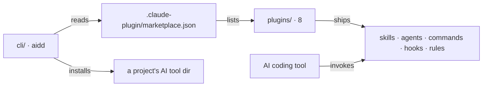

# Architecture

The macro technical shape: the stack, how the pieces fit, and the decisions behind them. Point to the code, do not restate it.

> CLI internals (layers, domain models, install flows, adapters) live in [`cli/aidd_docs/memory/architecture.md`](../../cli/aidd_docs/memory/architecture.md).

## Stack

| Part | What |
| --- | --- |
| Product | markdown — skills, agents, rules, templates. No framework runtime; an LLM interprets them. |
| Delivery | Node `>=22.12`, pnpm. `cli/` is the `aidd` binary; `kanban/` is a private package. |
| Manifest | `.claude-plugin/marketplace.json`, the plugin manifest: 8 plugins, no version among them. Versions are release-please's, in `deployment.md`. |

## How it fits together

```mermaid
flowchart LR
    Manifest[".claude-plugin/marketplace.json"] -->|lists| Plugins["plugins/ · 8"]
    Plugins -->|ships| Surfaces["skills · agents · commands · hooks · rules"]
    CLI["cli/ · aidd"] -->|reads| Manifest
    CLI -->|installs| Target["a project's AI tool dir"]
    Editor["AI coding tool"] -->|invokes| Surfaces
```

`cli/` and `kanban/` are self-contained projects with their own lockfiles, not pnpm workspace members — `pnpm-workspace.yaml` declares no `packages:` list on purpose, because membership would change how their dependencies resolve. Each installs on its own, and both are type-checked, linted and tested by this repository's CI. Only `cli/` is published.

## Key decisions

| Decision | Why |
| --- | --- |
| Knowledge and execution separated by a firewall | knowledge plugins produce artifacts you read, never write or run application source |
| Concern decides placement, not existence | a missing capability goes to the plugin whose concern owns it; the caller delegates |
| A skill is a router | `SKILL.md` dispatches to actions or protocols; the only place a capability is addressed by name |
| Recipe skills discover providers at runtime | by description matching. Only agent permission lists and orchestration references name a provider |
| Observation is its own layer | `aidd-telemetry` journals what a session did; it never reads or writes application source |
| A launcher runs an external binary, never embeds it | `kanban` broke that and was unwired. Detail in the CLI bank |

The concern-to-plugin taxonomy is canonical in [`docs/ARCHITECTURE.md`](../../docs/ARCHITECTURE.md).

## Gotchas

- 8 plugins ship, 2 off the curated install path: `aidd-ui` is alpha, `aidd-telemetry` beta and opt-in.
- A skill never links outside itself: the tree ships both flat and as a marketplace, so no relative path survives both.
- Bundled hooks run Node. No `node` on `PATH`, no memory refresh and no run journal.
