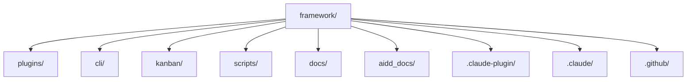

# Codebase Map

The macro layout: the top-level areas and what each holds. A map to navigate, not the full tree.

> Where things live inside the CLI is in [`cli/aidd_docs/memory/codebase-map.md`](../../cli/aidd_docs/memory/codebase-map.md).

## Areas

| Path | Holds |
| --- | --- |
| `plugins/` | the product — one dir per plugin, each with `plugins/<plugin>/.claude-plugin/plugin.json` and `skills/`, optionally `agents/`, `commands/`, `hooks/`, `rules/` |
| `cli/` | the `aidd` binary. Has its own memory bank and `CLAUDE.md` |
| `kanban/` | the task board. A private package with its own lockfile, unwired from the CLI |
| `scripts/` | repository checks and generators, run by lefthook and CI. Tests in `scripts/__tests__/` |
| `docs/` | durable docs — architecture, plugin authoring, glossary, maintainer runbook. `prompts-documentation.md` is generated |
| `aidd_docs/` | this memory bank, plus `tasks/`, `runs/`, `product/`, `specs/`, `recipes/`, `brainstorm/` |
| `.claude-plugin/` | `marketplace.json`, the plugin manifest. Versions live in `.release-please-manifest.json` — see `deployment.md` |
| `.claude/` | registers this checkout as a local marketplace, so a contributor runs the plugins they edit |
| `.github/` | workflows, issue templates, rulesets |

## Entry points

| Entry | Path |
| --- | --- |
| Binary | `cli/src/cli.ts` → `dist/cli.js`, bin name `aidd` |
| Workflow | `plugins/<plugin>/skills/<NN>-<name>/SKILL.md` |
| Memory refresh | `plugins/aidd-context/hooks/update_memory.js`, on `SessionStart` |
| Run journal | `plugins/aidd-telemetry/hooks/journal.cjs`, on `SessionStart`, `Stop`, `PostToolUse` |

## Packages

| Package | Released |
| --- | --- |
| `cli` (`@ai-driven-dev/cli`) | npm, the only published package |
| `kanban` (`@ai-driven-dev/kanban-source`) | private. Depends on npm packages only, never on `cli/` |
