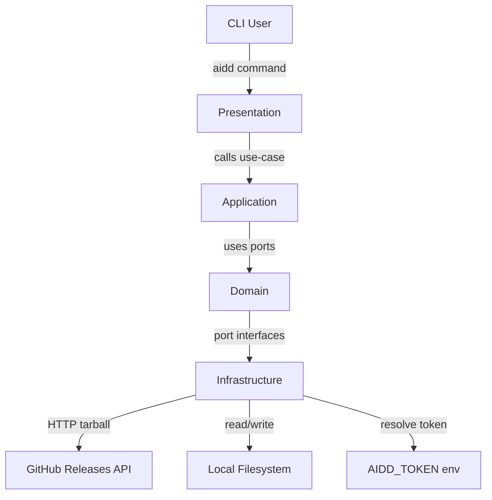

# Codebase Structure

## Status

- `src/` — deleted, being rebuilt via backlog tickets 001-072
- `dist/` — not yet produced (no build ran)
- Framework files (`.claude/`, `aidd_docs/`, `.aidd/`) — present and active

## Non-source files (exist now)

- `CLAUDE.md` — AI agent instructions
- `lefthook.yml` — delegates git hooks to parent monorepo
- `.aidd/config.json` — installed AIDD framework manifest (v3.1.0)
- `.aidd/settings.json` — user preferences and defaults
- `.claude/` — Claude Code agents, commands, rules, skills
- `aidd_docs/` — docs, memory, backlog, tasks, templates

## Planned source layout

- `src/cli.ts` — CLI entry point (`commander` program, global `--verbose`)
- `src/index.ts` — library entry (empty export)
- `src/domain/models/` — `Manifest`, `Distribution`, `ToolSpec`, `FrameworkDescriptor`, `FileHash`, `ConflictSet`
- `src/domain/ports/` — `ManifestRepository`, `FileSystem`, `FrameworkLoader`, `FrameworkResolver`, `Hasher`, `Prompter`, `Logger`, `SettingsRepository`
- `src/domain/tool-specs/` — `claude.ts`, `cursor.ts`, `copilot.ts`
- `src/application/use-cases/` — `init`, `install`, `uninstall`, `status`, `clean`, `doctor` (v3.1+: `update`, `restore`, `sync`)
- `src/infrastructure/adapters/` — all port implementations
- `src/infrastructure/http/http-client.ts` — `node:https` HTTP client
- `src/infrastructure/tar/tar-extractor.ts` — `node:child_process` + `tar`
- `src/infrastructure/cache/framework-cache.ts` — per-version cache with marker file
- `src/infrastructure/auth/token-resolver.ts` — token resolution chain
- `src/presentation/commands/` — Commander command registrations
- `src/presentation/presenter.ts` — output formatting
- `dist/cli.js` — tsup build output (ESM bundle, bin entry)

## Architecture diagram

## Runtime dependencies

- `commander` — CLI parsing
- `@inquirer/prompts` — interactive prompts
- Max 2 runtime deps enforced by coding assertions

## Key config files (deleted, to be recreated)

- `package.json` — `@ai-driven-dev/aidd-cli`, GitHub Packages registry
- `tsconfig.json` — TypeScript config
- `tsup.config.ts` — single ESM bundle build
- `vitest.config.ts` — test runner config
- `biome.json` — lint + format
