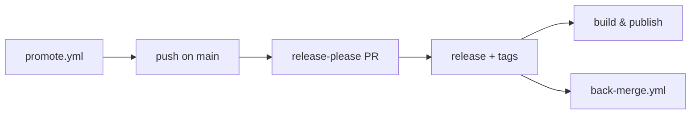

# Deployment

Where the project runs and how it ships: CI/CD, environments, and release.

> CLI build, publish and self-update detail: [`cli/aidd_docs/memory/deployment.md`](../../cli/aidd_docs/memory/deployment.md).

## Pipeline

| Workflow | Runs |
| --- | --- |
| `ci.yml` | commitlint on pull requests and on `main`'s tip, plus the PR title itself — the subject a squash merge uses — then release-please on `main` and the release jobs |
| `cli-ci.yml` | the `cli` and `kanban` gates — job list in the CLI bank. No `paths:` filter, deliberately: it runs on every push and pull request, and a `changes` job decides in bash whether the rest has anything to do — `cli/**`, `kanban/**`, `scripts/__tests__/**`, `README.md`, the workflow file itself, and `plugins/aidd-telemetry/**` except its `*.md` prose. Mutations skip only for a same-repository numeric `promote/next-to-main-*` snapshot whose `cli / gate` passed in a successful `next` push and whose PR merge tree equals that snapshot with `main` already its ancestor; the resulting `main` push reuses it only for that exact two-parent promotion merge when its tree, associated merged PR, and source snapshot all match. Missing, failed, unreadable, or mismatched Git/API proof keeps normal mutation scopes. All non-mutation checks still run on the current PR merge ref or `main` commit. |
| `validate.yml` | plugin and marketplace manifests against their schemas, plus the whole pre-commit over the whole tree |
| `codeql.yml` | code scanning |
| `promote.yml` | opens the `next` to `main` promote PR, merge auto-merge |
| `back-merge.yml` | folds `main` back into `next` after each release |
| `dependabot-auto-merge.yml` | merges dependency PRs that pass |
| `close-finished-milestones.yml` | closes a milestone once its issues are |
| `star-history.yml` | refreshes the README star chart |

Automatic on a push to `main`. Three workflows also accept a manual run: `promote.yml`, `close-finished-milestones.yml`, `star-history.yml`.

## Environments

None — no server, no container, no IaC. What ships are release assets and published packages.

| Target | Where |
| --- | --- |
| Repository | <https://github.com/ai-driven-dev/framework> |
| npm | `@ai-driven-dev/cli`, OIDC trusted publishing, no token |
| Archives | GitHub Releases |
| Mirror | GitHub Packages, npm package only, best-effort |

## Release

Branch model in `vcs.md`, cadence and safety rules in [`RELEASE.md`](../../RELEASE.md).

1. release-please opens the Release PR. Only paths with commits bump; the root bumps every cycle. CI auto-merges it with `--squash --admin`, because the branch policy refuses a plain merge, so `main` never holds merged but unversioned code.
2. Merging creates the release and its tags — a root umbrella tag, `cli-v<semver>`, and one `<plugin>-v<semver>` per plugin, `include-component-in-tag: true`.
3. Release jobs: `build-and-attach` (marketplace bundle), `build-per-tool` (nine distributions), `build-plugin` (one archive per released path), `publish-cli`.
4. Archives are staged outside the repo tree, uploaded with `gh release upload --clobber`.
5. `back-merge.yml` folds `main` into `next`.

Config: `release-please-config.json`, ten packages. Manifest: `.release-please-manifest.json`.

## Gotchas

- `build-per-tool` builds the CLI from this run's own checkout (`cd cli && pnpm install && pnpm build`, then `node cli/dist/cli.js translate`) rather than pinning a published version — no version to bump, and nothing can go stale the way the old `@ai-driven-dev/cli@5.1.1 framework build` pin did once `framework build` was replaced by `translate`.

## Monitoring

None. Failures surface as a red run; `back-merge.yml` opens a tracking issue when it cannot push, so drift is never silent.
