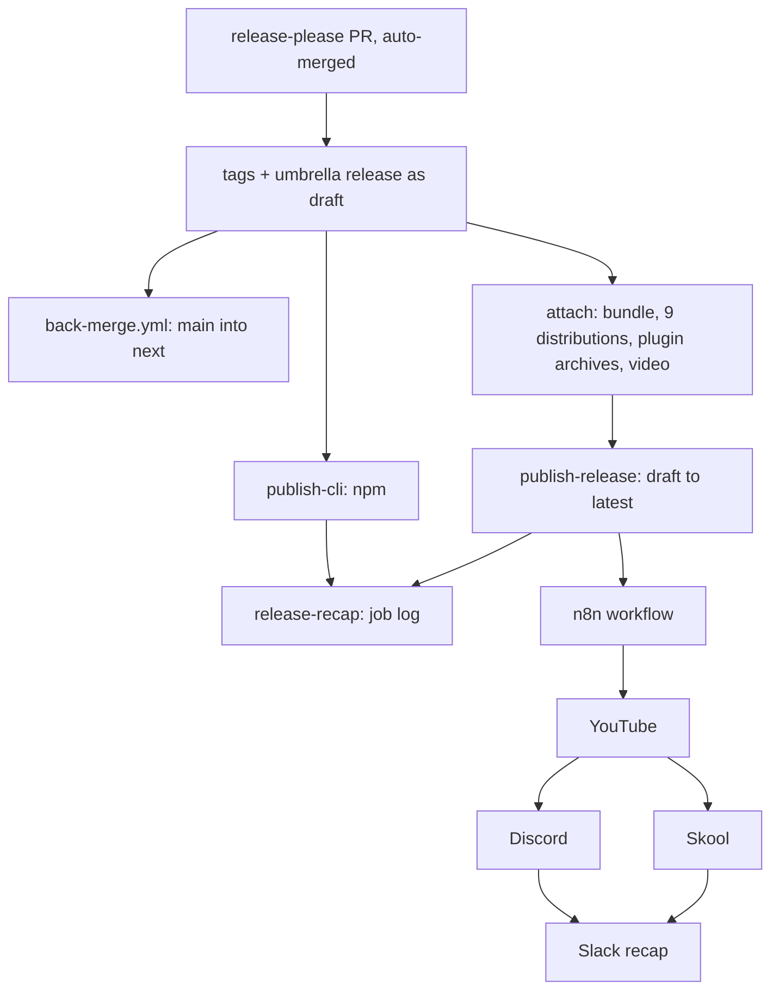

# Deployment

Where the project runs and how it ships: CI/CD, environments, and release.

> CLI build, publish and self-update detail: [`cli/aidd_docs/memory/deployment.md`](../../cli/aidd_docs/memory/deployment.md).

## Pipeline

| Workflow | Runs |
| --- | --- |
| `ci.yml` | commitlint (pull requests, `main`'s tip, the PR title a squash merge uses), then release-please on `main` and the release jobs |
| `cli-ci.yml` | the `cli` and `kanban` gates, jobs in the CLI bank. No `paths:` filter: a `changes` job decides in bash what has work. Mutations skip only for a verified `promote/next-to-main-*` snapshot; anything unproven keeps normal scopes |
| `validate.yml` | manifests against their schemas, plus the whole pre-commit over the whole tree |
| `codeql.yml` | code scanning |
| `promote.yml` | checks the release video covers what ships (`skip_video` bypasses), opens the `next` to `main` PR, auto-merges |
| `back-merge.yml` | folds `main` into `next` after each release |
| `dependabot-auto-merge.yml` | merges dependency PRs that pass |
| `close-finished-milestones.yml` | closes a milestone once its issues are |
| `star-history.yml` | refreshes the README star chart |

Push to `main` is automatic. Manual runs: `promote.yml`, `close-finished-milestones.yml`, `star-history.yml`.

## Environments

No server, container or IaC. What ships are release assets and packages.

| Target | Where |
| --- | --- |
| Repository | <https://github.com/ai-driven-dev/framework> |
| npm | `@ai-driven-dev/cli`, OIDC trusted publishing, no token |
| Archives | GitHub Releases |
| Mirror | GitHub Packages, npm package only, best-effort |

## Release

Branch model in `vcs.md`, cadence and safety rules in [`RELEASE.md`](../../RELEASE.md).

```mermaid
flowchart TD
    RP["release-please PR, auto-merged"] --> Tags["tags + umbrella release as draft"]
    Tags --> Back["back-merge.yml: main into next"]
    Tags --> Jobs["attach: bundle, 9 distributions, plugin archives, video"]
    Tags --> Cli["publish-cli: npm"]
    Jobs --> Pub["publish-release: draft to latest"]
    Cli --> Recap
    Pub --> Recap["release-recap: job log"]
    Pub --> N8N["n8n workflow"]
    N8N --> YT["YouTube"]
    YT --> DC["Discord"]
    YT --> SK["Skool"]
    DC --> Slack["Slack recap"]
    SK --> Slack
```

- The Release PR merges with `--merge --admin`: the only method `.github/rulesets/main.json` allows, so `main` never holds merged but unversioned code.
- Tags: umbrella, `cli-v<semver>`, `<plugin>-v<semver>`. `scripts/credit-release-authors.cjs` appends each author as `(@login)`, a workaround until [googleapis/release-please#2892](https://github.com/googleapis/release-please/pull/2892) ships.
- The umbrella stays a draft until every asset is attached; its publication is the event n8n listens to.
- A failed video build does not block publication, and a failed YouTube upload does not stop Discord and Skool: they post without the video link.

Config: `release-please-config.json`, eleven packages. Manifest: `.release-please-manifest.json`.

## Gotchas

- `build-per-tool` builds the CLI from this run's own checkout (`pnpm build`, then `node cli/dist/cli.js translate`), never a pinned published version: nothing to bump, nothing to go stale.

## Monitoring

None. Failures are a red run; `back-merge.yml` opens an issue when it cannot push.
