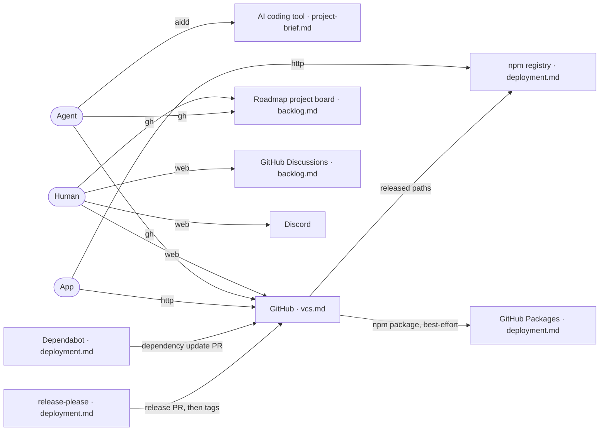

# Ecosystem

```mermaid
flowchart LR
  Human([Human])
  Agent([Agent])
  App([App])
  Tool["AI coding tool · project-brief.md"]
  GitHub["GitHub · vcs.md"]
  Board["Roadmap project board · backlog.md"]
  Discussions["GitHub Discussions · backlog.md"]
  Npm["npm registry · deployment.md"]
  Packages["GitHub Packages · deployment.md"]
  Discord["Discord"]
  ReleasePlease["release-please · deployment.md"]
  Dependabot["Dependabot · deployment.md"]

  Human -- web --> GitHub
  Human -- gh --> Board
  Human -- web --> Discussions
  Human -- web --> Discord
  Agent -- gh --> GitHub
  Agent -- gh --> Board
  Agent -- aidd --> Tool
  App -- http --> GitHub
  App -- http --> Npm

  Dependabot -- "dependency update PR" --> GitHub
  ReleasePlease -- "release PR, then tags" --> GitHub
  GitHub -- "released paths" --> Npm
  GitHub -- "npm package, best-effort" --> Packages
```
