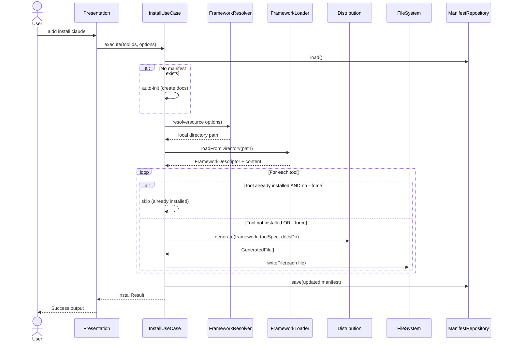
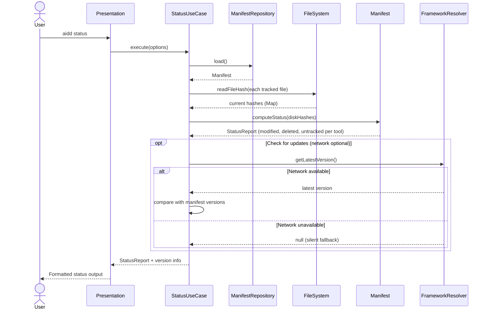
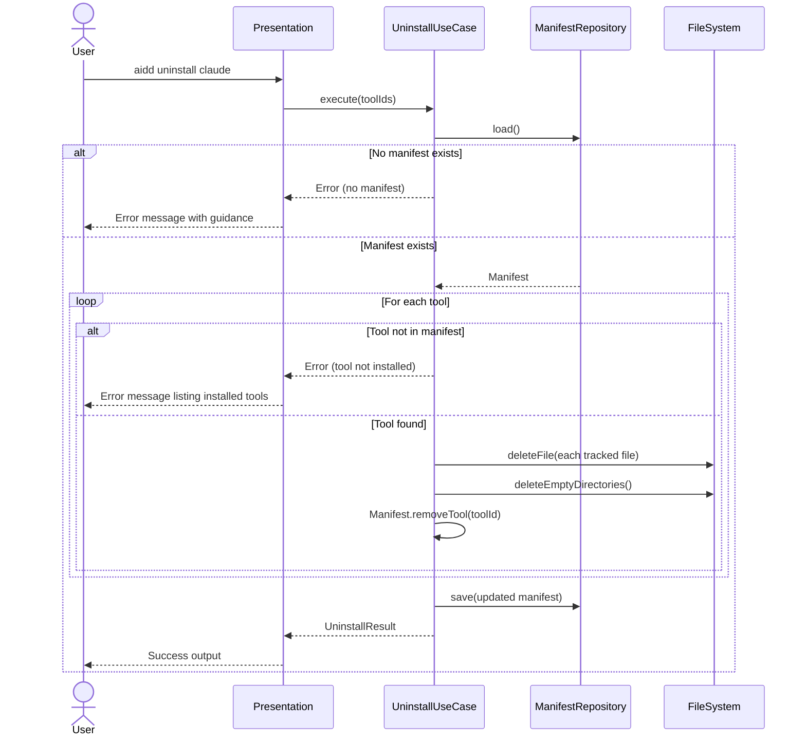
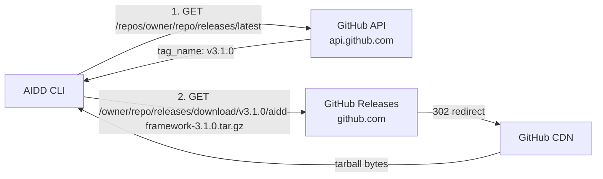
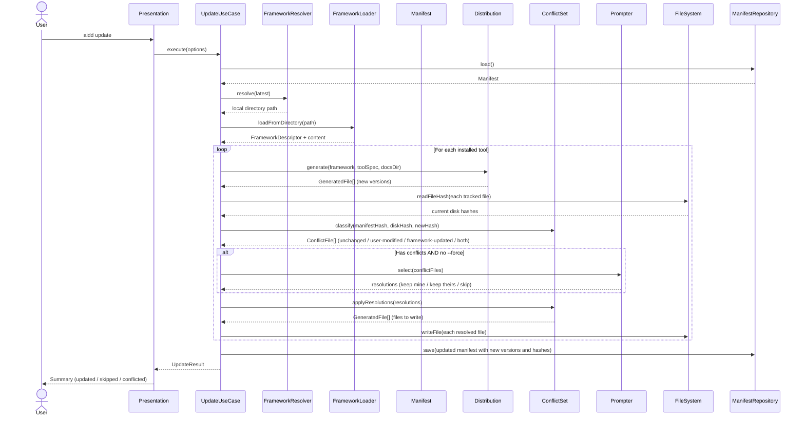
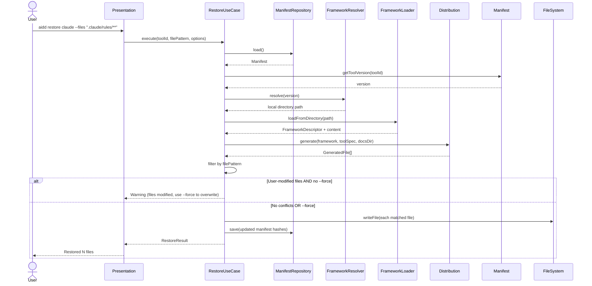
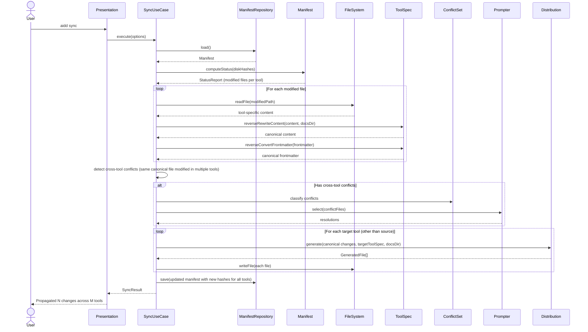

# Architecture -- AIDD CLI v3.0

- [Language/Framework](#languageframework)
  - [Naming Conventions](#naming-conventions)
- [Architecture Decisions](#architecture-decisions)
  - [ADR-001: Layered Architecture Style](#adr-001-layered-architecture-style)
  - [ADR-002: Runtime Dependencies](#adr-002-runtime-dependencies)
  - [ADR-003: Hashing Strategy](#adr-003-hashing-strategy)
  - [ADR-004: Tarball Extraction Strategy](#adr-004-tarball-extraction-strategy)
  - [ADR-005: HTTP Client Strategy](#adr-005-http-client-strategy)
  - [ADR-006: Framework Descriptor as Contract](#adr-006-framework-descriptor-as-contract)
  - [ADR-007: Manifest Storage Format](#adr-007-manifest-storage-format)
  - [ADR-008: Configuration File for Settings](#adr-008-configuration-file-for-settings)
- [Component Diagram](#component-diagram)
- [Layer Responsibilities](#layer-responsibilities)
  - [Domain Layer](#domain-layer)
  - [Application Layer](#application-layer)
  - [Infrastructure Layer](#infrastructure-layer)
  - [Presentation Layer](#presentation-layer)
- [Data Model](#data-model)
- [Domain Ports](#domain-ports)
- [Services Communication](#services-communication)
  - [Install Flow](#install-flow)
  - [Status Flow](#status-flow)
  - [Uninstall Flow](#uninstall-flow)
- [External Services](#external-services)
  - [GitHub Releases API](#github-releases-api)
- [Directory Structure](#directory-structure)
- [Extensibility Seams for v3.1+](#extensibility-seams-for-v31)

---

## Language/Framework

```
@package.json (to be created at project init)
```

```mermaid
flowchart LR
    A[TypeScript 5.x] --> B[Node.js >= 24 ESM]
    B --> C[commander - CLI parsing]
    B --> D[@inquirer/prompts - Interactive prompts]
    B --> E[node:crypto - Hashing]
    B --> F[node:fs/promises - File I/O]
    B --> G[node:child_process - tar extraction]
    B --> H[node:https - HTTP downloads]
    B --> I[vitest - Testing]
    B --> J[tsup - Bundling]
    B --> K[biome - Lint/Format]
```

| Decision           | Choice            | Justification                                                                                             |
| ------------------ | ----------------- | --------------------------------------------------------------------------------------------------------- |
| Language           | TypeScript 5.x    | Type safety for a domain-heavy codebase with multiple value objects and specifications |
| Runtime            | Node.js >= 24 ESM | Constitution constraint; ESM is the Node.js standard going forward; built-in modules cover HTTP, crypto, fs, zlib |
| Package manager    | pnpm >= 9         | Workspace-aware, strict dependency resolution, fast installs                           |
| CLI framework      | commander ^12     | PRD F3.1, F4.1 require multi-argument commands with flags; commander is the de facto standard, zero-config |
| Build              | tsup              | ESM bundling with Node 24 target, single-file output, zero-config for simple projects  |
| Test               | vitest             | Fast, ESM-native, compatible with Node.js built-ins                                    |
| Lint/Format        | biome              | Single tool for linting and formatting, fast, minimal config                            |

### Naming Conventions

- **Files**: kebab-case (e.g., `framework-resolver.ts`, `install-use-case.ts`)
- **Functions**: camelCase (e.g., `resolveFramework`, `computeStatus`)
- **Variables**: camelCase (e.g., `manifestPath`, `toolId`)
- **Constants**: UPPER_CASE (e.g., `DEFAULT_DOCS_DIR`, `MANIFEST_DIR`)
- **Types/Interfaces**: PascalCase (e.g., `Manifest`, `ToolDistribution`, `FileHash`)
- **Domain ports (interfaces)**: PascalCase with descriptive suffix (e.g., `ManifestRepository`, `FrameworkLoader`, `FileSystem`)
- **Enums**: PascalCase with PascalCase members (e.g., `ToolId.Claude`, `FileStatus.Modified`)

---

## Architecture Decisions

### ADR-001: Layered Architecture Style

**Context:** The system needs clear separation between business logic (manifest tracking, change detection, distribution generation), orchestration (use cases combining multiple domain operations), infrastructure (file I/O, HTTP, hashing), and presentation (CLI parsing, output formatting). Constitution Decision Rule 5 mandates readable code over clever abstractions. Clean Architecture and DDD are mandated project constraints to ensure domain isolation and testability.

**Options evaluated:**

| Criterion (weight)           | Clean Architecture + DDD (layered) | Hexagonal (ports & adapters) | Simple modular (flat) |
| ---------------------------- | ---------------------------------- | ---------------------------- | --------------------- |
| Domain isolation (30%)       | 5 -- strict inward dependency rule | 5 -- equivalent isolation    | 2 -- no enforcement   |
| Onboarding simplicity (25%) | 4 -- well-known pattern            | 3 -- port/adapter naming can confuse | 5 -- minimal structure |
| Testability (20%)            | 5 -- domain has zero infra imports | 5 -- equivalent              | 3 -- harder to mock boundaries |
| Extensibility for v3.1+ (15%)| 5 -- use cases compose freely     | 5 -- equivalent              | 3 -- grows tangled    |
| Code volume overhead (10%)  | 3 -- more files, clear boundaries  | 2 -- more ceremony           | 5 -- minimal          |
| **Weighted total**           | **4.55**                           | **4.20**                     | **3.15**              |

**Decision:** Clean Architecture with DDD. Four layers: Domain, Application, Infrastructure, Presentation. The domain defines ports (interfaces) that infrastructure implements. Dependencies always point inward. This provides the isolation needed for a system that manages file state across multiple tools.

**Trade-off accepted:** More files and indirection than a flat module structure. Justified because the domain has real complexity (manifest diffing, content rewriting, distribution generation, frontmatter conversion) that benefits from isolation and independent testability.

---

### ADR-002: Runtime Dependencies

**Context:** Constitution budget constraint limits runtime dependencies to max 2. The CLI needs argument parsing and interactive prompts (update conflict resolution in v3.1+, per-file approval during sync).

**Decision:** Two runtime dependencies filling the full budget:

| Dependency    | Purpose                                              | Version  |
| ------------- | ---------------------------------------------------- | -------- |
| commander     | CLI parsing: subcommands, flags, help generation     | ^12      |
| @inquirer/prompts | Interactive prompts: confirm, select, checkbox for update/sync conflict resolution | ^7 |

**v3.0 usage:** commander is used immediately. inquirer is imported but not called — v3.0 commands use explicit arguments and `--force` flags only. This avoids a breaking dependency addition in v3.1+.

**v3.1+ usage:** inquirer handles per-file conflict resolution during `update` (modified files) and `sync` (bidirectional conflicts). Prompt types needed: confirm (yes/no overwrite), select (keep mine / keep theirs / diff), checkbox (multi-file selection).

**Trade-off accepted:** The dependency budget is fully consumed from v3.0. No room for a third runtime dependency. If a future need arises, it must be covered by Node.js built-ins or by replacing one of these two.

**Prompter port:** A `Prompter` port in the domain abstracts interactive prompts. Infrastructure implements it with inquirer. In tests and CI, a `SilentPrompter` adapter auto-accepts (equivalent to `--force`). This keeps domain logic testable without interactive I/O.

---

### ADR-003: Hashing Strategy

**Context:** Constitution quality constraint requires hash-based change detection for all managed files. PRD F5.1 requires comparing file hashes against the manifest. The manifest specification uses MD5 hashes for change detection.

**Options evaluated:**

| Criterion (weight)       | MD5 (node:crypto)  | SHA-256 (node:crypto) | xxhash (npm package) |
| ------------------------ | ------------------ | --------------------- | -------------------- |
| Speed (30%)             | 4 -- fast enough for file sets <1000 | 3 -- slower but still fast | 5 -- fastest        |
| Zero-dep (30%)          | 5 -- node:crypto built-in | 5 -- node:crypto built-in | 1 -- requires npm dep |
| Sufficient for purpose (25%) | 5 -- collision risk irrelevant for change detection | 5 -- overkill but works | 5 -- works          |
| Spec alignment (15%)     | 5 -- matches manifest format specification | 3 -- not specified | 1 -- not specified   |
| **Weighted total**       | **4.75**           | **4.10**              | **2.90**             |

**Decision:** MD5 via `node:crypto`. This is not a security use case (no adversarial collision risk); MD5 is used purely for change detection. It is fast, built-in, and matches the manifest format specification (32-char hex strings).

**Trade-off accepted:** MD5 is cryptographically broken. Irrelevant here since the threat model is accidental file modification, not adversarial hash collision.

---

### ADR-004: Tarball Extraction Strategy

**Context:** PRD F1.4 requires downloading and extracting framework tarballs. Constitution budget constraint prohibits adding a tar-parsing npm dependency.

**Options evaluated:**

| Criterion (weight)              | child_process + system tar | Pure Node.js stream parsing | tar npm package |
| ------------------------------- | -------------------------- | --------------------------- | --------------- |
| Zero runtime dep (35%)         | 5 -- uses built-in module  | 5 -- uses built-in modules  | 1 -- adds dep   |
| Implementation effort (25%)    | 5 -- single exec call      | 1 -- complex stream parsing | 5 -- simple API |
| Platform support (20%)         | 4 -- tar available on macOS, Linux, WSL | 5 -- pure Node.js | 5 -- pure Node.js |
| Reliability (20%)              | 5 -- battle-tested system tar | 2 -- custom parser risks bugs | 5 -- battle-tested |
| **Weighted total**              | **4.80**                   | **3.30**                    | **3.30**         |

**Decision:** Shell out to `tar xzf` via `node:child_process`. The target platforms (macOS, Linux, WSL) all have `tar` available.

**Trade-off accepted:** Windows 10+ ships `tar.exe` natively (since build 17063, 2017), so bare Windows is likely supported. macOS and Linux have `tar` universally. The actual risk is behavioral differences between GNU tar (Linux), BSD tar (macOS), and Windows tar (libarchive-based) for advanced flags. Mitigation: use only basic `tar xzf` flags and handle GitHub's single-directory nesting in Node.js code (readdir + descend), not via tar-specific options. If a platform issue surfaces, a Node.js tar stream parser can be swapped in behind the same port interface without changing domain or application code.

---

### ADR-005: HTTP Client Strategy

**Context:** PRD F1.4 requires downloading tarballs from GitHub Releases. Constitution budget constraint prohibits adding an HTTP client dependency.

**Options evaluated:**

| Criterion (weight)       | node:https (built-in) | undici (bundled in Node 20+) | axios (npm package) |
| ------------------------ | --------------------- | ---------------------------- | ------------------- |
| Zero runtime dep (40%)  | 5 -- built-in         | 4 -- bundled but separate API | 1 -- adds dep      |
| Redirect handling (25%) | 3 -- manual implementation | 5 -- automatic              | 5 -- automatic      |
| Simplicity (20%)        | 3 -- callback/stream API | 4 -- modern fetch-like      | 5 -- simplest API  |
| Node.js stability (15%)| 5 -- stable since v0.x | 3 -- API still evolving     | 5 -- stable         |
| **Weighted total**       | **4.15**              | **4.05**                    | **2.80**            |

**Decision:** `node:https` with manual redirect following. GitHub download URLs redirect (302), so the implementation must follow one redirect. This is a small, well-understood pattern. The HTTP interaction is limited to two endpoints (releases API + asset download), so the callback API's verbosity is acceptable.

**Alternative considered:** `globalThis.fetch` (available in Node 20+) provides a simpler API with automatic redirects. This is a viable alternative that could be swapped in if the `node:https` implementation proves cumbersome. The port interface makes this substitution trivial.

---

### ADR-006: Framework Descriptor as Contract

**Context:** Constitution Decision Rule 3 states the CLI must adapt to framework structure changes without code changes. The framework ships a `framework.json` descriptor that declares its own structure (content directories, templates, configs).

**Decision:** The CLI reads `framework.json` at framework load time to discover content directories, template paths, and config file locations. No content paths are hardcoded in the CLI. This is not a choice between alternatives -- it is a non-negotiable constraint from the constitution. The architecture enforces this by making the framework descriptor a first-class domain concept that the loader parses and the distribution generator consumes.

**Consequence:** If the framework reorganizes its directory structure, only `framework.json` changes. The CLI code remains unchanged as long as content stays within existing categories (agents, commands, rules, skills). New content categories would require code changes -- this is explicitly acknowledged by Constitution Decision Rule 3.

---

### ADR-007: Manifest Storage Format

**Context:** PRD Section 8 specifies `.aidd/config.json` as the manifest location. The manifest must track per-tool file hashes, framework versions, and docs directory configuration.

**Options evaluated:**

| Criterion (weight)       | Single JSON file    | SQLite             | Multiple files (one per tool) |
| ------------------------ | ------------------- | ------------------ | ----------------------------- |
| Simplicity (35%)        | 5 -- one file, one read/write | 2 -- adds dep + complexity | 3 -- multiple reads |
| Human readable (25%)    | 5 -- plain JSON     | 1 -- binary        | 4 -- readable per file       |
| Atomic operations (20%) | 4 -- single write   | 5 -- transactions  | 2 -- multi-file consistency  |
| Zero dep (20%)          | 5 -- JSON.parse built-in | 1 -- requires dep | 5 -- built-in               |
| **Weighted total**       | **4.85**            | **2.05**           | **3.35**                     |

**Decision:** Single JSON file at `.aidd/config.json`. The manifest is small (hundreds of entries at most), read/written atomically, and benefits from being human-inspectable for debugging.

---

### ADR-008: Configuration File for Settings

**Context:** The CLI needs configurable settings: framework repository URL, default docs directory, authentication preferences, and potentially future options. These settings should not require CLI flags on every invocation. Constitution anti-over-engineering rules apply: only settings with validated use cases should be configurable.

**Options evaluated:**

| Criterion (weight)           | `.aidd/config.json` (shared manifest file) | Dedicated `.aidd/settings.json` | Environment variables only |
| ---------------------------- | ------------------------------------------ | ------------------------------- | -------------------------- |
| Separation of concerns (30%)| 2 -- mixes runtime state with user prefs   | 5 -- clear separation           | 4 -- no file but scattered |
| Discoverability (25%)       | 3 -- buried in manifest structure           | 5 -- dedicated file, self-documenting | 2 -- must know var names |
| Portability (25%)           | 3 -- manifest is project-specific           | 5 -- can be committed or gitignored | 2 -- per-machine only    |
| Simplicity (20%)            | 5 -- one fewer file                         | 4 -- one more file to manage    | 5 -- no file management   |
| **Weighted total**           | **3.15**                                   | **4.80**                        | **3.10**                  |

**Decision:** Dedicated `.aidd/settings.json` file. Separated from the manifest (which tracks runtime state). Settings are user preferences, not operational state.

**Resolution priority** (highest wins): CLI flag → environment variable → `.aidd/settings.json` → built-in default. This lets users override per-invocation (flag), per-environment (env var), or per-project (settings file).

**v3.0 configurable settings:**

| Setting          | CLI flag    | Env var         | Settings key     | Default                                |
| ---------------- | ----------- | --------------- | ---------------- | -------------------------------------- |
| Framework repo   | `--repo`    | `AIDD_REPO`     | `repo`           | `ai-driven-dev/aidd-framework`         |
| Auth token       | `--token`   | `AIDD_TOKEN`    | —                | `gh auth token` fallback (not persisted for security) |
| Docs directory   | `--docs`    | —               | `docsDir`        | `aidd_docs`                            |
| Verbose output   | `--verbose` | `AIDD_VERBOSE`  | `verbose`        | `false`                                |

**Security constraint:** Auth tokens are never stored in the settings file. Token resolution: `--token` flag → `AIDD_TOKEN` env → `gh auth token` (3s timeout) → unauthenticated.

**Trade-off accepted:** One additional file in `.aidd/`. Justified because it keeps user preferences separate from runtime state, is human-readable, and can be committed to the repository for team-wide defaults.

---

## Component Diagram

```mermaid
graph TB
    subgraph CLI["Presentation Layer"]
        CMD[Command Handlers<br>init / install / uninstall<br>status / clean / doctor]
        CMD_V31[Command Handlers v3.1+<br>update / restore / sync]
        PRES[Presenter<br>Output formatting]
    end

    subgraph APP["Application Layer (Use Cases)"]
        subgraph MVP["v3.0"]
            UC_INIT[InitUseCase]
            UC_INSTALL[InstallUseCase]
            UC_UNINSTALL[UninstallUseCase]
            UC_STATUS[StatusUseCase]
            UC_CLEAN[CleanUseCase]
            UC_DOCTOR[DoctorUseCase]
        end
        subgraph NEXT["v3.1+"]
            UC_UPDATE[UpdateUseCase]
            UC_RESTORE[RestoreUseCase]
            UC_SYNC[SyncUseCase]
        end
    end

    subgraph DOMAIN["Domain Layer (Business Logic)"]
        MAN[Manifest<br>Aggregate root: tools, hashes,<br>versions, docs config<br>computeStatus · addTool · removeTool]
        DIST[Distribution<br>Aggregate: generates tool files<br>generate · toGeneratedFiles]
        TS[ToolSpec<br>Rich value object: tool conventions<br>rewriteContent · convertFrontmatter<br>reverseRewriteContent · reverseConvertFrontmatter<br>buildFilePath · shouldFlatten]
        HASH[FileHash<br>Value object for<br>change detection]
        FW[FrameworkDescriptor<br>Parsed framework.json<br>content layout]
        SET[Settings<br>Value object: repo, docsDir,<br>verbose with defaults]
        CONFLICT[ConflictSet<br>v3.1+: modified files<br>needing user decision]
        PORTS[Ports<br>ManifestRepository · SettingsRepository<br>FileSystem · FrameworkLoader<br>FrameworkResolver · Hasher<br>Prompter · Logger]
    end

    subgraph INFRA["Infrastructure Layer"]
        FS[FileSystemAdapter<br>node:fs/promises]
        MAN_REPO[ManifestRepositoryAdapter<br>JSON read/write]
        SET_REPO[SettingsRepositoryAdapter<br>JSON read with defaults]
        FW_LOAD[FrameworkLoaderAdapter<br>Local directory parsing]
        FW_RESOLVE[FrameworkResolverAdapter<br>Local dir / tarball / remote]
        HASH_ADAPT[HasherAdapter<br>node:crypto MD5]
        PROMPT[PrompterAdapter<br>@inquirer/prompts]
        HTTP[HttpClient<br>node:https]
        TAR[TarExtractor<br>node:child_process]
        CACHE[FrameworkCache<br>os.tmpdir based]
        TOKEN[TokenResolver<br>flag / env / gh CLI]
        LOG[LoggerAdapter<br>stderr verbose output]
    end

    CMD --> UC_INIT
    CMD --> UC_INSTALL
    CMD --> UC_UNINSTALL
    CMD --> UC_STATUS
    CMD --> UC_CLEAN
    CMD --> UC_DOCTOR
    CMD_V31 --> UC_UPDATE
    CMD_V31 --> UC_RESTORE
    CMD_V31 --> UC_SYNC

    UC_INIT --> MAN
    UC_INIT --> FW
    UC_INSTALL --> MAN
    UC_INSTALL --> DIST
    UC_INSTALL --> FW
    UC_UNINSTALL --> MAN
    UC_STATUS --> MAN
    UC_CLEAN --> MAN
    UC_DOCTOR --> MAN

    UC_UPDATE --> MAN
    UC_UPDATE --> DIST
    UC_UPDATE --> FW
    UC_UPDATE --> CONFLICT
    UC_RESTORE --> MAN
    UC_RESTORE --> DIST
    UC_RESTORE --> FW
    UC_SYNC --> MAN
    UC_SYNC --> TS
    UC_SYNC --> CONFLICT

    DIST --> TS
    DIST --> HASH
    MAN --> HASH

    INFRA -.->|implements| PORTS
```

---

## Layer Responsibilities

### Domain Layer

Zero infrastructure imports. Rich domain objects own their behavior — no anemic services.

| Module                | Type              | Responsibility & Behavior                                                      | Driven by               |
| --------------------- | ----------------- | ------------------------------------------------------------------------------ | ----------------------- |
| Manifest              | Aggregate root    | Tracks tools, file hashes, versions, docs config. **Behavior:** `addTool(toolId, version, files)`, `removeTool(toolId)`, `computeStatus(diskHashes): StatusReport` (diffs manifest hashes against disk, classifies files as modified/deleted/added), `hasTool(toolId)`, `getToolVersion(toolId)`. | PRD Section 8, Constitution quality constraint |
| Distribution          | Aggregate         | Generates tool-specific file sets from framework content. **Behavior:** `generate(framework: FrameworkDescriptor, toolSpec: ToolSpec, docsDir: string): GeneratedFile[]` — iterates framework content sections, delegates per-file rewriting to `toolSpec`, produces output file set with computed hashes. | PRD F3                 |
| ToolSpec              | Rich value object | Describes a tool's conventions and owns all tool-specific transformations. **v3.0 behavior:** `rewriteContent(content, docsDir): string` (placeholder replacement for `$DOCS_DIR`/`$TOOL_DIR`, include syntax conversion `@path` vs markdown link), `convertFrontmatter(frontmatter): Frontmatter` (converts between paths/globs/applyTo scope formats), `buildFilePath(contentSection, fileName): string`, `shouldFlatten(contentSection): boolean`. **v3.1+ behavior:** `reverseRewriteContent(content, docsDir): string` (tool-specific back to canonical), `reverseConvertFrontmatter(frontmatter): Frontmatter` (tool format back to canonical). Each tool (Claude, Cursor, Copilot) has distinct directory layouts, file extensions, and scope formats. | Constitution extensibility constraint |
| FileHash              | Value object      | Wraps a hash string with equality comparison (`equals(other)`).                | Constitution quality constraint |
| FrameworkDescriptor   | Value object      | Parsed representation of framework.json. Locates content directories, templates, and config file references. | Constitution Decision Rule 3 |
| StatusReport          | Value object      | Result of `Manifest.computeStatus()`: per-tool lists of modified, deleted, and untracked files. | PRD F5               |
| GeneratedFile         | Value object      | A file produced by `Distribution.generate()`: relative path, content, and pre-computed hash. | PRD F3               |
| ConflictSet           | Value object      | v3.1+: Collection of files where the user-modified version differs from the new framework version. **Behavior:** `classify(manifestHash, diskHash, newHash): ConflictType` (unchanged/modified-by-user/modified-by-framework/both-modified), `getConflicts(): ConflictFile[]`, `applyResolutions(resolutions): GeneratedFile[]`. Used by UpdateUseCase and SyncUseCase. | PRD F8, F10            |
| Ports (interfaces)    | Interfaces        | ManifestRepository, FileSystem, FrameworkLoader, FrameworkResolver, Hasher, Prompter, Logger. Defined in domain, implemented in infrastructure. | Clean Architecture dependency rule |

### Application Layer

Orchestrates domain objects through ports. One use case per command. No business logic -- only coordination.

| Use Case         | Orchestration                                                                              | Driven by  |
| ---------------- | ------------------------------------------------------------------------------------------ | ---------- |
| InitUseCase      | Resolve framework -> load descriptor -> copy docs templates from FrameworkDescriptor.templates to docsDir -> hash them -> create manifest (docs templates are raw file copies, not tool-specific rewrites — no Distribution involved) | PRD F2     |
| InstallUseCase   | Check manifest (auto-init if missing) -> resolve framework -> generate distribution per tool -> write files -> update manifest | PRD F3 |
| UninstallUseCase | Load manifest -> delete tracked files per tool -> clean empty dirs -> update manifest (remove tool entries, keep docs and manifest alive even if no tools remain; only `clean` removes manifest) | PRD F4 |
| StatusUseCase    | Load manifest -> read disk hashes -> call Manifest.computeStatus(diskHashes) -> optionally check latest version via FrameworkResolver (silent fallback on network failure) -> return StatusReport per tool with update availability | PRD F5 |
| CleanUseCase     | Load manifest -> if no --force, return dry-run summary -> delete all tracked files (only manifest-tracked, never untracked user files) -> delete manifest directory | PRD F6 |
| DoctorUseCase    | Load manifest -> validate structure -> check file existence and hashes -> detect orphans -> report | PRD F7 |
| **v3.1+ Use Cases** | | |
| UpdateUseCase    | Resolve latest framework -> load descriptor -> for each installed tool: generate new distribution, build ConflictSet (compare manifest hashes vs disk hashes vs new hashes) -> if conflicts and no --force: prompt user per file via Prompter -> apply resolutions -> write files -> update manifest versions | PRD F8 |
| RestoreUseCase   | Load manifest -> get version per tool -> resolve that framework version -> regenerate distribution for specified tools -> overwrite files (only manifest-tracked, skip user-modified unless --force) -> update manifest hashes | PRD F9 |
| SyncUseCase      | Load manifest -> read tool-specific files from disk -> reverse rewrite via ToolSpec.reverseRewriteContent() -> reverse convert frontmatter via ToolSpec.reverseConvertFrontmatter() -> detect differences with canonical -> build ConflictSet -> prompt user for conflict resolution via Prompter -> propagate approved changes to all other tools via forward rewrite -> update manifest | PRD F10 |

### Infrastructure Layer

Implements domain ports with concrete I/O. Each adapter is independently testable.

| Adapter                  | Implements port     | Technology           | Notes                                   |
| ------------------------ | ------------------- | -------------------- | --------------------------------------- |
| FileSystemAdapter        | FileSystem          | node:fs/promises     | Read, write, delete, mkdir, rmdir, merge JSON |
| ManifestRepositoryAdapter| ManifestRepository  | node:fs + JSON.parse | Load, save, delete `.aidd/config.json`  |
| FrameworkLoaderAdapter   | FrameworkLoader     | node:fs/promises     | Parse framework.json, read content dirs |
| FrameworkResolverAdapter | FrameworkResolver   | Composes HTTP + tar + cache | Resolves any source to a local dir path |
| HasherAdapter            | Hasher              | node:crypto (MD5)    | Hash file contents for manifest         |
| HttpClientAdapter        | (internal to resolver) | node:https        | GET with redirect following, auth header |
| TarExtractorAdapter      | (internal to resolver) | node:child_process | `tar xzf` with framework root detection |
| FrameworkCacheAdapter    | (internal to resolver) | node:fs + os.tmpdir | Per-version cache with marker file      |
| TokenResolverAdapter     | (internal to resolver) | node:child_process | `gh auth token` with 3s timeout         |
| SettingsRepositoryAdapter| SettingsRepository  | node:fs + JSON.parse | Load `.aidd/settings.json`, merge with defaults |
| PrompterAdapter          | Prompter            | @inquirer/prompts    | Interactive conflict resolution prompts (v3.1+) |
| SilentPrompterAdapter    | Prompter            | (none)               | Auto-accepts all prompts (CI, tests, --force)   |
| LoggerAdapter            | Logger              | process.stderr       | Verbose-mode diagnostic output          |

### Presentation Layer

Thin layer that parses arguments, wires dependencies, calls use cases, and formats output.

| Responsibility           | Details                                                                      |
| ------------------------ | ---------------------------------------------------------------------------- |
| Command registration     | commander program with subcommands: init, install, uninstall, status, clean, doctor |
| Dependency wiring        | Creates infrastructure adapters, injects them into use cases (manual DI, no container) |
| Output formatting        | Translates use case results into user-friendly terminal output               |
| Error handling            | Catches domain/application errors, formats them as user-facing messages with actionable guidance |
| Settings resolution      | Merges CLI flags → env vars → `.aidd/settings.json` → defaults (ADR-008 priority chain) |
| Global options           | `--verbose` flag controls logger adapter behavior                            |

**Manual dependency injection** -- no DI container. Each command handler constructs the adapters it needs and passes them to the use case. This avoids a framework dependency and keeps the wiring explicit and readable (Constitution Decision Rule 5).

**Settings resolution at presentation layer** -- The presentation layer loads `SettingsRepository`, merges with CLI flags and env vars (ADR-008 priority chain), and passes resolved values to use cases as constructor parameters. This is intentional: settings are a wiring concern, not a domain concern. Use cases receive already-resolved values and never access the settings file directly.

**--force flag pattern** -- Commands `install`, `clean` (v3.0), `update`, `restore`, `sync` (v3.1+) accept a `--force` flag. Semantics per command: install (overwrite existing), clean (skip dry-run), update (overwrite user-modified files without prompting), restore (overwrite modified files), sync (auto-accept conflicts). The presentation layer extracts this flag and passes it as a boolean `force` parameter. When `force` is true, the `SilentPrompterAdapter` is injected instead of the interactive `PrompterAdapter`.

---

## Data Model

```mermaid
erDiagram
    Settings ||..|| Manifest : "resolved alongside"
    Manifest ||--|| FrameworkConfig : contains
    FrameworkConfig ||--o{ ToolEntry : contains
    FrameworkConfig ||--|| DocsEntry : contains
    ToolEntry ||--o{ TrackedFile : tracks
    DocsEntry ||--o{ TrackedFile : tracks
    FrameworkDescriptor ||--o{ ContentSection : declares
    FrameworkDescriptor ||--o{ TemplateRef : declares
    FrameworkDescriptor ||--o{ ConfigRef : declares
    ToolSpec ||--|| FrontmatterFormat : uses
    Distribution ||--o{ GeneratedFile : produces
    ConflictSet ||--o{ ConflictFile : contains

    Manifest {
        string docsDir "Optional - omitted if default"
    }

    FrameworkConfig {
        string version "Framework version used across all tools"
    }

    ToolEntry {
        ToolId toolId "claude | cursor | copilot"
        string version "Framework version at install"
    }

    DocsEntry {
        string version "Framework version at init"
    }

    TrackedFile {
        string relativePath "Path relative to project root"
        FileHash hash "MD5 hash of file content"
    }

    FrameworkDescriptor {
        string version "Semantic version"
    }

    ContentSection {
        string name "agents | commands | rules | skills"
        string dir "Directory path within framework"
        string organization "flat | phase-directories | category-directories | one-directory-per-skill"
        string entryFile "Optional - e.g. SKILL.md"
    }

    TemplateRef {
        string name "memoryBank | docsReadme | etc"
        string path "Path within framework"
    }

    ConfigRef {
        string name "mcp | vscodeDir"
        string path "Path within framework"
    }

    ToolSpec {
        ToolId toolId "claude | cursor | copilot"
        string directory ".claude/ | .cursor/ | .github/"
        string ruleExtension ".md (claude/cursor) | .mdc (cursor rules) | .instructions.md (copilot)"
        string memoryBankPath "CLAUDE.md | AGENTS.md | .github/copilot-instructions.md"
        string mcpConfigPath ".mcp.json | .cursor/mcp.json | null"
        string includeSyntaxPrefix "@ prefix | @ prefix | markdown link"
        boolean flattenCommands "false | false | true"
        boolean flattenRules "false | false | true"
    }

    FrontmatterFormat {
        string scopeField "paths | globs | applyTo"
        string alwaysApplyRepresentation "How 'always apply' is expressed"
    }

    Distribution {
        ToolId toolId "Target tool"
        string frameworkVersion "Source version"
    }

    GeneratedFile {
        string relativePath "Target path in project"
        string content "Rewritten content"
        FileHash hash "MD5 of content"
    }

    FileHash {
        string value "32-char MD5 hex string"
    }

    Settings {
        string repo "Optional - default: ai-driven-dev/aidd-framework"
        string docsDir "Optional - default: aidd_docs"
        boolean verbose "Optional - default: false"
    }

    ConflictSet {
        ToolId toolId "Tool being updated or synced"
    }

    ConflictFile {
        string relativePath "File with conflict"
        ConflictType type "unchanged | user-modified | framework-updated | both"
        FileHash manifestHash "Hash at last install"
        FileHash diskHash "Current hash on disk"
        FileHash newHash "Hash of new version"
    }
```



---

## Domain Ports

Ports are interfaces defined in the domain layer. Infrastructure provides implementations.

| Port               | Operations                                     | Purpose                                          |
| ------------------ | ---------------------------------------------- | ------------------------------------------------ |
| ManifestRepository | load, save, delete                             | Persist/retrieve manifest from `.aidd/config.json` |
| FileSystem         | writeFile, deleteFile, createDirectory, deleteEmptyDirectories, readFile, listDirectory, fileExists, readFileHash, mergeJsonFile | Combined read/write/merge operations on project files. mergeJsonFile handles VS Code config deep merge (FR3.8). |
| FrameworkLoader    | loadFromDirectory                              | Parse framework.json and load all content from a local directory |
| FrameworkResolver  | resolve, getLatestVersion                      | Resolve any source (local dir, tarball, remote) to a local directory path; check latest available version (used by status and update) |
| Hasher             | hash                                           | Compute MD5 hash of content. Note: MD5 algorithm is fixed by manifest spec; could be inlined as a pure function if the port is deemed excessive overhead. |
| SettingsRepository | load                                           | Load settings from `.aidd/settings.json` with defaults for missing keys. Read-only in v3.0 (users edit the file manually or use CLI flags). |
| Prompter           | confirm, select, checkbox                      | v3.1+: Interactive prompts for conflict resolution during update/sync. v3.0: not called (explicit arguments only). Infrastructure: `PrompterAdapter` (inquirer) for interactive use, `SilentPrompter` for CI/tests/--force. |
| Logger             | debug, info, warn                              | Emit diagnostic messages (verbose mode). Lightweight implementation: module-level function controlled by `--verbose` flag. |

---

## Services Communication

### Install Flow



### Status Flow



### Uninstall Flow



---

## External Services

### GitHub Releases API



| Aspect               | Detail                                                                          |
| --------------------- | ------------------------------------------------------------------------------- |
| Purpose               | Download canonical framework releases from the private community repository    |
| Authentication        | Bearer token via --token flag > AIDD_TOKEN env > `gh auth token` > none         |
| Endpoints             | Latest release: `GET /repos/{owner}/{repo}/releases/latest`; Asset download: `GET /{owner}/{repo}/releases/download/v{version}/aidd-framework-{version}.tar.gz` |
| Error handling         | 401/403: auth failure with guidance message; 404: not found; network error: clear message with offline fallback |
| Offline behavior       | Fall back to cached version if available; fail only if no cache (Constitution offline constraint) |
| Rate limiting          | 60/hr unauthenticated, 5000/hr authenticated; not a practical concern for authenticated usage |
| Security               | Token never cached, logged, or displayed (Constitution security constraint)     |

---

## Directory Structure

```
src/
  cli.ts                          # Entry point, commander setup
  index.ts                        # Library API entry point
  presentation/
    commands/                     # One file per CLI command
      init.ts
      install.ts
      uninstall.ts
      status.ts
      clean.ts
      doctor.ts
      update.ts                   # v3.1+
      restore.ts                  # v3.1+
      sync.ts                     # v3.1+
    presenter.ts                  # Output formatting
  application/
    use-cases/
      init-use-case.ts
      install-use-case.ts
      uninstall-use-case.ts
      status-use-case.ts
      clean-use-case.ts
      doctor-use-case.ts
      update-use-case.ts          # v3.1+
      restore-use-case.ts         # v3.1+
      sync-use-case.ts            # v3.1+
  domain/
    models/
      manifest.ts                 # Aggregate root: addTool, removeTool, computeStatus
      tool-entry.ts
      docs-entry.ts
      tracked-file.ts
      file-hash.ts                # Value object: equals()
      framework-descriptor.ts     # Value object: content section lookup
      tool-spec.ts                # Rich value object: rewriteContent, convertFrontmatter, buildFilePath, shouldFlatten
      distribution.ts             # Aggregate: generate()
      generated-file.ts           # Value object
      status-report.ts            # Value object
      conflict-set.ts             # Value object v3.1+: classify, getConflicts, applyResolutions
      settings.ts                 # Value object: repo, docsDir, verbose with defaults
    ports/
      manifest-repository.ts
      settings-repository.ts      # Load settings with defaults
      file-system.ts              # Combined read/write/merge port
      framework-loader.ts
      framework-resolver.ts
      hasher.ts
      prompter.ts                 # v3.1+: interactive conflict resolution
      logger.ts
    tool-specs/                   # ToolSpec factory data per tool
      claude.ts
      cursor.ts
      copilot.ts
  infrastructure/
    adapters/
      manifest-repository-adapter.ts
      settings-repository-adapter.ts  # Load .aidd/settings.json
      file-system-adapter.ts          # Single adapter for combined FileSystem port
      framework-loader-adapter.ts
      framework-resolver-adapter.ts
      hasher-adapter.ts
      prompter-adapter.ts           # @inquirer/prompts v3.1+
      silent-prompter-adapter.ts    # Auto-accept for CI/tests/--force
      logger-adapter.ts
    http/
      http-client.ts
    tar/
      tar-extractor.ts
    cache/
      framework-cache.ts
    auth/
      token-resolver.ts
```

---

## v3.1+ Architecture

The v3.1+ features reuse the same layers, ports, and domain objects as v3.0. The incremental additions are:

### Update Flow (F8)

Non-destructive framework update. User-modified files are never overwritten without consent.



### Restore Flow (F9)

Regenerate files from a specific framework version, useful when a file is corrupted or accidentally deleted.



### Sync Flow (F10)

Bidirectional propagation: changes made in one tool's files are reverse-rewritten to canonical form, then forward-rewritten to all other tools.



### Domain Additions for v3.1+

| Addition           | Location              | Purpose                                               |
| ------------------ | --------------------- | ----------------------------------------------------- |
| ConflictSet        | Domain model          | Three-way diff (manifest vs disk vs new) with resolution application |
| reverseRewriteContent | ToolSpec method     | Tool-specific content back to canonical form          |
| reverseConvertFrontmatter | ToolSpec method | Tool-specific frontmatter back to canonical format    |
| Prompter port      | Domain port           | Abstract interactive prompts, implemented by inquirer or silent adapter |
| PrompterAdapter    | Infrastructure        | @inquirer/prompts: confirm, select, checkbox          |
| SilentPrompterAdapter | Infrastructure     | Auto-accepts all prompts (CI, tests, --force)         |
