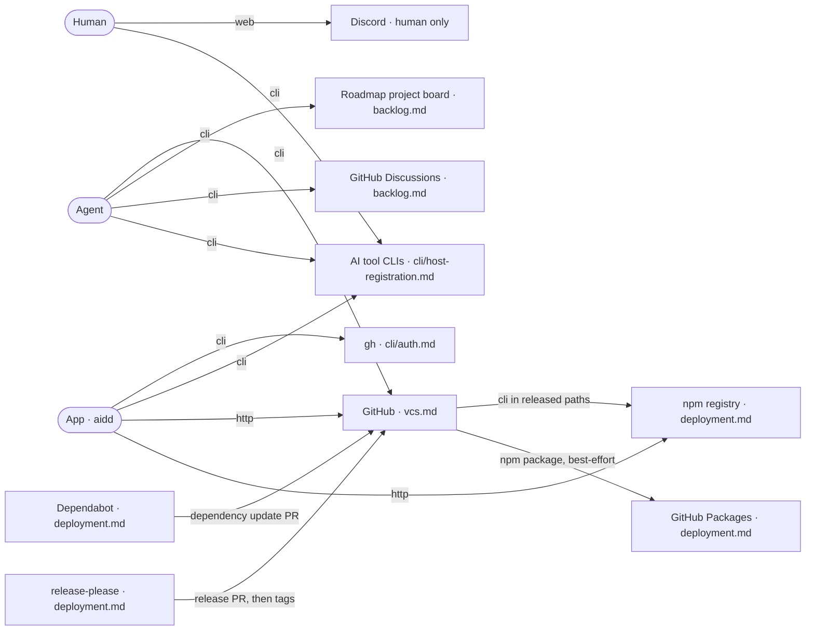

# Ecosystem

```mermaid
flowchart LR
  Human([Human])
  Agent([Agent])
  App(["App · aidd"])
  GitHub["GitHub · vcs.md"]
  Board["Roadmap project board · backlog.md"]
  Discussions["GitHub Discussions · backlog.md"]
  Npm["npm registry · deployment.md"]
  Packages["GitHub Packages · deployment.md"]
  Discord["Discord · human only"]
  ReleasePlease["release-please · deployment.md"]
  Dependabot["Dependabot · deployment.md"]
  Gh["gh · cli/auth.md"]
  Hosts["AI tool CLIs · cli/host-registration.md"]

  Human -- web --> Discord
  Human -- cli --> Hosts
  Agent -- cli --> GitHub
  Agent -- cli --> Board
  Agent -- cli --> Discussions
  Agent -- cli --> Hosts
  App -- cli --> Gh
  App -- cli --> Hosts
  App -- http --> GitHub
  App -- http --> Npm

  Dependabot -- "dependency update PR" --> GitHub
  ReleasePlease -- "release PR, then tags" --> GitHub
  GitHub -- "cli in released paths" --> Npm
  GitHub -- "npm package, best-effort" --> Packages
```
