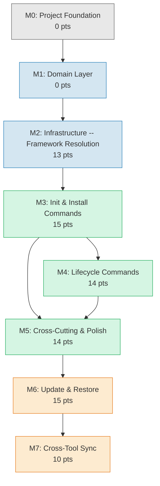

# AIDD CLI -- Implementation Milestones

> Ordered implementation plan for AIDD CLI v3.0 (MVP) and v3.1+.
> Derived from: architecture.md (8 ADRs, 4 layers), user_stories.md (25 stories, 81 pts), prd.md (10 features).
> Velocity: 20 pts/sprint -- Sprint: 2 weeks.

---

## Milestone Dependency Graph

**Critical path:** M0 -> M1 -> M2 -> M3 -> M4 -> M5 -> M6 -> M7

M1 and M2 can overlap partially (infrastructure adapters can start once domain ports are defined), but M3 strictly requires both M1 and M2 complete. M4 requires M3 because lifecycle commands operate on installed state.

---

## M0: Project Foundation

**Goal:** Establish the project skeleton, tooling, CI pipeline, and conventions so that all subsequent milestones can focus on feature code.

**Sprint:** 0 (pre-development)

**Points:** 0 (technical setup, not story-estimated)

### Key Deliverables

| Area                | Deliverable                                                                          |
| ------------------- | ------------------------------------------------------------------------------------ |
| Repository          | `package.json` with TypeScript 5.x, Node >= 20 ESM, pnpm >= 9                        |
| Build               | tsup config producing single ESM bundle with `bin` entry                             |
| Test                | vitest config with path aliases matching `src/` structure                            |
| Lint/Format         | biome config (lint + format)                                                         |
| CI                  | GitHub Actions: lint, type-check, test on push                                       |
| Directory structure | Scaffold `src/{domain,application,infrastructure,presentation}/` per architecture.md |
| Dependencies        | Install commander ^12 and @inquirer/prompts ^7 (ADR-002 budget)                      |
| Dev dependencies    | TypeScript, tsup, vitest, biome                                                      |
| Framework schema    | Framework descriptor schema (framework.json) fixture finalized                       |

### Acceptance Criteria

- [ ] `pnpm build` produces a working `dist/cli.js` entry point
- [ ] `pnpm test` runs vitest with zero tests passing (empty suite)
- [ ] `pnpm lint` runs biome check with zero violations
- [ ] CI pipeline green on empty project
- [ ] A smoke test imports `src/index.ts` and executes without error
- [ ] Directory structure matches architecture.md Directory Structure section (verified by automated check)
- [ ] ESM imports work end-to-end (`"type": "module"` in package.json)

---

## M1: Domain Layer

**Goal:** Implement all domain models, value objects, and port interfaces. This is the foundation of business logic with zero infrastructure imports.

**Sprint:** 1

**Points:** 0 (foundational modeling work; no user stories are allocated here -- stories that depend on these models are counted in M2 and M3 where the user-facing value is delivered)

### Key Deliverables

| Module                                  | Layer  | Type              | Behavior                                                                                                                       |
| --------------------------------------- | ------ | ----------------- | ------------------------------------------------------------------------------------------------------------------------------ |
| `domain/models/manifest.ts`             | Domain | Aggregate root    | `addTool`, `removeTool`, `computeStatus`, `hasTool`, `getToolVersion`                                                          |
| `domain/models/distribution.ts`         | Domain | Aggregate         | `generate(framework, toolSpec, docsDir): GeneratedFile[]`                                                                      |
| `domain/models/tool-id.ts`              | Domain | Enum              | `ToolId` enum: Claude, Cursor, Copilot                                                                                               |
| `domain/models/tool-spec.ts`            | Domain | Abstract class    | `rewriteContent`, `convertFrontmatter`, `buildFilePath`, `getConfigOutputPath`, `getMemoryBankOutputPath`                            |
| `domain/models/framework-descriptor.ts` | Domain | Value object      | Content section lookup, template/config references                                                                             |
| `domain/models/file-hash.ts`            | Domain | Value object      | `equals()` comparison                                                                                                          |
| `domain/models/status-report.ts`        | Domain | Value object      | Per-tool lists of modified/deleted/untracked files                                                                             |
| `domain/models/generated-file.ts`       | Domain | Value object      | Path + content + hash                                                                                                          |
| `domain/models/settings.ts`             | Domain | Value object      | Repo, docsDir, verbose with defaults                                                                                           |
| `domain/models/conflict-set.ts`         | Domain | Value object      | `classify`, `getConflicts`, `applyResolutions` (v3.1+ seam, tested now)                                                        |
| `domain/tool-specs/claude.ts`           | Domain | ToolSpec data     | Claude conventions: paths frontmatter, @path includes, .claude/ directory                                                      |
| `domain/tool-specs/cursor.ts`           | Domain | ToolSpec data     | Cursor conventions: globs/alwaysApply frontmatter, @path includes, .cursor/ directory                                          |
| `domain/tool-specs/copilot.ts`          | Domain | ToolSpec data     | Copilot conventions: applyTo frontmatter, markdown links, flattening                                                           |
| `domain/ports/*.ts`                     | Domain | Interfaces        | ManifestRepository, SettingsRepository, FileSystem, FrameworkLoader, FrameworkResolver, Hasher, Prompter, Logger               |
| Reverse methods (stubs)                 | Domain | ToolSpec methods  | `reverseRewriteContent` and `reverseConvertFrontmatter` with stub implementations and full test coverage (seam for M7 sync)    |

### Acceptance Criteria

- [ ] All domain models are testable with zero infrastructure imports
- [ ] `Distribution.generate()` produces correct file sets for Claude, Cursor, and Copilot given a mock FrameworkDescriptor
- [ ] `ToolSpec.rewriteContent()` handles placeholder replacement (`{{TOOLS}}/`, `{{DOCS}}/`, `@{{TOOLS}}/`, `@{{DOCS}}/`)
- [ ] `ToolSpec.convertFrontmatter()` converts between tool-specific formats (paths, globs/alwaysApply, applyTo)
- [ ] `ToolSpec.reverseRewriteContent()` and `ToolSpec.reverseConvertFrontmatter()` stubs exist and are tested (return canonical form or throw "not implemented" for non-trivial cases)
- [ ] Copilot `buildFilePath()` flattens commands and rules to single directory level; collision auto-prefix logic works
- [ ] `Manifest.computeStatus()` correctly classifies files as unmodified/modified/deleted/untracked
- [ ] `FileHash.equals()` works for value comparison
- [ ] All port interfaces are defined (compilation check, no implementation yet)
- [ ] Unit test coverage > 90% for domain layer
- [ ] Domain tests use the framework.json fixture finalized in M0

---

## M2: Infrastructure -- Framework Resolution

**Goal:** Implement all infrastructure adapters needed to resolve, download, extract, cache, and load a framework from any source.

**Sprint:** 1-2 (overlaps with M1 tail)

**Points:** 13

### User Stories

| ID     | Story                                             | Points |
| ------ | ------------------------------------------------- | ------ |
| US-001 | Download latest framework from remote             | 5      |
| US-002 | Use local framework source (directory or tarball) | 3      |
| US-003 | Cache downloaded frameworks                       | 3      |
| US-004 | Offline fallback to cached framework              | 2      |

### Key Deliverables

| Module                                                   | Layer          | Implements Port    | Technology                                                                |
| -------------------------------------------------------- | -------------- | ------------------ | ------------------------------------------------------------------------- |
| `infrastructure/http/http-client.ts`                     | Infrastructure | (internal)         | `node:https` with redirect following (ADR-005)                            |
| `infrastructure/tar/tar-extractor.ts`                    | Infrastructure | (internal)         | `node:child_process` + `tar xzf` (ADR-004)                                |
| `infrastructure/cache/framework-cache.ts`                | Infrastructure | (internal)         | `node:fs` + `os.tmpdir()` per-version cache with `.aidd-extracted` marker |
| `infrastructure/auth/token-resolver.ts`                  | Infrastructure | (internal)         | Flag > env > `gh auth token` (3s timeout)                                 |
| `infrastructure/adapters/framework-resolver-adapter.ts`  | Infrastructure | FrameworkResolver  | Composes HTTP + tar + cache + token resolver                              |
| `infrastructure/adapters/framework-loader-adapter.ts`    | Infrastructure | FrameworkLoader    | Parse `framework.json`, read content directories                          |
| `infrastructure/adapters/hasher-adapter.ts`              | Infrastructure | Hasher             | `node:crypto` MD5 (ADR-003)                                               |
| `infrastructure/adapters/file-system-adapter.ts`         | Infrastructure | FileSystem         | `node:fs/promises` read/write/delete/merge                                |
| `infrastructure/adapters/manifest-repository-adapter.ts` | Infrastructure | ManifestRepository | JSON read/write `.aidd/config.json` (ADR-007)                             |
| `infrastructure/adapters/settings-repository-adapter.ts` | Infrastructure | SettingsRepository | JSON read `.aidd/settings.json` with defaults (ADR-008)                   |
| `infrastructure/adapters/logger-adapter.ts`              | Infrastructure | Logger             | `process.stderr` verbose output                                           |
| `infrastructure/adapters/silent-prompter-adapter.ts`     | Infrastructure | Prompter           | Auto-accept (CI/tests/--force)                                            |

### Acceptance Criteria

- [ ] `FrameworkResolverAdapter.resolve()` downloads from GitHub Releases API, extracts tarball, detects single-directory nesting
- [ ] `FrameworkResolverAdapter.resolve()` loads from a local directory when `--framework` points to a directory
- [ ] `FrameworkResolverAdapter.resolve()` extracts a local tarball when `--framework` points to a .tar.gz
- [ ] Cache reuse: second resolve for same version skips download (marker + framework.json check)
- [ ] Cache corruption: missing marker or framework.json triggers re-download
- [ ] Offline fallback: network failure with existing cache falls back to latest cached version
- [ ] Offline failure: network failure with no cache produces clear error message
- [ ] Token resolution follows priority: `--token` > `AIDD_TOKEN` > `gh auth token` > none
- [ ] `gh auth token` timeout (3s) is handled gracefully
- [ ] `HasherAdapter` produces correct MD5 hex strings
- [ ] `FileSystemAdapter.mergeJsonFile()` deep merges JSON (for VS Code config)
- [ ] Integration tests with actual filesystem (temp directories)

---

## M3: Init & Install Commands

**Goal:** Wire domain and infrastructure through application use cases and expose them as CLI commands. Deliver the core value proposition: `aidd init` and `aidd install`.

**Sprint:** 2

**Points:** 15

### User Stories

| ID     | Story                                   | Points |
| ------ | --------------------------------------- | ------ |
| US-006 | Initialize docs structure               | 3      |
| US-007 | Custom docs directory name              | 2      |
| US-008 | Install framework for one or more tools | 8      |
| US-010 | Auto-initialize on install              | 2      |

### Key Deliverables

| Module                                      | Layer        | Responsibility                                                                                                                  |
| ------------------------------------------- | ------------ | ------------------------------------------------------------------------------------------------------------------------------- |
| `application/use-cases/init-use-case.ts`    | Application  | Resolve framework -> copy docs templates -> hash -> create manifest                                                             |
| `application/use-cases/install-use-case.ts` | Application  | Check manifest -> auto-init if missing -> resolve framework -> generate distribution per tool -> write files -> update manifest |
| `presentation/commands/init.ts`             | Presentation | Commander registration for `aidd init`, `--docs-dir` flag, dependency wiring                                                    |
| `presentation/commands/install.ts`          | Presentation | Commander registration for `aidd install <tools...>`, `--force`/`--framework`/`--repo`/`--token` flags                          |
| `presentation/presenter.ts`                 | Presentation | Output formatting for init and install results                                                                                  |
| `src/cli.ts`                                | Presentation | Commander program entry point with global options (`--verbose`)                                                                 |

### Acceptance Criteria

- [ ] `aidd init` creates `aidd_docs/` with templates and `.aidd/config.json` manifest
- [ ] `aidd init --docs-dir custom_dir` uses the custom name and persists it in the manifest
- [ ] `aidd init` on an existing docs directory fails with clear error
- [ ] `aidd install claude` generates all Claude-specific files with correct rewriting
- [ ] `aidd install claude cursor copilot` generates distributions for all three tools
- [ ] Content placeholders are rewritten per tool (verified by hash comparison against expected output)
- [ ] Frontmatter conversion works for all three tools
- [ ] Copilot flattening works with auto-prefix on collision (US-012 is covered here via US-008 scope)
- [ ] Copilot VS Code config merge preserves existing user content
- [ ] `aidd install` with no args fails with guidance message
- [ ] `aidd install invalid-tool` fails listing valid tools
- [ ] Auto-init: `aidd install claude` without prior init creates docs first
- [ ] `aidd install claude` on already-installed tool reports "already installed, use --force"
- [ ] `aidd install claude --force` regenerates all files
- [ ] All generated files are tracked in manifest with correct hashes
- [ ] E2E test: init -> install -> verify file content and manifest state

---

## M4: Lifecycle Commands

**Goal:** Deliver uninstall, status, clean, and doctor commands. These complete the MVP command set.

**Sprint:** 3

**Points:** 14

### User Stories

| ID     | Story                                  | Points |
| ------ | -------------------------------------- | ------ |
| US-013 | Uninstall a tool cleanly               | 3      |
| US-014 | View file drift status                 | 5      |
| US-016 | Clean all AIDD traces                  | 3      |
| US-017 | Run installation health check (doctor) | 3      |

### Key Deliverables

| Module                                        | Layer        | Responsibility                                                               |
| --------------------------------------------- | ------------ | ---------------------------------------------------------------------------- |
| `application/use-cases/uninstall-use-case.ts` | Application  | Load manifest -> delete tracked files -> clean empty dirs -> update manifest |
| `application/use-cases/status-use-case.ts`    | Application  | Load manifest -> read disk hashes -> computeStatus -> optional version check |
| `application/use-cases/clean-use-case.ts`     | Application  | Load manifest -> dry-run or delete all tracked files + manifest              |
| `application/use-cases/doctor-use-case.ts`    | Application  | Validate manifest -> check files -> detect orphans -> report                 |
| `presentation/commands/uninstall.ts`          | Presentation | Commander registration for `aidd uninstall <tools...>`                       |
| `presentation/commands/status.ts`             | Presentation | Commander registration for `aidd status`                                     |
| `presentation/commands/clean.ts`              | Presentation | Commander registration for `aidd clean`, `--force`                           |
| `presentation/commands/doctor.ts`             | Presentation | Commander registration for `aidd doctor`                                     |

### Acceptance Criteria

- [ ] `aidd uninstall claude` removes only Claude files, preserves other tools and docs
- [ ] `aidd uninstall claude cursor` removes both tools
- [ ] Uninstalling a non-installed tool fails with clear error
- [ ] Empty directories are cleaned after uninstall
- [ ] `aidd status` shows modified/deleted/untracked files per tool and docs
- [ ] `aidd status` with everything in sync reports "All files are in sync"
- [ ] `aidd status` with no manifest fails with guidance
- [ ] Version check in status: displays "Update available" when newer version exists, silent on network failure
- [ ] `aidd clean` without `--force` shows dry-run summary
- [ ] `aidd clean --force` removes all tracked files, docs, and `.aidd/` directory
- [ ] Clean preserves untracked user files in tool directories
- [ ] `aidd doctor` on healthy install reports "Installation is healthy"
- [ ] `aidd doctor` detects corrupted manifest, orphaned directories, hash mismatches
- [ ] `aidd doctor` with no manifest reports "not initialized"
- [ ] E2E test: init -> install -> modify files -> status -> uninstall -> clean

---

## M5: Cross-Cutting & Polish

**Goal:** Deliver the remaining MVP stories that are cross-cutting concerns (verbose mode, settings file, status filtering, force reinstall, custom repo, auth detection, Copilot-specific handling). Finalize the MVP.

**Sprint:** 3

**Points:** 14

### User Stories

| ID     | Story                                         | Points |
| ------ | --------------------------------------------- | ------ |
| US-005 | Auto-detect GitHub authentication token       | 2      |
| US-011 | Force reinstall a tool                        | 2      |
| US-012 | Copilot flattening and VS Code config merging | 3      |
| US-015 | Filter status by tool                         | 1      |
| US-018 | Verbose output for debugging                  | 2      |
| US-026 | Custom framework repository source            | 2      |
| US-027 | Project settings file                         | 2      |

### Key Deliverables

| Area             | Deliverable                                                                                                             |
| ---------------- | ----------------------------------------------------------------------------------------------------------------------- |
| Verbose mode     | `--verbose` global flag wired to LoggerAdapter across all commands (US-018)                                             |
| Settings         | `.aidd/settings.json` loading in presentation layer, resolution priority chain flag > env > settings > default (US-027) |
| Status filter    | `--tool` flag on `aidd status` (US-015)                                                                                 |
| Custom repo      | `--repo` flag and `AIDD_REPO` env var support (US-026)                                                                  |
| Auth polish      | Token resolution edge cases: `gh auth token` timeout, priority order, no-token graceful handling (US-005)               |
| Force reinstall  | `--force` flag full integration on install to regenerate all files (US-011)                                             |
| Copilot handling | Copilot-specific flattening, VS Code settings.json merge, name collision auto-prefix (US-012)                           |
| npm packaging    | `package.json` bin entry, README with usage, npm publish config                                                         |

### Acceptance Criteria

- [ ] `--verbose` on any command outputs diagnostics to stderr without polluting stdout
- [ ] `.aidd/settings.json` provides project defaults; CLI flags override settings
- [ ] Token key in settings file is ignored (security constraint)
- [ ] `aidd status --tool claude` shows only Claude drift
- [ ] `--repo` flag and `AIDD_REPO` override the default framework repository
- [ ] Invalid repo format is rejected with clear error
- [ ] `aidd install claude --force` regenerates all files even when already installed
- [ ] Copilot flattening applies auto-prefix on name collisions with warning
- [ ] Copilot VS Code config merge preserves user keys
- [ ] `npx aidd --help` shows all commands with descriptions
- [ ] `npx aidd --version` shows the CLI version
- [ ] MVP feature-complete: all 19 Must/Should MVP stories verified

---

## M6: Update & Restore (v3.1+)

**Goal:** Deliver framework update and file restore capabilities. These require the ConflictSet domain model (already built in M1) and interactive prompting via inquirer.

**Sprint:** 4

**Points:** 15

### User Stories

| ID     | Story                                       | Points |
| ------ | ------------------------------------------- | ------ |
| US-019 | Update distributions to latest framework    | 5      |
| US-020 | Handle local modifications during update    | 5      |
| US-021 | Restore specific files to framework version | 5      |

### Key Deliverables

| Module                                        | Layer          | Responsibility                                                                                                             |
| --------------------------------------------- | -------------- | -------------------------------------------------------------------------------------------------------------------------- |
| `application/use-cases/update-use-case.ts`    | Application    | Resolve latest framework -> generate new distributions -> build ConflictSet -> prompt or force -> write -> update manifest |
| `application/use-cases/restore-use-case.ts`   | Application    | Load manifest version -> resolve that version -> regenerate -> write -> update manifest                                    |
| `infrastructure/adapters/prompter-adapter.ts` | Infrastructure | `@inquirer/prompts` for interactive conflict resolution (confirm, select)                                                  |
| `presentation/commands/update.ts`             | Presentation   | Commander registration for `aidd update`, `--force` flag                                                                   |
| `presentation/commands/restore.ts`            | Presentation   | Commander registration for `aidd restore <tool> [--files <pattern>] [--force]`                                             |

### Acceptance Criteria

- [ ] `aidd update` downloads latest framework and applies diff to all installed tools
- [ ] Update detects user-modified files and prompts per-file resolution (keep/overwrite)
- [ ] `aidd update --force` overwrites all without prompting
- [ ] "Already up to date" when no new version available
- [ ] `aidd restore <tool> [--files <pattern>] [--force]` regenerates files from the pinned framework version (not latest)
- [ ] `aidd restore claude --force` restores all modified/deleted files
- [ ] Restoring a deleted file recreates it
- [ ] Pinned version unavailable: falls back to latest with warning
- [ ] "Nothing to restore" when all files are in sync
- [ ] Manifest updated with new hashes and versions after update/restore
- [ ] SilentPrompterAdapter used when `--force` is set (no interactive prompts in CI)

---

## M7: Cross-Tool Sync (v3.1+)

**Goal:** Deliver cross-tool synchronization. This is the differentiator for multi-tool users.

**Sprint:** 5

**Points:** 10

### User Stories

| ID     | Story                          | Points |
| ------ | ------------------------------ | ------ |
| US-023 | Propagate changes across tools | 5      |
| US-024 | Detect sync conflicts          | 3      |
| US-025 | Sync to a specific target tool | 2      |

### Key Deliverables

| Module                                   | Layer        | Responsibility                                                                                                               |
| ---------------------------------------- | ------------ | ---------------------------------------------------------------------------------------------------------------------------- |
| `application/use-cases/sync-use-case.ts` | Application  | Detect changes -> reverse rewrite to canonical -> forward rewrite to targets -> handle conflicts -> write -> update manifest |
| `presentation/commands/sync.ts`          | Presentation | Commander registration for `aidd sync`, `--source`, `--target`, `--force` flags                                              |

### Prerequisite: ToolSpec reverse operations

The `reverseRewriteContent` and `reverseConvertFrontmatter` methods on ToolSpec (stub implementations from M1) must be completed with full logic before sync can work. This is the spike identified in the user stories ("Reverse-rewrite feasibility", 2 days).

### Acceptance Criteria

- [ ] `aidd sync --source claude` propagates changes from Claude to all other installed tools
- [ ] Reverse rewrite (tool-specific -> canonical) is lossless for all content types
- [ ] Forward rewrite (canonical -> target tool) produces correct output
- [ ] Conflicts detected when target tool also has modifications; reported for resolution
- [ ] `--force` applies all changes including conflicts
- [ ] `--target cursor` limits propagation to a single tool
- [ ] Source = target is rejected with clear error
- [ ] Fewer than 2 installed tools is rejected with clear error
- [ ] Memory bank, MCP config, VS Code files, docs, and manifest are never propagated
- [ ] Identical content on target is skipped
- [ ] Manifest updated for both source and target tools

---

## Summary

| Milestone | Goal                       | Stories                                                | Points | Cumulative Pts | Sprint | Scope |
| --------- | -------------------------- | ------------------------------------------------------ | ------ | -------------- | ------ | ----- |
| **M0**    | Project foundation         | --                                                     | 0      | 0              | 0      | MVP   |
| **M1**    | Domain layer               | --                                                     | 0      | 0              | 1      | MVP   |
| **M2**    | Framework resolution infra | US-001, US-002, US-003, US-004                         | 13     | 13             | 1-2    | MVP   |
| **M3**    | Init & Install commands    | US-006, US-007, US-008, US-010                         | 15     | 28             | 2      | MVP   |
| **M4**    | Lifecycle commands         | US-013, US-014, US-016, US-017                         | 14     | 42             | 3      | MVP   |
| **M5**    | Cross-cutting & polish     | US-005, US-011, US-012, US-015, US-018, US-026, US-027 | 14     | 56             | 3      | MVP   |
| **M6**    | Update & Restore           | US-019, US-020, US-021                                 | 15     | 71             | 4      | v3.1+ |
| **M7**    | Cross-Tool Sync            | US-023, US-024, US-025                                 | 10     | 81             | 5      | v3.1+ |

### Story-to-Milestone Allocation

Every user story is assigned to exactly one milestone. No story appears in more than one milestone.

| Story     | Points | Milestone | Rationale                                           |
| --------- | ------ | --------- | --------------------------------------------------- |
| US-001    | 5      | M2        | Downloading frameworks is an infrastructure concern |
| US-002    | 3      | M2        | Local source resolution is infrastructure           |
| US-003    | 3      | M2        | Caching is infrastructure                           |
| US-004    | 2      | M2        | Offline fallback is infrastructure                  |
| US-005    | 2      | M5        | Auth token detection is cross-cutting polish        |
| US-006    | 3      | M3        | Init command wiring                                 |
| US-007    | 2      | M3        | Custom docs dir is part of init                     |
| US-008    | 8      | M3        | Install command is the core value delivery          |
| US-010    | 2      | M3        | Auto-init is part of install flow                   |
| US-011    | 2      | M5        | Force reinstall is polish on install                |
| US-012    | 3      | M5        | Copilot-specific handling is cross-cutting          |
| US-013    | 3      | M4        | Uninstall is a lifecycle command                    |
| US-014    | 5      | M4        | Status is a lifecycle command                       |
| US-015    | 1      | M5        | Status filtering is cross-cutting polish            |
| US-016    | 3      | M4        | Clean is a lifecycle command                        |
| US-017    | 3      | M4        | Doctor is a lifecycle command                       |
| US-018    | 2      | M5        | Verbose mode is cross-cutting                       |
| US-019    | 5      | M6        | Update command                                      |
| US-020    | 5      | M6        | Conflict handling during update                     |
| US-021    | 5      | M6        | Restore command                                     |
| US-023    | 5      | M7        | Cross-tool sync                                     |
| US-024    | 3      | M7        | Sync conflict detection                             |
| US-025    | 2      | M7        | Targeted sync                                       |
| US-026    | 2      | M5        | Custom repo is cross-cutting                        |
| US-027    | 2      | M5        | Settings file is cross-cutting                      |
| **Total** | **81** |           |                                                     |

### Sprint Planning View

| Sprint   | Milestones       | Points | Cumulative | Notes                                                                                                                                                                    |
| -------- | ---------------- | ------ | ---------- | ------------------------------------------------------------------------------------------------------------------------------------------------------------------------ |
| Sprint 0 | M0               | 0      | 0          | Pre-development setup                                                                                                                                                    |
| Sprint 1 | M1 + M2 (start)  | 13     | 13         | M1 has 0 story points but carries domain modeling effort. 5 spike days (GitHub tarball nesting, Copilot flattening, VS Code merge) reduce effective velocity to ~15 pts. |
| Sprint 2 | M2 (finish) + M3 | 15     | 28         | Remaining M2 work + full M3. Spike overlap from Sprint 1 may push some M2 into Sprint 2.                                                                                 |
| Sprint 3 | M4 + M5          | 28     | 56         | 28 points across two sprints of capacity (40 pts). Spike days (reverse-rewrite feasibility, 2 days) reduce effective capacity to ~36 pts. Comfortable fit.               |
| Sprint 4 | M6               | 15     | 71         |                                                                                                                                                                          |
| Sprint 5 | M7               | 10     | 81         | Reverse-rewrite spike (2 days) reduces effective capacity to ~16 pts.                                                                                                    |

MVP delivered at end of Sprint 3 (56 points). v3.1+ delivered at end of Sprint 5 (81 points total).

### Risk Factors

| Risk                                                               | Impact     | Mitigation                                                                 |
| ------------------------------------------------------------------ | ---------- | -------------------------------------------------------------------------- |
| GitHub tarball nesting varies across orgs                          | M2 blocked | Spike (1 day) in Sprint 1; fallback to manual nesting detection            |
| Copilot flattening name collisions are more complex than estimated | M3 delayed | Spike (1 day) in Sprint 1; auto-prefix is the conservative default         |
| VS Code settings.json merge conflicts                              | M3 delayed | Spike (1 day); deep merge with user-value preservation is the safe default |
| Reverse rewrite is lossy for some content                          | M7 blocked | Spike (2 days) before Sprint 5; fail fast if lossless is not achievable    |
| @inquirer/prompts API changes before v3.1+                         | M6 delayed | Prompter port abstracts; adapter swap is isolated                          |
