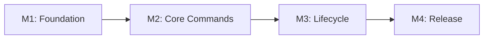

# AIDD CLI - v3.0.0

A command-line tool that generates AI coding assistant configurations from a single canonical framework. It resolves the framework source (remote, tarball, or local directory), generates tool-specific file distributions with content rewriting and frontmatter conversion, tracks every generated file in a hash-based manifest, and provides lifecycle commands (init, install, uninstall, status, clean, doctor) to manage installations non-destructively.

## 1. Executive Summary

### Problem

AI coding assistants each require tool-specific configuration files with different formats, directory structures, frontmatter syntax, and include conventions. The AIDD community maintains a proprietary framework of agents, commands, rules, skills, and templates. Distributing this framework to each tool today requires manual adaptation — translating content into different formats, maintaining separate directory structures, and risking inconsistencies that degrade AI assistant effectiveness. Framework updates compound the problem: applying them means manually checking each tool's files while avoiding overwrite of local customizations.

### Solution

AIDD CLI takes the canonical framework and generates tool-specific distributions in a single command. It resolves the framework from a remote GitHub release (default), a local tarball, or a local directory. Each generated file is tracked in a manifest with its hash, enabling change detection across the project lifecycle. The CLI provides six core commands for v3.0: init (docs setup), install (distribution generation), uninstall (tool removal), status (drift detection), clean (full removal), and doctor (diagnostics).

### Success Criteria

- 70% community adoption within 6 months (see constitution for checkpoints)
- Zero data loss incidents from CLI operations
- < 5 seconds for local operations (init, install, status, uninstall, clean, doctor)
- NPS > 40 on quarterly community survey

## 2. User Personas

### Primary Persona: Multi-Tool Developer

| Attribute                 | Description                                                                                                         |
| ------------------------- | ------------------------------------------------------------------------------------------------------------------- |
| **Role**                  | Developer in the AIDD paid community using 2+ AI coding assistants                                                  |
| **Goals**                 | Install and maintain consistent framework configurations across all AI tools with minimal effort                    |
| **Motivations**           | Eliminate repetitive manual config translation; get framework updates without losing customizations                 |
| **Frustrations**          | Config drift between tools causes inconsistent AI behavior; framework updates are dreaded because of overwrite risk |
| **Technical Environment** | Node.js >= 20, terminal-based workflow, multiple AI tools (e.g. Claude Code, Cursor, Copilot)                       |

### Secondary Persona: Single-Tool Developer

| Attribute        | Description                                                                                |
| ---------------- | ------------------------------------------------------------------------------------------ |
| **Role**         | Developer in the AIDD paid community using one AI coding assistant                         |
| **Goals**        | Install the community framework into their tool quickly and keep it up to date             |
| **Motivations**  | Access the community's curated agents, rules, and commands without manual setup            |
| **Frustrations** | Manual framework setup is error-prone; knowing which files to create and where to put them |

## 3. Goals & Objectives

### Business Goals

- BG1: Achieve 70% community adoption rate within 6 months of launch
- BG2: Reduce community support requests related to manual framework installation by 80%

### User Goals

- UG1: Install the framework for any supported tool in a single command
- UG2: Know at a glance whether local configurations have drifted from the installed framework version
- UG3: Remove a tool's configuration cleanly without affecting other tools or docs

## 4. Core Features

Group of identified features to build:

- **F1: Framework Resolution** — Resolve and load the canonical framework from remote, tarball, or local sources
- **F2: Init** — Set up the shared documentation structure
- **F3: Install** — Generate tool-specific distributions from the framework
- **F4: Uninstall** — Remove a single tool's distribution
- **F5: Status** — Show drift between disk and manifest
- **F6: Clean** — Remove all AIDD-managed files
- **F7: Doctor** — Check technical installation health (manifest integrity, orphaned directories, consistency)
- **F8: Update** *(v3.1+)* — Update installed distributions to latest framework version
- **F9: Restore** *(v3.1+)* — Restore modified files to their original framework version
- **F10: Sync** *(v3.1+)* — Propagate user changes from one tool to all others

### F1: Framework Resolution

- FR1.1: Resolve the framework source in priority order: remote tarball (default) > local tarball (--framework path.tar.gz) > local directory (--framework path/)
- FR1.2: For remote source, resolve the repository from --repo flag > AIDD_REPO env var > manifest stored value > default (ai-driven-dev/aidd-framework)
- FR1.3: For remote source, resolve the auth token from --token flag > AIDD_TOKEN env var > `gh auth token` output (3s timeout) > no token
- FR1.4: Call GitHub Releases API to get the latest version, download the release asset tarball, extract it
- FR1.5: Detect GitHub's single-directory nesting in tarballs and descend into the framework root
- FR1.6: Read and parse the framework descriptor (`framework.json`) to locate all content types
- FR1.7: Cache extracted frameworks per version in `{os.tmpdir()}/aidd-framework-cache/{version}/` with a `.aidd-extracted` marker file
- FR1.8: Reuse cache when marker file and `framework.json` both exist; re-download otherwise
- FR1.9: On network failure, fall back to the latest cached version if one exists; fail only if no cache is available

### F2: Init

- FR2.1: Create a docs directory (default: `aidd_docs`) with project documentation templates from the framework
- FR2.2: Create the manifest file (`.aidd/config.json`) tracking docs files with their hashes and the framework version used
- FR2.3: Support custom docs directory name via `--docs-dir` flag (only accepted by init, persisted in manifest)
- FR2.4: Fail with clear error if docs directory already exists

### F3: Install

- FR3.1: Accept one or more tool IDs as arguments (e.g. `aidd install claude cursor`)
- FR3.2: If no manifest exists, trigger init automatically before proceeding (uses default docs directory; for custom docs dir, user must run `aidd init --docs-dir <name>` first)
- FR3.3: For each tool, generate all tool-specific files: agents, commands, rules, skills, memory bank, MCP config, README
- FR3.4: Rewrite content placeholders ({{TOOLS}}/, {{DOCS}}/, @{{TOOLS}}/, @{{DOCS}}/) to tool-specific paths
- FR3.5: Convert frontmatter to tool-specific format (paths for Claude, globs/alwaysApply for Cursor, applyTo for Copilot)
- FR3.6: Apply tool-specific include syntax (@path for Claude/Cursor, markdown links for Copilot)
- FR3.7: Flatten commands and rules for Copilot; on name collision, auto-prefix with phase number (e.g. `04-implement.prompt.md`) and emit a warning
- FR3.8: For Copilot, merge into existing .vscode/settings.json and .vscode/extensions.json (deep merge, warn on conflicts)
- FR3.9: Write all generated files to disk and record their paths, hashes, and framework version in the manifest (version stored per tool entry)
- FR3.10: Skip already-installed tools by default; `--force` flag overwrites
- FR3.11: Reject invalid tool IDs with a clear error listing valid options

### F4: Uninstall

- FR4.1: Accept one or more tool IDs as arguments (e.g. `aidd uninstall claude cursor`)
- FR4.2: For each tool, delete all files tracked in the manifest
- FR4.3: Clean up empty directories left behind
- FR4.4: Update the manifest (remove tool entries)
- FR4.5: Never remove docs — only clean removes docs
- FR4.6: Fail with clear error if any specified tool is not installed or no manifest exists

### F5: Status

- FR5.1: Compare current file hashes on disk against manifest hashes
- FR5.2: Classify each tracked file as: unmodified, modified (hash differs), or deleted (missing from disk)
- FR5.3: Detect added/custom files (on disk in tool directories but not in manifest)
- FR5.4: Report per-tool and docs file lists grouped by category
- FR5.5: Display installed framework version per tool and for docs
- FR5.6: If everything matches, report that all files are in sync
- FR5.7: Fail with clear error if no manifest exists
- FR5.8: `--tool <tool>` flag filters the report to a specific tool (e.g. `aidd status --tool claude`)

### F6: Clean

- FR6.1: Display a summary of what will be removed (file count per tool, docs files, manifest)
- FR6.2: Require `--force` flag to proceed (no interactive confirmation in v3.0)
- FR6.3: Remove all tracked tool files, docs files, and the manifest directory
- FR6.4: Handle partial states gracefully (files already manually deleted)
- FR6.5: If no manifest exists, report that nothing needs cleaning

### F7: Doctor

- FR7.1: Validate that the manifest is present and well-formed (valid JSON, expected structure)
- FR7.2: Verify that all tracked files exist on disk
- FR7.3: Verify that file hashes match the manifest (detect corruption or unexpected changes)
- FR7.4: Check that tool directories are consistent with manifest entries
- FR7.5: Detect orphaned directories (tool directories exist on disk but tool not in manifest)
- FR7.6: Report a clear summary: healthy, or a list of issues found with suggested fixes
- FR7.7: If no manifest exists, report that AIDD is not initialized

### F8: Update *(v3.1+)*

- FR8.1: If no tool is specified, update all installed tools and docs
- FR8.2: For each tool, generate the new distribution from the updated framework and compute a diff (added, removed, changed, unchanged)
- FR8.3: Write new and changed files, delete removed files
- FR8.4: Detect user-modified files: list them and for each one, ask the user whether to keep their version or overwrite with the framework version
- FR8.5: `--force` mode overwrites all user-modified files without prompting
- FR8.6: Update the manifest with new hashes and versions

### F9: Restore *(v3.1+)*

- FR9.1: Compute current status to identify restorable files (modified + deleted)
- FR9.2: Accept file paths as arguments to restore specific files; `--force` restores all without prompting
- FR9.3: Download the same framework version that was used to install the tool (version stored in manifest), not latest
- FR9.4: Regenerate selected files from the framework source and write to disk
- FR9.5: Update the manifest with new hashes
- FR9.6: If no files need restoration, report that everything is already in sync
- FR9.7: If the specific version is no longer available remotely, fall back to latest and warn

### F10: Sync *(v3.1+)*

- FR10.1: Detect which tool has changes; require `--source <tool>` flag to specify source explicitly
- FR10.2: `--target <tool>` flag allows specifying a single target instead of all
- FR10.3: For each changed file: reverse-rewrite content to canonical format, then forward-rewrite to each target tool's format (including frontmatter conversion)
- FR10.4: Propagate file deletions
- FR10.5: Skip files where the target already has identical content
- FR10.6: Detect conflicts when target tool also has user modifications; report them for resolution
- FR10.7: `--force` applies all changes including conflicts without prompting
- FR10.8: Update the manifest with new hashes for all propagated files
- FR10.9: Memory bank files, MCP config, VS Code files, docs files, and manifest files are never propagated
- FR10.10: Fail with clear error if fewer than 2 tools are installed

## 5. Acceptance Criteria

### Feature 1: Framework Resolution

**Happy Path:**

```gherkin
Scenario: Remote framework download and caching
  Given no cached framework exists for the latest version
  And a valid auth token is available via gh auth token
  When the CLI resolves the framework source with no --framework flag
  Then it calls the GitHub Releases API with the auth token
  And downloads the release asset tarball
  And extracts it to the cache directory
  And writes a .aidd-extracted marker file
  And reads framework.json from the extracted root

Scenario: Cached framework reuse
  Given a cached framework exists for version 3.2.0 with marker file and framework.json
  When the CLI resolves the framework source for version 3.2.0
  Then it skips the download
  And loads directly from the cache directory

Scenario: Local directory framework
  Given --framework points to a directory containing framework.json
  When the CLI resolves the framework source
  Then it loads directly from that directory without downloading

Scenario: Local tarball framework
  Given --framework points to a .tar.gz file containing a framework
  When the CLI resolves the framework source
  Then it extracts the tarball to a temporary directory
  And detects the framework root inside it
  And loads from the extracted directory

Scenario: Custom repository via --repo flag
  Given --repo points to "my-org/my-framework"
  When the CLI resolves the framework source
  Then it calls the GitHub Releases API for my-org/my-framework
  And downloads the tarball from that repository

Scenario: Repository from AIDD_REPO env var
  Given AIDD_REPO is set to "my-org/my-framework"
  And no --repo flag is provided
  When the CLI resolves the framework source
  Then it uses my-org/my-framework as the repository
```

**Error Scenarios:**

```gherkin
Scenario: Authentication failure on private repository
  Given no auth token is available from any source
  When the CLI calls the GitHub Releases API for a private repository
  Then it fails with "Authentication failed. Run gh auth login to authenticate, or provide a token via --token or AIDD_TOKEN"

Scenario: Network failure with no cache
  Given the network is unreachable
  And no cached framework version exists
  When the CLI attempts to download the framework
  Then it fails with "Cannot reach the framework source. Check your network connection"

Scenario: Network failure with existing cache
  Given the network is unreachable
  And a cached framework version 3.1.0 exists with marker and framework.json
  When the CLI attempts to download the framework
  Then it falls back to the cached version 3.1.0
  And warns "Network unavailable. Using cached framework v3.1.0"

Scenario: Invalid tarball
  Given --framework points to a file that is not a valid .tar.gz
  When the CLI attempts to extract it
  Then it fails with "Downloaded file is not a valid tarball"

Scenario: Missing framework descriptor in archive
  Given the extracted archive contains no framework.json
  When the CLI attempts to load the framework
  Then it fails with "No framework descriptor found in the downloaded archive"

Scenario: Missing framework descriptor in local directory
  Given --framework points to a directory that exists but contains no framework.json
  When the CLI attempts to load the framework
  Then it fails with "No framework descriptor found in the specified directory"
```

**Edge Cases:**

- [ ] Cache directory exists but marker file is missing (interrupted extraction) — re-download
- [ ] Cache directory exists with marker but framework.json is missing (corrupted) — re-download
- [ ] GitHub tarball has single-directory nesting (org-repo-sha/) — descend automatically
- [ ] gh auth token command hangs — 3 second timeout, fall back to no token
- [ ] HTTP redirect during download — follow redirects

### Feature 2: Init

**Happy Path:**

```gherkin
Scenario: First-time initialization
  Given no aidd_docs directory exists
  And no .aidd directory exists
  When the user runs aidd init
  Then the CLI resolves the framework source
  And creates aidd_docs/ with documentation templates from the framework
  And creates .aidd/config.json tracking docs files with their hashes
  And reports success with list of created files

Scenario: Custom docs directory
  Given no my_docs directory exists
  When the user runs aidd init --docs-dir my_docs
  Then the CLI creates my_docs/ with documentation templates
  And the manifest stores "docsDir": "my_docs"
```

**Error Scenarios:**

```gherkin
Scenario: Docs directory already exists
  Given aidd_docs/ directory already exists
  When the user runs aidd init
  Then the CLI fails with a clear error indicating the directory already exists
  And no files are created or modified
```

**Edge Cases:**

- [ ] Custom docs dir name with special characters — validate and reject
- [ ] .aidd/ directory exists from a previous partial init without manifest — overwrite

### Feature 3: Install

**Happy Path:**

```gherkin
Scenario: Install a single tool
  Given the project is initialized with aidd_docs and manifest
  When the user runs aidd install claude
  Then the CLI generates all Claude-specific files (agents, commands, rules, skills, memory bank, MCP config)
  And all content placeholders are replaced with Claude-specific paths
  And frontmatter uses Claude format (paths: list)
  And include syntax uses @.claude/path format
  And all files are recorded in the manifest with correct hashes

Scenario: Install multiple tools
  Given the project is initialized
  When the user runs aidd install claude cursor copilot
  Then the CLI generates distributions for all three tools
  And each tool has its own directory structure and format
  And the manifest contains entries for all three tools

Scenario: Auto-init on install
  Given no manifest exists
  When the user runs aidd install claude
  Then the CLI runs init automatically first
  And reports "No installation found. Initializing docs first..."
  And then proceeds with tool installation

Scenario: Force reinstall
  Given claude is already installed
  When the user runs aidd install claude --force
  Then the CLI regenerates all Claude files
  And updates the manifest with new hashes
```

**Error Scenarios:**

```gherkin
Scenario: Invalid tool ID
  Given the project is initialized
  When the user runs aidd install invalid-tool
  Then the CLI fails with "Unknown tool: invalid-tool. Valid tools: claude, cursor, copilot"

Scenario: Tool already installed without force
  Given claude is already installed
  When the user runs aidd install claude
  Then the CLI skips installation and reports "claude is already installed. Use --force to reinstall."
```

**Edge Cases:**

- [ ] Copilot flattening causes name collision (two commands with same name in different phases) — auto-prefix with phase number and warn
- [ ] .vscode/settings.json already exists with user content — deep merge, preserve user values, warn on conflicts
- [ ] Framework contains a new content type not in framework.json — ignored, no error
- [ ] Tool directory already exists but tool is not in manifest — overwrite with warning

### Feature 4: Uninstall

**Happy Path:**

```gherkin
Scenario: Uninstall a single tool
  Given claude and cursor are installed
  When the user runs aidd uninstall claude
  Then all Claude-tracked files are deleted from disk
  And empty directories left behind are cleaned up
  And the manifest no longer contains a claude entry
  And cursor files and docs are untouched

Scenario: Uninstall multiple tools
  Given claude, cursor, and copilot are installed
  When the user runs aidd uninstall claude cursor
  Then all Claude and Cursor tracked files are deleted
  And the manifest only contains copilot
  And docs are untouched

Scenario: Uninstall last tool
  Given only claude is installed
  When the user runs aidd uninstall claude
  Then all Claude-tracked files are deleted
  And the manifest still exists (tracking docs)
  And aidd_docs directory is untouched
```

**Error Scenarios:**

```gherkin
Scenario: Uninstall non-installed tool
  Given only claude is installed
  When the user runs aidd uninstall cursor
  Then the CLI fails with "cursor is not installed"

Scenario: No manifest exists
  Given no .aidd directory exists
  When the user runs aidd uninstall claude
  Then the CLI fails with "No AIDD installation found. Run aidd init first."
```

**Edge Cases:**

- [ ] Some tracked files were already manually deleted — skip missing files, clean up the rest
- [ ] Tool directory contains untracked user files — leave them, only delete manifest-tracked files

### Feature 5: Status

**Happy Path:**

```gherkin
Scenario: All files in sync
  Given claude is installed and no files have been modified
  When the user runs aidd status
  Then the CLI reports "All files are in sync"
  And displays the installed framework version for claude and docs

Scenario: Detect drift
  Given claude is installed
  And the user has modified .claude/rules/01-standards/1-command-structure.md
  And the user has deleted .claude/agents/alexia.md
  And the user has created .claude/rules/custom-rule.md (not in manifest)
  When the user runs aidd status
  Then the CLI reports 1 modified file, 1 deleted file, and 1 added file for claude
```

**Error Scenarios:**

```gherkin
Scenario: No manifest
  Given no .aidd directory exists
  When the user runs aidd status
  Then the CLI fails with "No AIDD installation found. Run aidd init first."
```

**Edge Cases:**

- [ ] Docs files also modified — reported alongside tool files
- [ ] File content identical but different line endings — hash comparison catches this (platform-dependent behavior to document)

### Feature 6: Clean

**Happy Path:**

```gherkin
Scenario: Clean all installations
  Given claude and cursor are installed with docs
  When the user runs aidd clean --force
  Then all tracked tool files are deleted
  And all tracked docs files are deleted
  And the .aidd directory is removed
  And the project has no trace of AIDD installation

Scenario: Clean without force
  Given claude is installed
  When the user runs aidd clean
  Then the CLI displays a summary of what would be removed
  And fails with "Use --force to confirm removal"
```

**Error Scenarios:**

```gherkin
Scenario: Nothing to clean
  Given no .aidd directory exists
  When the user runs aidd clean
  Then the CLI reports "Nothing to clean. No AIDD installation found."
```

**Edge Cases:**

- [ ] Some files were already manually deleted — handle gracefully, skip missing
- [ ] User files exist in tool directories alongside tracked files — only delete tracked files

### Feature 5 (continued): Status --tool

**Happy Path:**

```gherkin
Scenario: Status filtered by tool
  Given claude and cursor are installed
  And the user has modified files in both tools
  When the user runs aidd status --tool claude
  Then the CLI reports only claude's modified/deleted/added files
  And does not show cursor or docs
```

**Edge Cases:**

- [ ] --tool with invalid tool name — error with valid tool list

### Feature 7: Doctor

**Happy Path:**

```gherkin
Scenario: Healthy installation
  Given claude is installed and all tracked files exist with matching hashes
  When the user runs aidd doctor
  Then the CLI reports "Installation is healthy"
  And lists the number of tracked files per tool and docs

Scenario: Detect issues
  Given claude is installed
  And .claude/agents/alexia.md has been corrupted (hash mismatch)
  And a .windsurf/ directory exists but windsurf is not in the manifest
  When the user runs aidd doctor
  Then the CLI reports 1 corrupted file and 1 orphaned directory
  And suggests actionable fixes for each issue
```

**Error Scenarios:**

```gherkin
Scenario: No manifest
  Given no .aidd directory exists
  When the user runs aidd doctor
  Then the CLI reports "AIDD is not initialized. Run aidd init to get started."
```

**Edge Cases:**

- [ ] Manifest file exists but is not valid JSON — report as corrupted manifest
- [ ] Tool directory exists but tool not in manifest — report as orphaned directory

### Feature 8: Update *(v3.1+)*

**Happy Path:**

```gherkin
Scenario: Update all tools to latest framework
  Given claude and cursor are installed at version 3.0.0
  And the latest framework version is 3.1.0
  When the user runs aidd update
  Then the CLI downloads framework 3.1.0
  And computes the diff for each tool (added, removed, changed, unchanged files)
  And writes new and changed files
  And deletes removed files
  And for each user-modified file, lists the file and asks the user whether to keep their version or overwrite with the framework version
  And updates the manifest with new hashes and version 3.1.0

Scenario: Already up to date
  Given claude is installed at version 3.1.0
  And the latest framework version is 3.1.0
  When the user runs aidd update
  Then the CLI reports "Already up to date (v3.1.0)"

Scenario: Force update overwrites all user modifications
  Given claude is installed and the user has modified a rule
  When the user runs aidd update --force
  Then the CLI overwrites all user-modified files without prompting
  And updates the manifest
```

**Error Scenarios:**

```gherkin
Scenario: No manifest
  Given no .aidd directory exists
  When the user runs aidd update
  Then the CLI fails with "No AIDD installation found. Run aidd init first."

Scenario: Tool not installed
  Given only claude is installed
  When the user runs aidd update cursor
  Then the CLI fails with "cursor is not installed"
```

**Edge Cases:**

- [ ] Docs also updated alongside tools
- [ ] Version mismatch between tools — warn but proceed
- [ ] User chooses "keep" for some files and "overwrite" for others — partial update applied correctly

### Feature 8: Restore *(v3.1+)*

**Happy Path:**

```gherkin
Scenario: Restore modified files
  Given claude is installed at version 3.0.0
  And the user has modified .claude/rules/01-standards/1-command-structure.md
  When the user runs aidd restore .claude/rules/01-standards/1-command-structure.md
  Then the CLI downloads framework version 3.0.0 (from manifest)
  And regenerates the file from the framework source
  And updates the manifest with the new hash

Scenario: Restore all with force
  Given claude is installed with 2 modified and 1 deleted file
  When the user runs aidd restore --force
  Then the CLI restores all 3 files to their framework version
  And updates the manifest

Scenario: Nothing to restore
  Given claude is installed and all files match the manifest
  When the user runs aidd restore
  Then the CLI reports "All files are in sync. Nothing to restore."
```

**Error Scenarios:**

```gherkin
Scenario: Specific version no longer available
  Given claude was installed from framework version 3.0.0
  And version 3.0.0 is no longer available remotely
  When the user runs aidd restore
  Then the CLI falls back to the latest version
  And warns "Version 3.0.0 is no longer available. Restoring from latest (3.1.0)."
```

**Edge Cases:**

- [ ] Restoring a deleted file recreates it in the correct location
- [ ] Partial restore (only specific files, not all)

### Feature 10: Sync *(v3.1+)*

**Happy Path:**

```gherkin
Scenario: Propagate changes from one tool to another
  Given claude and cursor are installed
  And the user has modified .claude/rules/01-standards/1-command-structure.md
  When the user runs aidd sync --source claude
  Then the CLI reverse-rewrites the modified file to canonical format
  And forward-rewrites it to Cursor format
  And writes the result to .cursor/rules/01-standards/1-command-structure.mdc
  And updates the manifest for both tools

Scenario: Propagate deletion
  Given claude and cursor are installed
  And the user has deleted .claude/agents/alexia.md
  When the user runs aidd sync --source claude
  Then the CLI deletes .cursor/agents/alexia.md
  And updates the manifest

Scenario: Skip identical content
  Given claude and cursor are installed
  And a file was modified in claude but the cursor version already has identical content
  When the user runs aidd sync --source claude
  Then the CLI skips that file for cursor
```

**Error Scenarios:**

```gherkin
Scenario: Fewer than 2 tools installed
  Given only claude is installed
  When the user runs aidd sync
  Then the CLI fails with "Sync requires at least 2 installed tools"

Scenario: Conflict detected
  Given claude and cursor are installed
  And the user has modified the same rule in both tools
  When the user runs aidd sync --source claude
  Then the CLI reports the conflict
  And does not overwrite the cursor version
  And lists the conflicting file for manual resolution
```

**Edge Cases:**

- [ ] Memory bank files, MCP config, docs, and manifest files are never propagated
- [ ] Frontmatter conversion between tools (paths to globs, globs to applyTo)
- [ ] --target flag limits propagation to a single tool
- [ ] --force applies all changes including conflicts

### Global: Verbose Mode (--verbose)

**Happy Path:**

```gherkin
Scenario: Verbose output during install
  Given the user runs aidd install claude --verbose
  When the CLI resolves the framework source
  Then it logs framework resolution details to stderr (source type, URL, cache status)
  And logs authentication method used (gh token, env var, flag, or none) without revealing token value
  And logs each file written with its path
  And logs manifest save operation
  And normal output goes to stdout

Scenario: Verbose output during status
  Given the user runs aidd status --verbose
  When the CLI compares disk files against the manifest
  Then it logs each file hash comparison to stderr
  And logs the hash algorithm used
  And normal status report goes to stdout
```

**Error Scenarios:**

```gherkin
Scenario: Verbose mode on error
  Given the user runs aidd install claude --verbose
  And the network is unreachable and no cache exists
  When the CLI fails to resolve the framework
  Then it logs the HTTP request attempt details to stderr (URL, method)
  And logs the error type (ECONNREFUSED, ETIMEDOUT)
  And the user-facing error message goes to stderr
```

**Edge Cases:**

- [ ] Without --verbose, no diagnostic output is emitted to stderr (only errors)
- [ ] Verbose output never contains auth token values

## 6. Non-Goals

| Non-Goal                                                  | Rationale                                                                |
| --------------------------------------------------------- | ------------------------------------------------------------------------ |
| Cross-tool propagation (sync)                             | Deferred to v3.1+; validate community demand first                       |
| Framework updates (update command)                        | Deferred to v3.1+; ship core lifecycle first                             |
| File restoration (restore command)                        | Deferred to v3.1+; depends on update workflow                            |
| Interactive prompts (tool selection, conflict resolution) | v3.0 uses explicit arguments only; simplifies implementation and testing |
| GUI or IDE plugins                                        | CLI is the interface; the community is CLI-proficient                    |
| Plugin system for custom tools                            | Extensible architecture is enough; no runtime plugin loading             |
| Version check in status                                   | Deferred; status works offline, version check requires network           |
| Support for tools beyond current set                      | Architecture supports it; implementations added on community request     |

## 7. Non-Functional Requirements

### Performance

- NFR1: All local operations (init, install, status, uninstall, clean) must complete in < 5 seconds for a standard framework (~100 files)
- NFR2: Remote framework download must complete in < 30 seconds on a standard connection
- NFR3: Cached framework resolution must add < 100ms overhead compared to local directory

### Security

- NFR4: Auth tokens are never written to disk, logged to stdout/stderr, or included in error messages
- NFR5: Token resolution from `gh auth token` has a 3-second timeout to prevent hanging
- NFR6: The CLI never makes network requests for local-only operations

### Usability

- NFR7: Every error message must include a clear action the user can take to resolve it
- NFR8: Verbose mode (--verbose) provides diagnostic output to stderr for debugging without polluting stdout
- NFR9: The CLI must work on macOS, Linux, and WSL (Windows Subsystem for Linux)

## 8. Technical Architecture

> Detailed technical decisions belong in `architecture.md`.

### Constraints

- Maximum 2 direct runtime dependencies (constitution constraint)
- Node.js >= 20 required (ESM, built-in modules)
- Clean Architecture: domain layer has zero infrastructure imports
- Framework descriptor drives all content discovery — no hardcoded framework paths

### Integration Points

- **External APIs**: GitHub Releases API (latest version resolution), GitHub release asset download (tarball)
- **External tools**: `gh` CLI (optional, for token auto-detection)
- **Data Sources**: Local filesystem (framework source, project files, manifest), OS temp directory (cache)

### High-Level Approach

Clean Architecture with DDD: domain objects own business behavior (manifest operations, distribution generation, content rewriting), application layer orchestrates use cases, infrastructure provides filesystem and HTTP adapters. Full details in `architecture.md`.

## 9. User Experience

### Information Architecture

```
aidd (CLI binary)
├── init          → creates aidd_docs/ + .aidd/config.json
├── install       → creates .claude/ | .cursor/ | .github/ + updates manifest
├── uninstall     → removes tool directory + updates manifest
├── status        → reads manifest + compares disk hashes
├── clean         → removes everything tracked + .aidd/
├── doctor        → validates manifest integrity, orphaned dirs, consistency
├── update (v3.1) → upgrades installed distributions to latest framework
├── restore (v3.1)→ restores modified/deleted files to framework version
└── sync (v3.1)   → propagates changes between installed tools
```

### Key User Flows

1. **First-time setup**: `aidd install claude` → auto-inits docs → downloads framework → generates Claude distribution → done
2. **Adding another tool**: `aidd install cursor` → downloads framework → generates Cursor distribution → done
3. **Checking drift**: `aidd status` → shows modified/deleted/added files per tool
4. **Removing a tool**: `aidd uninstall cursor` → deletes Cursor files → updates manifest → docs untouched
5. **Full cleanup**: `aidd clean --force` → removes all AIDD traces from project
6. **Health check**: `aidd doctor` → validates manifest integrity, detects corruption and orphans
7. **Framework upgrade** *(v3.1+)*: `aidd update` → downloads latest → applies diff → skips user-modified files
8. **File recovery** *(v3.1+)*: `aidd restore <file>` → regenerates from pinned framework version
9. **Cross-tool sync** *(v3.1+)*: `aidd sync --source claude` → rewrites changes to all other tools

### Design System

- **Visual**: Terminal output only — structured text with clear section headers, indentation for file lists, status indicators (checkmark, cross, warning)
- **Components**: Consistent output format: `[tool] action: path` for file operations, summary counts at end
- **Patterns**: Errors to stderr with actionable guidance, verbose diagnostics to stderr, normal output to stdout
- **Responsive**: N/A (CLI tool)

## 10. Success Metrics

### Business KPIs

| Metric                              | Current      | Target | Date    |
| ----------------------------------- | ------------ | ------ | ------- |
| Community adoption rate             | 0%           | 30%    | Month 3 |
| Community adoption rate             | 0%           | 70%    | Month 6 |
| Support requests for manual install | Baseline TBD | -80%   | Month 6 |

### Technical KPIs

| Metric                     | Current | Target       |
| -------------------------- | ------- | ------------ |
| Local operation time (p95) | N/A     | < 5 seconds  |
| Remote download time (p95) | N/A     | < 30 seconds |
| Data loss incidents        | N/A     | 0            |

### User KPIs

| Metric                               | How Measured                                | Target                                   |
| ------------------------------------ | ------------------------------------------- | ---------------------------------------- |
| NPS                                  | Quarterly community survey                  | > 40                                     |
| Issue resolution time                | GitHub issue tracker                        | < 48h average                            |
| Installs on latest framework version | GitHub Packages download counts per version | > 80% of new installs use latest version |

## 11. Dependencies

### Technical Dependencies

| Dependency                                  | Owner           | Status    | Risk                                         |
| ------------------------------------------- | --------------- | --------- | -------------------------------------------- |
| Framework descriptor (framework.json)       | Framework team  | To create | High — CLI cannot parse framework without it |
| Framework release pipeline (tarball assets) | Framework team  | Existing  | Low — already publishes tarballs             |
| GitHub Packages registry access             | Community admin | Existing  | Low — community members already have tokens  |

### External Dependencies

| Dependency               | Provider | Status    | Fallback                            |
| ------------------------ | -------- | --------- | ----------------------------------- |
| GitHub Releases API      | GitHub   | Available | --framework flag with local source  |
| GitHub release asset CDN | GitHub   | Available | --framework flag with local tarball |
| gh CLI (optional)        | GitHub   | Available | --token flag or AIDD_TOKEN env var  |

## 12. Experiments / A/B Testing

| Hypothesis                                                     | Experiment                                     | Metric                           | Success Criteria          |
| -------------------------------------------------------------- | ---------------------------------------------- | -------------------------------- | ------------------------- |
| Single-command install increases adoption vs. multi-step setup | Compare adoption rate before/after CLI launch  | Community adoption rate          | > 30% adoption at month 3 |
| Hash-based status detection catches real drift issues          | Track status command usage and issues reported | % of users running status weekly | > 50% of active users     |

### Experiment Plan

- **Phase 1**: 100% of community — v3.0 launch with core commands
- **Phase 2**: Gather feedback via NPS survey and GitHub issues for 3 months
- **Full rollout criteria**: Proceed to v3.1 (sync, update, restore) only if adoption > 30% and community feedback confirms demand for advanced features

## 13. Timeline & Milestones

| Milestone         | Objective                                  | Deliverable                                                             | Target Date | Go/No-Go Criteria                                          |
| ----------------- | ------------------------------------------ | ----------------------------------------------------------------------- | ----------- | ---------------------------------------------------------- |
| M1: Foundation    | Framework resolution and manifest tracking | Framework loader, descriptor parser, manifest CRUD, hash computation    | TBD         | All infrastructure integration tests pass                  |
| M2: Core Commands | Init and install working end-to-end        | aidd init, aidd install with full distribution generation for all tools | TBD         | E2E tests pass for all supported tools                     |
| M3: Lifecycle     | Complete v3.0 command set                  | aidd uninstall, aidd status, aidd clean, aidd doctor                    | TBD         | Full E2E test suite passes, snapshot tests match           |
| M4: Release       | Community launch                           | Published package, documentation, community announcement                | TBD         | pnpm validate passes, manual smoke test on 3 real projects |

### Critical Path



## 14. Risks & Mitigations

| Risk                                            | Probability | Impact | Mitigation Plan                                                                                                     | Owner                 |
| ----------------------------------------------- | ----------- | ------ | ------------------------------------------------------------------------------------------------------------------- | --------------------- |
| Tool vendors change config format               | Medium      | High   | Decision Rule #2: treat as highest-priority bug. Architecture decouples tool specs from core logic.                 | Team                  |
| Framework descriptor not ready for CLI launch   | High        | High   | Define minimal descriptor schema with framework team immediately. CLI can launch with hardcoded fallback if needed. | Team + Framework team |
| Node.js not installed by community members      | Low         | Medium | Validate Node.js prevalence pre-launch. Consider standalone binary distribution (pkg, sea) as fallback.             | Team                  |
| Initial tool set does not cover community needs | Medium      | High   | Pre-launch survey on tool usage (H8). Add tools reactively — architecture supports it without core changes.         | Team                  |
| GitHub API rate limiting                        | Low         | Low    | Authenticated requests get 5000/hour. Cache prevents repeated downloads.                                            | Team                  |
| Copilot flattening causes name collisions       | Medium      | Low    | Auto-prefix with phase number on collision, emit warning. Deterministic, no user intervention.                      | Team                  |

### Contingency Plans

- **If framework.json is not ready**: Ship with a hardcoded descriptor matching the current framework structure; migrate to framework.json when available
- **If adoption is below 15% at month 3**: Trigger community feedback sprint (per constitution)
- **If a tool vendor makes breaking changes**: Hotfix release with updated tool spec; existing installations continue working (manifest tracks state)

## 15. Scope Boundaries (3 Tiers)

### Tier 1 — MVP (Must Have)

| Feature                                                 | Rationale                                                              |
| ------------------------------------------------------- | ---------------------------------------------------------------------- |
| Framework resolution (remote, tarball, local)           | Users will not download the framework manually; remote must be default |
| Init (docs setup + manifest creation)                   | Foundation for all other commands                                      |
| Install (multi-tool distribution generation)            | Core value proposition — the reason this product exists                |
| Uninstall (single tool removal)                         | Users must be able to cleanly remove a tool without affecting others   |
| Status (drift detection)                                | Users need to know when files have drifted from the framework          |
| Clean (full removal)                                    | Users must be able to fully remove AIDD from a project                 |
| Doctor (installation health check)                      | Users need to diagnose corrupted manifests, orphaned directories, and inconsistencies |
| Manifest tracking with hash-based change detection      | Non-destructive operations depend on knowing what changed              |
| Content rewriting (placeholders, includes, frontmatter) | Each tool needs its own format — this is the core transformation       |
| Verbose mode (--verbose)                                | Debugging framework resolution and file operations                     |
| Framework caching                                       | Avoids redundant downloads across commands in the same session         |

### Tier 2 — Next Release (Should/Could Have)

| Feature                            | Rationale                                           | Promotion Trigger                                |
| ---------------------------------- | --------------------------------------------------- | ------------------------------------------------ |
| Update (framework version upgrade) | Users need to stay current                          | Adoption > 30%, community requests               |
| Restore (file restoration)         | Users who accidentally modify files need recovery   | Update command is shipped                        |
| Sync (cross-tool propagation)      | Multi-tool users need changes to flow between tools | Community feedback confirms demand               |
| Version check in status            | Show available updates                              | Update command is shipped                        |
| Interactive tool selection         | Better UX for new users                             | Adoption data shows confusion with explicit args |

### Tier 3 — Never (Won't Have)

| Feature                                        | Rationale                                                                               |
| ---------------------------------------------- | --------------------------------------------------------------------------------------- |
| Plugin system for custom tools                 | Architecture is extensible via code; runtime plugins add complexity without clear value |
| Configuration GUI or web interface             | Target users are CLI-proficient developers; a GUI adds maintenance burden               |
| IDE-specific plugins (VS Code extension, etc.) | The CLI is the interface; IDE integration is out of scope                               |
| Automatic background sync                      | Too risky for a tool that writes to the filesystem; explicit user action required       |
| Framework content editing                      | The CLI distributes content, it does not author it                                      |

## 16. Assumptions

| ID  | Assumption                                                                                        | Impact if wrong                                                                    | Validation method                          |
| --- | ------------------------------------------------------------------------------------------------- | ---------------------------------------------------------------------------------- | ------------------------------------------ |
| A1  | Community members have Node.js >= 20 installed                                                    | CLI cannot be installed; need alternative distribution (binary)                    | Pre-launch survey                          |
| A2  | The GitHub Releases API and release assets are the correct distribution channel for the framework | Framework loading pipeline needs redesign                                          | Confirm with framework team                |
| A3  | 3 initial tools cover > 80% of community usage                                                    | v3.0 value proposition weakens; need to add tools before launch                    | Pre-launch tool usage survey (H8)          |
| A4  | Hash-based (MD5) change detection is sufficient; content-level diffing is not needed for v3.0     | Users encounter false conflicts or missed changes                                  | Monitor post-launch issues (H5)            |
| A5  | The framework team will create framework.json before CLI launch                                   | CLI cannot parse framework structure dynamically; fallback to hardcoded descriptor | Coordinate with framework team             |
| A6  | `tar xzf` is available on all target platforms (macOS, Linux, WSL)                                | Tarball extraction fails; need Node.js-based extraction                            | Validate on CI across platforms            |
| A7  | The framework structure is stable enough that the descriptor approach works                       | Frequent descriptor changes negate the decoupling benefit                          | Track framework changes over 6 months (H6) |

---

## Appendix

### Glossary

- **Framework**: The canonical source of agents, commands, rules, skills, and templates maintained by the AIDD community
- **Distribution**: A tool-specific set of files generated from the framework, with correct paths, formats, and syntax
- **Manifest**: The `.aidd/config.json` file tracking all installed files, their hashes, and versions
- **Tool spec**: The configuration describing a tool's directory structure, file extensions, frontmatter format, and include syntax
- **Content rewriting**: The process of replacing canonical placeholders ({{TOOLS}}/, {{DOCS}}/) with tool-specific paths
- **Framework descriptor**: The `framework.json` file at the framework root describing its internal structure

### References

- Constitution: `aidd_docs/memory/internal/constitution.md`
- Product Brief: `aidd_docs/memory/internal/product_brief.md`
- Detailed Specification: `NEEDS.md`

### Open Questions

- [ ] Exact framework.json schema to be finalized with framework team
- [ ] .vscode deep merge strategy for array values (append vs deduplicate)

### Resolved Questions

- Copilot flattening collision: auto-prefix with phase number (e.g. `04-implement.prompt.md`), emit warning

---

**Team**: Community team (ship fast, improve iteratively)
**Timeline**: TBD (milestone-driven, not date-driven)
**Priority**: Critical
**Status**: Draft
