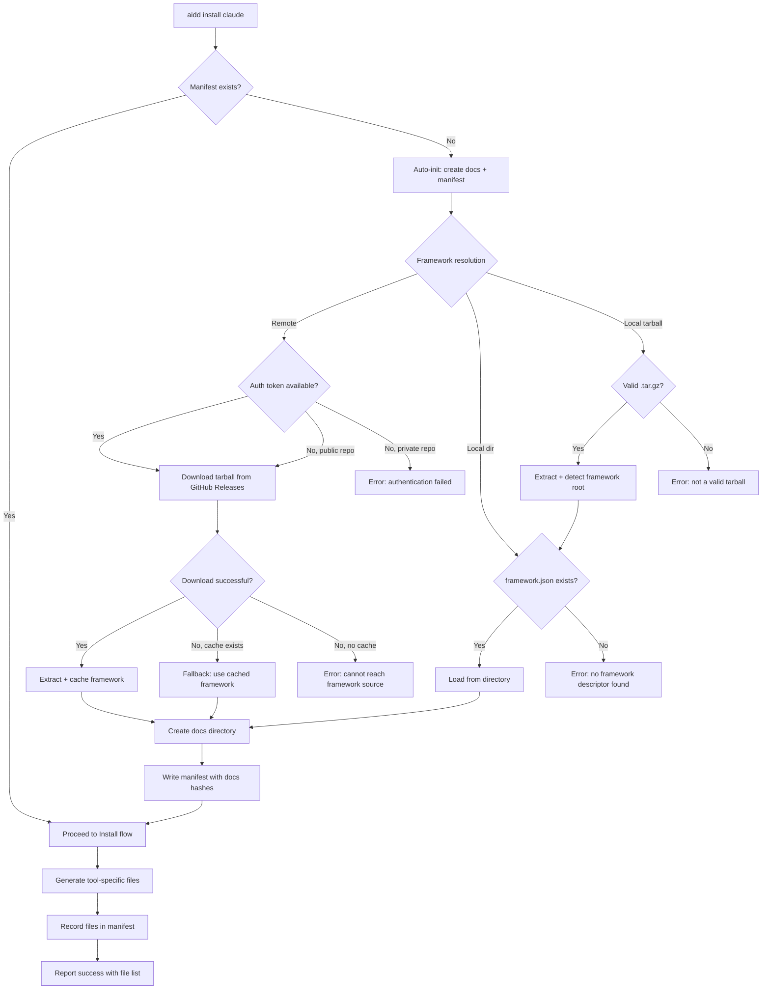
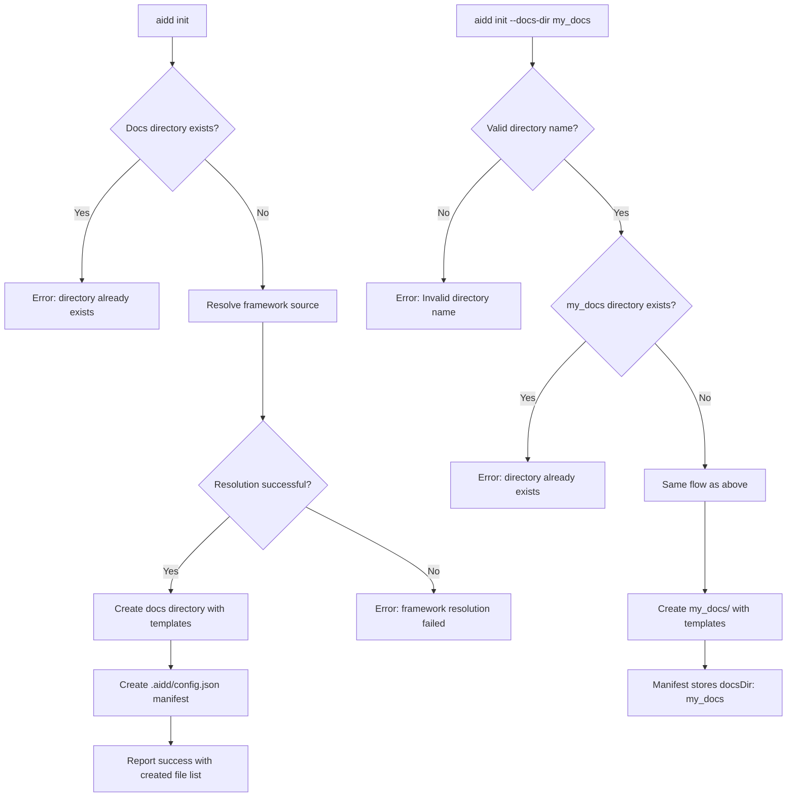
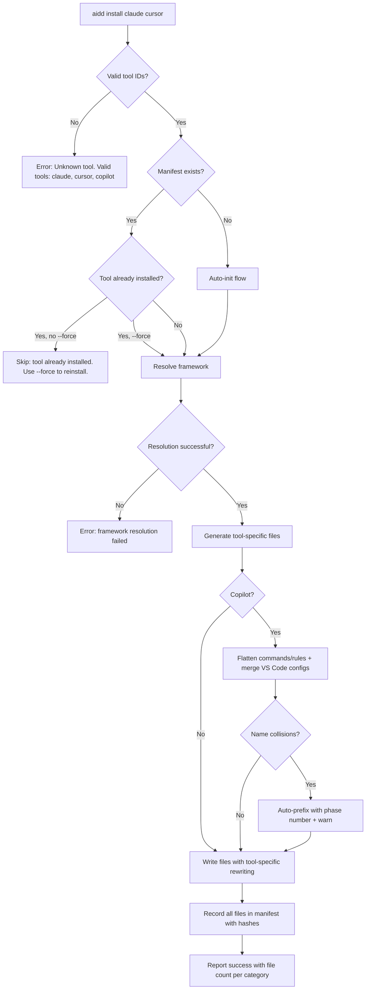
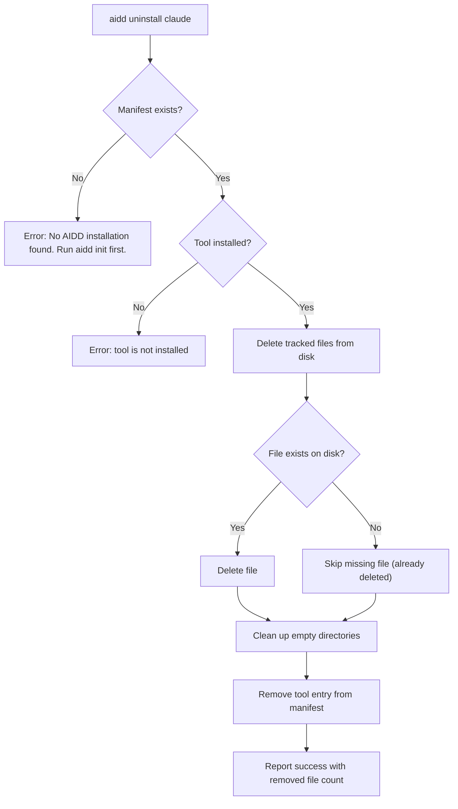
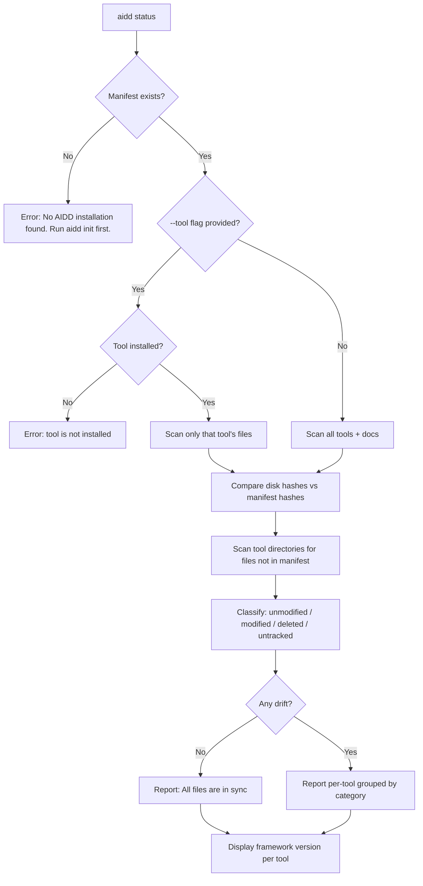
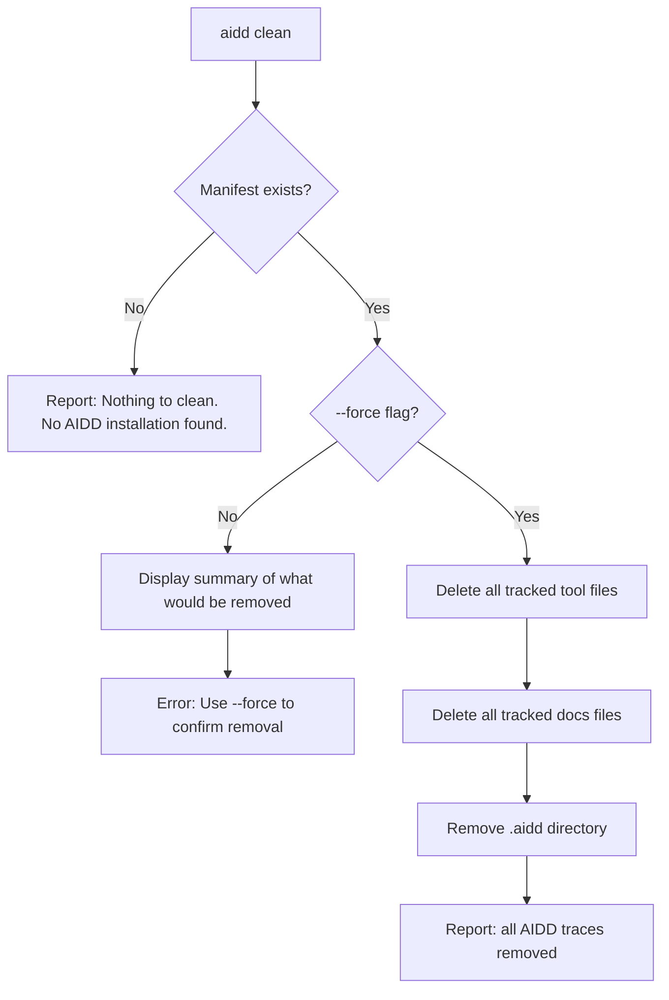
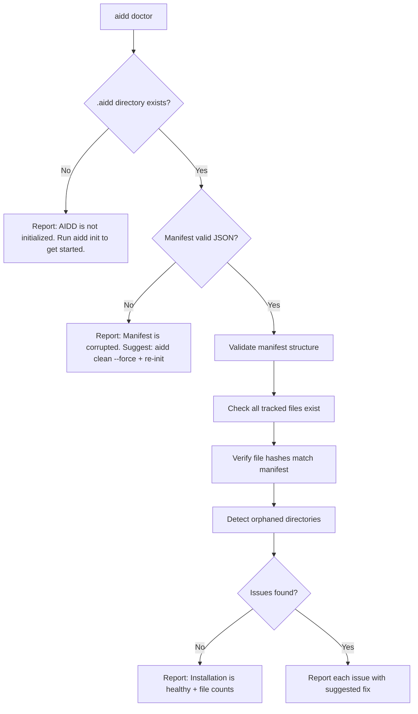
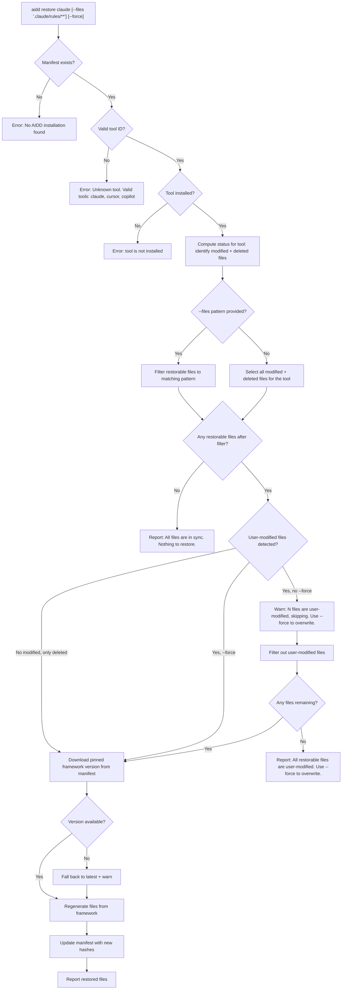
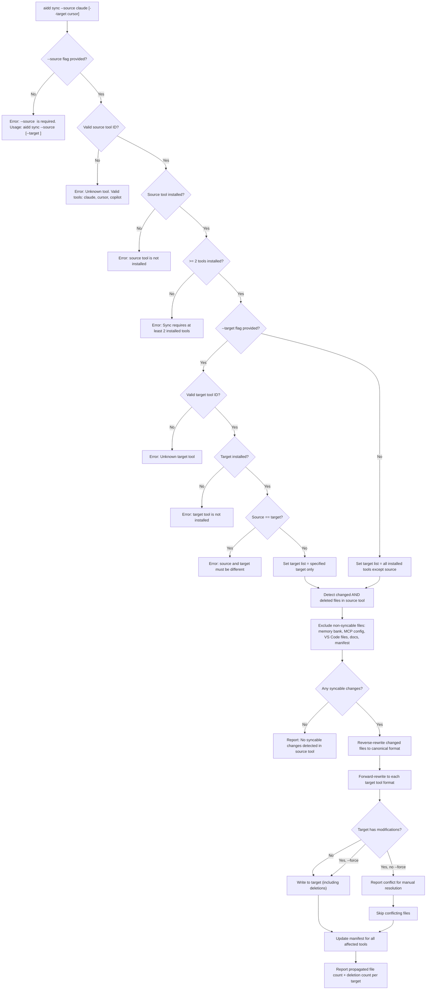

# User Flows - AIDD CLI

## Scope

**This document owns**: flow diagrams, state transition tables, recovery paths, entry/exit points for every CLI user journey.

**Out of scope** (reference only):

- Exact user-facing text (error messages, success messages) -> See `ux_copy.md`
- Visual output formatting -> Implementation concern (terminal rendering)

---

## 1. Flow Inventory

| Flow             | Entry point                         | Exit point                                     | Complexity |
| ---------------- | ----------------------------------- | ---------------------------------------------- | ---------- |
| First-time setup | `aidd install <tool>` (no manifest) | Distribution generated + manifest created      | High       |
| Init             | `aidd init`                         | Docs directory + manifest created              | Medium     |
| Install          | `aidd install <tool...>`            | Tool distribution generated + manifest updated | High       |
| Uninstall        | `aidd uninstall <tool...>`          | Tool files removed + manifest updated          | Medium     |
| Status           | `aidd status`                       | Drift report displayed                         | Low        |
| Clean            | `aidd clean --force`                | All AIDD traces removed                        | Medium     |
| Doctor           | `aidd doctor`                       | Health report displayed                        | Medium     |
| Update (v3.1+)   | `aidd update [tool...]`             | Distributions upgraded to latest framework     | High       |
| Restore (v3.1+)  | `aidd restore <tool> [--files <pattern>] [--force]` | Modified files restored to framework version   | Medium     |
| Sync (v3.1+)     | `aidd sync --source <tool> [--target <tool>]`       | Changes propagated across tools                | High       |

---

## 2. Flow Details

### 2.1 First-Time Setup (auto-init + install)

This is the most common entry point for new users. Running `aidd install <tool>` when no manifest exists triggers the full onboarding flow.



### State Table

| Step                 | Happy path                       | Error                                        | Empty/No data                  | Offline                    | First-time                             |
| -------------------- | -------------------------------- | -------------------------------------------- | ------------------------------ | -------------------------- | -------------------------------------- |
| Manifest check       | Proceed to install               | --                                           | No manifest: trigger auto-init | Same behavior              | Auto-init triggered                    |
| Framework resolution | Download + cache                 | Auth failure, invalid tarball, no descriptor | --                             | Fall back to cache or fail | Same as happy path                     |
| Docs creation        | Directory created with templates | Directory already exists: error              | --                             | Works (local operation)    | First docs directory created           |
| File generation      | All files written                | Write permission error                       | --                             | Works (local operation)    | First tool files created               |
| Manifest update      | Hashes recorded                  | Disk write failure                           | --                             | Works (local operation)    | Manifest created with first tool entry |

### Recovery Paths

| Error                         | Recovery action                                                  | Destination                     |
| ----------------------------- | ---------------------------------------------------------------- | ------------------------------- |
| Auth failure on private repo  | Run `gh auth login`, or provide `--token` or `AIDD_TOKEN`        | Retry same command              |
| Network failure, no cache     | Check network connection, or use `--framework` with local source | Retry same command              |
| Network failure, cache exists | Automatic fallback to cached version (warning displayed)         | Continues with cached framework |
| Invalid tarball               | Re-download or provide a valid `.tar.gz`                         | Retry same command              |
| No framework.json             | Verify framework source contains descriptor                      | Fix source and retry            |
| Docs directory already exists | Use a different docs dir name or remove existing                 | `aidd init --docs-dir <name>`   |

---

### 2.2 Init

Explicit initialization of the docs structure. Most users reach this only if they need a custom docs directory name.



### State Table

| Step                 | Happy path                        | Error                               | Empty/No data | Offline                 | First-time         |
| -------------------- | --------------------------------- | ----------------------------------- | ------------- | ----------------------- | ------------------ |
| Directory check      | Directory does not exist, proceed | Directory exists: fail with message | --            | Same behavior           | Expected state     |
| Framework resolution | Source resolved                   | Auth/network/tarball errors         | --            | Cache fallback or fail  | Same as happy path |
| Docs creation        | Templates written from framework  | Write permission error              | --            | Works (local operation) | Standard path      |
| Manifest creation    | config.json created               | Disk write failure                  | --            | Works (local operation) | Standard path      |

### Recovery Paths

| Error                                 | Recovery action                                   | Destination   |
| ------------------------------------- | ------------------------------------------------- | ------------- |
| Docs directory exists                 | Remove it or use `--docs-dir` with different name | Retry command |
| Invalid docs dir name (special chars) | Use alphanumeric name with hyphens/underscores    | Retry command |
| `--docs-dir` used on non-init command | Run `aidd init --docs-dir <name>` first           | `aidd init`   |

---

### 2.3 Install

Generates tool-specific distributions from the canonical framework.



### State Table

| Step                    | Happy path                 | Error                                 | Empty/No data                    | Offline                | First-time                   |
| ----------------------- | -------------------------- | ------------------------------------- | -------------------------------- | ---------------------- | ---------------------------- |
| Tool ID validation      | Valid IDs accepted         | Invalid ID: error with valid list     | No args: error requiring tool ID | Same behavior          | Same behavior                |
| Manifest check          | Exists, proceed            | --                                    | No manifest: auto-init           | Same behavior          | Auto-init triggered          |
| Already installed check | Not installed, proceed     | --                                    | --                               | Same behavior          | Never installed (first time) |
| Framework resolution    | Source resolved + cached   | Auth/network/tarball errors           | --                               | Cache fallback or fail | Download + cache             |
| File generation         | All files written per tool | Write permission errors               | --                               | Works (local)          | First files created          |
| Copilot flattening      | No collisions              | Name collision: auto-prefix + warning | --                               | Works (local)          | Same behavior                |
| VS Code merge           | No conflicts               | Conflicting keys: warning             | No existing file: create fresh   | Works (local)          | File created new             |
| Manifest update         | Hashes recorded            | Disk write failure                    | --                               | Works (local)          | First tool entry             |

### Recovery Paths

| Error                       | Recovery action                         | Destination           |
| --------------------------- | --------------------------------------- | --------------------- |
| Unknown tool ID             | Check valid tools list in error message | Retry with valid tool |
| No arguments                | Provide at least one tool ID            | Retry with tool ID    |
| Tool already installed      | Use `--force` to reinstall              | Retry with `--force`  |
| Framework resolution failed | See first-time setup recovery paths     | Fix source and retry  |

---

### 2.4 Uninstall

Removes a tool's distribution while preserving docs and other tools.



### State Table

| Step                 | Happy path         | Error                                 | Empty/No data | Offline       | First-time                      |
| -------------------- | ------------------ | ------------------------------------- | ------------- | ------------- | ------------------------------- |
| Manifest check       | Exists, proceed    | No manifest: error with guidance      | --            | Works (local) | Unlikely (nothing to uninstall) |
| Tool installed check | Tool in manifest   | Tool not in manifest: error           | --            | Works (local) | Unlikely                        |
| File deletion        | Files deleted      | Some already missing: skip gracefully | --            | Works (local) | --                              |
| Directory cleanup    | Empty dirs removed | Dirs with untracked files: preserved  | --            | Works (local) | --                              |
| Manifest update      | Tool entry removed | Disk write failure                    | --            | Works (local) | --                              |

### Recovery Paths

| Error              | Recovery action                         | Destination   |
| ------------------ | --------------------------------------- | ------------- |
| No manifest        | Run `aidd init` first                   | `aidd init`   |
| Tool not installed | Check installed tools via `aidd status` | `aidd status` |

---

### 2.5 Status

Shows drift between disk state and manifest.



### State Table

| Step            | Happy path                   | Error                             | Empty/No data                | Offline       | First-time                  |
| --------------- | ---------------------------- | --------------------------------- | ---------------------------- | ------------- | --------------------------- |
| Manifest check  | Exists, proceed              | No manifest: error with guidance  | --                           | Works (local) | Unlikely (nothing to check) |
| Tool filter       | Valid tool, filter applied    | Invalid/non-installed tool: error | --                           | Works (local) | --                          |
| Hash comparison   | All files scanned             | Read permission errors            | --                           | Works (local) | Likely all in sync          |
| Untracked scan    | Untracked files detected      | --                                | No untracked files           | Works (local) | No untracked files          |
| Drift report      | Grouped by tool, categorized  | --                                | All in sync: success message | Works (local) | "All files are in sync"     |

### Recovery Paths

| Error                              | Recovery action       | Destination               |
| ---------------------------------- | --------------------- | ------------------------- |
| No manifest                        | Run `aidd init` first | `aidd init`               |
| Tool not installed (--tool filter) | Check available tools | `aidd status` (no filter) |

---

### 2.6 Clean

Removes all AIDD-managed files from the project.



### State Table

| Step              | Happy path                | Error                                  | Empty/No data                   | Offline       | First-time |
| ----------------- | ------------------------- | -------------------------------------- | ------------------------------- | ------------- | ---------- |
| Manifest check    | Exists, proceed           | --                                     | No manifest: "nothing to clean" | Works (local) | Unlikely   |
| Force check       | --force provided          | No --force: dry-run summary + error    | --                              | Works (local) | --         |
| File deletion     | All tracked files removed | Some already missing: skip gracefully  | --                              | Works (local) | --         |
| Docs dir cleanup  | Tracked docs files removed | --                                    | Untracked files in aidd_docs/ are preserved (only manifest-tracked files removed) | Works (local) | --         |
| Directory removal | .aidd removed             | Untracked files preserved in tool dirs | --                              | Works (local) | --         |

### Recovery Paths

| Error                | Recovery action                                | Destination          |
| -------------------- | ---------------------------------------------- | -------------------- |
| No --force           | Add `--force` flag to confirm                  | `aidd clean --force` |
| Accidentally cleaned | Re-initialize: `aidd init` then `aidd install` | Fresh setup          |

---

### 2.7 Doctor

Validates installation health and detects inconsistencies.



### State Table

| Step                 | Happy path        | Error                                     | Empty/No data                     | Offline       | First-time  |
| -------------------- | ----------------- | ----------------------------------------- | --------------------------------- | ------------- | ----------- |
| Directory check      | .aidd exists      | --                                        | Not initialized: guidance message | Works (local) | Unlikely    |
| Manifest parsing     | Valid JSON        | Invalid JSON: corrupted manifest report   | --                                | Works (local) | --          |
| File existence check | All files present | Missing files: listed as issues           | --                                | Works (local) | All present |
| Hash verification    | All hashes match  | Mismatches: listed as issues              | --                                | Works (local) | All match   |
| Orphan detection     | No orphans        | Orphaned dirs: listed with fix suggestion | --                                | Works (local) | No orphans  |

### Recovery Paths

| Error                | Recovery action                                                      | Destination             |
| -------------------- | -------------------------------------------------------------------- | ----------------------- |
| Not initialized      | Run `aidd init`                                                      | `aidd init`             |
| Corrupted manifest   | Run `aidd clean --force` then re-init                                | `aidd clean --force`    |
| Missing files        | Run `aidd install <tool> --force` to regenerate                      | `aidd install --force`  |
| Hash mismatches      | Intentional: no action needed. Unintentional: `aidd restore` (v3.1+) | `aidd status` to review |
| Orphaned directories | Remove manually or install the orphaned tool                         | Manual cleanup          |

---

### 2.8 Update (v3.1+)

Upgrades installed distributions to the latest framework version.

```mermaid
flowchart TD
    A["aidd update [tool...]"] --> B{Manifest exists?}
    B -->|No| ERR["Error: No AIDD installation found"]
    B -->|Yes| C{Tool(s) specified?}
    C -->|Yes| C2{Valid tool IDs?}
    C2 -->|No| INV["Error: Unknown tool. Valid tools: claude, cursor, copilot"]
    C2 -->|Yes| C3{All specified tools installed?}
    C3 -->|No| ERR2["Error: tool is not installed"]
    C3 -->|Yes| D2["Set scope = specified tools only"]
    C -->|No| D3["Set scope = all installed tools"]
    D2 --> E["Resolve latest framework version"]
    D3 --> E
    E --> F{Same version?}
    F -->|Yes| UPTODATE["Report: Already up to date"]
    F -->|No| G["Compute diff: added / removed / changed / unchanged"]
    G --> H["Write new and changed files"]
    H --> I{User-modified files detected?}
    I -->|No| J["Delete removed files"]
    I -->|Yes, no --force| K["Prompt per file: keep or overwrite"]
    I -->|Yes, --force| L["Overwrite all"]
    K --> J
    L --> J
    J --> M["Update manifest with new hashes + version"]
    M --> N["Report update summary"]
```

### State Table

| Step                   | Happy path               | Error                                  | Empty/No data              | Offline                     | First-time |
| ---------------------- | ------------------------ | -------------------------------------- | -------------------------- | --------------------------- | ---------- |
| Manifest check         | Exists                   | No manifest: error                     | --                         | Requires network for latest | --         |
| Version check          | Newer version available  | --                                     | Already up to date: report | Network failure: error      | --         |
| Diff computation       | Changes identified       | --                                     | No changes (same version)  | --                          | --         |
| Modified file handling | No conflicts             | User-modified files: prompt or --force | --                         | --                          | --         |
| Manifest update        | Hashes + version updated | Disk write failure                     | --                         | Works (local)               | --         |

---

### 2.9 Restore (v3.1+)

Restores modified or deleted files to their original framework version for a given tool.



### State Table

| Step                   | Happy path                        | Error                                  | Empty/No data                        | Offline                     | First-time |
| ---------------------- | --------------------------------- | -------------------------------------- | ------------------------------------ | --------------------------- | ---------- |
| Manifest check         | Exists                            | No manifest: error                     | --                                   | Works (local)               | Unlikely   |
| Tool ID validation     | Valid ID accepted                 | Invalid ID: error with valid list      | No tool arg: error requiring tool ID | Same behavior               | --         |
| Tool installed check   | Tool in manifest                  | Tool not in manifest: error            | --                                   | Same behavior               | Unlikely   |
| Status computation     | Modified/deleted files identified | Read permission errors                 | All in sync: nothing to restore      | Works (local)               | --         |
| File pattern filter    | Matching files found              | No matches: nothing to restore         | --                                   | Works (local)               | --         |
| Modified file handling | No user-modified files            | User-modified without --force: skip    | --                                   | --                          | --         |
| Framework resolution   | Pinned version resolved           | Version unavailable: fallback + warn   | --                                   | Cache fallback or fail      | --         |
| Manifest update        | Hashes updated                    | Disk write failure                     | --                                   | Works (local)               | --         |

### Recovery Paths

| Error                         | Recovery action                                               | Destination                |
| ----------------------------- | ------------------------------------------------------------- | -------------------------- |
| No manifest                   | Run `aidd init` first                                         | `aidd init`                |
| Unknown tool ID               | Check valid tools list in error message                       | Retry with valid tool      |
| Tool not installed            | Check installed tools via `aidd status`                       | `aidd status`              |
| User-modified files skipped   | Use `--force` to overwrite user-modified files                | Retry with `--force`       |
| Pinned version unavailable    | Run `aidd update` to upgrade to latest, then restore          | `aidd update`              |
| Network failure               | Check network or use `--framework` with local source          | Retry same command         |

---

### 2.10 Sync (v3.1+)

Propagates user changes from one tool to all other installed tools, with optional target filtering.



### State Table

| Step                    | Happy path                         | Error                                      | Empty/No data                         | Offline       | First-time |
| ----------------------- | ---------------------------------- | ------------------------------------------ | ------------------------------------- | ------------- | ---------- |
| Source flag check        | --source provided                  | Missing --source: error with usage         | --                                    | Same behavior | --         |
| Source tool validation   | Valid, installed tool               | Invalid or not installed: error             | --                                    | Same behavior | Unlikely   |
| Multi-tool check         | >= 2 tools installed              | < 2 tools: error                           | --                                    | Same behavior | Unlikely   |
| Target validation        | Valid target or all-except-source  | Invalid/not installed/same as source: error | No --target: sync to all other tools  | Same behavior | --         |
| Change detection         | Changed + deleted files found      | Read permission errors                     | No changes: report nothing to sync    | Works (local) | --         |
| Exclusion filter         | Non-syncable files excluded        | --                                         | All changes excluded: nothing to sync | Works (local) | --         |
| Conflict handling        | No conflicts in targets            | Target modified without --force: skip      | --                                    | --            | --         |
| Manifest update          | Hashes updated for all targets     | Disk write failure                         | --                                    | Works (local) | --         |

### Recovery Paths

| Error                                | Recovery action                                        | Destination                |
| ------------------------------------ | ------------------------------------------------------ | -------------------------- |
| Missing --source flag                | Provide `--source <tool>` flag                         | Retry with flag            |
| Source tool not installed            | Install the tool first                                 | `aidd install <tool>`      |
| < 2 tools installed                  | Install at least one more tool                         | `aidd install <tool>`      |
| Target not installed                 | Install the target tool first                          | `aidd install <tool>`      |
| Source == target                     | Use a different target or omit --target                | Retry with different args  |
| Target has modifications (conflict)  | Use `--force` to overwrite, or resolve manually first  | Retry with `--force`       |
| No syncable changes                  | Run `aidd status` to verify source state               | `aidd status`              |

---

## 3. Cross-Flow Transitions

| From flow             | Trigger             | To flow                     | Context preserved                              |
| --------------------- | ------------------- | --------------------------- | ---------------------------------------------- |
| Install (no manifest) | Auto-init           | Init                        | Default docs dir used; install continues after |
| Status                | User sees drift     | Install --force             | User decides to regenerate                     |
| Status                | User sees drift     | Restore (v3.1+)             | User restores specific files                   |
| Doctor                | Corrupted manifest  | Clean --force               | User must clean and re-init                    |
| Doctor                | Missing files       | Install --force             | User regenerates tool distribution             |
| Doctor                | Orphaned directory  | Uninstall or manual cleanup | User removes orphan                            |
| Update (v3.1+)        | User-modified files | Status                      | User checks what changed before deciding       |
| Restore (v3.1+)       | Pinned version unavailable | Update                 | User upgrades to latest, then restores         |
| Restore (v3.1+)       | Check modified files | Status                      | User checks which files are modified           |
| Sync (v3.1+)          | Understand divergence | Status                     | User checks divergence before syncing          |
| Clean                 | Accidental clean    | Init + Install              | User re-initializes from scratch               |

---

## 4. Verbose Mode (Cross-Cutting)

Verbose mode (`--verbose`) applies to all flows. It does not change the flow itself but adds diagnostic output to stderr at each step.

| Step category        | Verbose output (stderr)                          | Normal output (stdout)    |
| -------------------- | ------------------------------------------------ | ------------------------- |
| Framework resolution | Source type, URL, cache hit/miss                 | --                        |
| Authentication       | Method used (flag/env/gh), never the token value | --                        |
| File operations      | Each file path written/deleted                   | Summary counts            |
| Hash comparison      | Per-file hash comparison results                 | Drift report              |
| Manifest operations  | Save path and entry count                        | --                        |
| Errors               | HTTP details (URL, method, error type)           | User-facing error message |

Without `--verbose`, no diagnostic output is emitted to stderr. Only errors go to stderr; normal output goes to stdout.

---

## 5. Settings Resolution (Cross-Cutting)

Every command resolves configuration through a priority chain before execution. This applies to all flows and ensures consistent behavior between interactive use and CI environments.

**Resolution order (highest to lowest priority):**

```
CLI flag  >  Environment variable  >  .aidd/settings.json  >  Built-in default
```

**Affected settings:**

| Setting    | CLI flag         | Env variable   | Settings key | Default                       | Applicable commands |
| ---------- | ---------------- | -------------- | ------------ | ----------------------------- | ------------------- |
| Repository | `--repo`         | `AIDD_REPO`    | `repo`       | Constitution-defined default  | All (framework resolution) |
| Docs dir   | `--docs-dir`     | --             | `docsDir`    | `aidd_docs`                   | `init` only         |
| Verbose    | `--verbose`      | `AIDD_VERBOSE` | `verbose`    | `false`                       | All                 |

**Behavior:**

- The presentation layer loads settings via `SettingsRepository`, merges with CLI flags and env vars, and passes resolved values to use cases.
- If `.aidd/settings.json` does not exist, built-in defaults are used without error.
- Token values (`--token`, `AIDD_TOKEN`, `gh auth token`) are never stored in settings. Any `token` key in the settings file is ignored.
- Settings resolution is a wiring concern handled at the presentation layer; use cases receive already-resolved values.

---

## 6. Flow Coverage Notes

**Note:** Init, Clean, and Doctor flows are fully specified in this document. The architecture document provides sequence diagrams only for Install, Status, Uninstall (v3.0) and Update, Restore, Sync (v3.1+). The use case descriptions in the architecture Application Layer table serve as the technical specification for Init, Clean, and Doctor.
