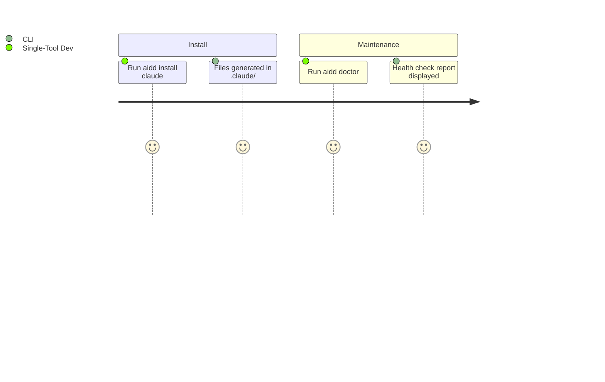

# PROJECT_BRIEF.md

## Executive Summary

- **Project Name**: AIDD CLI (`@ai-driven-dev/aidd-cli`)
- **Vision**: Distribute a canonical AI-Driven Development framework consistently across multiple AI coding assistants, eliminating manual tool-specific adaptation
- **Mission**: CLI that resolves the AIDD framework from remote/local sources, generates tool-specific file distributions with content rewriting and frontmatter conversion, and tracks every generated file in a hash-based manifest

### Full Description

- Paid community product gated by membership authentication token via GitHub Packages
- CLI is the distribution backbone — not a generic scaffolding tool
- Framework assets: agents, commands, rules, skills, templates
- Supported tools: Claude Code, Cursor, GitHub Copilot

## Context

### Core Domain

- Framework resolved from remote (GitHub Packages) or local source
- Files are rewritten per tool conventions (path, frontmatter, content format)
- Every installed file tracked in `.aidd/config.json` (manifest) via content hash
- Drift = local modification vs. framework version

### Ubiquitous Language

| Term                 | Definition                                                                               |
| -------------------- | ---------------------------------------------------------------------------------------- |
| Framework            | Canonical set of agents, commands, rules, skills, templates maintained by AIDD community |
| Distribution         | Tool-specific generated output (files rewritten for Claude/Cursor/Copilot conventions)   |
| Manifest             | `.aidd/config.json` — hash-based tracking of every installed file                        |
| ToolSpec             | Per-tool configuration: file rewriting, frontmatter conversion, path conventions         |
| Framework Descriptor | `framework.json` — describes the canonical framework's file layout                       |
| Drift                | Installed files modified locally vs. the framework version                               |
| Init                 | Bootstrap command that creates `aidd_docs/` structure and manifest                       |
| Install              | Command to generate and write tool-specific distribution files                           |

## Features & Use-cases

### v3.0 MVP

- `aidd init` — create `aidd_docs/` structure and manifest
- `aidd install <tools...>` — generate tool-specific distributions
- `aidd uninstall <tools...>` — remove tool files cleanly
- `aidd status` — detect drift between installed files and framework version
- `aidd clean` — remove all AIDD traces (with `--force`)
- `aidd doctor` — diagnostics and health check

### v3.1+ Future

- `aidd update` — download latest framework, apply diff with conflict resolution
- `aidd restore` — restore modified/deleted files to framework version
- `aidd sync` — cross-tool propagation of local changes

## User Journey maps

### Multi-Tool Developer

### Single-Tool Developer

