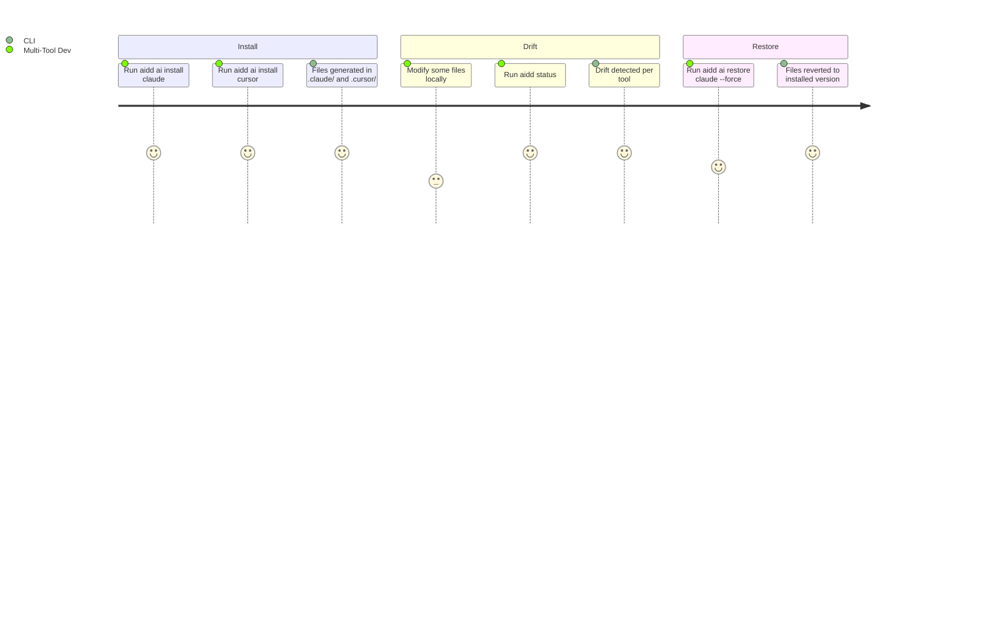

# Project Brief

## Executive Summary

- **Package**: `@ai-driven-dev/cli`
- **Vision**: Distribute a canonical AI-Driven Development framework consistently across multiple AI coding assistants, eliminating manual tool-specific adaptation
- **Mission**: CLI that resolves the AIDD framework from remote/local sources, generates tool-specific file distributions with content rewriting and frontmatter conversion, and tracks every generated file in a hash-based manifest

### Description

- Community product gated by GitHub authentication token
- CLI is the distribution backbone — not a generic scaffolding tool
- Framework assets: agents, commands, rules, skills, templates
- Supported tools: Claude Code, Cursor, GitHub Copilot, OpenCode, Codex (AI); VS Code (IDE)

## Core Domain

- Framework resolved from remote (GitHub Releases) or local path/tarball
- Files are rewritten per tool conventions (path, frontmatter, content format)
- Every installed file tracked in `.aidd/manifest.json` via MD5 hash
- Drift = local modification vs. what was written at install time

## Ubiquitous Language

| Term                 | Definition                                                                                                                                                                        |
| -------------------- | --------------------------------------------------------------------------------------------------------------------------------------------------------------------------------- |
| Framework            | Canonical set of agents, commands, rules, skills, templates                                                                                                                       |
| Distribution         | Tool-specific generated output (files rewritten per tool conventions)                                                                                                             |
| Manifest             | `.aidd/manifest.json` — hash-based tracking of every installed file                                                                                                               |
| ToolConfig           | Per-tool configuration: output paths, frontmatter conversion, merge rules. Tools: `claude` → `.claude/`, `cursor` → `.cursor/`, `copilot` → `.github/`, `opencode` → `.opencode/`, `codex` → `.codex/` |
| Plugin               | Capability files (agents, commands, hooks, mcp, rules, skills) distributed per AI tool format via marketplace catalogs                                                            |
| Drift                | Installed file modified locally vs. what was written at install time                                                                                                              |
| Init                 | Bootstrap: creates `aidd_docs/` structure + manifest                                                                                                                              |
| Install              | Generates and writes tool-specific distribution files                                                                                                                             |

## Commands

### Bootstrap
| Command | Purpose |
|---|---|
| `aidd setup --source remote\|local [--all] [--ai <ids>] [--ide <ids>] [--plugins/--all-plugins/--recommended-plugins/--no-plugins] [--yes]` | Initialize project: marketplace + tools + plugins |
| `aidd migrate [--dry-run] [--non-interactive]` | Migrate brownfield v3/v4 manifest to v5 |

### AI tools (claude, cursor, copilot, codex, opencode)
| Command | Purpose |
|---|---|
| `aidd ai install <tool> [--force]` | Install AI tool runtime config |
| `aidd ai uninstall <tool>` | Remove tool config |
| `aidd ai list / status / update / sync / restore / doctor` | Per-tool ops |

### IDE tools (vscode)
| Command | Purpose |
|---|---|
| `aidd ide install <tool> [--force]` | Install IDE config |
| `aidd ide uninstall / list / status / update / doctor` | Per-tool ops |

### Plugins
| Command | Purpose |
|---|---|
| `aidd plugin install <name> [--from <market>] [--tool <id>] [--token <v>] [--yes]` | Install from marketplace |
| `aidd plugin add <local-path> [--tool <id>]` | Add local plugin |
| `aidd plugin remove / list / update / search / pick / status / sync / restore / doctor` | Plugin ops |

### Marketplaces
| Command | Purpose |
|---|---|
| `aidd marketplace add <name> <source> [--user] [--yes] [--overwrite] [--token <v>]` | Register marketplace |
| `aidd marketplace list / remove / refresh / browse / check` | Marketplace ops |
| `aidd marketplace cache list / clear` | Cache management |

### Auth
| Command | Purpose |
|---|---|
| `aidd auth login [--gh] [--token <v>] [--level user\|project]` | GitHub auth |
| `aidd auth logout / status` | Auth ops |

### Globals (chain unitaries)
| Command | Purpose |
|---|---|
| `aidd update / status / sync / restore / doctor` | Run across AI + IDE + plugins |
| `aidd clean [--force]` | Nuke .aidd + tracked files |
| `aidd self-update` | Update CLI binary |

### Removed (v5 / post-beta.23 architecture cleanup)
- `aidd cache list/clear` — replaced by `aidd marketplace cache`
- `aidd config list/get/set` — no remaining writable fields
- `aidd install [category] [tool]` — replaced by `aidd ai/ide install`
- `aidd uninstall [category] [tool]` — replaced by `aidd ai/ide uninstall`
- Setup flags `--from / --switch-mode / --mode / --path` (path kept only with `--source local`) / `--release`
- Install flags `--path / --release / --plugins / --mcp / --all-plugins / --recommended-plugins / --no-plugins`
- Global `--repo` flag; `AIDD_REPO` env var gone from source
- `FrameworkResolver`, `FrameworkCache`, `ResolveFrameworkUseCase`, `InstallFrameworkPluginsUseCase`, `AdoptUseCase` — removed classes
- `MemoryCapability` — memory stubs moved to plugin ownership; no `memory-capability.ts` in source
- Manifest fields: `mode / scripts / repo / docsDir / docs / plugins(top-level)` — all removed

## User Journey

### Multi-Tool Developer

