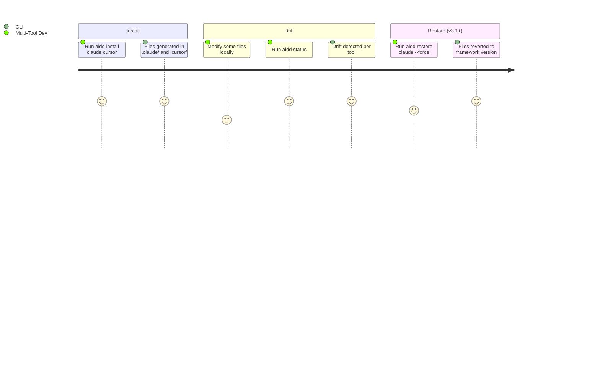

# Project Brief

## Executive Summary

- **Package**: `@ai-driven-dev/aidd-cli` v3.0.0
- **Vision**: Distribute a canonical AI-Driven Development framework consistently across multiple AI coding assistants, eliminating manual tool-specific adaptation
- **Mission**: CLI that resolves the AIDD framework from remote/local sources, generates tool-specific file distributions with content rewriting and frontmatter conversion, and tracks every generated file in a hash-based manifest

### Description

- Community product gated by GitHub authentication token
- CLI is the distribution backbone — not a generic scaffolding tool
- Framework assets: agents, commands, rules, skills, templates
- Supported tools: Claude Code, Cursor, GitHub Copilot

## Core Domain

- Framework resolved from remote (GitHub Releases) or local path/tarball
- Files are rewritten per tool conventions (path, frontmatter, content format)
- Every installed file tracked in `.aidd/manifest.json` via MD5 hash
- Drift = local modification vs. what was written at install time

## Ubiquitous Language

| Term | Definition |
| --- | --- |
| Framework | Canonical set of agents, commands, rules, skills, templates |
| Distribution | Tool-specific generated output (files rewritten per tool conventions) |
| Manifest | `.aidd/manifest.json` — hash-based tracking of every installed file |
| ToolConfig | Per-tool configuration: output paths, frontmatter conversion, merge rules |
| Framework Descriptor | `framework.json` — describes the canonical framework's file layout |
| Drift | Installed file modified locally vs. what was written at install time |
| Init | Bootstrap: creates `aidd_docs/` structure + manifest |
| Install | Generates and writes tool-specific distribution files |

## Commands

| Command | Flags | Description |
| --- | --- | --- |
| `aidd init` | `--force`, `--repo` | Create `aidd_docs/` structure and manifest. `--force` re-copies docs without full reset. |
| `aidd install <tools...>` | `--all`, `--force` | Generate and write tool-specific distribution files. |
| `aidd uninstall <tools...>` | `--all` | Remove tool files and update manifest. |
| `aidd adopt` | `--tools <tools>` (required), `--docs-dir` (opt) + global `--release` (required) | Bootstrap manifest for projects with pre-existing manually installed AIDD files. Scans disk as-is, no download, no conflict resolution. Deletes legacy `config.json` if present. |
| `aidd status` | `--tool`, `--docs` | Show drift (modified/deleted/added) between disk and manifest. |
| `aidd update` | `--force`, `--dry-run`, `--tool`, `--docs` | Diff and apply new framework version. `--tool`/`--docs` scope to one section. |
| `aidd restore` | `--force`, `--tool`, `--docs`, `[files...]` | Restore modified/deleted files from pinned version. |
| `aidd sync` | `--source`, `--target`, `--force` | Propagate local changes from one tool to others. |
| `aidd doctor` | — | Check structural integrity: manifest, orphaned dirs, broken references. Exits 1 on any issue. |
| `aidd clean` | `--force` | Remove all AIDD files. Dry-run without `--force`. |
| `aidd cache list/clear` | `--all`, `[version]` | List or clear cached framework versions. |
| `aidd config list/get/set` | `--force` | Manifest-backed config. Writable: `docsDir`, `repo`. Read-only: `tools`. |
| Global flags | `--verbose`, `--token`, `--repo`, `--framework`, `--release` | Apply to all commands. |

## vNext — Vision (unspecified)

**Interactive / non-interactive mode:**

- No flag = interactive mode: step-by-step guidance via `@inquirer/prompts` (tool selection, confirmation, sub-part selection)
- With flags = non-interactive mode: current behavior, CI/scripting compatible

**Installation granularity (to be specified):**

- Direction: ability to install sub-parts of the framework independently
- Exact scope not yet settled — do not implement before the vision is stabilized

## User Journey

### Multi-Tool Developer

