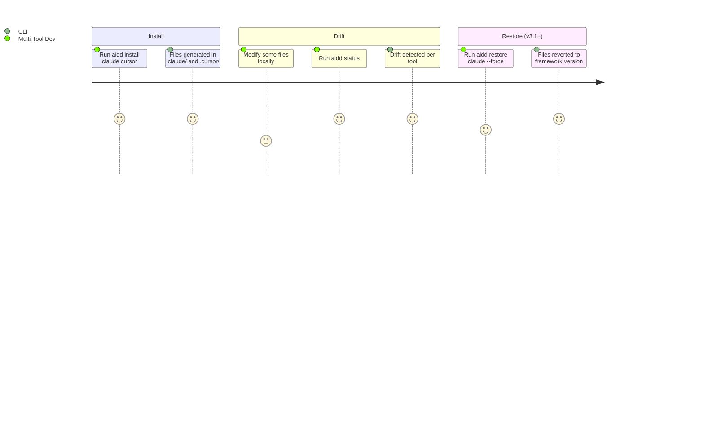

# Project Brief

## Executive Summary

- **Package**: `@ai-driven-dev/cli` v3.0.0
- **Vision**: Distribute a canonical AI-Driven Development framework consistently across multiple AI coding assistants, eliminating manual tool-specific adaptation
- **Mission**: CLI that resolves the AIDD framework from remote/local sources, generates tool-specific file distributions with content rewriting and frontmatter conversion, and tracks every generated file in a hash-based manifest

### Description

- Community product gated by GitHub authentication token
- CLI is the distribution backbone — not a generic scaffolding tool
- Framework assets: agents, commands, rules, skills, templates
- Supported tools: Claude Code, Cursor, GitHub Copilot

## Core Domain

- Framework resolved from remote (GitHub Releases) or local path/tarball
- Files are rewritten per tool conventions (path, frontmatter, content format)
- Every installed file tracked in `.aidd/manifest.json` via MD5 hash
- Drift = local modification vs. what was written at install time

## Ubiquitous Language

| Term | Definition |
| --- | --- |
| Framework | Canonical set of agents, commands, rules, skills, templates |
| Distribution | Tool-specific generated output (files rewritten per tool conventions) |
| Manifest | `.aidd/manifest.json` — hash-based tracking of every installed file |
| ToolConfig | Per-tool configuration: output paths, frontmatter conversion, merge rules |
| Framework Descriptor | `framework.json` — describes the canonical framework's file layout |
| Drift | Installed file modified locally vs. what was written at install time |
| Init | Bootstrap: creates `aidd_docs/` structure + manifest |
| Install | Generates and writes tool-specific distribution files |

## Features & Use-cases

### v3.0 — SHIPPED (tickets 001-054)

- `aidd init` — create `aidd_docs/` structure and manifest
- `aidd install <tools...>` — generate tool-specific distributions (`--all`, `--force`)
- `aidd uninstall <tools...>` — remove tool files cleanly
- `aidd status [--tool]` — detect drift per tool
- `aidd clean [--force]` — remove all AIDD traces (dry-run by default)
- `aidd doctor` — diagnostics and health check (exit 1 on any issue)
- Global: `--verbose`, `--token`, `--repo`, `--framework` (dir or tarball)
- Auto-init when `install` run without prior `init`
- Manifest migration system for schema evolution

### v3.1 — TODO (tickets 060-064, 070-072)

- `--release <tag>` global flag — install/init a specific framework version (ticket 055, DONE)
- `aidd status` — update-available check: displays "Update available" when newer version exists (ticket 056, DONE)
- `aidd update` — download latest framework, apply diff per tool (tickets 060-061)
- `aidd update --dry-run` — preview changes without writing files (ticket 064)
- `aidd restore` — restore modified/deleted files from pinned version (tickets 062-063)
- `aidd sync` — cross-tool propagation of local changes (tickets 071-072)
- Conflict handling for update/restore with user-modified files (ticket 061)

### v3.2 — TODO (tickets 080-083)

- `aidd cache` — list and clear cached framework versions (ticket 080)
- `aidd config get/set/list` — manage `.aidd/settings.json` via CLI (ticket 081)
- `aidd init --force` — re-copy docs templates without full clean+reinit (ticket 082)
- `aidd doctor --fix` — auto-remediate detectable issues (ticket 083)

### vNext — Vision (non spécifiée)

**Mode interactif / non-interactif :**

- Sans flag = mode interactif : guidage pas-à-pas via `@inquirer/prompts` (sélection d'outils, confirmation, choix de sous-parties)
- Avec flags = mode non-interactif : comportement actuel, compatible CI/scripting
- Chaque commande (`init`, `install`, `update`, ...) aura sa version interactive

**Granularité d'installation (à spécifier) :**

- Direction : pouvoir installer des sous-parties du framework indépendamment
- Exemples envisagés : profils thématiques (`common`, `dev`, `pm`, `ops`), configs de confidentialité, fichiers techniques — périmètre exact non arrêté
- Nécessite une réflexion dédiée avant spec : qu'est-ce qu'une "sous-partie" ? par rôle ? par type de contenu ? les deux ?
- Impacte `FrameworkDescriptor` et le manifest — ne pas implémenter avant que la vision soit stabilisée

## User Journey

### Multi-Tool Developer

