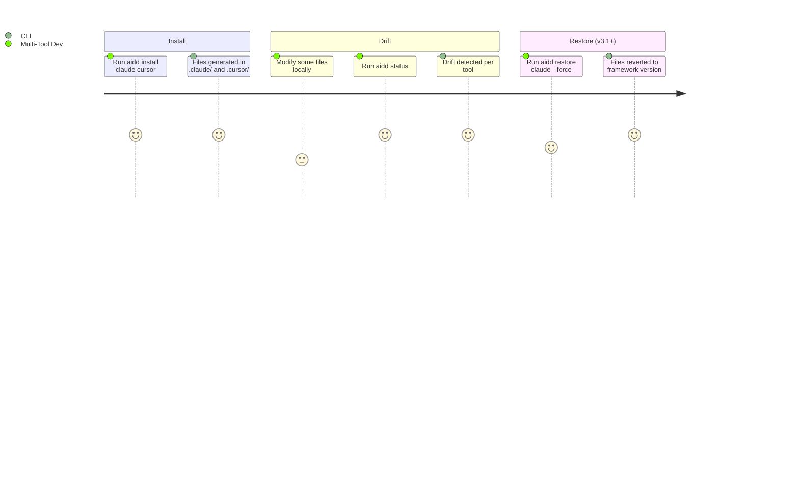

# Project Brief

## Executive Summary

- **Package**: `@ai-driven-dev/cli`
- **Vision**: Distribute a canonical AI-Driven Development framework consistently across multiple AI coding assistants, eliminating manual tool-specific adaptation
- **Mission**: CLI that resolves the AIDD framework from remote/local sources, generates tool-specific file distributions with content rewriting and frontmatter conversion, and tracks every generated file in a hash-based manifest

### Description

- Community product gated by GitHub authentication token
- CLI is the distribution backbone — not a generic scaffolding tool
- Framework assets: agents, commands, rules, skills, templates
- Supported tools: Claude Code, Cursor, GitHub Copilot, OpenCode

## Core Domain

- Framework resolved from remote (GitHub Releases) or local path/tarball
- Files are rewritten per tool conventions (path, frontmatter, content format)
- Every installed file tracked in `.aidd/manifest.json` via MD5 hash
- Drift = local modification vs. what was written at install time

## Ubiquitous Language

| Term                 | Definition                                                                                                                                                                        |
| -------------------- | --------------------------------------------------------------------------------------------------------------------------------------------------------------------------------- |
| Framework            | Canonical set of agents, commands, rules, skills, templates                                                                                                                       |
| Distribution         | Tool-specific generated output (files rewritten per tool conventions)                                                                                                             |
| Manifest             | `.aidd/manifest.json` — hash-based tracking of every installed file                                                                                                               |
| ToolConfig           | Per-tool configuration: output paths, frontmatter conversion, merge rules. Tools: `claude` → `.claude/`, `cursor` → `.cursor/`, `copilot` → `.github/`, `opencode` → `.opencode/` |
| Framework Descriptor | Code model built by `FrameworkLoaderAdapter` — no `framework.json` file                                                                                                           |
| Drift                | Installed file modified locally vs. what was written at install time                                                                                                              |
| Init                 | Bootstrap: creates `aidd_docs/` structure + manifest                                                                                                                              |
| Install              | Generates and writes tool-specific distribution files                                                                                                                             |

## Commands

| Command | Flags | Description |
| --- | --- | --- |
| `aidd setup` | `--release`, `--path`, `--tools`, `--all-tools`, `--docs-dir`, `--from` | Detects state and runs init + install, adopt, install, or update. Interactive by default; non-interactive when `--tools` or `--all-tools` is provided. |
| `aidd install <tools...>` | `--all`, `--force`, `--release`, `--path`, `--mcp` | Generate and write tool-specific distribution files. `--mcp server1,server2` selects specific MCP servers; interactive checkbox when TTY; all installed when non-interactive. Requires existing manifest. |
| `aidd uninstall <tools...>` | `--all`, `--mcp` | Remove tool files and update manifest. `--mcp server1` removes specific MCP entries without uninstalling the tool. |
| `aidd status` | `--tool`, `--docs` | Show drift (modified/deleted/added) between disk and manifest. |
| `aidd update` | `--force`, `--dry-run`, `--tool`, `--docs`, `--release`, `--path` | Diff and apply new framework version. `--tool`/`--docs` scope to one section. |
| `aidd restore` | `--force`, `--tool`, `--docs`, `[files...]`, `--release`, `--path` | Restore modified/deleted files from pinned version. |
| `aidd sync` | `--source`, `--target`, `--force` | Propagate local changes from one tool to others. |
| `aidd doctor` | — | Check structural integrity: manifest, orphaned dirs, broken references. Auth warning = exit 0 (info). Exits 1 on warning/error issues. |
| `aidd clean` | `--force` | Remove all AIDD files. Dry-run without `--force`. |
| `aidd cache list/clear` | `--all`, `[version]` | List or clear cached framework versions. |
| `aidd config list/get/set` | `--force` | Manifest-backed config. Writable: `docsDir`, `repo`. Read-only: `tools`. |
| `aidd self-update` | `--check`, `--dry-run`, `--force` | Update the aidd CLI itself to the latest version. `--check` shows if newer version is available without installing. `--dry-run` previews without installing. `--force` reinstalls even if already up to date. Uses GitHub Releases API for version check and changelog. |
| `aidd auth login/logout/status` | `--token`, `--gh`, `--level` | Manage stored GitHub credentials. `--token` is auth-command-only (not global). |
| Global flags | `--verbose`, `--repo` | Apply to all commands. `--path` and `--release` are command-level options on `setup`, `install`, `update`, `restore`. |

## vNext — Vision (unspecified)

**Interactive / non-interactive mode (implemented):**

- No flag = interactive mode: step-by-step guidance via `@inquirer/prompts`
- `--tools` or `--all-tools` = non-interactive mode: prompts suppressed, defaults auto-resolved, CI/scripting compatible

**Installation granularity (implemented — MCP servers):**

- `--mcp` flag on install/uninstall for granular MCP server selection
- Excluded MCP servers tracked per-tool in manifest (`excludedMcp`). See DEC-022.
- `update` skips excluded entries, prompts for genuinely new ones, `--force` clears all exclusions

## User Journey

### Multi-Tool Developer

