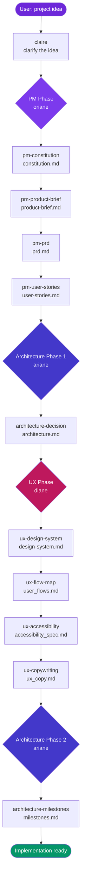
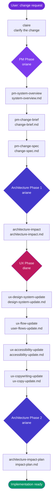
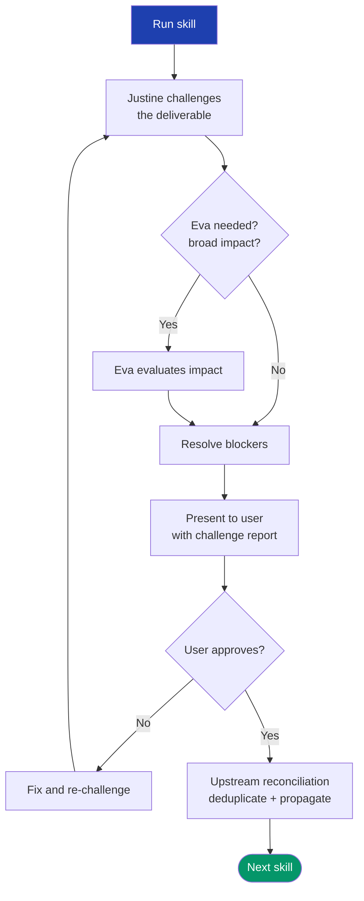
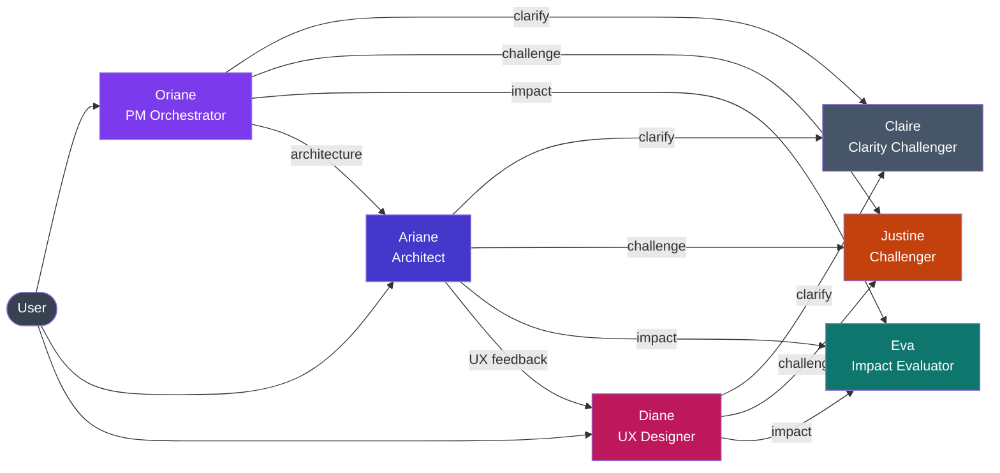

# Release v3.7.1-pm.2 — PM & UX Beta (2nd iteration)

> ⚠️ Pre-release for beta testing. Not proposed automatically to existing users.

## Install

```bash
# Via CLI
aidd --release v3.7.1-pm.2 install claude

# Flat install (replace claude with cursor, copilot, or opencode)
aidd --release v3.7.1-pm.2 install cursor
```

---

## What changed since v3.7.0-pm.1

### New: `spike` skill

Time-boxed investigations to reduce uncertainty before committing to a decision. Use when the team lacks enough knowledge to estimate, choose an approach, or commit to a solution. Available to Oriane, Ariane, and Diane.

### Challenge gates on every skill

Every PM, UX, and architecture skill now runs a built-in mechanical challenge gate before presenting its deliverable. The gate validates structure, completeness, and consistency — blockers must be resolved before the deliverable is shown to the user.

### Upstream reconciliation (replaces simple deduplication)

When a downstream deliverable is produced, the flow now checks if upstream docs need updating — in both directions:
- **Deduplication**: content now owned by the new deliverable is removed from upstream docs
- **Propagation**: new constraints discovered downstream (e.g., architecture impacts → new change-spec stories) are pushed back upstream

### Brownfield UX skills (new)

Four new UX skills that operate on existing systems, targeting only what changes:

| Skill | Purpose | Deliverable |
|---|---|---|
| `ux-design-system-update` | Update design system for a brownfield change | `design-system-update.md` |
| `ux-flow-update` | Map only flows impacted by the change | `user-flows-update.md` |
| `ux-accessibility-update` | A11y specs for new/modified components | `accessibility-update.md` |
| `ux-copywriting-update` | i18n-ready copy for new/modified screens | `ux-copy-update.md` |

### Agent simplification & template adherence

All agents (Oriane, Ariane, Diane, Eva, Justine, Claire) were stripped of duplicated content and aligned with course materials. Each agent now has a strict single responsibility and enforces it.

### Business-level language in `pm-constitution`

The `pm-constitution` skill now enforces business-level language — no technical jargon in vision, objectives, or constraints.

---

## Full feature set (v3.7.0-pm.1 + v3.7.1-pm.2)

### Agents

| Agent | Role | Model |
|---|---|---|
| **Oriane** | PM Orchestrator — runs PM workflows end to end | Opus |
| **Ariane** | Architect — architecture decisions and impact planning | Opus |
| **Diane** | UX Designer — design systems, flows, accessibility, copy, audits | Opus |
| **Eva** | Impact Evaluator — multi-dimensional impact assessments | Opus |
| **Justine** | Challenger — adversarial review of any deliverable | Opus |
| **Claire** | Clarity Challenger — Socratic questioning until request is ultra-clear | Default |

### PM Skills (Oriane)

| Skill | Use case | Deliverable |
|---|---|---|
| `pm-constitution` | Define vision, values, governance | `constitution.md` |
| `pm-product-brief` | Validate market fit via discovery | `product-brief.md` |
| `pm-prd` | Full Product Requirements Document | `prd.md` |
| `pm-user-stories` | INVEST-compliant user stories | `user-stories.md` |
| `pm-system-overview` | Analyze existing codebase (brownfield) | `system-overview.md` |
| `pm-change-brief` | As-is → to-be gap analysis | `change-brief.md` |
| `pm-change-spec` | Change specification + brownfield stories | `change-spec.md` |
| `spike` | Time-boxed investigation | `spike-{topic}.md` |

### Architecture Skills (Ariane)

| Skill | Use case | Deliverable |
|---|---|---|
| `architecture-decision` | Justified technical architecture | `architecture.md` |
| `architecture-milestones` | Implementation milestones (greenfield) | `milestones.md` |
| `architecture-impact` | Impact analysis of a change | `architecture-impact.md` |
| `architecture-impact-plan` | Rollout plan for a change | `impact-plan.md` |
| `spike` | Time-boxed investigation | `spike-{topic}.md` |

### UX Skills (Diane)

| Skill | Use case | Deliverable |
|---|---|---|
| `ux-design-system` | Full design system (greenfield) | `design-system.md` |
| `ux-design-system-update` | Design system delta (brownfield) | `design-system-update.md` |
| `ux-flow-map` | Complete user flows (greenfield) | `user_flows.md` |
| `ux-flow-update` | Impacted flows only (brownfield) | `user-flows-update.md` |
| `ux-accessibility` | WCAG AA specs per component (greenfield) | `accessibility_spec.md` |
| `ux-accessibility-update` | A11y specs for changed components | `accessibility-update.md` |
| `ux-copywriting` | i18n-ready microcopy (greenfield) | `ux_copy.md` |
| `ux-copywriting-update` | Copy for changed screens (brownfield) | `ux-copy-update.md` |
| `ux-audit` | Nielsen heuristics audit | `ux-audit.md` |
| `spike` | Time-boxed investigation | `spike-{topic}.md` |

### Commands

| Command | Phase | Description |
|---|---|---|
| `/greenfield` | `02_context` | Full new product workflow: idea → implementation plan |
| `/brownfield` | `02_context` | Change workflow: change request → impact plan |

---

## Workflows

### Greenfield — from idea to implementation plan



### Brownfield — from change request to impact plan



### Skill execution loop (within each phase)

Every skill in every phase follows this loop:



### Agent collaboration map



---

## Key design principles

**Single responsibility** — each agent does one thing. Oriane orchestrates PM, Ariane handles architecture, Diane handles UX. They call each other when needed, but never step on each other's domain.

**Challenge before approval** — no deliverable is shown to the user without passing through Justine's challenge gate. Blockers must be resolved first.

**Single source of truth** — upstream deliverables are referenced, not restated. Downstream deliverables are self-contained. Upstream reconciliation keeps everything in sync.

**Greenfield vs brownfield symmetry** — every greenfield skill has a brownfield counterpart. The two workflows share the same execution loop, the same agents, and the same quality gates.

**Scope discipline** — Oriane enforces a 3-tier scope (MVP / Next / Never) throughout all PM deliverables.

---

## Beta testing guide

### Prerequisites

- AIDD CLI installed (`npm i -g aidd-cli` or equivalent)
- Claude Code with Opus model access (agents default to Opus)

### Recommended test scenarios

**Greenfield test**
```bash
# Start a greenfield workflow on a new project idea
/greenfield
```
Expected: claire asks clarifying questions → oriane runs PM skills sequentially → justine challenges each → user approves → ariane runs architecture → diane runs UX → ariane finalizes milestones.

**Brownfield test**
```bash
# Start a brownfield workflow on an existing codebase
/brownfield
```
Expected: claire clarifies the change → oriane analyzes existing system → produces change brief and spec → ariane assesses impact → diane updates UX docs → ariane produces rollout plan.

**Single skill test**
```bash
# Test an individual skill via its agent
@oriane run pm-constitution for [your project idea]
@diane run ux-audit on [your product]
@ariane run spike on [uncertain technical question]
```

### What to report

- Skills that skip the challenge gate
- Agents that stray outside their domain
- Upstream reconciliation not triggering when it should
- Deliverables that restate upstream content instead of referencing it
- Business jargon bleeding into pm-constitution

Report issues at: https://github.com/ai-driven-dev/aidd-framework/issues
