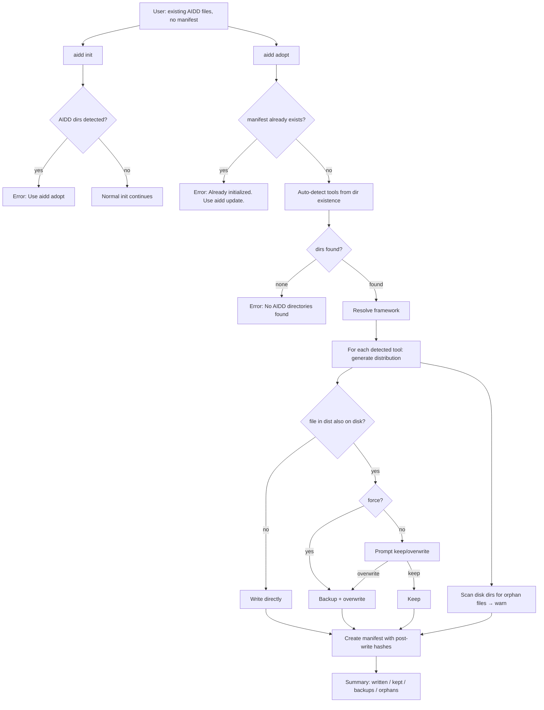

# Instruction: aidd adopt — migrate manual installation to CLI-managed state

## Feature

- **Summary**: Add `aidd adopt` command that bootstraps a manifest for projects with pre-existing AIDD files installed manually; add an `aidd init` guard that redirects to `adopt` when AIDD directories are detected.
- **Stack**: `TypeScript ESM`, `Node.js >= 24`, `vitest`, `commander`, `@inquirer/prompts`
- **Branch name**: `feat/adopt-command`
- **Parent Plan**: `none`
- **Sequence**: `standalone`
- Confidence: 9/10
- Time to implement: ~3h

## Progress

- [x] Step 0: Clarification / approval
- [x] Step 1: Init guard
- [x] Step 2: AdoptUseCase
- [x] Step 3: adopt command + CLI registration
- [x] Step 4: Unit tests
- [x] Step 5: E2E test
- [x] Step 6: Validation

## Existing files

- `src/application/use-cases/init-use-case.ts`
- `src/application/use-cases/update-use-case.ts`
- `src/application/use-cases/restore-use-case.ts`
- `src/application/commands/update.ts`
- `src/cli.ts`
- `src/domain/models/manifest.ts`
- `src/domain/models/tool-config.ts`
- `tests/application/use-cases/helpers.ts`

### New files to create

- `src/application/use-cases/adopt-use-case.ts`
- `src/application/commands/adopt.ts`
- `tests/application/use-cases/adopt-use-case.test.ts`
- `tests/e2e/adopt.e2e.test.ts`

## User Journey

## Implementation phases

### Phase 1: Init guard

> Block `aidd init` when AIDD directories already exist on disk (no manifest).

1. In `InitUseCase.execute()`, after confirming no manifest and no `--force`: check the following signals via `this.fs.fileExists()`:
   - `.aidd/` directory
   - `aidd_docs/` (using `docsDir` param)
   - `.claude/` directory
   - `.cursor/` directory
   - `.github/copilot-instructions.md` (not `.github/` alone — too common in any repo with CI)
2. If any of those exist, throw: `"AIDD files detected. Use \`aidd adopt\` to migrate your existing installation."`.
3. Guard fires before the `docsDir` already-exists check (replaces the current `docsDir` check with this broader guard).

### Phase 2: AdoptUseCase

> Core logic: detect tools, download framework, handle conflicts, create manifest.

1. Create `AdoptOptions`: `frameworkPath`, `version`, `docsDir`, `projectRoot`, `force?: boolean`.
2. Create `AdoptToolResult`: `toolId`, `written`, `kept`, `backedUp`, `orphans`.
3. Create `AdoptResult`: `tools: AdoptToolResult[]`, `totalWritten`, `totalKept`, `totalBackedUp`, `orphans`.
4. Guard: if manifest exists → throw `"Already initialized. Use \`aidd update\` to upgrade."`.
5. Auto-detect tools: for each known `VALID_TOOL_IDS`, check AIDD-specific signals on disk:
   - `claude` → `.claude/` exists
   - `cursor` → `.cursor/` exists
   - `copilot` → `.github/copilot-instructions.md` exists (not `.github/` alone)
   Collect detected tools. If none → throw `"No AIDD directories found. Run \`aidd init\` instead."`.
6. Create blank `Manifest.create(docsDir)`.
7. For each detected tool:
   - `generateDistribution(descriptor, config, docsDir, contentFiles, hasher)`.
   - For each file in distribution (skip merged files):
     - Not on disk → write directly, record `written`.
     - On disk, `--force` → backup + overwrite, record `backedUp` + `written`.
     - On disk, no `--force` → prompt `resolveConflict(relativePath)` → keep or backup+overwrite.
   - Re-apply merged files silently (same as `UpdateUseCase`).
   - Scan disk tool directory for files not in distribution → record `orphans`, log warn (no deletion).
   - Build final `GeneratedFile[]` with post-write hashes from disk.
   - `manifest.addTool(toolId, version, files)`.
8. Save manifest.
9. `writeCatalog(manifest, docsDir, projectRoot, fs)`.

### Phase 3: adopt command + CLI registration

> Wire AdoptUseCase to CLI.

1. Create `src/application/commands/adopt.ts` following `update.ts` pattern:
   - Flags: `-f, --force`, `--release <tag>` (inherited from global options).
   - Read manifest first to check for existing → error with message.
   - `resolveFramework(...)` for framework path + version.
   - Instantiate `InquirerPrompterAdapter` or `SilentPrompterAdapter` based on `--force`.
   - Call `AdoptUseCase.execute(...)`.
   - Output summary: files written, files kept, backups created, orphan warnings.
2. Register in `cli.ts`: `registerAdoptCommand(program)`.

### Phase 4: Tests

> Unit + E2E coverage of all acceptance criteria.

1. Unit `adopt-use-case.test.ts`:
   - Error: manifest already exists.
   - Error: no AIDD directories found.
   - All new files (nothing on disk) → all written.
   - All conflicts, keep → all kept, no writes.
   - All conflicts, overwrite → all backed up + written.
   - Mixed (some new, some conflict keep, some conflict overwrite).
   - Orphan files on disk → warned, not touched.
2. Unit `init-use-case.test.ts`: add case for init guard (AIDD dirs present, no manifest → correct error).
3. E2E `adopt.e2e.test.ts`:
   - Seed a project with manually-placed framework files (copy from fixture dir without manifest).
   - Run `aidd adopt --framework <fixture> --force`.
   - Assert `.aidd/manifest.json` exists.
   - Run `aidd status` → assert output shows no drift (all in-sync).

## Validation flow

1. `pnpm typecheck` passes.
2. `pnpm lint` passes.
3. `pnpm test` — all 509 + new tests pass.
4. Manual smoke: seed temp project with `.claude/` dir → `aidd init` → error message → `aidd adopt --force` → manifest created → `aidd status` clean.

---

## Confidence Assessment

**9/10**

✅ Reasons for high confidence:
- `AdoptUseCase` reuses exact same distribution, conflict, and backup logic as `UpdateUseCase` — no new patterns.
- Tool auto-detection is trivial: `getToolConfig(toolId).directory` + `fs.fileExists()`.
- `Manifest.create()` already handles blank manifest creation.
- `Prompter` interface already has `resolveConflict()` — no interface changes needed.
- Init guard is a 3-line addition to an already-tested guard block.

❌ Minor risks:
- The `orphan` scan uses `fs.listDirectory()` — need to confirm this method exists on the `FileSystem` port (it does: used in `RestoreUseCase`).
- The `--force` behavior on `adopt` skips the non-TTY guard that `restore` has — this is intentional per spec but must be documented in the command.
