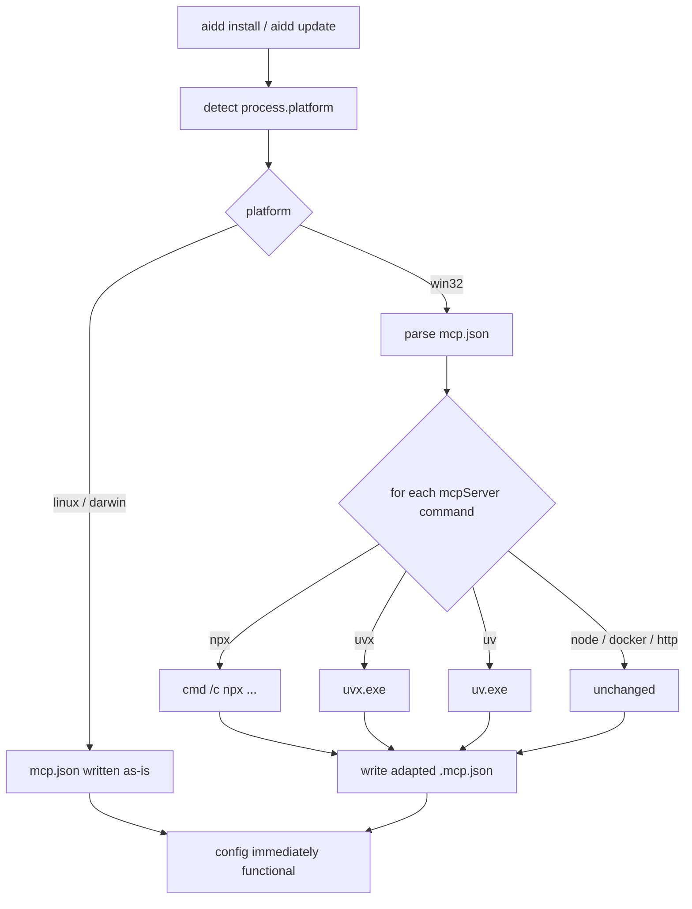

# Instruction: Adapt MCP config to target platform on install/update

## Feature

- **Summary**: Transform `.mcp.json` content at generation time based on the detected OS so the config is immediately functional without manual edits — `npx` → `cmd /c npx`, `uvx` → `uvx.exe`, `uv` → `uv.exe` on Windows; other platforms unchanged.
- **Stack**: `TypeScript`, `Node.js`, `Vitest`
- **Branch name**: `feat/mcp-platform-adaptation`
- **Parent Plan**: `none`
- **Sequence**: `standalone`
- Confidence: 9/10
- Time to implement: ~2h

## Progress

- [ ] Phase 1: Domain — pure transformation function
- [ ] Phase 2: Pipeline — wire into `generateDistribution`
- [ ] Phase 3: CLI — propagate platform from commands

## Existing files

- @src/domain/models/distribution.ts
- @src/domain/models/framework-descriptor.ts
- @src/application/use-cases/install-use-case.ts
- @src/application/use-cases/update-use-case.ts
- @src/application/commands/install.ts
- @src/application/commands/update.ts
- @tests/domain/models/distribution.test.ts
- @tests/application/use-cases/install-use-case.test.ts
- @tests/application/use-cases/update-use-case.test.ts

### New files to create

- `src/domain/models/mcp-transform.ts`
- `tests/domain/models/mcp-transform.test.ts`

## User Journey

## Implementation phases

### Phase 1 — Domain: pure transformation function

> Create isolated, unit-testable MCP transformation logic

1. Create `src/domain/models/mcp-transform.ts` with `transformMcpConfig(content: string, platform: string): string`
2. Parse JSON, iterate `mcpServers` entries, apply win32 rules:
   - `"command": "npx"` → `"command": "cmd", args: ["/c", "npx", ...originalArgs]`
   - `"command": "uvx"` → `"command": "uvx.exe"`
   - `"command": "uv"` → `"command": "uv.exe"`
3. Non-win32: return content unchanged (no JSON re-serialization)
4. Create `tests/domain/models/mcp-transform.test.ts` covering:
   - win32: npx transform (with and without existing args)
   - win32: uvx transform
   - win32: uv transform
   - win32: node/docker/http untouched
   - darwin/linux: all commands untouched
   - Invalid JSON: throw early

### Phase 2 — Pipeline: wire into `generateDistribution`

> Apply transformation at content generation time, not at write time

1. Add `platform: string` param to `generateDistribution` (required, no default — callers must be explicit)
2. Pass `platform` to `collectRawFiles`
3. In `collectRawFiles`, for refs where `name === CONFIG_MCP`, apply `transformMcpConfig(content, platform)` before creating `GeneratedFile`
4. Update `tests/domain/models/distribution.test.ts`: pass `platform: "linux"` to existing tests (no behavior change)
5. Add a distribution test with `platform: "win32"` and an mcp config containing `npx` — assert output is transformed

### Phase 3 — CLI: propagate platform from commands

> Pass `process.platform` from the command layer down to the use case

1. Add `platform: string` to `InstallOptions` and `UpdateOptions` interfaces
2. Use case passes it to `generateDistribution`
3. In `src/application/commands/install.ts`: add `platform: process.platform` to options
4. In `src/application/commands/update.ts`: same
5. Update use case tests: pass `platform: "linux"` (no behavior change for existing tests)
6. Add integration test: install with `platform: "win32"` + mcp fixture containing `npx` → assert `.mcp.json` on disk is adapted

## Validation flow

1. Run `npm test` — all existing tests pass
2. Run new unit tests for `mcp-transform.ts` — all pass
3. On macOS/Linux: run `aidd install` → `.mcp.json` written as-is from framework
4. Manually verify win32 output by running tests with `platform: "win32"` — assert `cmd /c npx`, `uvx.exe`, `uv.exe`
5. Confirm `aidd update` re-applies adaptation if platform changes (hash diff triggers rewrite)
