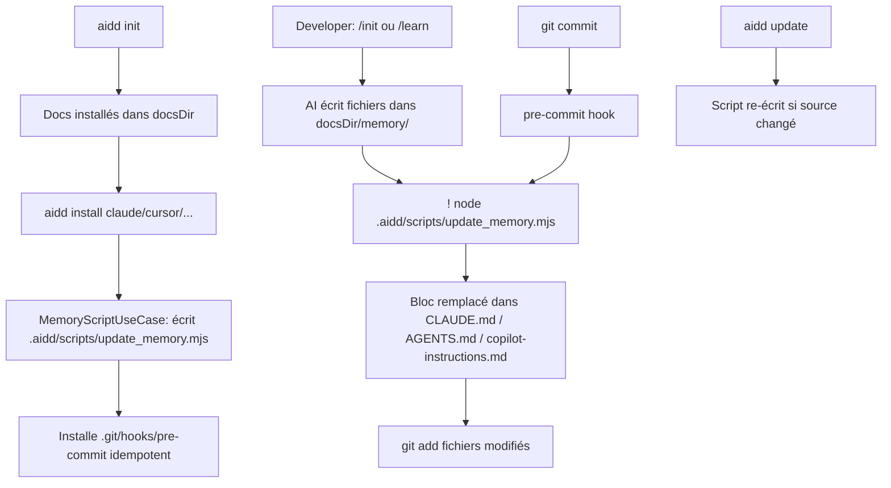

# Instruction: Auto-update `<aidd_project_memory>` block

## Feature

- **Summary**: Le framework distribue un script `update_memory.mjs`. Le CLI l'installe dans `.aidd/scripts/` et installe un hook git pre-commit lors de `aidd install`. `aidd update` le met à jour si le source change. Les commandes `/init` et `/learn` l'appellent en fin d'exécution.
- **Stack**: `TypeScript, Node.js 24, ESM, Vitest`
- **Branch name**: `feat/auto-update-memory-block`
- **Parent Plan**: `none`
- **Sequence**: `standalone`
- **Confidence**: 9/10
- **Time to implement**: ~4h

## Progress

- [x] Phase 1: Script dans le framework (config/scripts/update_memory.mjs)
- [ ] Phase 2: FrameworkLoaderAdapter — chargement config/scripts/
- [ ] Phase 3: InstallUseCase — écriture .aidd/scripts/ + pre-commit hook
- [ ] Phase 4: UpdateUseCase — mise à jour script via hash (automatique)
- [x] Phase 5: Framework — AGENTS.md + commandes /init et /learn
- [ ] Phase 6: Tests

## Existing files

- @src/domain/models/framework-descriptor.ts
- @src/infrastructure/adapters/framework-loader-adapter.ts
- @src/application/use-cases/install-use-case.ts
- @src/application/use-cases/update-use-case.ts
- @src/application/use-cases/gitignore-use-case.ts

### New files to create

- `src/domain/scripts/update-memory-script.ts`
- `src/application/use-cases/memory-script-use-case.ts`
- `tests/application/use-cases/memory-script-use-case.test.ts`

## User Journey



## Implementation phases

### Phase 1: Script dans le framework ✅

> Le framework est la source de vérité — `config/scripts/update_memory.mjs` existe déjà.

Script self-contained, zéro dépendance externe :
- Lit `docsDir` depuis `.aidd/manifest.json` (fallback: `process.argv[2]`)
- Liste `{docsDir}/memory/*.md` racine uniquement — tri alphabétique, exclut `.gitkeep`
- Pour chaque fichier cible existant contenant le bloc : remplace le contenu
- Syntaxe CLAUDE.md + AGENTS.md + opencode : `@{docsDir}/memory/{file}`
- Syntaxe `.github/copilot-instructions.md` : `[{docsDir}/memory/{file}](../{docsDir}/memory/{file})`
- `git add` des fichiers modifiés (silencieux si pas de git)

### Phase 2: FrameworkLoaderAdapter — chargement config/scripts/

> Réutiliser le pattern ConfigRef existant.

1. Dans `framework-descriptor.ts` : ajouter type `ScriptRef` (analogue à `ConfigRef`)
2. Dans `FrameworkLoaderAdapter` : ajouter `SCRIPT_REFS = [{ name: "updateMemory", path: "config/scripts/update_memory.mjs" }]`, charger dans `contentFiles`
3. `FrameworkDescriptor` : exposer `scriptRefs` (readonly array)

### Phase 3: InstallUseCase — écriture .aidd/scripts/ + hook

> Même mécanisme que les ConfigRef, plus installation du hook git.

1. Écrire `config/scripts/update_memory.mjs` → `.aidd/scripts/update_memory.mjs` (tracké dans manifest avec hash)
2. Installer `.git/hooks/pre-commit` : idempotent — crée si absent, sinon append uniquement si la ligne aidd est absente ; chmod 755
3. Gère le cas worktree git (`.git` est un fichier, pas un dossier)
4. Une seule fois peu importe le nombre d'outils ou `--force`

### Phase 4: UpdateUseCase — mise à jour script via hash

> Aucun mécanisme spécial — le hash manifest fait le travail.

1. Le script est tracké comme tout fichier framework : `relativePath` → `hash`
2. `UpdateUseCase` détecte le changement via diff hash — aucune logique supplémentaire
3. Le hook n'est pas re-touché (idempotent par construction)

### Phase 5: Framework — AGENTS.md + commandes

> Modifications minimales côté framework.

1. `aidd_docs/templates/AGENTS.md` : remplacer la section "Load the memory on launch" par :
   ```
   ### Project memory

   <aidd_project_memory>
   </aidd_project_memory>

   - If needed: load files from `{{DOCS}}/memory/external/*` when user request it
   - If needed: load files from `{{DOCS}}/memory/internal/*`, you have to think about it
   ```
2. `commands/01_onboard/init.md` : ajouter étape finale `! node .aidd/scripts/update_memory.mjs`
3. `commands/07_documentation/learn.md` : ajouter phase finale `! node .aidd/scripts/update_memory.mjs`

### Phase 6: Tests

> Unit + E2E selon les patterns existants.

1. Unit `memory-script-use-case.test.ts` :
   - Script écrit au bon chemin
   - Hook créé si absent
   - Hook appendé idempotent si existant sans la ligne aidd
   - Pas de doublon si ligne déjà présente
2. E2E `install.e2e.test.ts` :
   - Après `aidd install` : `.aidd/scripts/update_memory.mjs` et `.git/hooks/pre-commit` existent
   - Après `aidd install --force` : pas de doublon dans le hook
3. E2E `update.e2e.test.ts` :
   - Script re-écrit si contenu différent du source framework

## Validation flow

1. `aidd init && aidd install claude` → `.aidd/scripts/update_memory.mjs` et `.git/hooks/pre-commit` existent
2. Lancer `/init` → bloc `<aidd_project_memory>` de `CLAUDE.md` peuplé avec les références mémoire
3. Ajouter un fichier dans `{docsDir}/memory/` et committer → bloc auto-mis à jour, fichier stagé
4. `aidd install --force` → pas de doublon dans le hook
5. Projet avec pre-commit hook existant → ligne aidd appendée, contenu original préservé
6. Nouvelle version framework avec script modifié + `aidd update` → script re-écrit
