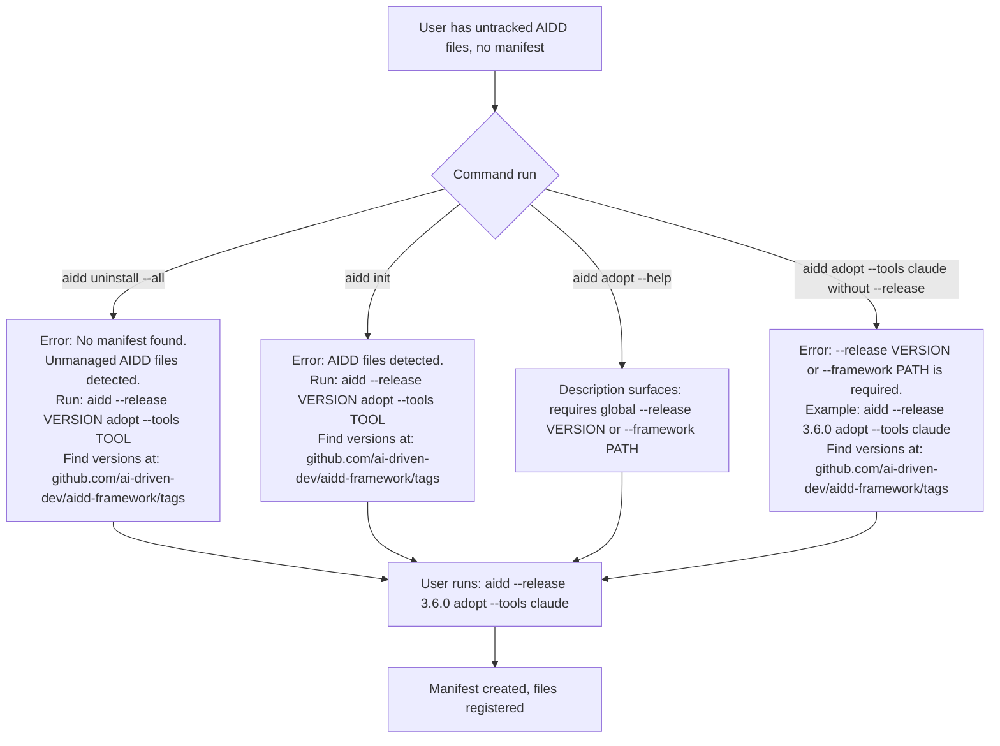

# Instruction: Fix inconsistent state between uninstall, init, and adopt for pre-existing AIDD files

## Feature

- **Summary**: Improve error messages in `init`, `uninstall`, and `adopt` so users with pre-existing unmanaged AIDD files are guided to the exact recovery command, eliminating the current dead-end UX state.
- **Stack**: `TypeScript ESM`, `Node.js >= 24`, `vitest`
- **Branch name**: `fix/inconsistent-state-uninstall-init-adopt`
- **Parent Plan**: none
- **Sequence**: standalone
- Confidence: 9/10
- Time to implement: ~1h

## Progress

- [x] Step 1: Fix `init` error message
- [x] Step 2: Fix `uninstall --all` error message
- [x] Step 3: Fix `adopt` command description and error example
- [x] Step 4: Update affected tests
- [ ] Step 5: Introduce typed error classes (`NoManifestError`, `AiddFilesDetectedError`)
- [ ] Step 6: Propagate `NoManifestError` to all 6 other use-cases with dead-end UX
- [ ] Step 7: Add `opencode` to AIDD signal detection in `init-use-case.ts`
- [ ] Step 8: Strengthen test assertions (verify recovery command + URL)

## Existing files

- @src/application/use-cases/init-use-case.ts
- @src/application/use-cases/uninstall-use-case.ts
- @src/application/use-cases/install-use-case.ts
- @src/application/use-cases/status-use-case.ts
- @src/application/use-cases/doctor-use-case.ts
- @src/application/use-cases/update-use-case.ts
- @src/application/use-cases/restore-use-case.ts
- @src/application/use-cases/sync-use-case.ts
- @src/application/commands/uninstall.ts
- @src/application/commands/adopt.ts
- @tests/application/use-cases/init-use-case.test.ts
- @tests/application/use-cases/uninstall-use-case.test.ts
- @tests/e2e/init.e2e.test.ts
- @tests/e2e/uninstall.e2e.test.ts

### New file to create

- `src/application/errors.ts` — typed error classes: `NoManifestError`, `AiddFilesDetectedError`

## User Journey

## Implementation phases

### Phase 1: Fix error messages in use-cases and commands

> Make every dead-end error actionable with the exact recovery command.

1. In `init-use-case.ts` `checkPreconditions`: update the "AIDD files detected" error to include the full recovery command hint and where to find the version.
2. In `uninstall.ts` command: update the "No AIDD installation found" error (when `manifest === null` in `--all` branch) to acknowledge unmanaged files and point to `adopt`.
3. In `adopt.ts` command: update the command description to surface that `--release VERSION` or `--framework PATH` global option is required. Update the example version in the error from `3.3.3` to a less specific placeholder or a more current example.

### Phase 2: Update tests

> Keep test assertions in sync with the new error messages.

1. Update `init-use-case.test.ts`: fix the `toThrow("AIDD files detected")` assertion to match the new message.
2. Update `uninstall-use-case.test.ts`: fix the `toThrow("No AIDD installation found")` assertion to match the new message.
3. Update any e2e tests that assert on the old exact strings.

## Validation flow

1. Run `aidd uninstall --all` in a project with no manifest but with `.claude/` present → error message mentions `adopt` and includes example command with version hint.
2. Run `aidd init` in a project with existing `.claude/` and no manifest → error message includes full ready-to-run `adopt` command.
3. Run `aidd adopt --help` → description mentions `--release` or `--framework` is required.
4. Run `aidd adopt --tools claude` (without `--release`) → error includes correct example and link to versions page.
5. Run `pnpm test` → all 637+ tests pass.
