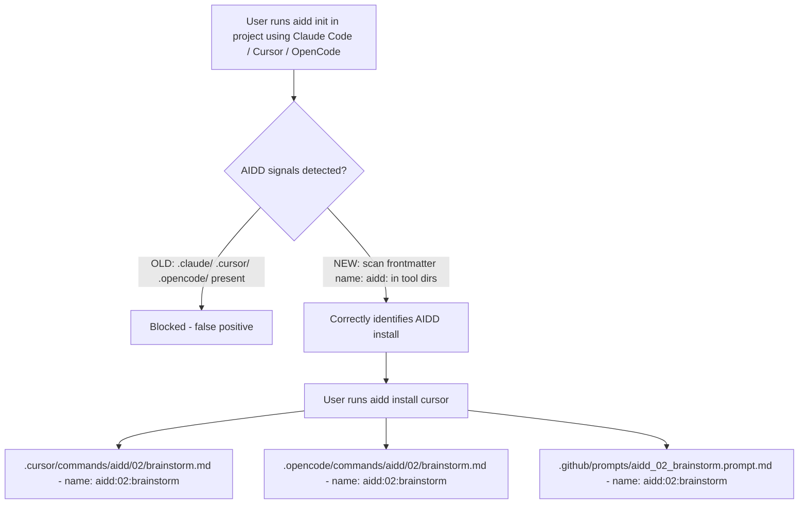

# Instruction: AIDD Branding + Signal Rework

## Feature

- **Summary**: Add AIDD-branded namespacing to cursor/opencode/copilot commands output paths, align frontmatter `name: aidd:XX:name` across all tools, add `name:` to OpenCode, and replace overly broad init signals with frontmatter-based AIDD detection.
- **Stack**: `TypeScript ESM`, `Node.js >= 24`, `vitest`
- **Branch name**: `feat/aidd-branding-signals`
- **Parent Plan**: none
- **Sequence**: standalone
- Confidence: 9/10
- Time to implement: ~1.5h

## Progress

- [ ] Phase 1: cursor.ts — AIDD-branded commands
- [ ] Phase 2: opencode.ts — AIDD-branded commands + name field
- [ ] Phase 3: copilot.ts — align name format to colon convention
- [ ] Phase 4: init-use-case.ts — frontmatter-based signal rework
- [ ] Phase 5: Tests

## Existing files

- @src/domain/tools/cursor.ts
- @src/domain/tools/opencode.ts
- @src/domain/tools/copilot.ts
- @src/application/use-cases/init-use-case.ts
- @tests/domain/tools/cursor.test.ts
- @tests/domain/tools/opencode.test.ts
- @tests/domain/tools/copilot.test.ts
- @tests/application/use-cases/init-use-case.test.ts
- @tests/application/use-cases/sync-use-case.test.ts
- @tests/domain/models/distribution.test.ts

### New file to create

none

## Output paths (final)

| Tool | Commands path | Call |
|------|--------------|------|
| Claude | `.claude/commands/aidd/02/brainstorm.md` | `/aidd:02:brainstorm` (already in place) |
| Cursor | `.cursor/commands/aidd/02/brainstorm.md` | filename `brainstorm` |
| OpenCode | `.opencode/commands/aidd/02/brainstorm.md` | `aidd/02/brainstorm` |
| Copilot | `.github/prompts/aidd_02_brainstorm.prompt.md` | frontmatter `name: aidd:02:brainstorm` |

Frontmatter `name: aidd:02:brainstorm` for all tools (OpenCode gets `name:` field added).

## User Journey

## Implementation phases

### Phase 1: cursor.ts — AIDD-branded commands

> Output commands under `aidd/<phase>/` subfolder, frontmatter name aligned to `aidd:XX:name`

1. `commands().buildFilePath`: output `.cursor/commands/aidd/<phase>/<name>.md` (phase = leading digits from source dir); fallback `.cursor/commands/aidd/<name>.md`
2. `commands().convertFrontmatter`: `name: aidd:<phase>:<baseName>` (colons, same as Claude)
3. `commands().reverseConvertFrontmatter`: strip `aidd:<phase>:` via `/^aidd:\d+:(.+)$/`
4. `detectUserFileSectionKey`: update commands prefix to `.cursor/commands/aidd/`

### Phase 2: opencode.ts — AIDD-branded commands + name field

> Output commands under `aidd/<phase>/` subfolder, add `name: aidd:XX:name` frontmatter

1. `commands().buildFilePath`: output `.opencode/commands/aidd/<phase>/<name>.md`; fallback `.opencode/commands/aidd/<name>.md`
2. `commands().convertFrontmatter`: emit `name: aidd:<phase>:<baseName>` + `description` (break from `descriptionOnlyFrontmatter`)
3. `commands().reverseConvertFrontmatter`: strip `aidd:<phase>:` prefix
4. `detectUserFileSectionKey`: update commands prefix to `.opencode/commands/aidd/`

### Phase 3: copilot.ts — align name format

> Align frontmatter `name` to colon convention `aidd:02:name` (matches Claude)

1. `commandsHandler.convertFrontmatter`: change `aidd_${phase}_${baseName}` → `aidd:${phase}:${baseName}`
2. `commandsHandler.reverseConvertFrontmatter`: update regex to `/^aidd:\d+:(.+)$/`

### Phase 4: init-use-case.ts — frontmatter-based signal rework

> Replace generic directory signals with AIDD frontmatter scan

1. Remove from `aiddSignals`: `.claude/`, `.cursor/`, `.opencode/`, `AGENTS.md`, `.github/copilot-instructions.md`
2. Keep: `docsDir` (fast directory check, first guard)
3. Add helper `hasAiddFrontmatter(dir)`: `fileExists(dir)` → `listDirectory(dir)` → read each `.md`/`.prompt.md` → parse frontmatter → return true if any `name:` starts with `aidd:`
4. Call helper for: `.claude/commands/`, `.cursor/commands/`, `.opencode/commands/`, `.github/prompts/`

### Phase 5: Tests

> Update all tests broken by path/name changes; add new signal tests

1. `cursor.test.ts`: add `buildFilePath` test for commands; update `convertFrontmatter` test (name: `aidd:04:implement`)
2. `opencode.test.ts`: update `buildFilePath` (`.opencode/commands/aidd/04/implement.md`); update `convertFrontmatter` (now emits name); update `detectUserFileSectionKey`
3. `copilot.test.ts`: update `convertFrontmatter` tests (name: `aidd:04:implement` not `aidd_04_implement`)
4. `init-use-case.test.ts`: replace `.claude/` and `.opencode/` signal tests; add frontmatter-based signal test; remove `AGENTS.md` test
5. `sync-use-case.test.ts`: update `.cursor/commands/04_code/implement.md` → `.cursor/commands/aidd/04/implement.md`
6. `distribution.test.ts`: update Copilot/Cursor/OpenCode commands path references

## Validation flow

1. `pnpm test` — all tests pass
2. `aidd install cursor` in fresh project → `.cursor/commands/aidd/02/brainstorm.md` with `name: aidd:02:brainstorm`
3. `aidd install opencode` → `.opencode/commands/aidd/02/brainstorm.md` with `name: aidd:02:brainstorm`
4. `aidd install copilot` → `.github/prompts/aidd_02_brainstorm.prompt.md` with `name: aidd:02:brainstorm`
5. `aidd init` in project with `.claude/` only → succeeds (no false positive)
6. `aidd init` in project with `.claude/commands/aidd/02/brainstorm.md` having `name: aidd:02:brainstorm` → throws `AiddFilesDetectedError`
