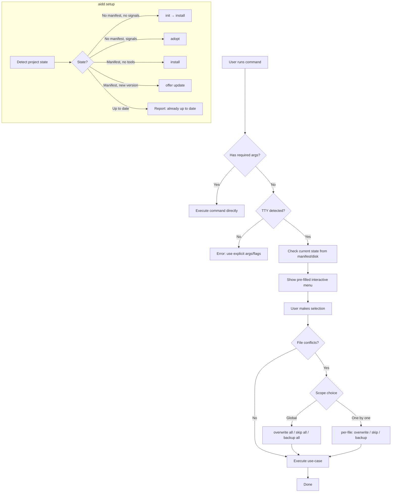

# Instruction: Interactive Mode — Master Plan

## Feature

- **Summary**: Add interactive fallback menus to all argument-driven commands using `@inquirer/prompts`; introduce cross-cutting conflict/override resolution with backup; add new `aidd setup` idempotent state-machine command
- **Stack**: `TypeScript ESM`, `Node.js >= 24`, `@inquirer/prompts ^7.0.0`, `commander`, `vitest`
- **Branch name**: `feat/interactive-mode`
- **Parent Plan**: `none`
- **Sequence**: `master`
- **Confidence**: 8/10
- **Time to implement**: ~5 sessions

## Progress

- [ ] Part 1: Interactive I/O Layer + Conflict Resolution Infrastructure
- [ ] Part 2: Tool Selection Commands (install, uninstall, adopt)
- [ ] Part 3: Configuration Commands (init, config get/set)
- [ ] Part 4: State Management Commands (update, restore, sync, cache clear)
- [ ] Part 5: aidd setup Command

## Child Plans

- @aidd_docs/tasks/2026_03/2026_03_18-interactive-mode-part-1.md
- @aidd_docs/tasks/2026_03/2026_03_18-interactive-mode-part-2.md
- @aidd_docs/tasks/2026_03/2026_03_18-interactive-mode-part-3.md
- @aidd_docs/tasks/2026_03/2026_03_18-interactive-mode-part-4.md
- @aidd_docs/tasks/2026_03/2026_03_18-interactive-mode-part-5.md

## Existing Files

- @src/cli.ts
- @src/domain/ports/prompter.ts
- @src/infrastructure/adapters/prompter-adapter.ts
- @src/infrastructure/deps.ts
- @src/application/commands/install.ts
- @src/application/commands/uninstall.ts
- @src/application/commands/init.ts
- @src/application/commands/adopt.ts
- @src/application/commands/update.ts
- @src/application/commands/restore.ts
- @src/application/commands/sync.ts
- @src/application/commands/config.ts
- @src/application/commands/cache.ts
- @src/domain/ports/file-system.ts
- @src/infrastructure/adapters/file-system-adapter.ts

### New Files to Create

- `src/application/detect-aidd-signals.ts` (extracted from `InitUseCase.hasAiddSignals()`)
- `src/application/use-cases/conflict-resolution-use-case.ts`
- `src/application/use-cases/setup-use-case.ts`
- `src/application/commands/setup.ts`

## User Journey

## Architecture Constraints

- Interactive logic lives in the **command layer** (application), never in use-cases or domain
- `Prompter` port extended with generic primitives: `confirm`, `input`, `select`, `checkbox`
- `SilentPrompterAdapter` returns safe defaults for all new methods (CI/non-TTY)
- `InquirerPrompterAdapter` implements all new methods via `@inquirer/prompts`
- `Prompter` wired via `deps.ts` — commands receive it as a parameter, no direct instantiation
- TTY check: `process.stdout.isTTY` (already used in codebase) — centralized in one helper
- Backup: `fs.backup(absolutePath)` → copies file to `<path>.bak.<timestamp>` — added to `FileSystem` port
- `aidd setup` is interactive-only: fails immediately if no TTY

## Validation Flow

1. Run `aidd install` with no args in TTY → checkbox appears with uninstalled tools selectable
2. Run `aidd install` with no args without TTY → error message
3. Run `aidd install claude` → no menu, direct install (no regression)
4. Install claude, then run `aidd install` → claude appears pre-checked and disabled
5. Run `aidd init` with no args → prompts for docsDir and repo
6. Run `aidd update` with no args → shows version diff, scope, confirmation
7. Run `aidd restore` with no args → checkbox of drifted files
8. Run `aidd sync` with no args → source tool select, then target checkbox
9. Run `aidd adopt` with no args → tools checkbox + version input
10. Run `aidd config get` with no args → key select, displays value
11. Run `aidd config set` with no args → key select + value input
12. Run `aidd cache clear` with no args → checkbox of cached versions
13. During install, file conflict detected → scope prompt appears, backup creates `.bak.timestamp`
14. Run `aidd setup` on fresh project → guides through init + install
15. Run `aidd setup` again on same project → reports "already up to date"
16. Run `aidd setup` without TTY → fails with clear error
