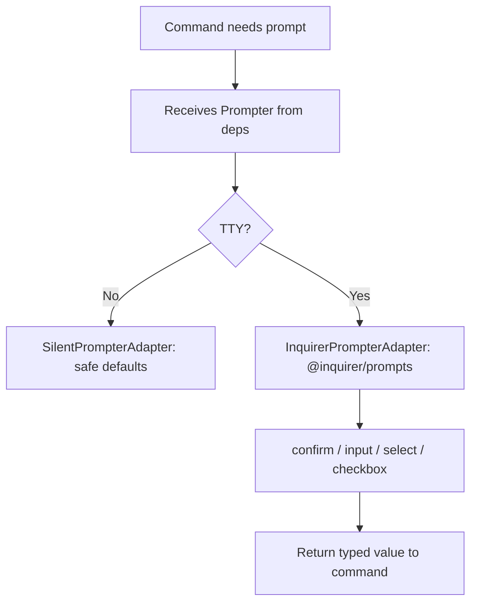

# Instruction: Interactive Mode — Part 1: I/O Layer + Conflict Resolution Infrastructure

## Feature

- **Summary**: Extend `Prompter` port with generic interactive primitives; implement `SilentPrompterAdapter` and `InquirerPrompterAdapter`; add `fs.backup()` to FileSystem; centralize TTY detection; wire `Prompter` into `deps.ts`
- **Stack**: `TypeScript ESM`, `Node.js >= 24`, `@inquirer/prompts ^7.0.0`
- **Branch name**: `feat/interactive-mode`
- **Parent Plan**: `@aidd_docs/tasks/2026_03/2026_03_18-interactive-mode-master.md`
- **Sequence**: `1 of 5`
- **Confidence**: 9/10
- **Time to implement**: 1 session

## Progress

- [ ] Step 0: Clarification
- [ ] Step 1: Extend Prompter port
- [ ] Step 2: Implement adapters
- [ ] Step 3: Add backup to FileSystem
- [ ] Step 4: Wire Prompter into deps.ts
- [ ] Step 5: Implement conflict resolution helper
- [ ] Step 6: Tests

## Existing Files

- @src/domain/ports/prompter.ts
- @src/infrastructure/adapters/prompter-adapter.ts
- @src/infrastructure/deps.ts
- @src/domain/ports/file-system.ts
- @src/infrastructure/adapters/file-system-adapter.ts
- @src/application/use-cases/update-use-case.ts

### New Files to Create

- `src/application/use-cases/conflict-resolution-use-case.ts`

## User Journey

## Implementation Phases

### Phase 1: Extend Prompter Port

> Add generic interactive primitives to the port; preserve existing `resolveConflict`

1. Add to `Prompter` port:
   - `confirm(message: string): Promise<boolean>`
   - `input(message: string, defaultValue?: string): Promise<string>`
   - `select<T>(message: string, choices: Array<{ name: string; value: T; disabled?: boolean }>): Promise<T>`
   - `checkbox<T>(message: string, choices: Array<{ name: string; value: T; checked?: boolean; disabled?: boolean }>): Promise<T[]>`
2. Keep existing `resolveConflict` unchanged for backward compatibility

### Phase 2: Implement Adapters

> Both adapters must implement all new methods

1. `SilentPrompterAdapter`:
   - `confirm` → returns `true`
   - `input` → returns `defaultValue ?? ""`
   - `select` → returns first non-disabled choice value
   - `checkbox` → returns all pre-checked, non-disabled choice values
2. `InquirerPrompterAdapter`:
   - `confirm` → `@inquirer/prompts` `confirm()`
   - `input` → `@inquirer/prompts` `input()`
   - `select` → `@inquirer/prompts` `select()`
   - `checkbox` → `@inquirer/prompts` `checkbox()`

### Phase 3: Add Backup to FileSystem Port + Adapter

> Add `backup(absolutePath: string): Promise<string>` — copies file to `<path>.bak.<iso-timestamp>`

1. Add `backup(absolutePath: string): Promise<string>` to `FileSystem` port (returns backup path)
2. Implement in `FileSystemAdapter` using `node:fs` copy
3. Timestamp format: `ISO 8601` without colons (safe for filenames: `2026-03-18T104500`)

### Phase 4: Wire Prompter into deps.ts

> Commands currently instantiate prompter directly — centralize in deps

1. Add `prompter: Prompter` to `Deps` interface in `deps.ts`
2. In `createDeps`: instantiate `InquirerPrompterAdapter` if `process.stdout.isTTY`, else `SilentPrompterAdapter`
3. Update `restore.ts` and `config.ts` (the two existing commands that instantiate prompter directly) to use `deps.prompter` instead
4. Remove direct instantiation of prompter adapters from command files

### Phase 5: Add backup to FileSystem Port + Adapter + Migrate UpdateUseCase

> `fs.backup()` is pure I/O — belongs in FileSystem port. UpdateUseCase currently inlines backup logic: migrate to use the port method for consistency.

1. Add `backup(absolutePath: string): Promise<string>` to `FileSystem` port — returns backup path
2. Implement in `FileSystemAdapter`: copies file to `<path>.bak.<iso-timestamp>` (e.g. `file.txt.bak.2026-03-18T104500`) using `node:fs`
3. In `UpdateUseCase.applyDiff()`: replace the inline `writeFile(.backup)` with `this.fs.backup(diskPath)` — unified backup format, no more `.backup` suffix without timestamp

### Phase 6: ConflictResolutionUseCase

> New use-case — orchestrates the global/one-by-one prompt flow with backup; reused by install, adopt, sync in later parts

1. Create `src/application/use-cases/conflict-resolution-use-case.ts`:
   - Constructor: `FileSystem`, `Prompter`
   - `execute(absolutePaths: string[]): Promise<Map<string, "overwrite" | "skip" | "backup">>`
   - First prompt: `select` — "Handle conflicts globally or one by one?"
   - Global: single `select` → overwrite all / skip all / backup all
   - One by one: per-file `select` → overwrite / skip / backup
   - For backup resolution: calls `this.fs.backup(path)` immediately, returns `"backup"` in map

### Phase 7: Tests

1. Unit test `SilentPrompterAdapter` all new methods
2. Unit test `InquirerPrompterAdapter` (mock `@inquirer/prompts`)
3. Unit test `FileSystemAdapter.backup()` with temp dir — assert filename format
4. Unit test `ConflictResolutionUseCase` — global flow, one-by-one flow, backup calls `fs.backup()`
5. Unit test `UpdateUseCase` — assert it calls `fs.backup()` (not inline write) on conflict

## Validation Flow

1. `deps.prompter` is available in all commands
2. Non-TTY environment → `SilentPrompterAdapter` is wired automatically
3. `restore` and `config` continue to work unchanged (using deps.prompter)
4. `fs.backup("file.txt")` creates `file.txt.bak.2026-03-18T104500`
5. `ConflictResolutionUseCase` returns correct map for all 3 resolution types (global + one-by-one)
6. `UpdateUseCase` conflict backup uses `fs.backup()` — consistent `.bak.timestamp` format
