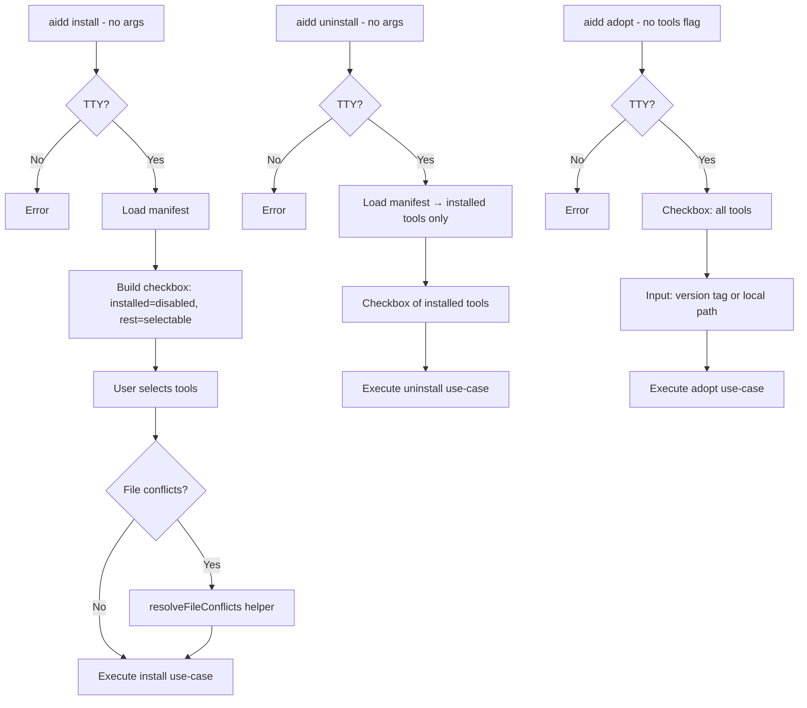

# Instruction: Interactive Mode — Part 2: Tool Selection Commands

## Feature

- **Summary**: Add interactive fallback to `install`, `uninstall`, and `adopt` commands; pre-check and disable already-installed tools; use conflict resolution helper for file overrides
- **Stack**: `TypeScript ESM`, `Node.js >= 24`, `@inquirer/prompts ^7.0.0`
- **Branch name**: `feat/interactive-mode`
- **Parent Plan**: `@aidd_docs/tasks/2026_03/2026_03_18-interactive-mode-master.md`
- **Sequence**: `2 of 5`
- **Confidence**: 9/10
- **Time to implement**: 1 session

## Progress

- [ ] Step 0: Clarification
- [ ] Step 1: install — interactive fallback
- [ ] Step 2: uninstall — interactive fallback
- [ ] Step 3: adopt — interactive fallback
- [ ] Step 4: Tests

## Existing Files

- @src/application/commands/install.ts
- @src/application/commands/uninstall.ts
- @src/application/commands/adopt.ts
- @src/application/interactive/conflict-resolution.ts

### New Files to Create

- none

## User Journey

## Implementation Phases

### Phase 1: install — Interactive Fallback

> When no `[tools...]` and no `--all`: show checkbox instead of error

1. In `install.ts`, detect missing args: `tools.length === 0 && !options.all`
2. Check TTY: `!process.stdout.isTTY` → print error + exit 1
3. Load manifest via `deps.manifestRepo.load()` to get already-installed tools
4. Build checkbox choices: all supported tool IDs (`claude`, `cursor`, `copilot`, `opencode`)
   - Installed tools: `checked: true, disabled: "(already installed)"`
   - Uninstalled tools: `checked: false`
5. Call `deps.prompter.checkbox(...)` → resolved tools array
6. Abort if user selects nothing
7. Check for conflicting files before proceeding → call `resolveFileConflicts`
8. Proceed with existing install use-case logic using resolved tools

### Phase 2: uninstall — Interactive Fallback

> When no `[tools...]` and no `--all`: show checkbox of installed tools only

1. In `uninstall.ts`, detect missing args: `tools.length === 0 && !options.all`
2. Check TTY → error + exit 1 if not
3. Load manifest → extract installed tool IDs
4. If no tools installed → print "No tools installed" + exit 0
5. Build checkbox from installed tools only, all pre-unchecked (user chooses what to remove)
6. Abort if user selects nothing
7. Proceed with existing uninstall use-case logic

### Phase 3: adopt — Interactive Fallback

> When no `--tools`: show tools checkbox + version/path input

1. In `adopt.ts`, detect missing `--tools` option
2. Check TTY → error + exit 1 if not
3. Show checkbox of all supported tools (none pre-checked, none disabled)
4. Abort if user selects nothing
5. Ask: "Framework version tag or local path?" (`input`, no default)
6. Detect if input looks like a path (starts with `/`, `./`, `../`) → map to `--path`; else → map to `--release`
7. Proceed with existing adopt use-case logic

### Phase 4: Tests

> Unit tests for each interactive branch; e2e tests for the non-interactive regression

1. Unit test install interactive branch: mock prompter.checkbox, assert use-case called with correct tools
2. Unit test install: already-installed tools appear as disabled in choices
3. Unit test uninstall interactive branch: mock prompter.checkbox
4. Unit test adopt interactive branch: path detection logic (path vs version tag)
5. E2e: `aidd install claude cursor` still works without prompts (no regression)
6. E2e: `aidd install` in non-TTY → exits with error code 1

## Validation Flow

1. Run `aidd install` in TTY → checkbox with 4 tools, none pre-checked (fresh project)
2. Install claude, run `aidd install` again → claude pre-checked + disabled, others selectable
3. Select no tools → abort with message
4. Run `aidd uninstall` with claude installed → checkbox shows only claude
5. Run `aidd adopt` → tools checkbox then version input
6. Input `./my-framework` → resolves as local path; input `v3.2.0` → resolves as release tag
7. Non-TTY: all 3 commands exit 1 with explicit error when args missing
