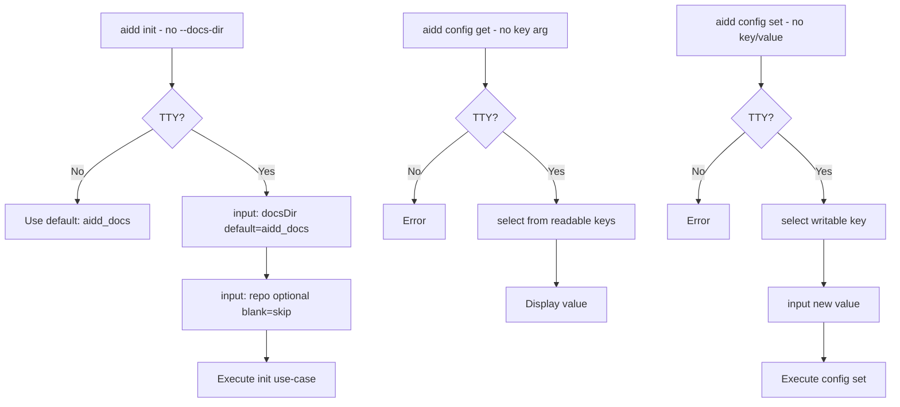

# Instruction: Interactive Mode — Part 3: Configuration Commands

## Feature

- **Summary**: Add interactive fallback to `init` (docsDir + repo inputs) and `config get` (key select) + `config set` (key select + value input)
- **Stack**: `TypeScript ESM`, `Node.js >= 24`, `@inquirer/prompts ^7.0.0`
- **Branch name**: `feat/interactive-mode`
- **Parent Plan**: `@aidd_docs/tasks/2026_03/2026_03_18-interactive-mode-master.md`
- **Sequence**: `3 of 5`
- **Confidence**: 9/10
- **Time to implement**: 1 session

## Progress

- [ ] Step 0: Clarification
- [ ] Step 1: init — interactive fallback
- [ ] Step 2: config get — interactive fallback
- [ ] Step 3: config set — interactive fallback
- [ ] Step 4: Tests

## Existing Files

- @src/application/commands/init.ts
- @src/application/commands/config.ts

### New Files to Create

- none

## User Journey

## Implementation Phases

### Phase 1: init — Interactive Fallback

> When no `--docs-dir` provided AND TTY: prompt for docsDir and repo

1. In `init.ts`, detect missing `--docs-dir`
2. If not TTY → fall through to existing default behavior (no change, `init` already works without `--docs-dir`)
3. If TTY and no `--docs-dir`:
   - `prompter.input("Documentation directory name:", "aidd_docs")` → validate same regex as flag
   - `prompter.input("Framework repository (owner/repo, leave blank to skip):", "")` → empty = omit
4. Map collected values to existing init use-case options
5. No change to `--force` behavior: if `--force` passed, skip confirmation prompts (existing behavior preserved)

### Phase 2: config get — Interactive Fallback

> When no `<key>` argument: select from readable config keys

1. In `config.ts get` subcommand, detect missing `key` argument
2. Check TTY → error + exit 1 if not
3. Build select choices from readable keys: `docsDir`, `repo`, `tools`
4. `prompter.select("Which config key?", choices)` → selected key
5. Execute existing get logic with selected key

### Phase 3: config set — Interactive Fallback

> When no `<key>` or `<value>`: select key then input value

1. In `config.ts set` subcommand, detect missing args
2. Check TTY → error + exit 1 if not
3. Build select choices from writable keys only: `docsDir`, `repo`
4. `prompter.select("Which config key to set?", choices)` → selected key
5. Load current value from manifest as default
6. `prompter.input("New value:", currentValue ?? "")` → new value
7. The existing TTY confirmation prompt in `config set` (lines 105, 141) is preserved as-is — interactive flow just feeds key+value before reaching it

### Phase 4: Tests

> Unit tests per interactive branch

1. Unit test init interactive: prompter.input called with correct defaults
2. Unit test init: blank repo input → repo omitted from use-case call
3. Unit test config get interactive: select resolves to correct key, get logic executes
4. Unit test config set interactive: select + input feeds existing set flow
5. E2e: `aidd init --docs-dir mydir` works unchanged (no regression)
6. E2e: `aidd config get docsDir` works unchanged

## Validation Flow

1. Run `aidd init` in TTY → prompted for docsDir (default: aidd_docs) then repo
2. Leave repo blank → init proceeds without repo in manifest
3. Run `aidd init --docs-dir custom` → no prompt (direct execution)
4. Run `aidd config get` in TTY → key selector appears with docsDir/repo/tools
5. Run `aidd config set` in TTY → writable key selector, then value input with current value as default
6. Non-TTY: `config get`/`config set` without args exit 1 with explicit error
