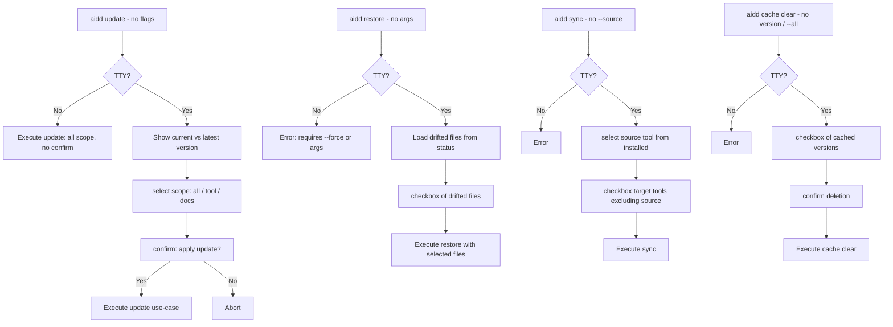

# Instruction: Interactive Mode — Part 4: State Management Commands

## Feature

- **Summary**: Add interactive fallback to `update` (diff preview + scope + confirm), `restore` (checkbox of drifted files), `sync` (source select + target checkbox), `cache clear` (checkbox of cached versions)
- **Stack**: `TypeScript ESM`, `Node.js >= 24`, `@inquirer/prompts ^7.0.0`
- **Branch name**: `feat/interactive-mode`
- **Parent Plan**: `@aidd_docs/tasks/2026_03/2026_03_18-interactive-mode-master.md`
- **Sequence**: `4 of 5`
- **Confidence**: 8/10
- **Time to implement**: 1 session

## Progress

- [ ] Step 0: Clarification
- [ ] Step 1: update — interactive fallback
- [ ] Step 2: restore — interactive fallback
- [ ] Step 3: sync — interactive fallback
- [ ] Step 4: cache clear — interactive fallback
- [ ] Step 5: Tests

## Existing Files

- @src/application/commands/update.ts
- @src/application/commands/restore.ts
- @src/application/commands/sync.ts
- @src/application/commands/cache.ts

### New Files to Create

- none

## User Journey

## Implementation Phases

### Phase 1: update — Interactive Fallback

> When no flags provided AND TTY: show version info, scope select, confirm

1. In `update.ts`, detect no relevant flags (`!force && !dryRun && !tool && !docs`)
2. If not TTY → fall through to existing behavior (updates all scope, no prompt)
3. If TTY and no flags:
   - Print current version and latest version (already fetched by `printUpdateBanner`)
   - `prompter.select("Scope?", ["all", "tool: <id>", "docs"])` → map to existing options
   - `prompter.confirm("Apply update?")` → if false, abort
4. Map selections to existing update use-case options

### Phase 2: restore — Interactive Fallback

> When no `[files...]` and no `--tool`/`--docs` AND TTY: checkbox of drifted files

1. In `restore.ts`, existing TTY check already gates `--force`. Extend: when no `files` and no scope flags and no `--force`:
2. Check TTY → error if not (existing behavior preserved)
3. Run status use-case (drift detection) to get modified/deleted files list
4. If no drift → print "Nothing to restore" + exit 0
5. `prompter.checkbox("Select files to restore:", driftedFiles)` → selected files
6. Abort if nothing selected
7. Pass selected file paths to existing restore use-case

### Phase 3: sync — Interactive Fallback

> When no `--source` AND TTY: select source, then target tools

1. In `sync.ts`, detect missing `--source` option
2. Check TTY → error + exit 1 if not
3. Load manifest → installed tool IDs (minimum 2 required, existing validation)
4. `prompter.select("Source tool?", installedTools)` → source
5. `prompter.checkbox("Target tools?", installedTools excluding source)` → targets
6. Abort if no targets selected
7. Proceed with existing sync use-case

### Phase 4: cache clear — Interactive Fallback

> When no `[version]` and no `--all` AND TTY: checkbox of cached versions

1. In `cache.ts clear` subcommand, detect missing version and no `--all`
2. Check TTY → error + exit 1 if not
3. Load cached versions from `FrameworkCache` (list)
4. If no cached versions → print "No cached versions" + exit 0
5. `prompter.checkbox("Select versions to clear:", cachedVersions)` → selected
6. Abort if nothing selected
7. `prompter.confirm("Delete selected versions?")` → if false, abort
8. Execute existing clear logic per selected version

### Phase 5: Tests

> Unit tests per interactive branch

1. Unit test update interactive: scope select + confirm → use-case called with correct options
2. Unit test update: TTY=false, no flags → direct execution (no regression)
3. Unit test restore interactive: drift list → checkbox → restore with selected files
4. Unit test restore: empty drift → "Nothing to restore"
5. Unit test sync interactive: source select + target checkbox → use-case
6. Unit test cache clear interactive: version checkbox + confirm
7. E2e: `aidd update --force` works unchanged

## Validation Flow

1. Run `aidd update` in TTY → version display, scope select, confirm prompt
2. Answer No to confirm → abort, no files changed
3. Run `aidd restore` in TTY with drifted files → checkbox shows only drifted files
4. Run `aidd restore --force` → no prompt (existing behavior)
5. Run `aidd sync` without `--source` in TTY → source select then target checkbox
6. Run `aidd cache clear` in TTY → checkbox of cached versions + confirmation
7. Non-TTY: `sync` and `cache clear` without args exit 1 with explicit error
