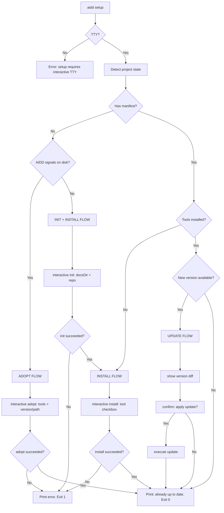

# Instruction: Interactive Mode — Part 5: aidd setup Command

## Feature

- **Summary**: New `aidd setup` command — interactive-only, idempotent state machine that detects current project state and chains init/adopt/install/update to reach a stable installed state
- **Stack**: `TypeScript ESM`, `Node.js >= 24`, `@inquirer/prompts ^7.0.0`, `commander`
- **Branch name**: `feat/interactive-mode`
- **Parent Plan**: `@aidd_docs/tasks/2026_03/2026_03_18-interactive-mode-master.md`
- **Sequence**: `5 of 5`
- **Confidence**: 8/10
- **Time to implement**: 1 session

## Progress

- [ ] Step 0: Clarification
- [ ] Step 1: State detection logic
- [ ] Step 2: setup command implementation
- [ ] Step 3: Register in cli.ts
- [ ] Step 4: Tests

## Existing Files

- @src/cli.ts
- @src/application/commands/init.ts
- @src/application/commands/install.ts
- @src/application/commands/adopt.ts
- @src/application/commands/update.ts
- @src/infrastructure/deps.ts
- @src/application/use-cases/init-use-case.ts
- @src/application/use-cases/install-use-case.ts
- @src/application/use-cases/adopt-use-case.ts
- @src/application/use-cases/update-use-case.ts
- @src/application/use-cases/status-use-case.ts

### New Files to Create

- `src/application/detect-aidd-signals.ts` (extracted from `InitUseCase.hasAiddSignals()`)
- `src/application/use-cases/setup-use-case.ts`
- `src/application/commands/setup.ts`

## User Journey



## Implementation Phases

### Phase 1: SetupUseCase — State Detection

> Use-case responsible for determining which state the project is in; uses existing ports only, no logic duplication

1. Create `src/application/use-cases/setup-use-case.ts`
2. Constructor: `ManifestRepository`, `FileSystem`, `FrameworkResolver`
3. `detectState(): Promise<SetupState>` where:
   ```
   type SetupState =
     | { kind: "needs-init" }
     | { kind: "needs-adopt" }
     | { kind: "needs-install" }
     | { kind: "needs-update"; currentVersion: string; latestVersion: string }
     | { kind: "up-to-date" }
   ```
4. Detection logic (uses ports directly, no reimplementation):
   - `manifestRepo.load()` → null: check AIDD signals via `detectAiddSignals(fs, projectRoot): Promise<boolean>` — extracted from `InitUseCase.hasAiddSignals()` (currently private) into a shared application-layer function `src/application/detect-aidd-signals.ts`; `InitUseCase` is refactored to call the shared function instead of its private method
     - Signals found → `needs-adopt`
     - No signals → `needs-init`
   - Manifest exists, `manifest.getInstalledToolIds().length === 0` → `needs-install`
   - Manifest + tools: `resolver.fetchLatestVersion()` → compare with manifest tool versions
     - New version → `needs-update` (with versions)
     - Same → `up-to-date`
5. Network failure in version check → `up-to-date` (silent, consistent with `status` behavior)

### Phase 2: setup Command — Thin Orchestration Layer

> Command layer is thin: TTY check + call SetupUseCase.detectState() + orchestrate existing use-cases based on result

1. Create `src/application/commands/setup.ts` with `registerSetupCommand(program)`
2. No options, no arguments
3. On entry: `!process.stdout.isTTY` → error + exit 1
4. Call `SetupUseCase.detectState()` → switch on result:
   - `needs-init`:
     - Prompt docsDir + repo (same prompts as `init` interactive, Part 3)
     - Call `InitUseCase` directly with collected values
     - On failure → print error + exit 1 (stop, do not proceed)
     - On success → fall through to `needs-install`
   - `needs-adopt`:
     - Prompt tools + version/path (same prompts as `adopt` interactive, Part 2)
     - Call `AdoptUseCase` directly
     - On failure → print error + exit 1
   - `needs-install`:
     - Prompt tool checkbox (same as `install` interactive, Part 2)
     - Call `InstallUseCase` directly
     - On failure → print error + exit 1
   - `needs-update`:
     - Call `UpdateUseCase(dryRun: true)` → display diff summary (added/changed/removed counts)
     - `deps.prompter.confirm("Apply update?")` → if no, exit 0
     - Call `UpdateUseCase(dryRun: false)` — framework served from cache, no re-download
   - `up-to-date`:
     - Print "Project is up to date" + exit 0
6. **No prompt logic duplicated** — interactive prompts from Parts 2–4 are extracted as shared functions in `src/application/interactive/` if reused in 2+ places; otherwise inlined

### Phase 3: Register in cli.ts

1. Import `registerSetupCommand` in `cli.ts`
2. Call `registerSetupCommand(program)` alongside other commands

### Phase 4: Tests

1. Unit test `SetupUseCase.detectState()`: all 5 states with mocked ports
2. Unit test: network failure → `up-to-date`
3. Unit test: `detectAiddSignals()` — with and without AIDD signals (frontmatter `name: aidd[_:]` in command dirs); existing `InitUseCase` tests remain green after refactor
4. E2e: fresh project → `aidd setup` → init + install flow completes
5. E2e: AIDD signals, no manifest → adopt flow
6. E2e: manifest, no tools → install flow
7. E2e: up-to-date → "Project is up to date", exit 0
8. E2e: non-TTY → exit 1 with error
9. E2e: init failure → stops cleanly, install not attempted

## Validation Flow

1. Fresh directory → `aidd setup` → guided init then tool selection → project fully initialized
2. Re-run `aidd setup` on same project (up to date) → "Project is up to date"
3. Re-run after framework update available → update prompt appears
4. Project with manually copied AIDD files (no manifest) → adopt flow triggered
5. Project with manifest but no tools → install flow triggered
6. `aidd setup` in CI (no TTY) → exits 1 with "setup requires interactive TTY"
7. Simulate init failure → setup stops cleanly, no install attempt
