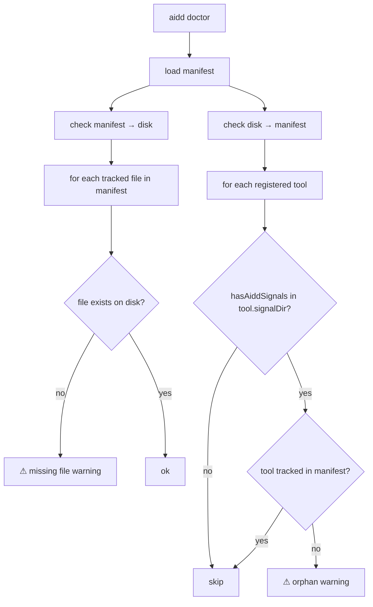

# Instruction: Doctor — signal-based orphan detection

## Feature

- **Summary**: Fix false positive on `.github/` in `aidd doctor` by replacing directory existence check with aidd signal detection (frontmatter scan). Signal logic mutualisée dans `domain/models/tool-config.ts` — chaque tool expose `signalDir` (data), une fonction partagée fait le scan via le port `FileSystem`. Doctor couvre les deux directions : manifest→disk (tracked files manquants) et disk→manifest (aidd files non trackés).
- **Stack**: `TypeScript`, `Node.js`, `Vitest`
- **Branch name**: `fix/doctor-signal-detection`
- **Parent Plan**: `none`
- **Sequence**: `standalone`
- Confidence: 9.5/10
- Time to implement: ~1.5h

## Existing files

- @src/domain/models/tool-config.ts
- @src/domain/ports/file-system.ts
- @src/domain/tools/claude.ts
- @src/domain/tools/cursor.ts
- @src/domain/tools/copilot.ts
- @src/domain/tools/opencode.ts
- @src/application/use-cases/doctor-use-case.ts
- @src/application/use-cases/init-use-case.ts
- @tests/application/use-cases/doctor-use-case.test.ts

### New file to create

- none

## User Journey

## Implementation phases

### Phase 1 — `signalDir` + `hasToolSignals` dans `domain/models/tool-config.ts`

> Chaque tool expose ses signaux comme donnée, la fonction de scan vit dans le domain

1. Ajouter `signalDir: string` à l'interface `ToolConfig`
2. Ajouter `export async function hasToolSignals(fs: FileSystem, config: ToolConfig, projectRoot: string): Promise<boolean>` dans `tool-config.ts`
   - `fileExists(join(projectRoot, config.signalDir))` → false early return
   - `listDirectory(join(projectRoot, config.signalDir))` → filter `.md` → scan `/^name:\s*['"]?aidd[_:]/m`
3. Implémenter `signalDir` dans chaque tool:
   - `claude`: `.claude/commands`
   - `cursor`: `.cursor/commands`
   - `opencode`: `.opencode/commands`
   - `copilot`: `.github/prompts`

### Phase 2 — Fixer `checkBrokenReferences` → `checkMissingTrackedFiles`

> `checkBrokenReferences` fait actuellement `continue` si le fichier n'existe pas sur disque — gap manifest→disk

1. Ajouter `checkMissingTrackedFiles(allTrackedFiles, projectRoot)` dans `DoctorUseCase`
   - Pour chaque fichier tracké dans le manifest, si `!fileExists(fullPath)` → warning `error`
2. Ordre d'appel dans `execute()` :
   1. `checkMissingTrackedFiles` — manifest → disk
   2. `checkBrokenReferences` — références internes
   3. `checkOrphanedDirectories` — disk → manifest
3. `checkBrokenReferences` continue de vérifier les références internes (comportement inchangé)

### Phase 3 — Update `DoctorUseCase.checkOrphanedDirectories`

> Remplacer `fileExists(directory)` par `hasToolSignals(fs, tool, projectRoot)`

1. Remplacer `fileExists(join(projectRoot, tool.directory))` par `hasToolSignals(this.fs, tool, projectRoot)`
2. Supprimer toute logique de scan inline dans le doctor
3. Manifest check préservé : `!installedToolDirs.has(tool.directory)` inchangé

### Phase 4 — Update `InitUseCase.hasAiddSignals`

> Dériver les dirs depuis le registry au lieu de la liste hardcodée

1. Supprimer la méthode privée `hasAiddSignals`
2. Remplacer par : `getAllRegisteredTools()` → pour chaque tool → `hasToolSignals(this.fs, tool, projectRoot)` → any true → return true
3. Comportement identique, source de vérité déplacée dans le registry

### Phase 5 — Tests

> Couvrir le nouveau comportement

1. `.github/` avec seulement `workflows/ci.yml` → aucun orphan warning
2. `.github/prompts/` avec `name: aidd:01:plan` sans manifest → orphan warning
3. `.github/prompts/` avec contenu non-aidd → aucun warning
4. Fichier tracké dans manifest mais absent sur disk → `error` warning (manifest→disk)
5. `hasToolSignals` testé en isolation (FileSystem mocké)

## Validation flow

1. Project with `.github/workflows/ci.yml`, no Copilot install → `aidd doctor` → no `.github/` warning
2. Project with `.github/prompts/plan.prompt.md` containing `name: aidd:01:plan`, no manifest → `aidd doctor` → orphan warning
3. Project with Copilot installed + manifest → `aidd doctor` → healthy
4. Run full test suite → all green
