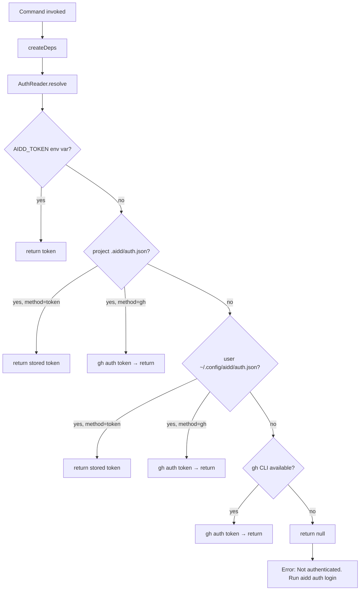

# Instruction: Auth Infrastructure — AuthReader + token removal

## Feature

- **Summary**: Replace `TokenResolver` with `AuthReader` that reads from env → project auth.json → user auth.json → gh CLI. Remove `--token` flag and centralize `AIDD_TOKEN` inside `AuthReader` only.
- **Stack**: `TypeScript 5`, `Node.js`, `vitest 2`
- **Branch name**: `feat/aidd-auth`
- **Parent Plan**: `./2026_03_20-#54-aidd-auth-master.md`
- **Sequence**: `1 of 3`
- **Confidence**: 9/10
- **Time to implement**: 1 session

## Existing files

- @src/infrastructure/auth/token-resolver.ts
- @src/infrastructure/deps.ts
- @src/cli.ts
- @src/application/commands/init.ts
- @src/application/commands/install.ts
- @src/application/commands/update.ts
- @src/application/commands/sync.ts
- @src/application/commands/restore.ts
- @src/application/commands/adopt.ts
- @src/application/commands/doctor.ts
- @src/application/commands/self-update.ts
- @src/infrastructure/http/http-client.ts
- @tests/infrastructure/auth/token-resolver.test.ts

### New files to create

- `src/domain/models/auth-config.ts`
- `src/infrastructure/auth/auth-reader.ts`
- `src/infrastructure/auth/auth-storage.ts`
- `tests/infrastructure/auth/auth-reader.test.ts`
- `tests/infrastructure/auth/auth-storage.test.ts`

## User Journey

## Implementation phases

### Phase 1 — AuthConfig domain model + AuthStorage

> Define the data shape and file I/O with platform-safe permissions

1. Create `src/domain/models/auth-config.ts` — interface `AuthConfig { version: 1; method: 'gh' | 'token'; level: 'user' | 'project'; token?: string; createdAt: string }`
2. Create `src/infrastructure/auth/auth-storage.ts` — `AuthStorage` class with:
   - `userConfigPath()` → `~/.config/aidd/auth.json`
   - `projectConfigPath(projectRoot)` → `.aidd/auth.json`
   - `read(path): AuthConfig | null` — returns null if file missing or malformed
   - `write(path, config)` — writes JSON, then:
     - Unix/macOS: `fs.chmod(path, 0o600)`
     - Windows (`process.platform === 'win32'`): spawn `icacls <path> /inheritance:r /grant:r "%USERNAME%:(R,W)"` — throw explicit error if it fails
3. Write `tests/infrastructure/auth/auth-storage.test.ts`

### Phase 2 — AuthReader

> Single resolution chain, replaces TokenResolver

1. Create `src/infrastructure/auth/auth-reader.ts` — `AuthReader` class:
   - Constructor: `(storage: AuthStorage, projectRoot: string, logger?: Logger)`
   - `resolve(): string | null` — reads in order:
     1. `process.env.AIDD_TOKEN`
     2. Project `auth.json` → if method=`gh`, call `gh auth token`; if method=`token`, return `config.token`
     3. User `auth.json` → same
     4. `gh auth token` (direct fallback, 3s timeout, silent on failure)
     5. `null`
   - Never logs token values, only resolution source (debug)
2. Write `tests/infrastructure/auth/auth-reader.test.ts` — cover all 5 resolution paths + silent failure of gh CLI

### Phase 3 — Wire AuthReader into createDeps, remove --token

> Breaking change: token removed from public API of all commands

1. Update `src/infrastructure/deps.ts`:
   - Remove `token?: string` from `GlobalOptions` interface
   - Replace `TokenResolver` instantiation with `AuthReader` (inject `AuthStorage`, `projectRoot`, `logger`)
   - Pass resolved token to `FrameworkResolverAdapter` and `CliUpdaterAdapter` as before
2. Update `src/cli.ts` — remove `.option("--token <token>", ...)` global option
3. Update all 8 command files — remove `token: globalOptions.token` from each
4. Update `src/infrastructure/http/http-client.ts` error messages — remove all `AIDD_TOKEN` references from 401/403 messages; replace with `"Run aidd auth login"`
5. Delete `src/infrastructure/auth/token-resolver.ts`
6. Delete `tests/infrastructure/auth/token-resolver.test.ts`

## Validation flow

1. `pnpm build` — no TypeScript errors
2. `pnpm test` — all tests pass, new auth-reader + auth-storage tests green
3. `AIDD_TOKEN=<valid-token> aidd doctor` — resolves via env var, no error
4. `aidd doctor` without any auth — exits with `"Not authenticated. Run aidd auth login"`
5. Confirm `--token` flag no longer exists: `aidd --help` shows no `--token`
