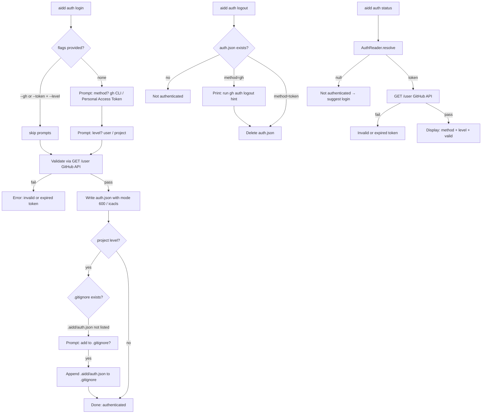

# Instruction: aidd auth command — login / logout / status

## Feature

- **Summary**: New `aidd auth` command with `login`, `logout`, `status` sub-commands. Interactive and flag-based modes. Writes `auth.json` with restrictive permissions, proposes `.gitignore` entry for project-level storage.
- **Stack**: `TypeScript 5`, `Node.js`, `vitest 2`
- **Branch name**: `feat/aidd-auth`
- **Parent Plan**: `./2026_03_20-#54-aidd-auth-master.md`
- **Sequence**: `2 of 3`
- **Confidence**: 9/10
- **Time to implement**: 1 session

## Existing files

- @src/cli.ts
- @src/infrastructure/deps.ts
- @src/infrastructure/auth/auth-storage.ts
- @src/infrastructure/auth/auth-reader.ts
- @src/domain/models/auth-config.ts

### New files to create

- `src/application/commands/auth.ts`
- `src/application/use-cases/auth-login-use-case.ts`
- `src/application/use-cases/auth-logout-use-case.ts`
- `src/application/use-cases/auth-status-use-case.ts`
- `tests/application/use-cases/auth-login-use-case.test.ts`
- `tests/application/use-cases/auth-logout-use-case.test.ts`
- `tests/application/use-cases/auth-status-use-case.test.ts`

## User Journey

## Implementation phases

### Phase 1 — AuthLoginUseCase

> Core login logic: interactive + flags, validation, storage, .gitignore

1. Create `src/application/use-cases/auth-login-use-case.ts`:
   - Input: `{ method?: 'gh' | 'token'; token?: string; level?: 'user' | 'project'; interactive: boolean }`
   - If `interactive` and missing inputs → prompt for method, then level
   - If method=`gh` → call `gh auth token` to retrieve token (error if gh not installed or not authenticated)
   - Validate resolved token via `GET https://api.github.com/user` with `Authorization: Bearer <token>`
   - On HTTP 401 → `"Invalid or expired token. Run aidd auth login"`
   - On HTTP 403 → `"Token lacks required scopes. Regenerate your PAT"`
   - On success → build `AuthConfig`, call `AuthStorage.write()`
   - If level=`project` → check `.gitignore`; if `.aidd/auth.json` not present, prompt user to add it; if confirmed, append line
   - Return: `{ method, level, login: string }` (login = GitHub username from `/user` response)
2. Write `tests/application/use-cases/auth-login-use-case.test.ts`

### Phase 2 — AuthLogoutUseCase + AuthStatusUseCase

> Cleanup and inspection

1. Create `src/application/use-cases/auth-logout-use-case.ts`:
   - Read config from `AuthStorage` (project then user)
   - If not found → return `{ found: false }`
   - If method=`gh` → output hint: `"To fully logout from GitHub, run gh auth logout"`, then delete file
   - If method=`token` → delete file directly
   - Return: `{ method, level }`
2. Create `src/application/use-cases/auth-status-use-case.ts`:
   - Call `AuthReader.resolve()` → if null return `{ authenticated: false }`
   - Determine source (env var / project / user / gh)
   - `GET /user` with token → if fails return `{ authenticated: true, valid: false, reason }`
   - Return: `{ authenticated: true, valid: true, method, level, login }`
3. Write tests for both use cases

### Phase 3 — auth command handler + CLI registration

> Thin command wrappers following 0-command-thin-wrapper rule

1. Create `src/application/commands/auth.ts`:
   - Register `auth` command with `login`, `logout`, `status` subcommands
   - `login`: flags `--gh`, `--token <value>`, `--level <user|project>`
   - Each subcommand calls one use case, displays typed result via `CLIOutput`
   - Catch all errors with `output.exit(error)`
2. Register `registerAuthCommand(program)` in `src/cli.ts`

## Validation flow

1. `pnpm build` — no TypeScript errors
2. `pnpm test` — all use-case tests green
3. `aidd auth login` (interactive) → prompts for method and level, validates, writes `~/.config/aidd/auth.json`
4. `aidd auth status` → displays method, level, valid=true
5. `aidd auth login --token <bad-token>` → error: invalid token
6. `aidd auth login --token <valid-token> --level project` → proposes `.gitignore` entry
7. `aidd auth logout` → removes auth.json, confirms level removed
8. `aidd auth status` after logout → suggests `aidd auth login`
9. Windows: confirm `icacls` call on `auth.json`
