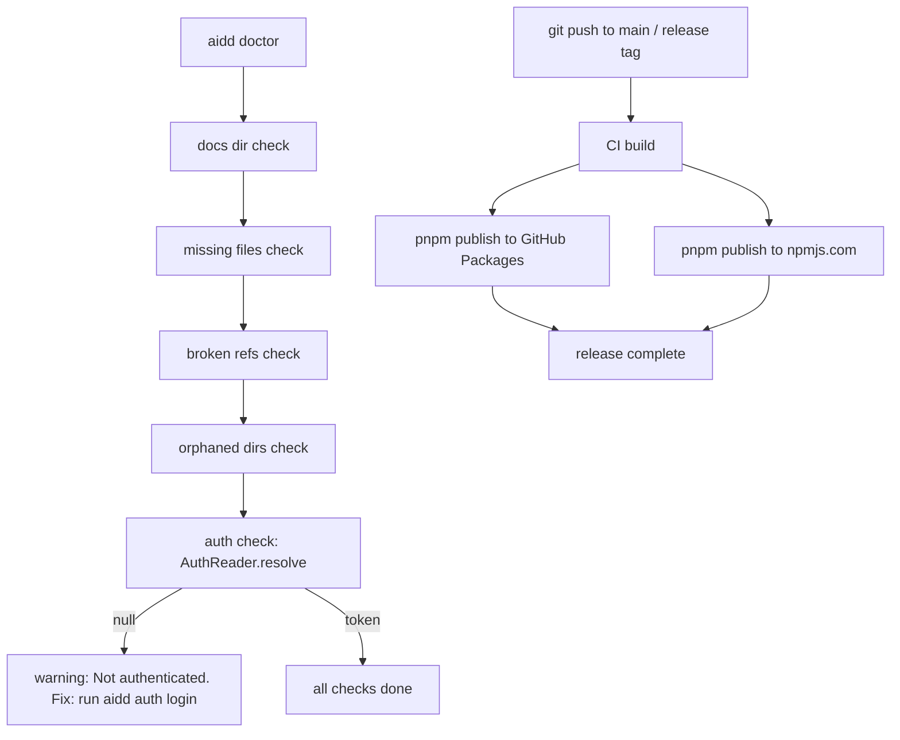

# Instruction: Integrations — doctor auth check + npm public publish

## Feature

- **Summary**: Add auth check to `aidd doctor` and publish CLI to npmjs.com public registry alongside existing GitHub Packages pipeline.
- **Stack**: `TypeScript 5`, `Node.js`, `vitest 2`, `GitHub Actions`
- **Branch name**: `feat/aidd-auth`
- **Parent Plan**: `./2026_03_20-#54-aidd-auth-master.md`
- **Sequence**: `3 of 3`
- **Confidence**: 9/10
- **Time to implement**: 1 session

## Existing files

- @src/application/use-cases/doctor-use-case.ts
- @tests/application/use-cases/doctor-use-case.test.ts
- @.github/workflows/ci.yml
- @.github/workflows/publish.yml
- @package.json

### New files to create

- none

## User Journey



## Implementation phases

### Phase 1 — Doctor auth check

> Add auth as a doctor check following existing check pattern

1. Read `doctor-use-case.ts` to understand the existing check structure (`DoctorCheck` interface, severity levels)
2. Inject `AuthReader` into `DoctorUseCase` constructor (add to `Deps` if needed)
3. Add auth check: call `AuthReader.resolve()` → if null → push warning with `fix: "Run aidd auth login"`, severity=`warning`
4. Update `doctor-use-case.test.ts` — add tests for: auth missing (warning), auth present (no issue)

### Phase 2 — npm public publish pipeline

> Dual publish: GitHub Packages (existing) + npmjs.com (new)

1. Read `.github/workflows/ci.yml` and `.github/workflows/publish.yml` to understand current publish flow
2. Update `package.json`: keep `publishConfig.registry` as GitHub Packages (primary), add `--registry https://registry.npmjs.org` to publish step instead of changing the default
3. Update automated release job in `ci.yml`:
   - After existing GitHub Packages publish step, add new step:
     ```yaml
     - name: Publish to npm public
       run: pnpm publish --no-git-checks --registry https://registry.npmjs.org
       env:
         NODE_AUTH_TOKEN: ${{ secrets.NPM_TOKEN }}
     ```
   - Add `NPM_TOKEN` secret reference (secret must be configured in GitHub repo settings)
4. Update `publish.yml` (manual workflow) with same dual publish steps
5. Add comment in both workflows explaining the dual-registry strategy

## Validation flow

1. `pnpm build && pnpm test` — all tests pass including new doctor auth tests
2. `aidd doctor` without auth → warning displayed with fix suggestion
3. `aidd doctor` with valid auth → no auth warning
4. Verify `ci.yml` and `publish.yml` YAML is valid (use `act` dry-run or GitHub Actions linter)
5. Confirm `NPM_TOKEN` secret documented in repo README / CONTRIBUTING (or existing docs location)
