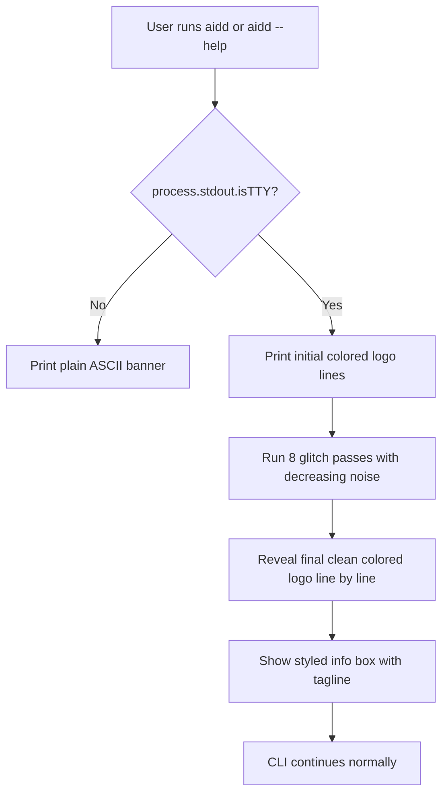

# Instruction: feat: animated ANSI banner with glitch effect on CLI launch

## Feature

- **Summary**: Replace the plain ASCII `printBanner()` in `src/cli.ts` with an async animated version using ANSI 24-bit colors and a glitch reveal animation, followed by a styled info box. Falls back to plain output when non-TTY.
- **Stack**: `TypeScript ESM, Node.js >= 24, node:process (stdout)`
- **Branch name**: `feat/animated-banner-#64`
- **Parent Plan**: `none`
- **Sequence**: `standalone`
- Confidence: 9.5/10
- Time to implement: ~30min

## Existing files

- @src/cli.ts

### New file to create

- none

## User Journey

## Implementation phases

### Phase 1: Async animated printBanner

> Replace synchronous `printBanner()` with async version using validated design from issue #64 comment

1. Add ANSI color constants: B (blue #4E4EF9), P (pink #DD5475), G (green #66CC99), D (dim), R (reset), BOLD
2. Define `logoLines` array with colored logo
3. Add `stripped` array for animation (ANSI-stripped lines)
4. Add `sleep` helper: `(ms: number) => new Promise(r => setTimeout(r, ms))`
5. Add `boxLine` helper with INNER=44 alignment
6. In `printBanner()`: early return on non-TTY (already exists)
7. Implement 8-pass glitch animation (pink→blue intensity decay, 65ms delay)
8. Reveal logo line-by-line (30ms per line)
9. Print info box after 300ms pause
10. Change trigger condition: `process.argv.slice(2).length === 0 || process.argv.includes('--help') || process.argv.includes('-h')`
11. Use top-level await since ESM module: `await printBanner()`

## Validation flow

1. Run `aidd` → glitch animation plays, colored logo reveals, info box appears
2. Run `aidd --help` → same animation before help output
3. Run `aidd | cat` → no ANSI codes, no animation (non-TTY fallback)
4. Total animation duration ≤ 1.5s (8 × 65ms + 300ms + 6 × 30ms ≈ 1.0s)
5. Run test suite → all 690 tests pass (tests run non-TTY, so `printBanner` returns early)
