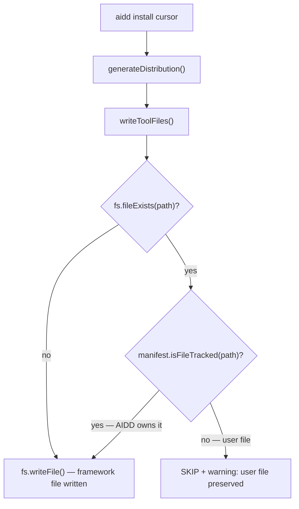

# Instruction: Protect user files from overwrite during install

## Feature

- **Summary**: Prevent `aidd install` from silently overwriting user-created files that share a path with framework-distributed files. Any pre-existing file not tracked in the manifest must be skipped with a warning, never overwritten.
- **Stack**: `TypeScript ESM`, `Node.js >= 24`, `vitest`
- **Branch name**: `fix/protect-user-files-on-install`
- **Parent Plan**: `none`
- **Sequence**: `standalone`
- Confidence: 9/10
- Time to implement: ~1h

## Existing files

- @src/domain/models/manifest.ts
- @src/application/use-cases/install-use-case.ts
- @src/domain/ports/file-system.ts

### New file to create

- none

## User Journey

## Implementation phases

### Phase 1: Add `isFileTracked()` to `Manifest`

> Expose a cross-tool lookup to detect if a path is owned by AIDD.

1. Add `isFileTracked(relativePath: string): boolean` method to `Manifest`
2. Implementation: check `_tools` entries, docs files, scripts files — return true if found in any
3. Unit test: tracked file returns true, untracked returns false, file from different tool returns true

### Phase 2: Guard in `writeToolFiles`

> Skip user files silently instead of overwriting them.

1. Change `writeToolFiles` return type from `Promise<GeneratedFile[]>` to `Promise<{ files: GeneratedFile[]; userFileConflicts: string[] }>`
2. Before writing each non-merge file: check `fs.fileExists(outputPath)` && `!manifest.isFileTracked(file.relativePath)` → push path to `userFileConflicts`, skip file (do not add to `filesByPath`)
3. Update the single call site in `execute()` to destructure `{ files, userFileConflicts }` and append conflicts to `warnings`
4. Unit test: existing untracked file is skipped, tracked file is overwritten, non-existing file is written

## Validation flow

1. Create a project with a pre-existing `.cursor/rules/my-rule.mdc` (not AIDD-installed)
2. Run `aidd install cursor`
3. Confirm `my-rule.mdc` is intact on disk after install
4. Confirm a warning lists the skipped file in the install output
5. Confirm all AIDD framework rules are installed correctly alongside the user file
6. Run `aidd status` — confirm `my-rule.mdc` does not appear as a drift (it is untracked, not managed)
