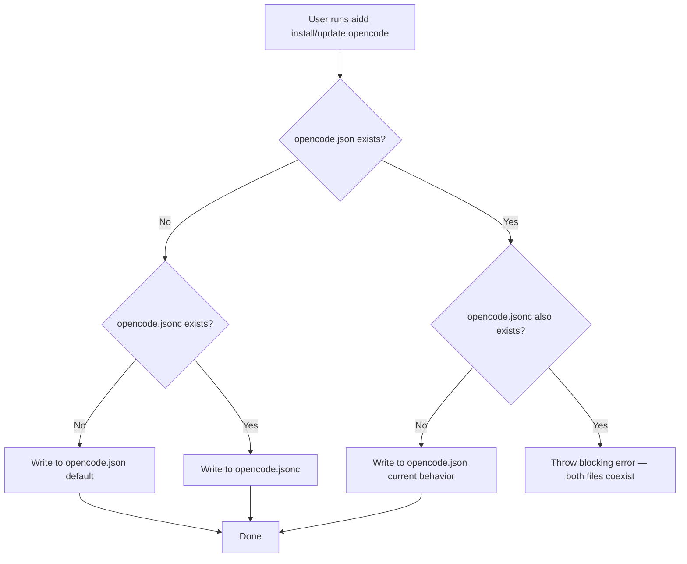

# Instruction: opencode config file detection

## Feature

- **Summary**: Detect whether `opencode.jsonc` or `opencode.json` already exists in the project root before writing, and route writes to the correct file. Error when both coexist. Exclude `opencode.jsonc` from sync.
- **Stack**: `TypeScript ESM`, `Node.js >= 24`
- **Branch name**: `feat/opencode-config-file-detection`
- **Parent Plan**: `none`
- **Sequence**: `standalone`
- Confidence: 9/10
- Time to implement: 1-2h

## Existing files

- @src/domain/tools/opencode.ts
- @src/application/use-cases/install-use-case.ts
- @src/application/use-cases/update-use-case.ts
- @src/application/use-cases/sync-use-case.ts
- @src/domain/models/generated-file.ts
- @src/domain/ports/file-system.ts

### New file to create

- none

## User Journey

## Implementation phases

### Phase 1 — Domain helper in opencode.ts

> Add a pure async resolver that picks the target config filename from the filesystem.

1. Add `resolveOpencodeConfigPath(projectRoot: string, fs: FileSystem): Promise<string>` in `src/domain/tools/opencode.ts`
2. Check `fs.fileExists(join(projectRoot, "opencode.json"))` and `fs.fileExists(join(projectRoot, "opencode.jsonc")))`
3. If both exist → throw `new Error("Both opencode.json and opencode.jsonc exist in the project root. Remove one before running AIDD.")`
4. If only `opencode.jsonc` exists → return `"opencode.jsonc"`
5. Otherwise (only `opencode.json`, or neither) → return `"opencode.json"`
6. Import `join` from `"node:path"` and `type FileSystem` from `"../ports/file-system.js"`

### Phase 2 — InstallUseCase path substitution

> Substitute the resolved config path before writing merged files.

1. In `writeToolFiles()`, before the loop, call `resolveOpencodeConfigPath(projectRoot, this.fs)` — store result as `opencodeConfigPath`
2. For each `file` in `generated`: if `file.relativePath === "opencode.json"` AND `file.merge === true`, create a replacement `GeneratedFile` with `relativePath: opencodeConfigPath` and the same `content`, `hash`, `merge`, `frameworkPath`
3. Use the replacement in all subsequent operations (mergeJsonFile path, manifest tracking, filesByPath key)
4. Manifest entries must use `opencodeConfigPath` (not hardcoded `"opencode.json"`) so drift detection stays consistent

### Phase 3 — UpdateUseCase path substitution

> Substitute the resolved config path before computeDiff() to avoid phantom diffs.

1. In `executeInternal()`, before `generateDistribution()` is called for a tool, call `resolveOpencodeConfigPath(projectRoot, this.fs)` — store as `opencodeConfigPath`
2. After `generateDistribution()` produces `newDistribution`, remap: for each entry where `relativePath === "opencode.json"` AND `merge === true`, replace it with a new `GeneratedFile` using `opencodeConfigPath`
3. Rebuild `newDistMap` from the remapped `newDistribution`
4. Proceed with `computeDiff()` using the remapped data — no phantom added/removed diffs
5. Merged file writes (the `!dryRun` block) already use `newFile.relativePath` so they pick up the substituted path automatically

### Phase 4 — SyncUseCase exclusion

> Prevent sync from propagating opencode.jsonc as a content file.

1. In `EXCLUDED_FILES` set in `sync-use-case.ts`, add `"opencode.jsonc"` alongside the existing `"opencode.json"` entry

## Validation flow

1. Project has no config file → `aidd install opencode` → verify `opencode.json` created, manifest tracks `opencode.json`
2. Project has `opencode.jsonc` only → `aidd install opencode` → verify merge written into `opencode.jsonc`, manifest tracks `opencode.jsonc`
3. Project has `opencode.json` only → `aidd install opencode` → behavior unchanged, manifest tracks `opencode.json`
4. Project has both → `aidd install opencode` → command exits with error message, no files written
5. Run `aidd update` in each of the 4 scenarios → verify same routing and no phantom diffs
6. Run `aidd sync` with opencode as source → verify neither `opencode.json` nor `opencode.jsonc` is propagated
